# CODEEVOLVE: an open-source evolutionary framework for algorithmic discovery and optimization

lenrique Assumpção¹,³, Diego Ferreira¹,³, Leandro Campos¹,³, Fabricio Murai²

¹Inter&Co., Belo Horizonte, MG, Brasil

²Worcester Polytechnic Institute, Worcester, MA, USA

³Universidade Federal de Minas Gerais, Belo Horizonte, MG, Brasil

Correspondence: henrique.soares@inter.co

## Abstract

We introduce CODEEVOLVE, an open-source framework that combines large language models (LLMs) with evolutionary search to synthesize high-performing algorithmic solutions. CODEEVOLVE couples an islands-based genetic algorithm with modular LLM orchestration, using execution feedback and task-specific metrics to guide selection and variation. Exploration and exploitation are balanced through context-aware recombination, adaptive metamixing, and targeted refinement of promising solutions. We evaluate CODEEVOLVE on benchmarks previously used to assess Google DeepMind's AlphaEvolve, showing superior performance on several tasks and competitive results overall. Notably, open-weight models often match or exceed closed-source baselines at a fraction of the compute cost. We provide extensive ablations analyzing the contribution of each component and release our framework and experimental results at https://github.com/inter-co/science-codeevolve.

## 1 Introduction

Recent strides in Large Language Models (LLMs) and agentic systems research have achieved major breakthroughs in program synthesis and automated scientific discovery (Chen et al., 2021; Li et al., 2022; Fawzi et al., 2022; Romera-Paredes et al., 2024). A common thread in such frameworks is the use of algorithmic orchestration to systematically enrich model context and reduce the dependency on human prompters, enabling LLMs to iteratively propose, test, and refine candidate solutions. In parallel, multi-agent and ensemble approaches explore how smaller or open models can be coordinated to tackle complex tasks with greater transparency and lower operational cost (Belcak et al., 2025).

Of particular relevance to our work is AlphaEvolve (Novikov et al., 2025), which combines genetic algorithms with the Gemini family of LLMs (Team et al., 2025) to discover solutions across diverse domains, including data-center optimization, matrix multiplication, and combinatorial constructions (Nagda et al., 2025; Georgiev et al., 2025). Despite promising results, AlphaEvolve is closed-source and described only at a high level, limiting reproducibility, controlled ablations, and systematic exploration of orchestration design choices. In response, several open-source frameworks (Sharma, 2025; Lange et al., 2025; Wang et al., 2025; Yu et al., 2025) have begun to explore LLM-driven evolutionary agents, offering accessible baselines but leaving open questions about orchestration design, evaluation rigor, and quality—cost trade-offs.

In this work, we introduce CODEEVOLVE, an evolutionary coding framework that operationalizes LLM-driven search within a transparent, fully open framework. CODEEVOLVE addresses a meta-optimization task: the population consists of candidate programs for a target optimization problem, and the evolutionary loop applies selection, variation, and recombination guided by execution feedback and fitness signals. Concretely, it integrates (i) an islands-based genetic algorithm to maintain diversity and enable parallel search, (ii) a weighted LLM ensemble that performs model selection based on population state, and (iii) three modular operators that structure exploration and exploitation: an inspiration-based crossover using contextual recombination, a meta-prompting strategy to diversify search trajectories, and a depth-based exploitation mechanism for targeted edits. These components work in concert to balance global search with local refinement and to translate LLM proposals into executable, testable artifacts.

Our evaluation on benchmarks previously used for assessing AlphaEvolve compares solution quality, sample efficiency, and compute cost against both reported AlphaEvolve results and open-source baselines. CODEEVOLVE achieves state-of-the-art performance on several problems, including

instances where open-weight models such as Qwen (Yang et al., 2025) match or outperform closed-source LLMs at significantly lower cost. Extensive ablations quantify the contribution of each component and reveal interactions between diversity-preserving and refinement mechanisms.

Our work makes the following contributions:

• An open-source framework for algorithmic discovery that integrates islands-based evolutionary search with modular LLM orchestration, designed for transparency and reproducibility.

• A comprehensive empirical evaluation on established algorithm-discovery benchmarks, demonstrating strong performance and favorable quality—cost trade-offs, including with open-weight models.

• An extensive ablation and component-level analysis that isolates the effects of individual operators and their interactions on search efficiency and solution quality.

## 2 Related Work

Genetic programming and LLMs. Automated generation and optimization of computer programs has long been the domain of Genetic Programming (GP) (Koza, 1992, 1994; Langdon and Poli, 2013), where populations of programs are iteratively improved by operators such as crossover and mutation. Although foundational, classical GP methods often struggle with the semantic complexity of modern programming languages. The recent advent of LLMs represents a paradigm shift: with demonstrated success in generating high-quality solutions for competitive programming tasks (Li et al., 2022), LLMs can serve as semantically-aware operators for code improvement and synthesis.

This synergy has given rise to “Evolution through Large Models” (Lehman et al., 2023; Hemberg et al., 2024). The breakthrough application of this concept was FunSearch (Romera-Paredes et al., 2023), which paired an LLM with a programmatic evaluator to discover novel solutions to open problems in mathematics, establishing the viability of the approach for scientific discovery. Building on this idea, Google DeepMind introduced AlphaEvolve (Novikov et al., 2025; Georgiev et al., 2025), a closed-source system that generalizes FunSearch from evolving single functions to entire codebases and a broader range of optimization tasks, including GPU kernels, warehouse-scale computing, and complexity theory (Nagda et al., 2025).

Evolutionary coding agents. Following AlphaEvolve, several open-source projects developed LLM-driven evolutionary agents. OpenEvolve (Sharma, 2025) provided an accessible implementation of core features, accelerating community adoption. ShinkaEvolve (Lange et al., 2025) and ThetaEvolve (Wang et al., 2025) propose distinct orchestration designs and evaluation pipelines. Specialized variants target domains such as scaling law discovery (Lin et al., 2025) and cloud scheduling (Cheng et al., 2025), etc (Brown et al., 2025; Nagaitsev et al., 2025). CODEEVOLVE sits within this class of LLM-driven evolutionary systems and is designed to be broadly applicable to algorithmic problems with quantifiable metrics, while prioritizing reproducibility and transparent evaluation.

Meta-prompting. LLMs are sensitive to prompt variations (Anagnostidis and Bulian, 2024), motivating systems that automatically design and improve prompts (“meta-prompting”) (Suzgun and Kalai, 2024; Zhang et al., 2025). CODEEVOLVE builds on evolutionary strategies for improving prompts (Chen et al., 2023), mirroring the optimization of solution programs and enabling the LLM to reflect on and rewrite its own instructions to yield more diverse and effective search trajectories.

Alternative algorithm discovery paradigms. LLM-driven evolution is part of a broader landscape of AI for scientific discovery, and many distinct approaches have seen major success in recent years. Deep Reinforcement Learning (RL), for instance, has achieved landmark results such as discovering faster matrix multiplication algorithms with AlphaTensor (Fawzi et al., 2022). While incredibly powerful, RL typically requires a more structured environment and a well-defined action space. Other approaches, such as agentic systems, leverage LLMs to reason over scientific hypotheses expressed in natural language (Gottweis et al., 2025). CODEEVOLVE aims to bridge these paradigms by combining LLM-based reasoning with a genetic algorithm that enforces rigorous exploration of the solution space through explicit evaluation and selection.

## 3 Preliminaries

The task addressed here constitutes a meta-level optimization: we use an evolutionary algorithm to optimize programs, which themselves solve mathematical optimization problems. To clarify this distinction, this section formally defines the core concepts and notation used throughout the paper.

A solution is a program generated to solve a problem. When an existing solution S is used in a prompt to generate a new solution  $ S' $, we say that S is the parent solution of  $ S' $. This parent-children relationship imposes a natural forest structure on the solution population, which is a collection of rooted, directed trees. For any solution S, we denote the set of its k nearest ancestors as  $ A_{k}(S) $.

A prompt is a textual input provided to a Large Language Model (LLM) to generate a solution. We define the prompt used for generating solution S as its parent prompt, denoted by  $ P(S) $. Since LLMs are inherently probabilistic, a single prompt can generate multiple distinct solutions.

The quality of a solution is quantified by an evaluation function,  $ h : \mathcal{S} \mapsto \mathbb{R}^d $, which maps a solution  $ S $ from the space of all possible solutions  $ \mathcal{S} $ to a real-valued vector of performance metrics, such as runtime, memory usage, or objective value.

We also define two fitness functions to measure the overall quality of prompts and solutions. The solution fitness,  $ f_{\text{sol}} : \mathcal{S} \mapsto \mathbb{R}_{\geq 0} $, maps a solution to a non-negative score and typically corresponds to the primary metric in  $ h $ that we aim to optimize. The prompt fitness,  $ f_{\text{prompt}} $, is derived from  $ f_{\text{sol}} $ and is defined as the maximum fitness achieved by any solution generated from that prompt:

 $$ f_{\mathrm{prompt}}(P)=\max_{S:P(S)=P}\big\{f_{\mathrm{sol}}(S)\big\}. $$ 

This rewards prompts that have demonstrated the potential to generate high-quality solutions, making them valuable candidates for future evolution, even if some of their offspring may be suboptimal.

The primary optimization goal is to iteratively evolve an initial population of prompts and solutions, in order to maximize the solution fitness  $ f_{\mathrm{sol}} $ over a maximum number of epochs N, while respecting constraints on other metrics from h, such as execution time and memory.

## 4 Methodology

CODEEVOLVE integrates an evolutionary framework with LLMs to optimize programs. The architecture is based on the island genetic algorithm (Whitley and Starkweather, 1990): multiple populations (islands) evolve independently and periodically exchange their best-performing individuals (migration) according to a predefined topology. This design improves concurrent evaluation, maintains diversity, and propagates successful solutions across the search. At each epoch t, every island i maintains a population of prompts  $ \mathcal{P}_t^i $ and solutions  $ \mathcal{S}_t^i $. CODEEVOLVE operates through an iterative process that progressively enhances populations of prompts and solutions via three components. Evolutionary Operators (Section 4.2) generate new individuals, balancing exploration and exploitation. An LLM Ensemble (Section 4.1) provides the generative engine for code modification and recombination. Population Management (Section 4.4) handles evaluation, fitness tracking, migration, and archive updates using the MAP-Elites method (Mouret and Clune, 2015).

### 4.1 LLM Ensemble for Solution Generation

The engine behind CODEEVolve’s solution generation is a weighted ensemble of LLMs—denoted LLMEnsemble—that modify and combine preexisting solutions. For each generation task, a model is sampled according to ensemble weights. Users can configure distinct ensembles for exploration and exploitation (e.g., cheaper, higher-temperature models for exploration; more accurate, lower-temperature models for exploitation). In the simplest case, it consists of a single LLM. We evaluate two ensemble configurations: one using Google’s GEMINI-2.5 models (Comanici et al., 2025) for direct comparison with AlphaEvolve, and another using only Qwen’s Qwen3-Coder-30B (Yang et al., 2025) to explore the performance-cost trade-off with open-weight models. See Appendix C for further details on the ensemble configurations.

### 4.2 Evolutionary Operators

New solutions are generated in parallel using exploitation or exploration operators, sampled independently across islands. At each step, one operator is chosen according to an exploration rate  $ p_{explr} $, which is governed by a scheduler (Section 4.3):

1. Depth exploitation. This operator refines high-performing solutions. A parent S is selected from  $ S_{t}^{i} $ via rank-based selection, with probability inversely proportional to its rank:

 $$ \mathrm{Pr}(S):=\frac{\mathbf{rk}(S)^{-1}}{\sum_{S^{\prime}\in\mathcal{S}_{t}^{i}}\mathbf{rk}(S^{\prime})^{-1}}, $$ 

where  $  \mathrm{rk}(S)  $ is the position of S when sorting  $  S_{t}^{i}  $ by  $  f_{\mathrm{sol}}  $ in descending order. The ensemble is prompted with S, its parent prompt  $  P(S)  $, and its k nearest ancestors  $  A_{k}(S)  $. This truncated ancestral context encourages targeted, incremental improvements as depth increases, rather than wholesale strategy changes.

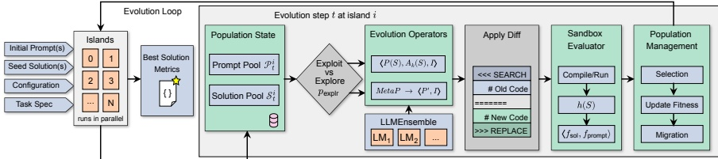

Figure 1: Overview of CodeEvolve.

2. Meta-prompting exploration. This operator fosters solution diversity and enriches the prompt population with feedback from previous solutions. A solution S and a prompt P are sampled independently and uniformly at random. An auxiliary LLM MetaPromptingLLM generates an enriched prompt P' by analyzing P and S. The LLMEnsemble uses P' and S to generate a new solution S'. We intentionally exclude the ancestor chain to allow exploration of novel strategies unconstrained by lineage, while leveraging the richer prompt P'.

Inspiration-based Crossover. Directly splicing code often breaks syntax and semantics. Instead, CODEEVOLVE uses inspiration-based crossover: for both exploitation and exploration, we provide the ensemble with a set of “inspiration” solutions sampled either by rank in case of exploitation (Eq. 2) or uniformly, in case of exploration. The LLM integrates successful patterns, logic, or functions from multiple parents within its generative process, thus performing a semantic crossover.

Algorithm 1 presents the core operator loop. The LLMEnsemble receives a prompt, an ancestor set (possibly empty), the target solution, and inspirations, and outputs a new solution. The MetaPromptingLLM receives a prompt and a solution and outputs a new prompt. For readability, the pseudocode omits the exploration scheduler and MAP-Elites integration, as both are orthogonal to the operator logic and described below.

In practice, new solutions are expressed via LLM edits using a diff-based SEARCH/REPLACE format: the model identifies a code region and proposes a targeted replacement.

### 4.3 Exploration Scheduling

To adaptively balance exploration and exploitation, CODEEVOLVE uses a scheduler that controls  $ p_{explr} $ over time. We have implemented two scheduler policies: (i) Decay scheduling, where we initialize

Algorithm 1 Core exploitation/exploration loop of CODEEVOLVE at epoch $t$

1: Input: Populations $\mathcal{P}_t^i$, $\mathcal{S}_t^i$, exploration probability $p_{\text{explr}}$, maximum ancestor depth $k$
2: Output: New solution $S'$, and new prompt $P'$ if exploration is chosen
3: Sample $p \sim \text{Uniform}(0, 1)$
4: if $p < 1 - p_{\text{explr}}$ then
5: Sample $S \in \mathcal{S}_t^i$ and inspirations $I \subseteq \mathcal{S}_t^i \setminus \{S\}$ according to Eq. 2
6: Collect ancestor solutions $A_k(S)$ from $S$ to its root in $\mathcal{S}_t^i$
7: $S' \leftarrow \text{LLMEnsemble}(P(S), A_k(S), S, I)$
8: $P' \leftarrow \text{NULL}$
9: else
10: Sample $S \in \mathcal{S}_t^i$, inspirations $I \subseteq \mathcal{S}_t^i \setminus \{S\}$, and $P \in \mathcal{P}_t^i$ uniformly at random
11: $P' \leftarrow \text{MetaPromptingLLM}(P, S)$
12: $S' \leftarrow \text{LLMEnsemble}(P', \emptyset, S, I)$
13: end if
14: return $S', P'$

the exploration rate at a high value, and monotonically decrease it (e.g., exponential or cosine decay) as the search progresses, and (ii) Plateau scheduling, where we monitor the best-so-far fitness using a moving window, increasing the exploration rate to escape local optima, then gradually decrease it to the baseline rate. Both variants require only lightweight state (recent fitness history) and are orthogonal to operator design.

### 4.4 Population Management

CODEEVOLVE includes three mechanisms to manage populations over time.

Initialization: The algorithm begins with an initial solution (often trivial, e.g., a function returning zero) and a basic prompt describing the problem. To create a diverse starting population at each island, the LLMEnsemble is prompted multiple times with this initial pair, generating independent ap-

proaches that become roots of new solution trees.

Evaluation and Population Control: Each new solution is executed in a sandbox with runtime and memory limits. If execution succeeds, we compute  $ f_{\mathrm{sol}}(S) $ and metrics  $ h(S) $ and add S to the population. Failures receive fitness zero, with logs stored for instructive context in future prompts.

Elitist Migration: Top performers from each island are copied to neighboring islands at a fixed migration frequency and rate. To prevent cycles and premature convergence, a solution migrates at most once from its origin island, and we never migrate the best-performing solution of an island in order to preserve its uniqueness (Romera-Paredes et al., 2024). Migrants become roots of new trees upon arrival, with parent pointers set to NULL.

Quality–diversity via MAP-Elites. In addition to island populations, CODEEVOLVE maintains a per-island MAP-Elites archive (Mouret and Clune, 2015). Users define feature descriptors (e.g., code-level properties, algorithmic behaviors, or runtime profiles). The archive partitions the feature space either as a regular lattice (MAP-Elites) or via centroidal Voronoi tessellations (CVT-MAP-Elites) (Vassiliades et al., 2017), storing the elite (i.e., most fit) solution per cell. Archive updates occur after evaluation: each successful solution S is mapped to its feature cell; if S improves the cell's fitness, it replaces the incumbent elite. Sampling for inspirations or parents can draw from the archive to inject structured diversity, e.g., proportional to the rank of all elites in the grid or uniformly over filled cells. The archive thus complements island dynamics by probing diverse niches and reducing premature convergence. The pseudocode (Algo. 1) omits archive maintenance for readability as implementation is straightforward.

## 5 Experiments

We evaluate CODEEVOLVE on a set of mathematical problems from the benchmark suite used to validate AlphaEvolve (Novikov et al., 2025). We are interested in answering the following questions:

RQ1 Can CODEEVOLVE advance the state of the art in automated algorithmic discovery?

RQ2 Can smaller open-weight models compete with more expensive, closed-source LLMs as the backbone of CODEEVOLVE?

### 5.1 Benchmark Problems

RQ3 How do the different components of CODE-VOLVE impact its performance on the proposed benchmarks?

Following AlphaEvolve (Novikov et al., 2025), we evaluate CODEEVOLVE on a number of open problems from mathematics and algorithm design. We now briefly describe each problem.

Packing Circles and Hexagons. This benchmark consists of three distinct problems, referred to as CirclePackingSquare, CirclePackingRect and HexagonPacking. The first problem consists of placing n disjoint unit circles inside a unit square in order to maximize the sum of their radii, with instances n = 26 and n = 32. The second consists of placing n disjoint unit circles inside a rectangle of perimeter 4 in order to maximize the sum of their radii, with n = 21. The third asks for a placement of n disjoint unit regular hexagons into a larger regular hexagon, minimizing the side length of the outer hexagon, with n = 11 and n = 12.

Minimizing ratio of maximum to minimum distance. This benchmark consists of placing n-dimensional points in order to minimize the ratio between their maximum to minimum distance, referred to as MinimizeMaxMinDist, with instances n = 16, d = 2 and n = 14, d = 3.

Autocorrelation Inequalities. This benchmark encompasses two distinct optimization problems, referred to as FirstAutocorrIneq and SecondAutocorrIneq, related to constructing step-functions to improve certain convolution bounds that arise in additive combinatorics. The first problem is a minimization problem, and the second is a maximization one. See Appendix A for further details.

### 5.2 Experimental setup

All experiments were conducted using AWS Sagemaker. To ensure fair resource allocation, each experimental run was assigned a fixed computational budget of vCPUS and RAM, with each solution being evaluated with a maximum runtime and memory budget. For the LLM ensemble, we utilized API endpoints for GEMINI-2.5 and Qwen3-Coder-30B. See Appendix C for a complete description of our setup for each experiment.

To provide a rigorous assessment of CODE-VOLVE, we use Google DeepMind's AlphaEvolve (Novikov et al., 2025) as our primary baseline, as it currently defines the state-of-the-art for this benchmark suite. We further compare CODE-VOLVE against ThetaEvolve (Wang et al., 2025),

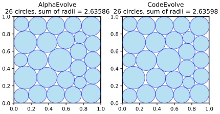

Figure 2: Comparison of best solutions found by CODEEVOLVE and AlphaEvolve for the CirclePackingSquare problem with n = 26.

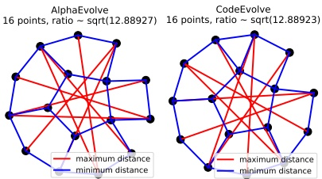

Figure 3: Comparison of best solutions found by CODEEVOLVE and AlphaEvolve for both instances of the MinimizeMaxMinDist problem.

an open-source framework for algorithmic discovery that relies on RL-tuning. While other frameworks such as OpenEvolve (Sharma, 2025) and ShinkaEvolve (Lange et al., 2025) exist, they only report results for a single instance in our suite (CirclePackingSquare  $ (n = 26) $); for this specific case, ShinkaEvolve matches our results while OpenEvolve is slightly inferior. Consequently, we focus our comparative analysis on AlphaEvolve and ThetaEvolve to provide a broader view of performance across diverse problem domains.

### 5.3 Main Results

As shown in Table 1, CODEEVOLVE matches or surpasses the results reported for AlphaEvolve in 5 out of 9 benchmark instances. Notably, in the MinimizeMaxMinDist and CirclePackingSquare (n = 32) instances, CODEEVOLVE establishes new state-of-the-art marks. While ThetaEvolve performs strongly on the Autocorrelation inequalities, it lacks reported results on all other benchmarks except for one of the CirclePackingSquare instances. In contrast, CODEEVOLVE's consistency across packing and distance optimization problems demonstrates its robustness as a discovery engine, and also its ability to advance the

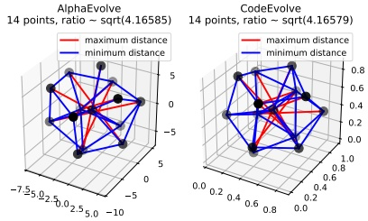

Figure 4: Comparison of best solutions found by CODEEVOLVE and AlphaEvolve for both instances of the MinimizeMaxMinDist problem.

state-of-the-art, answering RQ1 in the affirmative.

For both CirclePackingSquare problem instances, the Qwen3 configuration presented the best results (one of them illustrated in Figure 2), surpassing the configuration using an ensemble of GEMINI-2.5 FLASH/PRO, whereas the GEMINI-2.5 Ensemble produced the best results for the CirclePackingRect problem and for the two instances of the MinimizeMaxMinDist problem (shown in Figure 3). Figure 5 shows the solution history for the n = 26 instance, with Qwen3-Coder-30B on the left and GEMINI-2.5 on the right. The Qwen3 configuration requires around 900 LLM calls to surpass AlphaEvolve's solution, with a total API cost of approximately 6 USD, whereas the GEMINI-2.5 configuration needs approximately 400 LLM calls and costs a little under 35 USD. A similar behavior in terms of LLM calls and cost can be observed for the CirclePackingSquare (n=32) (see Appendix B.2). This order-of-magnitude difference in cost-efficiency suggests that, for well-defined algorithmic tasks, modular orchestration—rather than raw model scale—is the primary driver of success, answering RQ2 in the affirmative.

## 5.4 Ablations

To evaluate the individual contributions of CODEEVOLVE's components, we conduct an extensive ablation study using the CirclePackingSquare benchmark. This problem was selected due to its computational efficiency and its status as a standard comparison point in recent literature (Sharma, 2025; Lange et al., 2025; Wang et al., 2025). To maintain a sustainable experimental budget, all ablations use Qwen3-Coder-30B as the backbone model. In these analyses, we report the best and worst results across runs rather than standard dev

Table 1: Results comparison between CODEEVOLVE, AlphaEvolve and ThetaEvolve. We display only the best results reported in the respective articles.

<table border=1 style='margin: auto; word-wrap: break-word;'><tr><td rowspan="2">Problem</td><td rowspan="2">AlphaEvolve</td><td style='text-align: center; word-wrap: break-word;'>ThetaEvolve</td><td colspan="2">CODEEVOLVE</td></tr><tr><td style='text-align: center; word-wrap: break-word;'>Distill-Qwen3-8B</td><td style='text-align: center; word-wrap: break-word;'>Qwen3-Coder-38B</td><td style='text-align: center; word-wrap: break-word;'>GEMINI-2.5 FLASH/PRO</td></tr><tr><td style='text-align: center; word-wrap: break-word;'>CirclePackingSquare(n=26)( $ \uparrow $)</td><td style='text-align: center; word-wrap: break-word;'>2.63586</td><td style='text-align: center; word-wrap: break-word;'>2.63598</td><td style='text-align: center; word-wrap: break-word;'>2.63598</td><td style='text-align: center; word-wrap: break-word;'>2.63597</td></tr><tr><td style='text-align: center; word-wrap: break-word;'>CirclePackingSquare(n=32)( $ \uparrow $)</td><td style='text-align: center; word-wrap: break-word;'>2.93794</td><td style='text-align: center; word-wrap: break-word;'>—</td><td style='text-align: center; word-wrap: break-word;'>2.93954</td><td style='text-align: center; word-wrap: break-word;'>2.93950</td></tr><tr><td style='text-align: center; word-wrap: break-word;'>CirclePackingRect(n=21)( $ \uparrow $)</td><td style='text-align: center; word-wrap: break-word;'>2.36583</td><td style='text-align: center; word-wrap: break-word;'>—</td><td style='text-align: center; word-wrap: break-word;'>2.36339</td><td style='text-align: center; word-wrap: break-word;'>2.36583</td></tr><tr><td style='text-align: center; word-wrap: break-word;'>HexagonPacking(n=11)( $ \downarrow $)</td><td style='text-align: center; word-wrap: break-word;'>3.93009</td><td style='text-align: center; word-wrap: break-word;'>—</td><td style='text-align: center; word-wrap: break-word;'>4.07507</td><td style='text-align: center; word-wrap: break-word;'>3.93794</td></tr><tr><td style='text-align: center; word-wrap: break-word;'>HexagonPacking(n=12)( $ \downarrow $)</td><td style='text-align: center; word-wrap: break-word;'>3.94191</td><td style='text-align: center; word-wrap: break-word;'>—</td><td style='text-align: center; word-wrap: break-word;'>4.02519</td><td style='text-align: center; word-wrap: break-word;'>4.00001</td></tr><tr><td style='text-align: center; word-wrap: break-word;'>MinimizeMaxMinDist(n=16,d=2)( $ \downarrow $)</td><td style='text-align: center; word-wrap: break-word;'>12.88927</td><td style='text-align: center; word-wrap: break-word;'>—</td><td style='text-align: center; word-wrap: break-word;'>13.43612</td><td style='text-align: center; word-wrap: break-word;'>12.88923</td></tr><tr><td style='text-align: center; word-wrap: break-word;'>MinimizeMaxMinDist(n=14,d=3)( $ \downarrow $)</td><td style='text-align: center; word-wrap: break-word;'>4.16585</td><td style='text-align: center; word-wrap: break-word;'>—</td><td style='text-align: center; word-wrap: break-word;'>4.20692</td><td style='text-align: center; word-wrap: break-word;'>4.16579</td></tr><tr><td style='text-align: center; word-wrap: break-word;'>FirstAutocorrIneq( $ \downarrow $)</td><td style='text-align: center; word-wrap: break-word;'>1.50316</td><td style='text-align: center; word-wrap: break-word;'>1.50313</td><td style='text-align: center; word-wrap: break-word;'>1.55837</td><td style='text-align: center; word-wrap: break-word;'>1.55438</td></tr><tr><td style='text-align: center; word-wrap: break-word;'>SecondAutocorrIneq( $ \uparrow $)</td><td style='text-align: center; word-wrap: break-word;'>0.96102</td><td style='text-align: center; word-wrap: break-word;'>0.94690</td><td style='text-align: center; word-wrap: break-word;'>0.88110</td><td style='text-align: center; word-wrap: break-word;'>0.87067</td></tr></table>

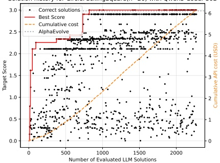

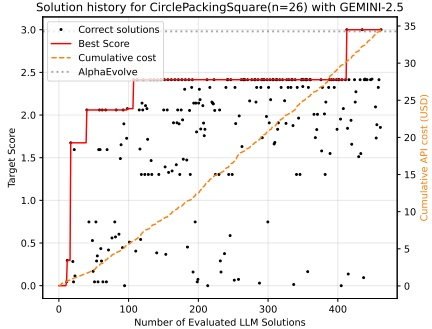

Figure 5: Comparison between Qwen3-Coder-30B and GEMINI-2.5 in CirclePackingSquare (n = 26). Left vertical axis shows  $ -\log(M - y + \epsilon) $, where M is the maximum fitness attained in all experiments, y is the best fitness, and  $ \epsilon = 10^{-3} $ is a constant controlling space between curves. Individual points show the score of solutions that were executed without errors. Right vertical axis displays the cumulative API cost in USD of the LLM calls.

ation. In the context of algorithmic discovery, we argue this is more instructive: our main goal is to exceed existing state-of-the-art results, and aggregate metrics can mask the “breakthrough” runs that successfully surpass AlphaEvolve. Furthermore, given that each experiment is executed 3 times, the standard deviation is an unreliable estimator of population variance; reporting the full range of outcomes provides a more transparent and representative view of the framework’s peak potential and its reliability. See Appendix C for further details.

Impact of components In order to evaluate the impact of the components described in Section 4, we evaluated CODEEVOLVE on three distinct configurations: (i) “full method”, utilizes all operators implemented by CODEEVOLVE; (ii) “naive evolution”, utilizes the standard exploration/exploitation pipeline, without any of the aforementioned components; and (iii) “no evolution”, repeatedly prompts the LLM with the initial prompt and solution, with no contextual data from other solutions.

Figure 6 shows the ablation results for the CirclePackingSquare problem. On both instances, we see that “full method” outperforms the other configurations both in terms of mean score and LLM calls required to surpass AlphaEvolve (sample efficiency). For the n = 32 case, it is the only configuration that manages to surpass AlphaEvolve’s results, and for the n = 26 case, the Naive configuration also matches it, requiring, however, over twice the number of solutions to do so. This shows that, in regards to RQ3, CODEEVOLVE’s components not only increase overall performance, but are the enabling factor that allows the framework to obtain state-of-the-art results.

Impact of depth and inspirations We study the impact of two hyperparameters of the operators described in Section 4.2 for the n = 32 instance of the CirclePackingSquare problem, namely: (i) maximum ancestor depth k used in the Depth Exploitation operator, and (ii) number  $ \iota $ of inspiration solutions used in the Inspiration-based Crossover

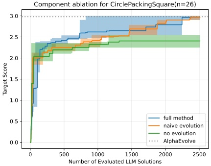

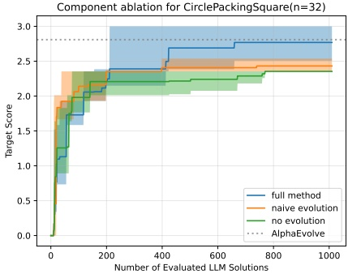

Figure 6: Component ablations for CODEEVOLVE using Qwen3-Coder-30B on the CirclePackingSquare problem. Curves show the mean across three distinct runs, and shaded regions show the best and worst results across all runs.

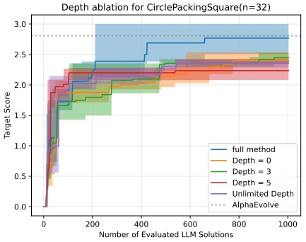

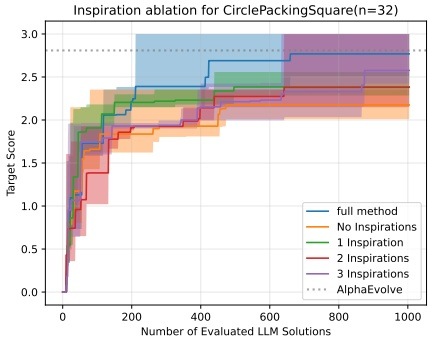

Figure 7: Depth and Inspiration ablations for CODEEVOLVE using Qwen3-Coder-30B on the CirclePacking-Square problem with n = 32.

operator. In order to control for the impact that these two operators may have on each other, we set  $ \iota = 0 $ for (i) and, conversely, set  $ k = 0 $ for (ii). We also show the results for the “full method” configuration of the previous experiment to analyze the synergy between these two operators.

As shown in Figure 7, all depth configurations failed to exceed AlphaEvolve's results, but inspiration configurations ( $ \iota = 2, 3 $) succeeded. Consequently, for RQ3, the Inspiration-based Crossover can independently surpass AlphaEvolve, unlike the Depth Exploitation operator. However, in both scenarios we see that the “full method” curve outperforms all other configurations in mean value, while also requiring less LLM calls to surpass the SOTA, thus highlighting a positive synergistic behavior between these two components. Additional ablation studies in Appendix B.1 demonstrate the importance of MAP-Elites and migration topology.

# 6 Conclusion

We introduced CODEEVOLVE, an open-source framework that democratizes the search for novel algorithms. By integrating an islands-based genetic algorithm with modular LLM operators—specifically inspiration-based crossover and metaprompting—CODEEVOLVE bridges the gap between opaque, large-scale systems and accessible research tools. Our experiments demonstrate that CODEEVOLVE consistently matches or exceeds the performance of closed-source baselines like AlphaEvolve. Perhaps most significantly, our results show that high-performing open-weight models, when properly orchestrated, offer a transparent and cost-effective alternative to proprietary APIs. CODEEVOLVE provides a foundation for future work in automated scientific discovery, enabling the community to iterate on search strategies and model ensembles within a reproducible framework.

## Limitations

While CODEEVOLVE achieves state-of-the-art results, several limitations remain. First, budget constraints prevented a full-scale ablation study using the Gemini ensemble; however, the success of the Qwen-based ablations suggests the architectural benefits are model-agnostic. For the same reason, we opted for listing the reported results for ThetaEvolve, ShinkaEvolve and AlphaEvolve, rather than attempting to reproduce them. Third, while our operators are effective, there is significant potential for “heterogeneous orchestration,” such as using a frontier model (e.g., Gemini Pro) for the metaprompting stage to distill complex insights, while using a smaller, faster model for iterative exploitation. Fourth, the current framework uses static hyperparameters for LLM generation; future iterations could explore dynamic scheduling of temperature and top-p values to adaptively control the creativity-precision trade-off during the search process. Fifth, the framework introduces new hyperparameters (e.g., migration topology, number of islands, number of inspirations, maximum ancestor depth) that require tuning; while we provide robust defaults, performance on novel domains may require specific calibration. Finally, while we reduce costs compared to manual discovery, the inference budget for large-scale evolution remains non-trivial, potentially limiting accessibility for researchers with constrained compute resources.

## Acknowledgments

The authors thank Bruno Grossi for reviewing this paper and for the continuous support during the development of this project. We also thank Fernando Augusto and Tiago Machado for the useful conversations about possible applications of CODEEVOLVE at Inter.

### Author Contributions

H.A. started the project, designed and implemented the core features of CODEEVOLVE, and conducted experiments on all of the proposed benchmarks. D.F. implemented the benchmarks related to analysis and the code for the solution evaluator, and also conducted experiments for problem P1. L.C. and F.M. were involved in design discussions about the main components of CODEEVOLVE, as well as the analysis of the experimental results. H.A. and F.M. wrote the manuscript, and D.F. drafted preliminary versions of the two first sections. L.C. and F.M. were responsible for multiple rounds of revisions before the final submission

## References

Sotiris Anagnostidis and Jannis Bulian. 2024. How susceptible are llms to influence in prompts? Preprint, arXiv:2408.11865.

Peter Belcak, Greg Heinrich, Shizhe Diao, Yonggan Fu, Xin Dong, Saurav Muralidharan, Yingyan Celine Lin, and Pavlo Molchanov. 2025. Small language models are the future of agentic ai. Preprint, arXiv:2506.02153.

Davis Brown, Jesse He, Helen Jenne, Henry Kvinge, and Max Vargas. 2025. Even with ai, bijection discovery is still hard: The opportunities and challenges of openevolve for novel bijection construction. Preprint, arXiv:2511.20987.

Angelica Chen, David M. Dohan, and David R. So. 2023. EvoPrompting: Language models for code-level neural architecture search. In Advances in Neural Information Processing Systems.

Mark Chen, Jerry Tworek, Heewoo Jun, Qiming Yuan, and others Penedones, Henrique and. 2021. Evaluating large language models trained on code. arXiv preprint arXiv:2107.03374.

Audrey Cheng, Shu Liu, Melissa Pan, Zhifei Li, Bowen Wang, Alex Krentsel, Tian Xia, Mert Cemri, Jongseok Park, Shuo Yang, Jeff Chen, Lakshya Agrawal, Aditya Desai, Jiarong Xing, Koushik Sen, Matei Zaharia, and Ion Stoica. 2025. Barbarians at the gate: How ai is upending systems research. Preprint, arXiv:2510.06189.

Gheorghe Comanici, Eric Bieber, Mike Schaekermann, Ice Pasupat, Noveen Sachdeva, Inderjit Dhillon, Marcel Blistein, Ori Ram, Dan Zhang, Evan Rosen, Luke Marris, Sam Petulla, Colin Gaffney, Asaf Aharoni, Nathan Lintz, Tiago Cardal Pais, Henrik Jacobsson, Idan Szpektor, Nan-Jiang Jiang, and 3290 others. 2025. Gemini 2.5: Pushing the frontier with advanced reasoning, multimodality, long context, and next generation agentic capabilities. Preprint, arXiv:2507.06261.

Alhussein Fawzi, Matej Balog, Alexander Huang, Thomas Hubert, Bernardino Romera-Paredes, and 1 others. 2022. Discovering faster matrix multiplication algorithms with reinforcement learning. Nature, 610(7930):47–53.

Bogdan Georgiev, Javier Gómez-Serrano, Terence Tao, and Adam Zsolt Wagner. 2025. Mathematical exploration and discovery at scale. Preprint, arXiv:2511.02864.

Jonas Gottweis, Wen-Hao Weng, Aleksandr Daryin, Tuan Tu, Anirudh Palepu, and 1 others. 2025. Towards an ai co-scientist. arXiv preprint arXiv:2502.18864.

Erik Hemberg, Stephen Moskal, and Una-May O'Reilly. 2024. Evolving code with a large language model. Genetic Programming and Evolvable Machines, 25(2):21.

John R Koza. 1992. Genetic programming: on the programming of computers by means of natural selection, volume 1. MIT press.

John R. Koza. 1994. Genetic programming as a means for programming computers by natural selection. Statistics and Computing, 4(2):87–112.

William B Langdon and Riccardo Poli. 2013. Foundations of genetic programming. Springer Science & Business Media.

Robert Tjarko Lange, Yuki Imajuku, and Edoardo Cetin. 2025. Shinkaevolve: Towards open-ended and sample-efficient program evolution. arXiv preprint arXiv:2509.19349.

Yujia Li, David Choi, Junyoung Chung, Nate Kushman, Julian Schrittwieser, and 1 others. 2022. Competition-level code generation with alphacode. Science, 378(6624):1092–1097.

Joel Lehman, Jonathan Gordon, Shreyas Jain, Kenz Ndousse, Christine Yeh, and Kenneth O Stanley. 2023. Evolution through large models. In Handbook of Evolutionary Machine Learning, pages 331–366. Springer.

Haowei Lin, Haotian Ye, Wenzheng Feng, Quzhe Huang, Yujun Li, Hubert Lim, Zhengrui Li, Xiangyu Wang, Jianzhu Ma, James Zou, and Yitao Liang. 2025. Can language models discover scaling laws? Preprint, arXiv:2507.21184.

S. Lloyd. 1982. Least squares quantization in pcm. IEEE Transactions on Information Theory, 28(2):129–137.

Mate Matolcsi and Carlos Vinuesa. 2009. Improved bounds on the supremum of autoconvolutions. Preprint, arXiv:0907.1379.

Jean-Baptiste Mouret and Jeff Clune. 2015. Illuminating search spaces by mapping elites. Preprint, arXiv:1504.04909.

Kirill Nagaitsev, Luka Grbcic, Samuel Williams, and Costin Iancu. 2025. Optimizing pytorch inference with llm-based multi-agent systems. Preprint, arXiv:2511.16964.

Ansh Nagda, Prabhakar Raghavan, and Abhradeep Thakurta. 2025. Reinforced generation of combinatorial structures: Applications to complexity theory. Preprint, arXiv:2509.18057.

Alexander Novikov, Ngân Vũ, Marvin Eisenberger, Emilien Dupont, Po-Sen Huang, Adam Zsolt Wagner, Sergey Shirobokov, Borislav Kozlovskii, Francisco J. R. Ruiz, Abbas Mehrabian, M. Pawan Kumar, Abigail See, Swarat Chaudhuri, George Holland, Alex

Davies, Sebastian Nowozin, Pushmeet Kohli, and Matej Balog. 2025. Alphaevolve: A coding agent for scientific and algorithmic discovery. Preprint, arXiv:2506.13131.

Bernardino Romera-Paredes, Mohammad Barekatain, Alexander Novikov, Matej Balog, M. Pawan Kumar, Emilien Dupont, Francisco J. R. Ruiz, Jordan S. Ellenberg, Pengming Wang, Omar Fawzi, and 1 others. 2023. Mathematical discoveries from program search with large language models. Nature, 624(7992):545–552.

Bernardino Romera-Paredes, Mohammadamin Barekatain, Alexander Novikov, Matej Balog, M. Pawan Kumar, Emilien Dupont, Francisco J. R. Ruiz, Jordan S. Ellenberg, Pengming Wang, Omar Fawzi, Pushmeet Kohli, and Alhussein Fawzi. 2024. Mathematical discoveries from program search with large language models. Nature, 625(7995):468–475.

Asankhaya Sharma. 2025. Openevolve: an open-source evolutionary coding agent.

Mirac Suzgun and Adam Tauman Kalai. 2024. Metaprompting: Enhancing language models with task-agnostic scaffolding. Preprint, arXiv:2401.12954.

Gemini Team, Rohan Anil, Sebastian Borgeaud, Jean-Baptiste Alayrac, Jiahui Yu, Radu Soricut, Johan Schalkwyk, Andrew M. Dai, Anja Hauth, Katie Millican, David Silver, Melvin Johnson, Ioannis Antonoglou, Julian Schrittwieser, Amelia Glaese, Jilin Chen, Emily Pitler, Timothy Lillicrap, Angeliki Lazaridou, and 1332 others. 2025. Gemini: A family of highly capable multimodal models. Preprint, arXiv:2312.11805.

Vassilis Vassiliades, Konstantinos Chatzilygeroudis, and Jean-Baptiste Mouret. 2017. Using centroidal voronoi tessellations to scale up the multidimensional archive of phenotypic elites algorithm. Preprint, arXiv:1610.05729.

Yiping Wang, Shao-Rong Su, Zhiyuan Zeng, Eva Xu, Liliang Ren, Xinyu Yang, Zeyi Huang, Xuehai He, Luyao Ma, Baolin Peng, Hao Cheng, Pengcheng He, Weizhu Chen, Shuohang Wang, Simon Shaolei Du, and Yelong Shen. 2025. Thetaevolve: Test-time learning on open problems. Preprint, arXiv:2511.23473.

Darrell Whitley and Timothy Starkweather. 1990. Genitor ii.: a distributed genetic algorithm. J. Exp. Theor. Artif. Intell., 2(3):189–214.

An Yang, Anfeng Li, Baosong Yang, Beichen Zhang, Binyuan Hui, Bo Zheng, Bowen Yu, Chang Gao, Chengen Huang, Chenxu Lv, Chujie Zheng, Dayiheng Liu, Fan Zhou, Fei Huang, Feng Hu, Hao Ge, Haoran Wei, Huan Lin, Jialong Tang, and 41 others. 2025. Qwen3 technical report. Preprint, arXiv:2505.09388.

Zhaojian Yu, Kaiyue Feng, Yilun Zhao, Shilin He, Xiao-Ping Zhang, and Arman Cohan. 2025. Alpharesearch: Accelerating new algorithm discovery with language models. Preprint, arXiv:2511.08522.

Yifan Zhang, Yang Yuan, and Andrew Chi-Chih Yao. 2025. Meta prompting for ai systems. Preprint, arXiv:2311.11482.

### A Benchmark Problems

In this section, we provide further details about some of the problems used to evaluate CODE-VOLVE.

### A.1 First Autocorrelation Inequality

Let  $ C_{1} $ be the largest constant such that

 $$ \max_{-1/2\leq t\leq1/2}(f*f)(t)\geq C_{1}\left(\int_{-1/4}^{1/4}f(x)dx\right)^{2}, $$ 

for all nonnegative functions $f : \mathbb{R} \to \mathbb{R}$, where $f * f$ denotes the convolution operation. Upper bounds on $C_1$ can be obtained by explicitly constructing step-functions (Matolcsi and Vinuesa, 2009), thus we wish to create an algorithm that generates a nonnegative step function that minimizes the ratio between $\max_{-1/2 \leq t \leq 1/2}(f * f)(t)$ and $(\int_{-1/4}^{1/4} f(x) dx)^2$.

### A.2 Second Autocorrelation Inequality

Let  $ C_{2} $ be the smallest constant satisfying

 $$ \|f*f\|_{2}^{2}\leq C\|f*f\|_{1}\|f*f\|_{\infty}, $$ 

for all nonnegative functions  $ f : \mathbb{R} \mapsto \mathbb{R} $, where  $ \|\cdot\|_{p} $ denotes the  $ p $-norm of a given function, and  $ f \times f $ denotes the convolution operation. Hölder's inequality immediately yields  $ C_2 \leq 1 $, and mathematicians have been attempting to bound  $ C_2 $ from below by constructing explicit step functions (Matolcsi and Vinuesa, 2009). The task at hand is thus to create an algorithm that generates a nonnegative step function that maximizes the ratio between  $ \|f \times f\|_2^2 $ and  $ \|f \times f\|_1 \|f \times f\|_\infty $.

## B Supplemental experiments and results

In this section, we provide supplemental experimental results using CODEEVOLVE.

## B.1 Further ablations

Impact of MAP-Elites In this experiment, we evaluate the performance of CODEEVOLVE using three distinct elite selection policies: (i) the centroidal Voronoi tesselations MAP-Elites

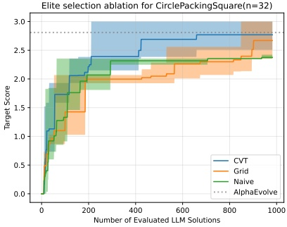

Figure 8: Elite selection ablations for CODEEVOLVE using Qwen3-Coder-30B on the CirclePackingSquare problem with n = 32.

method (Vassiliades et al., 2017), referred to as CVT, is a variant of the MAP-Elites (Mouret and Clune, 2015) algorithm, in which the feature space is partitioned according to a fixed number of centroids that approximate a centroidal Voronoi tessellation, e.g., by means of Lloyd's algorithm (Lloyd, 1982); (ii) the traditional MAP-Elites method, referred to as Grid, in which the feature space is partitioned according to a regular lattice; and (iii) a naive elite selection, referred to as Naive, in which we define a maximum population cap and only add a new solution/prompt if its fitness is greater than the fitness of the worst live individual.

Figure 8 shows the results of this experiment for the CirclePackingSquare problem with n = 32. The most notable finding is that the MAP-Elites method is clearly necessary for surpassing AlphaEvolve's results, and moreover, the CVT variant displays the best performance both in terms of sample efficiency and mean score.

Choice of island topology In this experiment, we vary the underlying migration topology in order to assess its impact on the performance of CODEEVOLVE. We consider three distinct topologies: (i) the Cycle topology connects the N islands according to the undirected cycle graph  $ C_N $, i.e., if  $ \{0, \ldots, N - 1\} $ are the island indices, then island i can send and receive migrants from islands  $ i-1 \mod N $ and  $ i+1 \mod N $; (ii) the Complete topology connects the islands according to the undirected complete graph  $ K_N $, i.e., all islands can send an receive migrants from one another; and (iii) the Empty topology does not connect any of the islands, thus suppressing migration.

Figure 9 shows that, for the CirclePacking-

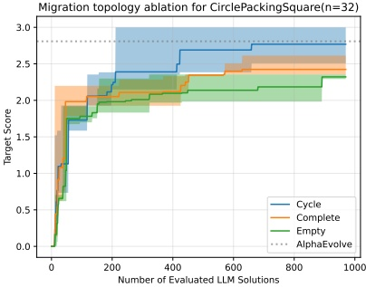

Figure 9: Migration topology ablations for CODE-VOLVE using Qwen3-Coder-30B on the CirclePackingSquare problem with n = 32.

Square problem with n = 32, the Cycle configuration is the only one able to surpass AlphaEvolve's results, with the Complete topology only being slightly superior to the Empty topology in mean score. This shows that migration between islands clearly plays a crucial role in producing state-of-the-art results, but also that excessively migrating between islands can be detrimental, as the overall diversity tends to decrease.

### B.2 Cost and Runtime comparison

In this section, we provide further information about the cost and runtime of our experiments. Figure 10 shows the solution and cost history for both ensemble configurations in the n = 32 instance of the CirclePackingSquare problem. As discussed in Section 5, we again see that, although Qwen3-Coder-30B presents a smaller sample efficiency when compared to GEMINI-2.5, it not only finds the best performing solution but does so at almost 10% of the cost.

Table 2 provides approximate costs and runtimes for the best runs of both ensemble configurations on the considered benchmarks. Overall, we can easily see that Qwen3 is significantly less expensive when compared to GEMINI-2.5. The runtime varies between problems, as it mainly depends on the evaluation timeout and number of islands being used (see Table 3), but overall it remains similar between configurations. For the costs and runtimes of all experiments conducted, including the multiple runs done for the ablation studies, see https://github.com/inter-co/science-codeevolve.

## C Experiment Details

In this section, we provide further details about the configurations used in our experiments. CODEEVOLVE's components have many different parameters, so we only list the most important ones here. For the complete configuration files, see https://github.com/inter-co/science-codeevolve.

Ensemble configurations. All experiments with the Qwen3-Coder-3B model use a temperature of 0.7 and top-p of 0.8. The ensemble with GEMINI 2.5 FLASH/PRO uses temperatures of 0.7 and top-p of 0.95 for both models. During exploration steps, we only call the FLASH variant, and during exploitation steps, we call FLASH with 60% probability and PRO with 40% probability by default.

CODEEVOLVE hyperparameters Table 3 shows the hyperparameters for the best runs of CODEEVOLVE on the proposed benchmarks. By default, we start with an exploration probability of 0.2, and use the Plateau Scheduler to increase this probability by a multiplicative factor of 1.05 if no fitness increase is observed for 5 epochs, and decrease it by 0.95 otherwise, preserving a minimum rate of 0.2 and a maximum rate of 0.5.

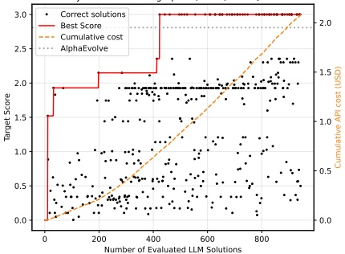

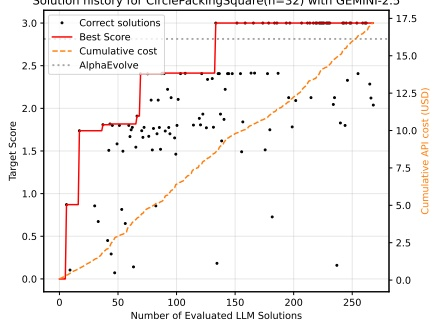

Figure 10: Solution and cost history of Qwen3-Coder-30B and GEMINI-2.5 in the CirclePackingSquare problem with n = 32.

Table 2: Cost and time comparison between Qwen3-Coder-30B and GEMINI-2.5 for the best runs of CODEEVOLVE on the benchmark problems.

<table border=1 style='margin: auto; word-wrap: break-word;'><tr><td rowspan="2">Problem</td><td colspan="2">Qwen3-Coder-30B</td><td colspan="2">GEMINI-2.5</td></tr><tr><td style='text-align: center; word-wrap: break-word;'>Cost (USD)</td><td style='text-align: center; word-wrap: break-word;'>Time (Hours)</td><td style='text-align: center; word-wrap: break-word;'>Cost (USD)</td><td style='text-align: center; word-wrap: break-word;'>Time (Hours)</td></tr><tr><td style='text-align: center; word-wrap: break-word;'>CirclePackingSquare(n=26)</td><td style='text-align: center; word-wrap: break-word;'>6.5</td><td style='text-align: center; word-wrap: break-word;'>6.2</td><td style='text-align: center; word-wrap: break-word;'>34.5</td><td style='text-align: center; word-wrap: break-word;'>6.1</td></tr><tr><td style='text-align: center; word-wrap: break-word;'>CirclePackingSquare(n=32)</td><td style='text-align: center; word-wrap: break-word;'>2.1</td><td style='text-align: center; word-wrap: break-word;'>2.2</td><td style='text-align: center; word-wrap: break-word;'>17.2</td><td style='text-align: center; word-wrap: break-word;'>7.5</td></tr><tr><td style='text-align: center; word-wrap: break-word;'>CirclePackingRect(n=21)</td><td style='text-align: center; word-wrap: break-word;'>11.4</td><td style='text-align: center; word-wrap: break-word;'>15.3</td><td style='text-align: center; word-wrap: break-word;'>67.5</td><td style='text-align: center; word-wrap: break-word;'>11.1</td></tr><tr><td style='text-align: center; word-wrap: break-word;'>HexagonPacking(n=11)</td><td style='text-align: center; word-wrap: break-word;'>6.2</td><td style='text-align: center; word-wrap: break-word;'>16.0</td><td style='text-align: center; word-wrap: break-word;'>73.7</td><td style='text-align: center; word-wrap: break-word;'>17.5</td></tr><tr><td style='text-align: center; word-wrap: break-word;'>HexagonPacking(n=12)</td><td style='text-align: center; word-wrap: break-word;'>6.1</td><td style='text-align: center; word-wrap: break-word;'>14.5</td><td style='text-align: center; word-wrap: break-word;'>77.4</td><td style='text-align: center; word-wrap: break-word;'>15.6</td></tr><tr><td style='text-align: center; word-wrap: break-word;'>MinimizeMaxMinDist(n=16,d=2)</td><td style='text-align: center; word-wrap: break-word;'>4.9</td><td style='text-align: center; word-wrap: break-word;'>21.7</td><td style='text-align: center; word-wrap: break-word;'>51.5</td><td style='text-align: center; word-wrap: break-word;'>15.7</td></tr><tr><td style='text-align: center; word-wrap: break-word;'>MinimizeMaxMinDist(n=14,d=3)</td><td style='text-align: center; word-wrap: break-word;'>9.6</td><td style='text-align: center; word-wrap: break-word;'>10.9</td><td style='text-align: center; word-wrap: break-word;'>54.4</td><td style='text-align: center; word-wrap: break-word;'>13.1</td></tr><tr><td style='text-align: center; word-wrap: break-word;'>FirstAutocorrIneq</td><td style='text-align: center; word-wrap: break-word;'>9.7</td><td style='text-align: center; word-wrap: break-word;'>15.3</td><td style='text-align: center; word-wrap: break-word;'>70.8</td><td style='text-align: center; word-wrap: break-word;'>17.3</td></tr><tr><td style='text-align: center; word-wrap: break-word;'>SecondAutocorrIneq</td><td style='text-align: center; word-wrap: break-word;'>6.7</td><td style='text-align: center; word-wrap: break-word;'>14.5</td><td style='text-align: center; word-wrap: break-word;'>66.7</td><td style='text-align: center; word-wrap: break-word;'>18.7</td></tr></table>

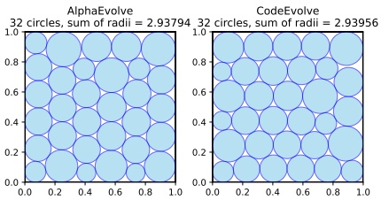

Figure 11: Comparison of best solutions found by CODEEVOLVE and AlphaEvolve for the CirclePackingSquare problem with n = 32.

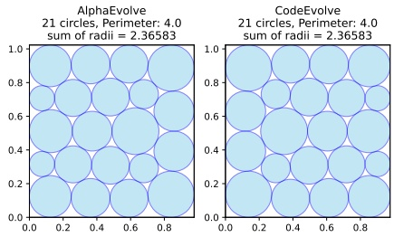

Figure 12: Comparison of best solutions found by CODEEVOLVE and AlphaEvolve for the CirclePackingRect problem with n = 21.

Table 3: Hyperparameters used in the best runs of CODEEVOLVE for the proposed benchmarks.

<table border=1 style='margin: auto; word-wrap: break-word;'><tr><td rowspan="2">Problem</td><td colspan="8">Hyperparameters</td></tr><tr><td style='text-align: center; word-wrap: break-word;'>Model</td><td style='text-align: center; word-wrap: break-word;'>Islands</td><td style='text-align: center; word-wrap: break-word;'>Epochs</td><td style='text-align: center; word-wrap: break-word;'>Depth</td><td style='text-align: center; word-wrap: break-word;'>Inspirations</td><td style='text-align: center; word-wrap: break-word;'>CPUs</td><td style='text-align: center; word-wrap: break-word;'>Evaluation (s) Timeout (s)</td><td style='text-align: center; word-wrap: break-word;'>Evaluation Max Memory (GB)</td></tr><tr><td style='text-align: center; word-wrap: break-word;'>CirclePackingSquare(n = 26)</td><td style='text-align: center; word-wrap: break-word;'>Qwen3-Coder-30B</td><td style='text-align: center; word-wrap: break-word;'>10</td><td style='text-align: center; word-wrap: break-word;'>250</td><td style='text-align: center; word-wrap: break-word;'>5</td><td style='text-align: center; word-wrap: break-word;'>2</td><td style='text-align: center; word-wrap: break-word;'>10</td><td style='text-align: center; word-wrap: break-word;'>60</td><td style='text-align: center; word-wrap: break-word;'>1</td></tr><tr><td style='text-align: center; word-wrap: break-word;'>CirclePackingSquare(n = 32)</td><td style='text-align: center; word-wrap: break-word;'>Qwen3-Coder-30B</td><td style='text-align: center; word-wrap: break-word;'>10</td><td style='text-align: center; word-wrap: break-word;'>100</td><td style='text-align: center; word-wrap: break-word;'>5</td><td style='text-align: center; word-wrap: break-word;'>2</td><td style='text-align: center; word-wrap: break-word;'>10</td><td style='text-align: center; word-wrap: break-word;'>60</td><td style='text-align: center; word-wrap: break-word;'>1</td></tr><tr><td style='text-align: center; word-wrap: break-word;'>CirclePackingRect(n = 21)</td><td style='text-align: center; word-wrap: break-word;'>GEMINI-2.5</td><td style='text-align: center; word-wrap: break-word;'>5</td><td style='text-align: center; word-wrap: break-word;'>200</td><td style='text-align: center; word-wrap: break-word;'>5</td><td style='text-align: center; word-wrap: break-word;'>2</td><td style='text-align: center; word-wrap: break-word;'>10</td><td style='text-align: center; word-wrap: break-word;'>60</td><td style='text-align: center; word-wrap: break-word;'>1</td></tr><tr><td style='text-align: center; word-wrap: break-word;'>HexagonPacking(n = 11)</td><td style='text-align: center; word-wrap: break-word;'>GEMINI-2.5</td><td style='text-align: center; word-wrap: break-word;'>5</td><td style='text-align: center; word-wrap: break-word;'>200</td><td style='text-align: center; word-wrap: break-word;'>Unlimited</td><td style='text-align: center; word-wrap: break-word;'>3</td><td style='text-align: center; word-wrap: break-word;'>10</td><td style='text-align: center; word-wrap: break-word;'>180</td><td style='text-align: center; word-wrap: break-word;'>5</td></tr><tr><td style='text-align: center; word-wrap: break-word;'>HexagonPacking(n = 12)</td><td style='text-align: center; word-wrap: break-word;'>GEMINI-2.5</td><td style='text-align: center; word-wrap: break-word;'>5</td><td style='text-align: center; word-wrap: break-word;'>200</td><td style='text-align: center; word-wrap: break-word;'>Unlimited</td><td style='text-align: center; word-wrap: break-word;'>3</td><td style='text-align: center; word-wrap: break-word;'>10</td><td style='text-align: center; word-wrap: break-word;'>180</td><td style='text-align: center; word-wrap: break-word;'>5</td></tr><tr><td style='text-align: center; word-wrap: break-word;'>MinimizeMaxMinDist(n = 16, d = 2)</td><td style='text-align: center; word-wrap: break-word;'>GEMINI-2.5</td><td style='text-align: center; word-wrap: break-word;'>5</td><td style='text-align: center; word-wrap: break-word;'>200</td><td style='text-align: center; word-wrap: break-word;'>Unlimited</td><td style='text-align: center; word-wrap: break-word;'>3</td><td style='text-align: center; word-wrap: break-word;'>10</td><td style='text-align: center; word-wrap: break-word;'>180</td><td style='text-align: center; word-wrap: break-word;'>5</td></tr><tr><td style='text-align: center; word-wrap: break-word;'>MinimizeMaxMinDist(n = 14, d = 3)</td><td style='text-align: center; word-wrap: break-word;'>GEMINI-2.5</td><td style='text-align: center; word-wrap: break-word;'>10</td><td style='text-align: center; word-wrap: break-word;'>100</td><td style='text-align: center; word-wrap: break-word;'>Unlimited</td><td style='text-align: center; word-wrap: break-word;'>3</td><td style='text-align: center; word-wrap: break-word;'>20</td><td style='text-align: center; word-wrap: break-word;'>360</td><td style='text-align: center; word-wrap: break-word;'>5</td></tr><tr><td style='text-align: center; word-wrap: break-word;'>FirstAutocorrIneq</td><td style='text-align: center; word-wrap: break-word;'>GEMINI-2.5</td><td style='text-align: center; word-wrap: break-word;'>5</td><td style='text-align: center; word-wrap: break-word;'>200</td><td style='text-align: center; word-wrap: break-word;'>Unlimited</td><td style='text-align: center; word-wrap: break-word;'>3</td><td style='text-align: center; word-wrap: break-word;'>10</td><td style='text-align: center; word-wrap: break-word;'>180</td><td style='text-align: center; word-wrap: break-word;'>5</td></tr><tr><td style='text-align: center; word-wrap: break-word;'>SecondAutocorrIneq</td><td style='text-align: center; word-wrap: break-word;'>Qwen3-Coder-30B</td><td style='text-align: center; word-wrap: break-word;'>10</td><td style='text-align: center; word-wrap: break-word;'>250</td><td style='text-align: center; word-wrap: break-word;'>5</td><td style='text-align: center; word-wrap: break-word;'>3</td><td style='text-align: center; word-wrap: break-word;'>10</td><td style='text-align: center; word-wrap: break-word;'>90</td><td style='text-align: center; word-wrap: break-word;'>5</td></tr></table>

