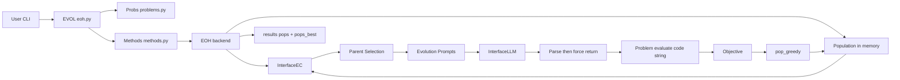
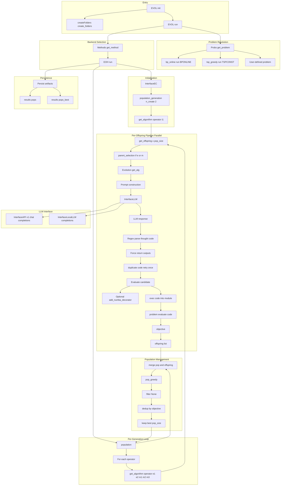
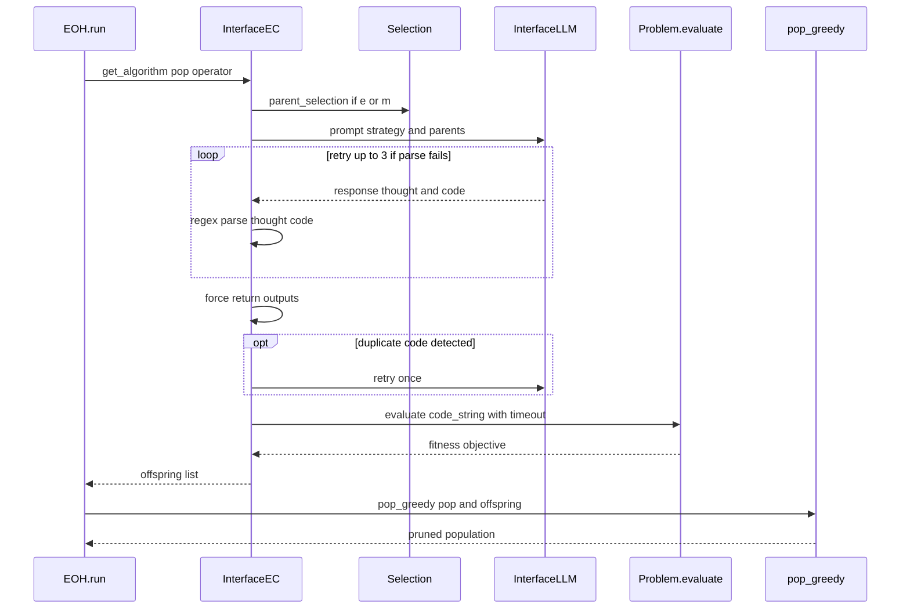

# EoH Paper + Code Implementation Notes

This document cross-walks the EoH paper with the concrete implementation in this repository. It is intended as a reference for later backend integration work alongside the existing FunSearch backend.

**Sources analyzed**
- Paper (PDF): [Evolution_of_Heuristics_Towards_Efficient_Automatic_Algorithm_Design_Using_Large_Language_Model.pdf](Evolution_of_Heuristics_Towards_Efficient_Automatic_Algorithm_Design_Using_Large_Language_Model.pdf)
- Paper (Markdown): [Evolution_of_Heuristics_Towards_Efficient_Automatic_Algorithm_Design_Using_Large_Language_Model.md](Evolution_of_Heuristics_Towards_Efficient_Automatic_Algorithm_Design_Using_Large_Language_Model.md)
- Codebase root: [README.md](EoH/README.md)
- Core package entrypoint: [eoh.py](EoH/eoh/src/eoh/eoh.py)
- EoH method implementation: [eoh/methods/eoh/eoh.py](EoH/eoh/src/eoh/methods/eoh/eoh.py)
- EoH evolution prompts: [eoh/methods/eoh/eoh_evolution.py](EoH/eoh/src/eoh/methods/eoh/eoh_evolution.py)
- EC interface and evaluation dispatch: [eoh/methods/eoh/eoh_interface_EC.py](EoH/eoh/src/eoh/methods/eoh/eoh_interface_EC.py)
- LLM interfaces: [eoh/llm/interface_LLM.py](EoH/eoh/src/eoh/llm/interface_LLM.py)
- Default parameter schema: [eoh/utils/getParas.py](EoH/eoh/src/eoh/utils/getParas.py)
- Built-in optimization problems: [eoh/problems/problems.py](EoH/eoh/src/eoh/problems/problems.py)

## 0. Architecture Diagrams (Mermaid)

These diagrams are designed to complement the implementation notes below. The high-level view maps directly to Sections 2–3, while the detailed view expands Sections 5–10 (prompts, evaluation, and population management).

### 0.0 Diagram Reading Guide

Use the diagrams as an index into the rest of this document. The most important crosswalks are:
- `EVOL`: Section 3, [eoh.py](EoH/eoh/src/eoh/eoh.py)
- `Probs.get_problem`: Section 9, [problems.py](EoH/eoh/src/eoh/problems/problems.py)
- `Evolution._get_alg` and prompts: Section 5, [eoh_evolution.py](EoH/eoh/src/eoh/methods/eoh/eoh_evolution.py)
- `InterfaceEC` evaluation path: Section 7, [eoh_interface_EC.py](EoH/eoh/src/eoh/methods/eoh/eoh_interface_EC.py)
- `pop_greedy`: Section 8, [pop_greedy.py](EoH/eoh/src/eoh/methods/management/pop_greedy.py)
- `results/pops` and `results/pops_best`: Section 10, [createFolders.py](EoH/eoh/src/eoh/utils/createFolders.py)

Diagram notes:
- Edges indicate control flow. The `population` node represents in-memory state, and `results/pops*` nodes represent persisted artifacts.
- Objective values are minimized throughout the population management path.

### 0.1 High-Level Module Interaction

### 0.2 Detailed Implementation Flow

### 0.3 Sequence View (Single Operator Call)

The subgraph names in Diagram 0.2 mirror the section headers below and are intended as quick entry points when tracing implementation details. For backend integration work, focus first on the Offspring and Pop subgraphs, then cross-check Sections 5–10 for the exact code paths and data contracts.

## 1. Paper Summary (Conceptual Model)

EoH evolves heuristics by co-evolving two linked representations per individual:
1. A high-level natural language “thought” (heuristic description).
2. An executable code implementation of the heuristic.

Core loop as described in the paper:
1. Initialize a population of heuristics via LLM prompts.
2. Generate new heuristics with multiple prompt strategies.
3. Evaluate each heuristic on a set of instances (fitness = average performance).
4. Select best heuristics to form the next generation.

Prompt strategies in the paper:
- Initialization (I1): generate a new heuristic and code.
- Exploration (E1): generate a heuristic very different from parents.
- Exploration (E2): find common idea in parents, then design a different heuristic based on that idea.
- Modification (M1): modify a parent heuristic for better performance.
- Modification (M2): adjust parent heuristic parameters.
- Modification (M3): simplify the heuristic by removing redundant parts.

Paper experiments (high-level):
- Online bin packing: evolve a bin scoring function. Fitness = average gap vs. lower bound.
- TSP: evolve a GLS update heuristic for distance matrix (paper uses GLS; see implementation section for deviations).
- FSSP: evolve a GLS perturbation heuristic for the time matrix.

## 2. Codebase Structure Mapping

Top-level layout under `/workspace/ablation/EoH/EoH`:
- `eoh/`: Python package, core framework.
- `examples/`: runnable examples for bin packing, TSP construct, and custom problems.
- `baseline/funsearch/`: separate FunSearch baseline code (not part of the `eoh` package runtime).

Inside the package (`eoh/src/eoh`):
- `eoh.py`: top-level orchestrator `EVOL` class.
- `methods/`: algorithm backends (`eoh`, `ael`, `localsearch`).
- `problems/`: built-in problems and prompt definitions.
- `llm/`: LLM API adapters.
- `utils/`: parameter handling and result folder creation.

## 3. Runtime Control Flow (Actual Implementation)

This is the concrete call path when you run `eoh.EVOL.run()`:
1. `EVOL.run()` in [eoh.py](EoH/eoh/src/eoh/eoh.py) instantiates a problem via `Probs`.
2. `Probs.get_problem()` (in [problems.py](EoH/eoh/src/eoh/problems/problems.py)) returns either a built-in problem object or a user-supplied one.
3. `Methods.get_method()` (in [methods.py](EoH/eoh/src/eoh/methods/methods.py)) selects the backend (`EOH` for `method = "eoh"`).
4. `EOH.run()` (in [eoh/methods/eoh/eoh.py](EoH/eoh/src/eoh/methods/eoh/eoh.py)) orchestrates evolution. It creates `InterfaceEC` (LLM + evaluation + operator interface), initializes a population, iterates through generations (`ec_n_pop`) and operators (`ec_operators`), and saves population snapshots to `results/pops` plus the best individual to `results/pops_best`.

## 4. Configuration and Defaults

The configuration schema is `Paras` in [getParas.py](EoH/eoh/src/eoh/utils/getParas.py).

Key defaults (as shipped):
- `method = 'eoh'`
- `problem = 'tsp_construct'`
- `ec_pop_size = 5`
- `ec_n_pop = 5`
- `ec_m = 2` (number of parents for E1/E2)
- `ec_operators = ['e1','e2','m1','m2']` for EoH
- `selection = 'prob_rank'`
- `management = 'pop_greedy'`
- `eva_timeout = 20` for `bp_online` and `tsp_construct`
- `eva_numba_decorator = True` for `bp_online`

Parallelism:
- `exp_n_proc` controls `joblib.Parallel` process count.
- `exp_n_proc = -1` uses CPU count.

## 5. Evolution Operators and Prompting (Implemented)

Prompts are defined by the problem’s `GetPrompts` object and are assembled in `Evolution` (in [eoh_evolution.py](EoH/eoh/src/eoh/methods/eoh/eoh_evolution.py)). Each prompt expects:
- A one-sentence algorithm description inside braces `{...}`.
- A Python function with a fixed name, inputs, and outputs.

Operators implemented:
- `i1`: initialization (no parents).
- `e1`: “very different” from parents.
- `e2`: identify common idea then build a new heuristic based on it.
- `m1`: modify a parent heuristic.
- `m2`: modify parameters of a parent heuristic.
- `m3`: simplify a heuristic by removing redundant parts.

Parsing logic:
- Description extracted with regex on `{...}` or the preamble before `def`/`import`.
- Code extracted by regex from first `def`/`import` until `return`.
- If parsing fails, it retries the LLM up to 3 times.
- After regex extraction, the code string ends at the last `return` keyword (the regex does not capture the return expression). The implementation then appends the expected output variable names, producing `return <expected_outputs>` regardless of what the LLM originally returned. This relies on the prompt’s requirement that the LLM assigns those output variable names.

Important implementation detail:
- The default operator list does **not** include `m3` even though the paper uses M1–M3. Enabling `m3` requires explicitly setting `ec_operators` in `Paras`.

## 6. LLM Interface Layer

LLM selection in [interface_LLM.py](EoH/eoh/src/eoh/llm/interface_LLM.py):
- `llm_use_local = True` uses `InterfaceLocalLLM` (custom REST endpoint, expects `content` in JSON response).
- Otherwise uses `InterfaceAPI` (OpenAI-compatible `/v1/chat/completions` style).

Behavior:
- The LLM adapter immediately tests connectivity with a `"1+1=?"` prompt.
- If the response is `None`, the process terminates.

## 7. EC Interface and Evaluation

`InterfaceEC` (in [eoh_interface_EC.py](EoH/eoh/src/eoh/methods/eoh/eoh_interface_EC.py)) manages:
- LLM prompt calls for each operator.
- Duplicate checking by code string.
- Evaluation of candidate code via the problem’s `evaluate(code_string)`.

Evaluation is executed by:
- Compiling the LLM code string with `exec` into a new module object.
- Passing that module to the problem’s evaluation routine.

Optional acceleration:
- If `eva_numba_decorator = True`, the system injects `@numba.jit(nopython=True)` into the generated function (see [evaluator_accelerate.py](EoH/eoh/src/eoh/methods/eoh/evaluator_accelerate.py)).

Timeout handling:
- Each evaluation runs via a `ThreadPoolExecutor` with a timeout (`eva_timeout`).
- The outer `joblib.Parallel` call also has a timeout (`eva_timeout + 15`).

## 8. Population Management and Selection

Selection methods (choose via `paras.selection`):
- `prob_rank` (default): rank-based probability 1/(rank + N).
- `roulette_wheel`: proportional to 1/(objective + 1e-6).
- `tournament`: tournament size 2.
- `equal`: uniform random.

Management method (default `pop_greedy` in [pop_greedy.py](EoH/eoh/src/eoh/methods/management/pop_greedy.py)):
- Filters out individuals with `objective = None`.
- Deduplicates by objective value.
- Keeps the `size` smallest objectives (minimization).

## 9. Built-in Problems (as Implemented)

### 9.1 Online Bin Packing (`bp_online`)
- Implementation: [bp_online/run.py](EoH/eoh/src/eoh/problems/optimization/bp_online/run.py)
- Instances: hard-coded Weibull 5k dataset in [bp_online/get_instance.py](EoH/eoh/src/eoh/problems/optimization/bp_online/get_instance.py).
- Heuristic signature: `score(item, bins) -> scores`.
- Fitness: average gap vs. L1 lower bound computed from instances.
- Evaluation uses greedy online packing with the score function.
- Objective direction: smaller is better (the gap `(avg_bins - lb) / lb` is minimized).
- If multiple datasets were present, the current loop would overwrite `fitness` on each dataset and return only the last one; with the shipped single dataset this is not a practical issue.

### 9.2 TSP Constructive (`tsp_construct`)
- Implementation: [tsp_greedy/run.py](EoH/eoh/src/eoh/problems/optimization/tsp_greedy/run.py)
- Instances: randomly generated coordinates with fixed seed, via [tsp_greedy/get_instance.py](EoH/eoh/src/eoh/problems/optimization/tsp_greedy/get_instance.py).
- Heuristic signature: `select_next_node(current_node, destination_node, unvisited_nodes, distance_matrix) -> next_node`.
- Fitness: average tour length across generated instances.
- If the heuristic selects a duplicate node, the evaluation returns `None` for that instance and the individual is discarded by population management.
- The prompt input name has a typo (`univisited_nodes`) but evaluation is positional, so only the argument order matters.

### 9.3 GLS-based TSP and FSSP (Examples)
The GLS-style tasks described in the paper are implemented as **examples**, not as built-in `problems`:
- TSP GLS: [examples/user_tsp_gls](EoH/examples/user_tsp_gls)
- FSSP GLS: [examples/user_fssp_gls](EoH/examples/user_fssp_gls)

These follow the same contract: `problem.prompts` + `problem.evaluate(code_string)`.
- TSP GLS prompt expects `update_edge_distance(edge_distance, local_opt_tour, edge_n_used) -> updated_edge_distance`.
- FSSP GLS prompt expects `get_matrix_and_jobs(current_sequence, time_matrix, m, n) -> new_matrix, perturb_jobs`.

## 10. Outputs and Artifacts

When running EoH, the framework creates:
- `results/pops/population_generation_<k>.json` for each generation.
- `results/pops_best/population_generation_<k>.json` for the best individual.

Folder creation is handled by [createFolders.py](EoH/eoh/src/eoh/utils/createFolders.py).

## 11. Paper vs. Code: Notable Deviations

These gaps matter for integration and ablation parity:
- Operator set mismatch: the paper uses E1/E2/M1/M2/M3, but the default code uses only E1/E2/M1/M2.
- Parent count mismatch: paper uses `p = 5` for E1/E2; code default is `ec_m = 2`.
- Initialization: code generates `2 * pop_size` candidates then prunes to `pop_size`.
- Built-in tasks: code defaults to `tsp_construct` (greedy), while paper’s main TSP/FSSP experiments are GLS-based.
- Evaluation timeouts: paper mentions 60s for TSP/FSSP; code defaults to 20s for `bp_online` and `tsp_construct`.
- Randomness: Python `random.seed(2024)` in EOH; NumPy seed applied per problem only in some tasks.
- `m3` prompt does not explicitly request a description; parsing can fail without LLM compliance.
- Fitness orientation: the paper reports `lb / n` for bin packing (higher is better), while the code minimizes `(avg_bins - lb) / lb`. Both are monotonic in `n` but not identical in scale.
- `ec_operator_weights` validation uses a misspelled attribute (`self.ec_operator`), which will break if custom weights are provided.
- If any `ec_operator_weight` is less than 1, `EOH.run()` can hit an `UnboundLocalError` because `offsprings` is referenced even when the operator is skipped.
- `methods.py` includes `funsearch` and `reevo` branches but there are no corresponding modules under `eoh/src/eoh/methods`. The FunSearch baseline lives under `baseline/funsearch` and is not wired into the EoH package.
- `setup.py` lists only `numpy`, `numba`, and `joblib`, but the runtime uses `requests`, `docx`, and `matplotlib` in optional paths. Installing the package alone may be insufficient for local LLM calls or report generation.
- Paper ablation variants (EoC, EoH-e1, EoH-e2, T2T2C, T&C2T2C) are described but do not exist as first-class modes in code. Some can be approximated by changing `ec_operators` and prompt content, but they are not one-to-one implementations.

## 12. Integration Checklist for a New Backend

If the goal is to integrate EoH into another framework (e.g., alongside FunSearch), the minimum moving parts are:
1. Problem adapter providing `prompts` + `evaluate(code_string)`.
2. LLM adapter compatible with EoH prompt/response parsing.
3. EC loop matching EoH’s “thought + code” representation.
4. Population management and selection policy consistent with the intended ablation.
5. Output persistence to match existing experiment tracking (`results/pops` layout).
6. Objective orientation should be “smaller is better” to match `pop_greedy`.
7. The response parser must enforce the expected output variable names or the execution will fail.

This document should be used as the canonical mapping between the paper’s algorithm and the actual code paths in this repo.

## 13. Prompt Content vs. Paper Examples

The paper’s appendix shows explicit prompt templates that include “avoid randomness” and detailed formatting notes. In the code, the shipped prompts are shorter and less restrictive. For example, [bp_online/prompts.py](EoH/eoh/src/eoh/problems/optimization/bp_online/prompts.py) does not forbid randomness even though the paper’s prompt example does. If you want parity with paper experiments, you should align the prompt strings with the appendix versions.

The paper’s GLS-based tasks are represented as examples rather than built-in problems. Their prompts live in [examples/user_tsp_gls/prompts.py](EoH/examples/user_tsp_gls/prompts.py) and [examples/user_fssp_gls/prompts.py](EoH/examples/user_fssp_gls/prompts.py), which more closely match the paper’s description of GLS update heuristics.

## 14. Baseline FunSearch Code (Separate from EoH Package)

The FunSearch baseline under [baseline/funsearch](EoH/baseline/funsearch) is a standalone implementation with its own LLM interface, sandboxing, and evaluation pipeline. It is not wired into `eoh/src/eoh/methods` and cannot be selected through `Paras.method` without additional integration work.

Key interface differences relevant to future backend integration:
1. FunSearch uses a “specification + function continuation” paradigm, not “thought + code” pairs.
2. FunSearch evaluates in a multiprocessing sandbox, while EoH evaluates in-process via `exec`.
3. FunSearch’s bin packing data and fitness definitions live inside its own `bin_packing_utils.py`, separate from EoH’s Weibull dataset and L1 lower bound logic.

## 15. Additional Implementation Details That Affect Parity

1. The population JSON schema is `{algorithm, code, objective, other_inf}`. Only `code` is used for evaluation; `algorithm` is used only for prompting.
2. The `history` results directory is created but currently unused because the history-writing block is commented out in `EOH.run()`.
3. `pop_greedy` deduplicates by objective value, not by code or algorithm description, which can collapse distinct heuristics with identical scores.
4. The LLM API uses a fixed `POST /v1/chat/completions` path and expects `api_endpoint` to be a host name only.
5. Local LLM calls use a custom JSON schema (`prompt`, `repeat_prompt`, `params`) that must match the provided server scripts in `eoh/llm_local_server`.
6. `roulette_wheel` selection assumes positive objectives. If objectives can be negative (possible for some tasks), probabilities become invalid.
7. The evaluation is done via `exec` in-process, so a malformed heuristic can crash or hang the Python process unless the thread timeout triggers first.
8. Duplicate prevention is best-effort: `check_duplicate` only checks against the current population, not against concurrently generated offsprings in the same batch. `add2pop` also only checks objective equality, so code-level duplicates can still enter the population.

## 16. REvolution Backend Integration Requirements (Cross-Referenced)

The REvolution repo expects every backend to conform to the `EvolutionBackend` interface in [backends/base.py](../../src/revolution/backends/base.py) and to operate on Verilog candidates with JSON-formatted LLM outputs. To integrate an EoH-style backend into REvolution, the following details must be specified or implemented:

1. Backend registration and CLI plumbing
   Add a new backend class under `src/revolution/backends/`, export it in [backends/__init__.py](../../src/revolution/backends/__init__.py), and update [scripts/run_backend.py](../../scripts/run_backend.py) to include the new backend in `--backend` choices and parse backend-specific options.

2. LLM response schema (strict `eoh_v1`)
   REvolution’s `LLMInterface` enforces strict JSON parsing with `format="eoh_v1"` and either `mode="whole"` or `mode="diff"`. In `diff` mode, the code must serialize as `{"edits":[{"file":"...","hunks":[{"search":"...","replace":"..."}]}]}` or strict validation fails with `failed_format`, so prompts must guarantee this shape.

3. Prompt keys and profiles
   Prompts are loaded by key from `data/prompts/<profile>/...`; a new backend must define its required keys and ship corresponding files. If multiple operators are needed (E1/E2/M1/M2/M3), map each to prompt keys similar to `evolve/<STRATEGY>/{whole|diff}` used by the existing REvolution engine.

4. Candidate materialization and evaluation contract
   The backend must write each candidate’s Verilog code to disk and pass `CandidateWorkItem(code, code_file_path, initial_status)` into `CandidateEvaluator`, which expects testbench paths from `ProblemContext` and runs syntax, functionality, synthesis, and PPA stages. Scores are minimized (lower is better), so selection logic must align with this orientation.

5. Artifact layout and summary
   Use `ArtifactWriter` to save `code.sv`, `thought.txt`, metadata JSON, generation logs, and a final summary JSON. `BackendRunResult` should include `best_code_path`, `best_report_path`, and `best_score` when available.

6. Budgeting and termination
   REvolution backends should respect `RunBudget`-style constraints (max evaluations, iterations, runtime, LLM calls/tokens), and the new backend should emit a summary that includes the effective budgets for parity with `run_backend` snapshots.

7. Evaluation-mode compatibility
   In `search_accelerated` mode, `CandidateEvaluator` will skip synthesis for some candidates based on length. The backend should expect `SKIPPED_SYNTHESIS` statuses and still log them.

8. Test coverage expectations
   Add tests analogous to [tests/revolution/test_funsearch_backend.py](../../tests/revolution/test_funsearch_backend.py) validating initialization, prompt key requirements, candidate flow, and summary output.

These are the minimum details required to implement a new backend inside REvolution while maintaining compatibility with existing runners and tests.

## 17. LLM Query and Population Accounting (EoH Code)

The EoH implementation’s LLM call counts and population sizing are implicit and should be made explicit for budgeting:

1. Initialization uses `population_generation()` with `n_create = 2`. Each call to `get_algorithm()` generates `pop_size` offsprings, so initialization issues `2 * pop_size` LLM calls and then prunes down to `pop_size`.
2. Each generation loops over every operator in `ec_operators` and calls `get_algorithm()` once per operator. This issues `pop_size * len(ec_operators)` LLM calls per generation, even though only the best `pop_size` individuals are kept.
3. Each operator call also triggers `pop_size` evaluations in parallel, so the evaluation budget scales with the same factor as LLM calls.
