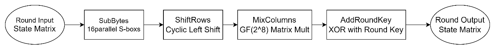
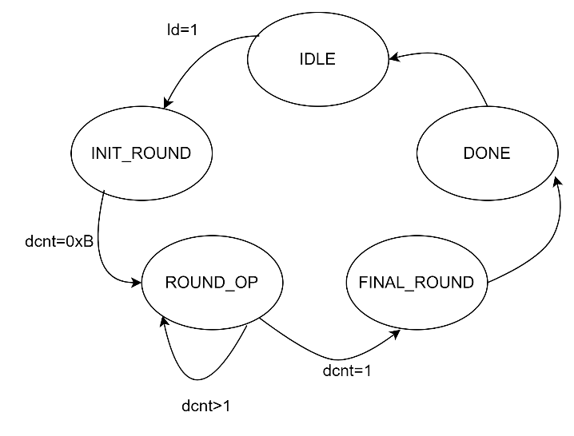

**aes_cipher_top Design Specification**

**1. Introduction**

The aes_cipher_top module is the core control module of the entire AES
encryption system, responsible for coordinating and controlling the
entire encryption process. This module implements all round
transformations of the AES encryption algorithm, including SubBytes,
ShiftRows, MixColumns, and AddRoundKey.

**2. Block Diagram**

**3. Interface**

| **Signal Name** | **Direction** | **Width** | **Description** |
| --- | --- | --- | --- |
| clk | input | 1 | Clock signal |
| rst | input | 1 | Reset signal |
| ld | input | 1 | Load enable |
| done | output | 1 | Encryption complete |
| key | input | 128 | Input key |
| text_in | input | 128 | Input plaintext |
| text_out | output | 128 | Output ciphertext |

**4.Registers**

| **Register Name** | **Width** | **Type** | **Reset Value** | **Description** |
| --- | --- | --- | --- | --- |
| text_in_r | 128 | Data Buffer | 0 | Temporary storage register for input text during encryption process |
| sa[0:3][0:3] | 8 | State Matrix | 0 | 4×4 state matrix registers for storing and processing intermediate encryption results, arranged in column-major order |
| dcnt | 4 | Control | 0 | Round counter register for tracking encryption progress, initial value 11 (0xB) for 10 rounds plus initial round |
| ld_r | 1 | Control | 0 | Load operation flag register, synchronizes data loading with clock cycle |
| text_out | 128 | Output Buffer | 0 | Output register storing the final ciphertext result after complete encryption process |

**5. Operation Principle**

**5.1 Basic Principle**

AES encryption algorithm, based on the state matrix concept, performs 10
rounds of transformation on 128-bit input data. Each round includes:

1.  SubBytes - Non-linear byte substitution

2.  ShiftRows - Row shifting operation

3.  MixColumns - Column mixing operation (except final round)

4.  AddRoundKey - Round key addition

**5.2 Mathematical Principle**

1.  State Matrix Structure

$$\begin{matrix}
sa00 & sa01 & sa02 & sa03 \\
sa10 & sa11 & sa12 & sa13 \\
sa20 & sa21 & sa22 & sa23 \\
sa30 & sa31 & sa32 & sa33
\end{matrix}$$

-   4×4 byte matrix

-   Column-major order mapping

-   Each element is 8-bit data

2.  Round Transformations

a\) **SubBytes**: Non-linear transformation through S-box

-   Independent byte transformation

-   16 bytes processed in parallel

b\) **ShiftRows**: Cyclic left shift

Row 0: \[a b c d\] → \[a b c d\] // No shift

Row 1: \[a b c d\] → \[b c d a\] // Shift 1 byte

Row 2: \[a b c d\] → \[c d a b\] // Shift 2 bytes

Row 3: \[a b c d\] → \[d a b c\] // Shift 3 bytes

c\) **MixColumns**: Column mixing

$$\begin{bmatrix}
02 & 03 & 01 & 01 \\
01 & 02 & 03 & 01 \\
01 & 01 & 02 & 03 \\
03 & 01 & 01 & 02
\end{bmatrix} \times \begin{bmatrix}
s0 \\
s1 \\
s2 \\
s3
\end{bmatrix} = \begin{bmatrix}
out0 \\
out1 \\
out2 \\
out3
\end{bmatrix}$$

-   Operations in GF($2^{8}$)

-   ×2 requires special finite field multiplication

-   ×3 equals (×2)⊕(×1)

d\) **AddRoundKey**: Round key XOR

-   Byte-wise XOR with round key

-   Round key generated by key expansion module

**6. Implementation Details**

**6.1 Data Flow Diagram**

**6.2 State Transition Diagram**

IDLE: This is the initial reset state, waiting for the load signal ld=1.

INIT_ROUND: Loads the input data into the text_in_r register.Performs
the initial round key addition operation.Sets the round counter dcnt=0xB
(11), preparing for the following 10 encryption rounds.

ROUND_OP: Performs the standard round operations (Rounds 1-9).

FINAL_ROUND: Executes the final round operation (Round 10). The final
round does not include the MixColumns operation.

DONE: Indicates that encryption is complete.Sets the done signal.Holds
the final encryption result at the text_out output port.

**6.3 Data Loading Operation**

1.  Input Data Mapping:

-   128-bit input mapped to state matrix in column-major order

-   Fill matrix columns from MSB to LSB

-   One-to-one byte mapping

2.  Initial Round Key Addition:

-   Byte-wise XOR of input data with initial round key

-   Synchronous loading to state matrix registers

-   Loading controlled by load signal

**6.4 Round Transformation Implementation**

1.  **SubBytes Transformation**

-   16 parallel S-box units

-   Process all state matrix bytes simultaneously

-   Pure combinational logic implementation

2.  **ShiftRows Transformation**

-   Hardwired row shifting

-   Independent cyclic left shifts per row

-   Shift distances: 0,1,2,3 bytes

3.  **MixColumns Transformation**

-   Four columns processed in parallel

-   Matrix multiplication in GF(2\^8)

-   Finite field multiplication and XOR operations

4.  **AddRoundKey Transformation**

-   Byte-wise XOR with current round key

-   Round key provided by key expansion module

-   Parallel XOR operations

-   Results stored directly in state matrix registers

**6.5 Control Logic**

1.  **Round Counter Operation**

-   4-bit counter for round control

-   Initial value 11 (10 rounds + initial round)

-   Decrements until completion

2.  **Data Flow Control**

-   Load signal controls initial data input

-   One round per clock cycle

-   Synchronous updates on clock edge

**6.6 Output Generation**

Final Round Operations:

1.  Skip MixColumns transformation

2.  Complete ShiftRows operation

3.  XOR with final round key

4.  Organize output in column-major order

5.  Generate completion signal

**7. Submodules**

**7.1 aes_key_expand_128**

**7.1.1 Description**
The aes_key_expand_128 module is a crucial component
in the AES encryption algorithm, responsible for expanding a 128-bit
initial key into round keys for multiple encryption rounds. This
document describes the design principles, implementation methods, and
interface specifications of this module.

**7.1.2 Interface**
|**Signal** |     **Direction**   | **Width**  | **Description Name**    |                                  
|---|---|---|---|
|clk  |          input    |        1      |     Clock signal|
|kld  |          input    |        1      |     Key load enable|
|key  |          input    |        128    |     Input initial key|
|wo_0  |         output   |        32     |     Output round key word 0|
|wo_1 |          output   |        32     |     Output round key word 1|
|wo_2  |         output   |        32     |     Output round key word 2|
|wo_3  |         output   |        32     |     Output round key word 3|

**7.2 aes_sbox**

**7.2.1 Description**

The aes_sbox module is a crucial component in the AES
encryption algorithm, responsible for performing non-linear byte
substitution operations. This document describes the design principles,
implementation methods, and interface specifications of the S-box.

**7.2.2 Interface**

| **Signal Name** | **Direction** | **Width** | **Description** |
| ---             | ---           | ---       | ---             |
| a | input | 8 | Input byte |
| b | output | 8 | Substituted byte |

**8. Corner Cases**

1\. Timing Related:

-   Initial state after reset

-   State transition during new data loading

2\. Data Loading:

-   Data synchronization during load

-   Data stability assurance

3\. Completion Check:

-   Output control after final round

-   Proper done signal generation

**9. Constraints**

1\. Timing Constraints:

-   Register updates on clock rising edge

-   Critical path includes S-box lookup and column mixing

2\. Resource Constraints:

-   Requires 16 S-box modules

-   4×4 state matrix register array

-   Round counter and control logic

