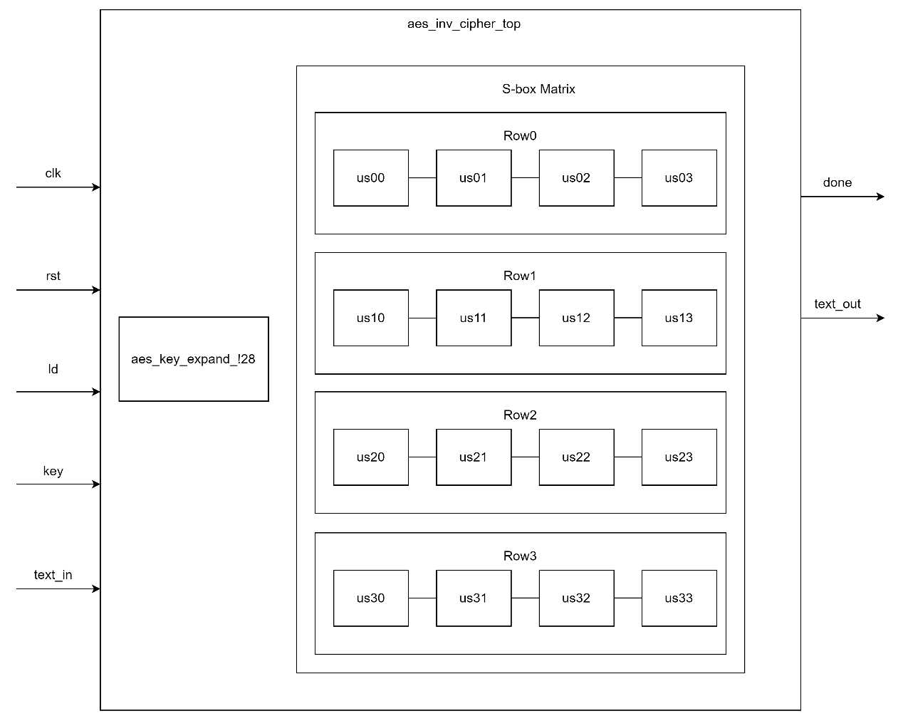
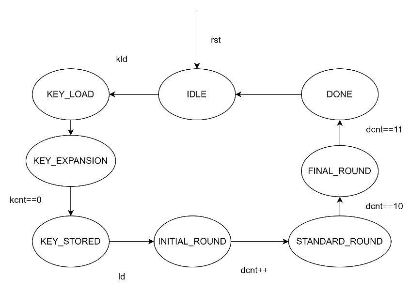

**aes_inv_cipher_top Design Specification**

**1. Introduction**

The aes_inv_cipher_top module is the core control module of the AES
decryption system, responsible for coordinating and controlling the
entire decryption process. This module implements all inverse round
transformations of the AES decryption algorithm, including InvSubBytes,
InvShiftRows, InvMixColumns, and AddRoundKey.

**2. Block Diagram**

**3. Interface**

| **Signal Name** | **Direction** | **Width** | **Description** |
| --- | --- | --- | --- |
| clk | input | 1 | Clock signal |
| rst | input | 1 | Reset signal |
| kld | input | 1 | Key load enable |
| ld | input | 1 | Load enable |
| done | output | 1 | Decryption complete |
| key | input | 128 | Input key |
| text_in | input | 128 | Input ciphertext |
| text_out | output | 128 | Output plaintext |

**4.Registers**

| **Register Name** | **Width** | **Type** | **Reset Value** | **Description** |
| --- | --- | --- | --- | --- |
| text_in_r | 128 | Data Buffer | 0 | Temporary storage register for input ciphertext during decryption process |
| sa[0:3][0:3] | 8 | State Matrix | 0 | 4×4 state matrix registers for storing and processing intermediate decryption results, arranged in column-major order |
| dcnt | 4 | Control | 0 | Round counter register for tracking decryption progress |
| kb[10:0] | 128 | Key Buffer | 0 | Key schedule buffer storing the round keys in reverse order |
| kcnt | 4 | Control | 0xA | Key buffer counter for key schedule loading |
| ld_r | 1 | Control | 0 | Load operation flag register |
| text_out | 128 | Output Buffer | 0 | Output register storing the final plaintext result |

**5. Submodule Relationship**

1\. Key Expansion Module (aes_key_expand_128):

-   Function: Generate the round keys

-   Inputs: Master key (key), clock (clk), load signal (kld)

-   Output: Expanded keys (wk0-wk3)

-   Calling timing: During the key loading stage

2\. Inverse S-box Module (aes_inv_sbox):

-   Number: 16 parallel instances

-   Naming: us00-us33, corresponding to the state matrix positions

-   Input: State matrix element (\_sr)

-   Output: Replaced value (\_sub)

-   Implementation: Pure combinational logic

**6. Operation Principle**

**6.1 Basic Principle**

The AES decryption algorithm is based on the state matrix concept,
performing 10 rounds of inverse transformations on the 128-bit input
ciphertext. Each round includes:

1.  InvShiftRows - Cyclic right shift operation

2.  InvSubBytes - Nonlinear inverse byte substitution

3.  AddRoundKey - XOR with the round key

4.  InvMixColumns - Inverse column mixing operation (except the final
    round)

Key features:

1.  All operations are based on the state matrix

2.  Different round keys are used in each round

3.  The final round does not include the InvMixColumns operation

4.  The order of round key usage is reversed compared to encryption

**6.2 Mathematical Principle**

1\. State Matrix Structure and Data Mapping:

-   State matrix arrangement:

> $$\begin{matrix}
> sa00 & sa01 & sa02 & sa03 \\
> sa10 & sa11 & sa12 & sa13 \\
> sa20 & sa21 & sa22 & sa23 \\
> sa30 & sa31 & sa32 & sa33
> \end{matrix}$$

-   Input data mapping (128-bit in column-major order):

    -   Start from text_in\[127:120\], map to the state matrix from top
        to bottom, left to right.

2\. Inverse Round Transformations

a\) **InvShiftRows**: Cyclic right shift

Row 0: \[a b c d\] → \[a b c d\] // No shift

Row 1: \[a b c d\] → \[d a b c\] // Right shift by 3 bytes

Row 2: \[a b c d\] → \[c d a b\] // Right shift by 2 bytes

Row 3: \[a b c d\] → \[b c d a\] // Right shift by 1 byte

b\) **InvSubBytes**: - Nonlinear transformation using the inverse
S-box - 16 bytes processed in parallel - Involves multiplicative inverse
operations in GF($2^{8}$)

c\) **InvMixColumns**:

Matrix representation:

$$\begin{bmatrix}
0E & 0B & 0D & 09 \\
09 & 0E & 0B & 0D \\
0D & 09 & 0E & 0B \\
0B & 0D & 09 & 0E
\end{bmatrix} \times \begin{bmatrix}
s0 \\
s1 \\
s2 \\
s3
\end{bmatrix} = \begin{bmatrix}
out0 \\
out1 \\
out2 \\
out3
\end{bmatrix}$$

Multiplication coefficients:

\- 0E: 14

\- 0B: 11

\- 0D: 13

\- 09: 9

All operations are performed in the GF($2^{8}$) domain, using
pre-computed polynomial multiplications.

d\) **AddRoundKey**:

\- Byte-wise XOR with the round key

\- Round keys are applied in reverse order

\- Each byte is XOR\'ed with the corresponding round key byte

**7. Implementation Details**

**7.1 State Transition Diagram**

a)  IDLE: This is the initial reset state, waiting for the key load
    signal (kld) or data load signal (ld) to start the decryption
    process.

b)  KeyLoad State: Enters the key loading state, preparing to execute
    the key expansion operation.

c)  KeyExpansion State: Enters the key expansion state, executing the
    expansion algorithm to generate the required round keys.When the key
    expansion is complete (kcnt==0), it transitions to the KeyStored
    state.

d)  KeyStored State: The key expansion is complete, and the round keys
    are ready.Upon receiving the data load signal (ld), it transitions
    to the InitialRound state to start the decryption.

e)  InitialRound State: Performs the initial round\'s inverse round key
    addition operation. The round counter (dcnt) is incremented, and it
    transitions to the StandardRound state.

f)  StandardRound State: Executes the standard round\'s inverse
    transformations, including InvShiftRows, InvSubBytes, AddRoundKey,
    and InvMixColumns. The round counter continues to increment.

g)  FinalRound State: Performs the final round\'s inverse operation,
    excluding the InvMixColumns transformation.When the round counter
    reaches 11, it transitions to the Done state.

h)  Done State: The decryption operation is complete, and the final
    plaintext result is output.

It transitions back to the Idle state, waiting for the next decryption
operation.

**7.2 Round Counter and Control Logic**

1.  Round Counter State Transition:

-   Reset state: Counter reset to 0

-   Load state: Counter set to 1

-   Run state: Increment each cycle

-   Finish state: Count reaches 11 and not in load state

2.  Completion Signal Control:

-   Set when count reaches 11 and not in load state

-   Cleared on reset or new data load

-   Indicates the decryption operation is complete

3.  Run Control (go signal):

-   Cleared on reset

-   Set on data load

-   Cleared on completion

-   Controls the start and stop of the decryption process

**7.3 Initial Data Loading**

1.  Input Data Mapping Process:

-   Buffered in the text_in_r register

-   Mapped to the state matrix in column-major order

-   From sa33 to sa03, then shift left

-   Each data byte XOR\'ed with the corresponding round key byte

2.  State Selection Logic:

-   Load state (ld_r=1): Perform data load and initial round key
    addition

-   Run state (ld_r=0): Use the results of the round transformations

**7.4 Round Transformation Implementation**

1.  InvShiftRows Operation:

-   Row 0: Unchanged

-   Row 1: Cyclic right shift by 3 bytes, sa13-\>sa10, sa10-\>sa11,
    sa11-\>sa12, sa12-\>sa13

-   Row 2: Cyclic right shift by 2 bytes, sa22-\>sa20, sa20-\>sa21,
    sa21-\>sa22, sa23-\>sa21

-   Row 3: Cyclic right shift by 1 byte, sa31-\>sa30, sa32-\>sa31,
    sa33-\>sa32, sa30-\>sa33

2.  InvSubBytes:

-   16 parallel inverse S-box modules

-   Each S-box independently processes a state matrix element

-   The replacement results are used for the subsequent round key
    addition

3.  AddRoundKey Operation:

-   XOR each state matrix byte with the corresponding round key byte

-   The result is assigned to the sa_ark signal

-   The XOR result is used for the InvMixColumns operation

4.  InvMixColumns:

-   Processed independently for each column

-   Uses pre-computed GF(2\^8) multiplication functions (pmul_e/b/d/9)

-   Generates the sa_next signal as the input for the next round

**7.5 Key Expansion Buffer**

1.  Buffer Control Logic:

-   Uses the kcnt (4-bit counter) to track the storage progress

-   Initial value is set to 10, reaches 0 when the storage is complete

-   The kb_ld signal controls the storage process

2.  Key Storage Process:

-   kb\[10\] stores the initial round key

-   kb\[9\] to kb\[1\] store the intermediate round keys

-   kb\[0\] stores the last round key

-   Receives the expanded keys via wk3, wk2, wk1, wk0

3.  Key Retrieval Mechanism:

-   Selects the current round key based on the dcnt (round counter)

-   Outputs to w3, w2, w1, w0 for the round transformations

-   Updated every clock cycle

**7.6 Final Output Generation**

1.  Output Mapping Process:

-   Maps the round key addition result (sa_ark) of the last round to
    text_out

-   In column-major order, opposite to the input mapping

-   From sa00 to sa30, then shift right

2.  Output Timing Control:

-   Synchronized with the clock rising edge

-   Completion signal indicates the valid output

-   Holds the output until the next load

3.  Output Data Organization:

-   The highest byte (text_out\[127:120\]) comes from sa00

-   The lowest byte (text_out\[7:0\]) comes from sa33

-   Bytes are arranged in column-major order

**8. Submodules**

**8.1 aes_key_expand_128**

**8.1.1 Description**

The aes_key_expand_128 module is a crucial component
in the AES encryption algorithm, responsible for expanding a 128-bit
initial key into round keys for multiple encryption rounds. This
document describes the design principles, implementation methods, and
interface specifications of this module.

**8.1.2 Interface**

|**Signal** |     **Direction**   | **Width**  | **Description Name**    |                                  
|---|---|---|---|
|clk  |          input    |        1      |     Clock signal|
|kld  |          input    |        1      |     Key load enable|
|key  |          input    |        128    |     Input initial key|
|wo_0  |         output   |        32     |     Output round key word 0|
|wo_1 |          output   |        32     |     Output round key word 1|
|wo_2  |         output   |        32     |     Output round key word 2|
|wo_3  |         output   |        32     |     Output round key word 3|

**8.2 aes_inv_sbox**

**8.2.1 Description**
The aes_inv_sbox module is a key component in
the AES decryption algorithm, responsible for performing the inverse
non-linear byte substitution operation. This document describes the
design principles, implementation methods, and interface specifications
of the Inverse S-box.

**8.2.2 Interface**

| **Signal  Name**| **Direction**  |  **Width** |  **Description**   |                                  
| --- | --- | --- | --- |
|a |input| 8      |     Input byte|
|b  |output|8      |     Substituted byte|

**9. Corner Cases**

1.  Timing Related:

-   Key schedule loading completion

-   Round operation synchronization

-   Final round detection

2.  Key Schedule:

-   Key buffer loading sequence

-   Key availability timing

-   Buffer overflow prevention

3.  Data Flow:

-   State matrix initialization

-   Round transformation sequencing

-   Output generation timing

**10. Constraints**

> 1\. Timing Constraints:

-   Key schedule must be loaded before data processing

-   Register updates on clock rising edge

-   Critical path includes inverse S-box and inverse column mixing

> 2\. Resource Constraints:

-   16 inverse S-box modules required

-   11 x 128-bit key buffer registers

-   4×4 state matrix register array

-   Complex multiplication functions in GF(2⁸)

> 3\. Control Constraints:

-   Proper key schedule loading sequence

-   Accurate round counting

-   Correct transformation ordering
