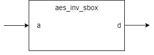

**aes_inv_sbox Design Specification**

**1. Introduction**

The aes_inv_sbox module is a key component in
the AES decryption algorithm, responsible for performing the inverse
non-linear byte substitution operation. This document describes the
design principles, implementation methods, and interface specifications
of the Inverse S-box.

**2. Block Diagram**

**3. Interface**

| **Signal  Name**| **Direction**  |  **Width** |  **Description**   |                                  
| --- | --- | --- | --- |
|a |input| 8      |     Input byte|
|b  |output|8      |     Substituted byte|

**4. Operation Principle**

**4.1 Basic Principle**

The Inverse S-box transformation implements the inverse operation of the
S-box transformation in AES encryption. According to AES algorithm
theory, the inverse S-box values can be obtained through two
mathematical methods:

1.  Through mathematical calculations in GF($2^{8}$) field, including
    multiplicative inverse and inverse affine transformation.

2.  Directly through the Inverse S-box table.

This design uses a lookup table approach to directly implement the
inverse S-box functionality, where the table stores the inverse S-box
output values for all possible inputs.

**4.2 Mathematical Derivation**

The Inverse S-box transformation process is the reverse order of the
original S-box transformation steps:

4.2.1 Inverse Affine Transformation

-   Input byte b undergoes a linear transformation using an inverse
    matrix

-   The transformation includes two parts:

-   8x8 binary matrix multiplication (matrix is inverse of original
    S-box affine transformation matrix)

-   XOR with constant vector 0x05 (inverse of original S-box constant
    0x63)

> $\begin{bmatrix}
> b'0 \\
> b'1 \\
> b'2 \\
> b'3 \\
> b'4 \\
> b'5 \\
> b'6 \\
> b'7
> \end{bmatrix}$ =$\ \left\lbrack \begin{matrix}
> 0 \\
> 0 \\
> 1 \\
> 0 \\
> 0 \\
> 1 \\
> 0 \\
> 1
> \end{matrix}\ \begin{matrix}
> 1 \\
> 0 \\
> 0 \\
> 1 \\
> 0 \\
> 0 \\
> 1 \\
> 0
> \end{matrix}\ \begin{matrix}
> 0 \\
> 1 \\
> 0 \\
> 0 \\
> 1 \\
> 0 \\
> 0 \\
> 1
> \end{matrix}\ \begin{matrix}
> 1 \\
> 0 \\
> 1 \\
> 0 \\
> 0 \\
> 1 \\
> 0 \\
> 0
> \end{matrix}\ \begin{matrix}
> 0 \\
> 1 \\
> 0 \\
> 1 \\
> 0 \\
> 0 \\
> 1 \\
> 0
> \end{matrix}\ \begin{matrix}
> 0 \\
> 0 \\
> 1 \\
> 0 \\
> 1 \\
> 0 \\
> 0 \\
> 1
> \end{matrix}\ \begin{matrix}
> 1 \\
> 0 \\
> 0 \\
> 1 \\
> 0 \\
> 1 \\
> 0 \\
> 0
> \end{matrix}\ \begin{matrix}
> 0 \\
> 1 \\
> 0 \\
> 0 \\
> 1 \\
> 0 \\
> 1 \\
> 0
> \end{matrix} \right\rbrack\ \begin{bmatrix}
> b0 \\
> b1 \\
> b2 \\
> b3 \\
> b4 \\
> b5 \\
> b6 \\
> b7
> \end{bmatrix} + \begin{bmatrix}
> 1 \\
> 1 \\
> 0 \\
> 0 \\
> 0 \\
> 1 \\
> 1 \\
> 0
> \end{bmatrix}$

4.2.2 Multiplicative Inverse in GF($2^{8}$)

-   Calculate multiplicative inverse in Galois Field GF($2^{8}$)

-   Based on irreducible polynomial: p(x)
    =$x^{8} + x^{4} + x^{3} + x + 1$

-   For any non-zero element a, its inverse $a^{- 1}$ satisfies: a ×
    $a^{- 1}$ ≡ 1 (mod p(x))

-   Special case: inverse of 0x00 is defined as 0x00

**4.3 Implementation Method**

Due to the complexity of mathematical operations, actual implementation
uses a ROM lookup table:

1.  ROM structure uses 256 x 8-bit mapping table

2.  Input byte directly serves as ROM address

3.  ROM output corresponds to pre-calculated inverse transformation
    results

4.  All 256 possible input values have unique output mappings

**4.4 Transformation Example**

Taking input 0x63 as an example:

1.  Input 0x63

2.  Lookup table returns 0x00

3.  This result corresponds to S-box mapping 0x00 to 0x63, verifying the
    inverse relationship

**5. Corner Cases**

**5.1 Special Input Value Handling**

-   Input 0x00 → Output 0x52

-   Input 0x63 → Output 0x00

-   Input 0xFF → Output 0x7D

**5.2 Key Verification Points**

1.  Ensure inverse relationship with S-box module

2.  For any input x, must satisfy:

-   S-box(Inv_S-box(x)) = x

-   Inv_S-box(S-box(x)) = x

**6. Constraints**

1.  Implementation Constraints:

-   Pure combinational logic implementation, no clock or reset required

-   Output responds immediately to input changes

-   Input must remain stable until output is sampled

2.  Resource Constraints:

-   ROM implementation requires 256×8-bit storage

-   Implementation method can be chosen based on target device (ROM/LUT)

-   Lookup table method uses more resources than computational
    implementation
