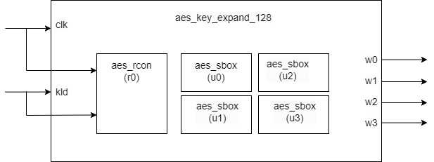
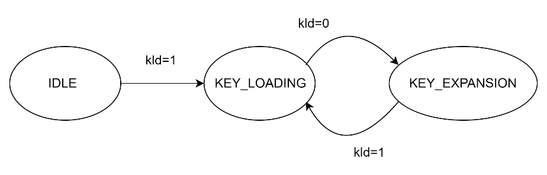

**aes_key_expand_128 Design Specification**

**1. Introduction**

The aes_key_expand_128 module is a crucial component
in the AES encryption algorithm, responsible for expanding a 128-bit
initial key into round keys for multiple encryption rounds. This
document describes the design principles, implementation methods, and
interface specifications of this module.

**2. Block Diagram**

**3. Interface**

|**Signal** |     **Direction**   | **Width**  | **Description Name**    |                                  
|---|---|---|---|
|clk  |          input    |        1      |     Clock signal|
|kld  |          input    |        1      |     Key load enable|
|key  |          input    |        128    |     Input initial key|
|wo_0  |         output   |        32     |     Output round key word 0|
|wo_1 |          output   |        32     |     Output round key word 1|
|wo_2  |         output   |        32     |     Output round key word 2|
|wo_3  |         output   |        32     |     Output round key word 3|
  

**4. Operation Principle**

**4.1 Basic Principle**

AES-128 key expansion transforms a 128-bit initial key into 11 sets of
128-bit round keys (including the initial round key). Each round key
consists of four 32-bit words. The expansion process is iterative,
generating one new round key at a time.

**4.2 Mathematical Derivation**

**The key expansion process involves the following operations:**

1.  Word Rotation (RotWord)

-   Performs a cyclic left shift on input word

-   \[a0,a1,a2,a3\] → \[a1,a2,a3,a0\]

2.  S-box Substitution (SubWord)

-   Applies S-box transformation to each byte

-   Uses the same S-box as encryption process

3.  Round Constant XOR (Rcon)

-   XOR operation with round constant

-   Different constant value for each round

4.  Key Expansion Algorithm

-   W\[i\] = W\[i-4\]⊕T(W\[i-1\]), when i mod 4 = 0

-   W\[i\] = W\[i-4\]⊕W\[i-1\], otherwise where T(W) =
    SubWord(RotWord(W))⊕Rcon

**5. Implementation Details**

**5.1 State Transition Diagram**

**5.2 Key Loading Operation**

1.  When kld signal is active:

-   128-bit input key is divided into four 32-bit words

-   key\[127:96\] loads into first register

-   key\[95:64\] loads into second register

-   key\[63:32\] loads into third register

-   key\[31:0\] loads into fourth register

2.  Loading process:

-   Synchronous loading at clock rising edge

-   All registers update simultaneously

-   Immediately output to wo_0 to wo_3 ports after loading

**5.3 Key Expansion Operation**

1.  When kld signal is inactive, perform expansion:

-   Take the last word (fourth register value)

-   Perform byte reordering and S-box transformation

-   XOR with current round constant

2.  New round key generation sequence:

-   First word: XOR with previous round word and transformation result

-   Second word: XOR with previous round word, current round first word,
    and transformation result

-   Third word: XOR with previous round word, current round first two
    words, and transformation result

-   Fourth word: XOR with previous round word, current round first three
    words, and transformation result

**5.4 S-box Transformation**

1.  S-box transformation process:

-   Perform parallel S-box lookup on reordered bytes

-   First byte transformation result stores in highest 8 bits

-   Second byte transformation result stores in second highest 8 bits

-   Third byte transformation result stores in second lowest 8 bits

-   Fourth byte transformation result stores in lowest 8 bits

**5.5 Round Constant Operation**

1.  Round constant generation:

-   Starts from initial value, updates automatically each round

-   Only highest byte is valid, other bytes are 0

-   XORs with transformation result during each key expansion

2.  Round constant update:

-   Reset during initial key loading

-   Left shift each round, XOR with specific polynomial on overflow

**6. Submodules**

**6.1 aes_rcon**

**6.1.1 Description**
The aes_rcon module generates constant values used in the
AES key expansion process. For each round of key expansion, a different
constant value is needed. This module generates these round constants
through a counter-based lookup mechanism.

**6.1.2 Interface**

|**Signal Name**|      **Direction**|    **Width**|   **Description**|                                      
| --- | --- | --- | --- |
|clk    |        input      |      1       |    System clock|
|kld  |          iutput   |        1     |      Key load signal (active high)|
|out       |     output    |       32   |       Round constant value|

**6.2 aes_sbox**

**6.2.1 Description**

The aes_sbox module is a crucial component in the AES
encryption algorithm, responsible for performing non-linear byte
substitution operations. This document describes the design principles,
implementation methods, and interface specifications of the S-box.

**6.2.2 Interface**

| **Signal Name** | **Direction** | **Width** | **Description** |
| ---             | ---           | ---       | ---             |
| a | input | 8 | Input byte |
| b | output | 8 | Substituted byte |

**7. Corner Cases**

1.  Key loading timing:

-   kld signal rising edge must synchronize with clk

-   Ensure initial key remains stable when kld is active

2.  Special value handling:

-   All-zero initial key case

-   All-one initial key case

**8. Constraints**

1\. Timing constraints:

-   All registers update on clk rising edge

-   Combinational logic path must meet timing requirements

2\. Resource constraints:

-   Requires four 32-bit registers

-   Uses four S-box modules

-   Includes round constant generator
