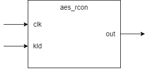
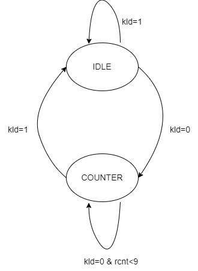

**aes_rcon Design Specification**

**1. Introduction**

The aes_rcon module generates constant values used in the
AES key expansion process. For each round of key expansion, a different
constant value is needed. This module generates these round constants
through a counter-based lookup mechanism.

**2. Block Diagram**

**3. Interface**

|**Signal Name**|      **Direction**|    **Width**|   **Description**|                                      
| --- | --- | --- | --- |
|clk    |        input      |      1       |    System clock|
|kld  |          iutput   |        1     |      Key load signal (active high)|
|out       |     output    |       32   |       Round constant value|

**4.Register**

rcnt: Round counter for key expansion process. Counts from 0 to 9,
increments each clock cycle when kld is deasserted, resets to 0 when kld
is asserted. Controls round constant generation sequence.

**5. Operation Principle**

**5.1 Algebraic Structure of Round Constants**

Round constants are calculated in the finite field GF($2^{8}$).
According to the paper, this field is defined by the irreducible
polynomial m(x) = $x^{8} + x^{4} + x^{3} + x + 1$. In this field:

-   Each element can be represented as an 8-bit binary number

-   Addition operation is bitwise XOR

-   Multiplication must be performed under modulo m(x)

**5.2 Round Constant Generation Principle**

Round constants RC\[i\] are generated using the following recursive
formula:

1.  RC\[1\] = 01 (initial value)

2.  RC\[i\] = x·RC\[i-1\], i\>1

where x represents 02 in GF($2^{8}$). Therefore, each round constant is
the result of multiplying the previous round constant by 02 in
GF($2^{8}$).

**5.3 Round Constant Sequence Derivation**

**5.3.1 Basic Derivation Process**

The derivation process of round constants:

1.  RC\[1\] = 01

2.  RC\[2\] = 02 × 01 = 02

3.  RC\[3\] = 02 × 02 = 04

4.  RC\[4\] = 02 × 04 = 08

5.  RC\[5\] = 02 × 08 = 10

6.  RC\[6\] = 02 × 10 = 20

7.  RC\[7\] = 02 × 40 = 40

8.  RC\[8\] = 02 × 40 = 80

9.  RC\[9\] = 02 × 80 = 1B (requires reduction in GF($2^{8}$))

10. RC\[10\] = 02 × 1B = 36 (requires reduction in GF($2^{8}$))

**5.3.2 Special Value Processing**

When products exceed 8 bits (as in RC\[9\] and RC\[10\]), reduction in
GF($2^{8}$) is required:

-   100 = 1B (mod m(x))

-   1B × 02 = 36 (mod m(x))

**6.Operation**

**6.1 State Transition Diagram**

**6.2 Normal Operation**

1.  Upon Reset:

-   One time unit after the clock's rising edge, rcnt is cleared to zero

-   One time unit after the clock's rising edge, out outputs initial round constant (32\'h01_00_00_00)

2.  Counting Operation:

-   One time unit after the clock's rising edge, rcnt increments every clock cycle

-   One time unit after the clock's rising edge, out generates corresponding round constant based on rcnt value

**6.3 Round Constant Sequence**

-   RC\[0\] = 32\'h01_00_00_00

-   RC\[1\] = 32\'h02_00_00_00

-   RC\[2\] = 32\'h04_00_00_00

-   \...continues through RC\[9\]

**7. Corner Cases**

**7.1 Key load**

-   When kld=1, output must be 0x01000000

-   Counter must reset to 0

**7.2 Maximum Count**

-   When rcnt\>9, output should be 0x00000000

-   Counter continues to increment but output remains 0

**8. Constraints**

1.  Counter Size:

-   rcnt is 4 bits wide

-   Valid RCON values for rcnt range 0-9

2.  Output Format:

-   Only MSB changes

-   Lower 24 bits must always be 0x000000

-   Output is registered, changes on clock edge
