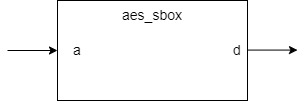
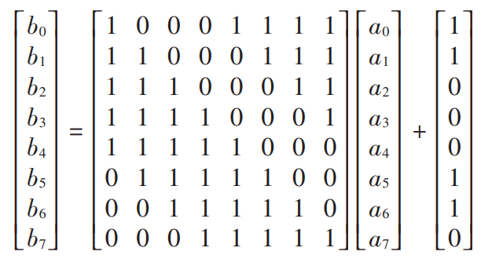

**aes_sbox Design Specification**

**1. Introduction**

The aes_sbox module is a crucial component in the AES
encryption algorithm, responsible for performing non-linear byte
substitution operations. This document describes the design principles,
implementation methods, and interface specifications of the S-box.

**2. Block Diagram**

**3. Interface**

| **Signal Name** | **Direction** | **Width** | **Description** |
| ---             | ---           | ---       | ---             |
| a | input | 8 | Input byte |
| b | output | 8 | Substituted byte |

**4. Operation Principle**

**4.1 Basic Principle**

The S-box transformation is completed in two steps:

1.  Computing the multiplicative inverse in Galois Field GF($2^{8}$)

2.  Applying an affine transformation

Apart from the mathematical calculations, we can look up in the forward
S-box table in actual realization.

In this design, we uses a lookup table to store all the S-box outputs
values for their corresponding inputs.

**4.2 Mathematical Derivation**

**4.2.1 Multiplicative Inverse in GF(**$\mathbf{2}^{\mathbf{8}}$**)**

1.  GF($2^{8}$) Definition:

-   Irreducible polynomial:$\ x^{8} + x^{4} + x^{3} + x + 1$

-   Field elements representation:
    $b_{7}x^{7} + b_{6}x^{6} + b_{5}x^{5} + b_{4}x^{4} + b_{3}x^{3} + b_{2}x^{2} + b_{1}x + b_{0}$

2.  Inverse Calculation:

-   For non-zero element a, its inverse $a^{- 1}$ satisfies: a ×
    $a^{- 1}$ ≡ 1 (mod$x^{8} + x^{4} + x^{3} + x + 1$)

-   Special case: inverse of 0x00 is defined as 0x00

**4.2.2 Affine Transformation**

After computing the multiplicative inverse, an affine transformation is
applied:

$$b_{i}\  = \ a_{i} \oplus a_{i + 4} \oplus a_{i + 5} \oplus a_{i + 6} \oplus a_{i + 7} \oplus c_{i}$$

where:

-   $b_{i}\ $is the i-th bit of the result.

-   c = 0x63 is the transformation constant

-   All index additions are performed modulo 8

For example, for i = 0:

$$b_{0}\  = \ a_{0} \oplus a_{4} \oplus a_{5} \oplus a_{6} \oplus a_{7} \oplus c_{0}$$

For i = 7:

$$b_{7}\  = \ a_{7} \oplus a_{3} \oplus a_{4} \oplus a_{5} \oplus a_{6} \oplus c_{7}$$

This can be represented in matrix form as:

where c = 0x63 =
$\{c_{7},c_{6},c_{5},c_{4},c_{3},c_{2},c_{1},c_{0}\}$=
{0,1,1,0,0,0,1,1}

**5. Corner Cases**

1.  Zero Value Handling:

Input 0x00 must correctly output 0x63.

2.  All-Ones Handling:

Input 0xFF must correctly output 0x16.

**6. Constraints**

1.  Timing Constraints:

-   Combinational logic implementation, no clock required.

-   Output updates immediately after input changes.

2.  Resource Constraints:

-   ROM implementation: requires 256×8 bits storage.

-   Implementation method can be selected based on target device
    characteristics (ROM/LUT).

3.  Usage Guidelines:

-   Pure combinational logic module, consider setup and hold times.

-   Pipeline registers can be added externally if needed.
