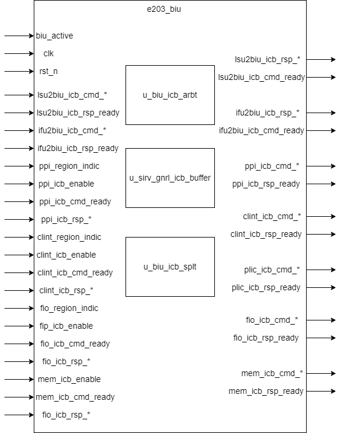

# e203_biu Design Document

## 1. Introduction
The e203_biu module is designed to control the ICB (Internal Coherent Bus) requests to the external memory system in the E203 RISC-V processor. It serves as a crucial interface between the Load-Store Unit (LSU), Instruction Fetch Unit (IFU) of the processor, various peripheral interfaces (including PPI, CLINT, PLIC, FIO), and the main memory.

## 2. Module Architecture

## 3. Interface List

### 3.1 Control Signals
| Signal Name | Direction | Bit Width | Description |
| --- | --- | --- | --- |
| biu_active | Output | 1 | Indication signal for the working status of the BIU |
| clk | Input | 1 | System clock |
| rst_n | Input | 1 | Active-low reset signal |

### 3.2 ICB Interface

#### ICB interface template

The interface signals for inter-module communication using the ICB protocol have the same suffix, and the prefix of the signals is determined by the connected module, represented by `*` in the template below.

| Signal Name       | Direction | Bit Width      | Description                             |
| :---------------- | --------- | -------------- | --------------------------------------- |
| *_icb_cmd_valid   | Input     | 1              | command valid signal                    |
| *_icb_cmd_ready   | Output    | 1              | current ready to receive command signal |
| *_icb_cmd_addr    | Input     | E203_ADDR_SIZE | command address                         |
| *_icb_cmd_read    | Input     | 1              | read command indication                 |
| *_icb_cmd_wdata   | Input     | E203_XLEN      | write data                              |
| *_icb_cmd_wmask   | Input     | E203_XLEN/8    | write mask                              |
| *_icb_cmd_burst   | Input     | 2              | burst transfer type                     |
| *_icb_cmd_beat    | Input     | 2              | burst transfer beat number              |
| *_icb_cmd_lock    | Input     | 1              | locked access signal                    |
| *_icb_cmd_excl    | Input     | 1              | exclusive access signal                 |
| *_icb_cmd_size    | Input     | 2              | access size                             |
| *_icb_rsp_valid   | Output    | 1              | response valid signal                   |
| *_icb_rsp_ready   | Input     | 1              | ready to receive response signal        |
| *_icb_rsp_err     | Output    | 1              | response error signal                   |
| *_icb_rsp_excl_ok | Output    | 1              | exclusive access success signal         |
| *_icb_rsp_rdata   | Output    | E203_XLEN      | response data                           |

#### Modules connected to the module via ICB

1. LSU

   Substitute`*` with `lsu2biu`, e.g.,`*_icb_cmd_valid` → `lsu2biu_icb_cmd_valid`

2. IFU if `E203_HAS_MEM_ITF` is defined

   Substitute`*` with `ifu2biu`, e.g.,`*_icb_cmd_valid` → `ifu2biu_icb_cmd_valid`

3. PPI ( Private Peripheral Interface )

   Substitute`*` with `ppi`, e.g.,`*_icb_cmd_valid` → `ppi_icb_cmd_valid`

   In addition to the ICB protocol, the module also receives other outputs from PPI

   | Signal Name      | Direction | Bit Width      | Description                 |
   | ---------------- | --------- | -------------- | --------------------------- |
   | ppi_region_indic | Input     | E203_ADDR_SIZE | PPI region indicator        |
   | ppi_icb_enable   | Input     | 1              | PPI interface enable signal |

4. CLINT

   Substitute`*` with `clint`, e.g.,`*_icb_cmd_valid` → `clint_icb_cmd_valid`

   In addition to the ICB protocol, the module also receives other outputs from CLINT

   | Signal Name        | Direction | Bit Width      | Description                   |
   | ------------------ | --------- | -------------- | ----------------------------- |
   | clint_region_indic | Input     | E203_ADDR_SIZE | CLINT region indicator        |
   | clint_icb_enable   | Input     | 1              | CLINT interface enable signal |

5. PLIC 

   Substitute`*` with `plic`, e.g.,`*_icb_cmd_valid` → `plic_icb_cmd_valid`

   In addition to the ICB protocol, the module also receives other outputs from PLIC

   | Signal Name       | Direction | Bit Width      | Description                  |
   | ----------------- | --------- | -------------- | ---------------------------- |
   | plic_region_indic | Input     | E203_ADDR_SIZE | PLIC region indicator        |
   | plic_icb_enable   | Input     | 1              | PLIC interface enable signal |

6. FIO (Fast I/O) if `E203_HAS_FIO` macro is defined

   Substitute`*` with `fio`, e.g.,`*_icb_cmd_valid` → `fio_icb_cmd_valid`

   In addition to the ICB protocol, the module also receives other outputs from PLIC

   | Signal Name      | Direction | Bit Width      | Description                  |
   | ---------------- | --------- | -------------- | ---------------------------- |
   | fio_region_indic | Input     | E203_ADDR_SIZE | PLIC region indicator        |
   | fio_icb_enable   | Input     | 1              | PLIC interface enable signal |

7. MEM if `E203_HAS_MEM_ITF` is defined

   Substitute`*` with `lsu2biu`, e.g.,`*_icb_cmd_valid` → `mem_icb_cmd_valid`

   In addition to the ICB protocol, the module also receives other outputs from MEM

   | Signal Name    | Direction | Bit Width | Description                 |
   | -------------- | --------- | --------- | --------------------------- |
   | mem_icb_enable | Input     | 1         | MEM interface enable signal |

### 4. Submodule List

#### 4.0 localparam
|Param Name|Param Value|Description|
| --- | --- | --- |
|BIU_ARBT_I_NUM|1 or 2|Number of input channel to the arbitration logic. 2 When E203_HAS_MEM_ITF is defined and 1 otherwise|
|BIU_ARBT_I_PTR_W|1|Width of pointer used for arbitration |
|BIU_SPLT_I_NUM|4 or 5 or 6|Number of split channels. 5 if one of E203_HAS_FIO or E203_HAS_MEM_ITF is defined else 6 if both are defined and 4 otherwise|

#### 4.1 ICB Arbiter (sirv_gnrl_icb_arbt)
**Function**: It conducts priority arbitration between the requests from the LSU and the IFU, guaranteeing the fairness and correctness of accesses by multiple master devices.

**Key Parameters**:
- AW = E203_ADDR_SIZE(address width)
- DW = E203_XLEN(data width)
- ARBT_NUM = BIU_ARBT_I_NUM
- ARBT_PTR_W = BIU_ARBT_I_PTR_W
- USR_W = 1
- ARBT_SCHEME = 0 (Priority-based arbitration).
- ALLOW_0CYCL_RSP = 0 (Zero-cycle response is not permitted).
- FIFO_OUTS_NUM = E203_BIU_OUTS_NUM.
- FIFO_CUT_READY = E203_BIU_CMD_CUT_READY.

**Main Interfaces**:

| Signal Name | Direction | Bit Width | Description |
| --- | --- | --- | --- |
| o_icb_cmd_valid | Output | 1 | The valid signal for the arbitrated command. |
| o_icb_cmd_ready | Input | 1 | The signal indicating that the downstream module is ready to receive. |
| o_icb_cmd_read | Output | 1 | The indication of the arbitrated read command. |
| o_icb_cmd_addr | Output | AW | The arbitrated address signal. |
| o_icb_cmd_wdata | Output | DW | The arbitrated write data. |
| o_icb_cmd_wmask | Output | DW/8 | The arbitrated write mask. |
| o_icb_rsp_valid | Output | 1 | The valid signal for the arbitrated response. |
| o_icb_rsp_ready | Input | 1 | The signal indicating that the upstream module is ready to receive the response. |
| i_bus_icb_cmd_valid | Input | NUM | The group of input command valid signals. |
| i_bus_icb_cmd_ready | Output | NUM | The group of arbiter ready-to-receive signals. |
| clk | Input | 1 | The clock signal. |
| rst_n | Input | 1 | The reset signal. |

#### 4.2 ICB Buffer (sirv_gnrl_icb_buffer)
**Function**: It realizes the caching of commands and responses, manages outstanding transactions, and ensures the correct sequencing of commands and responses.

**Key Parameters**:
- AW = E203_ADDR_SIZE(address width)
- DW = E203_XLEN(data width)
- USR_W = 1
- OUTS_CNT_W = E203_BIU_OUTS_CNT_W.
- CMD_DP = E203_BIU_CMD_DP.
- RSP_DP = E203_BIU_RSP_DP.
- CMD_CUT_READY = E203_BIU_CMD_CUT_READY.
- RSP_CUT_READY = E203_BIU_RSP_CUT_READY.

**Main Interfaces**:

| Signal Name | Direction | Bit Width | Description |
| --- | --- | --- | --- |
| icb_buffer_active | Output | 1 | The indication of the buffer's working status. |
| i_icb_cmd_valid | Input | 1 | The input command valid signal. |
| i_icb_cmd_ready | Output | 1 | The buffer's readiness signal to receive commands. |
| i_icb_cmd_read | Input | 1 | The indication of the input read command. |
| i_icb_cmd_addr | Input | AW | The input address signal. |
| i_icb_cmd_wdata | Input | DW | The input write data. |
| i_icb_cmd_wmask | Input | DW/8 | The input write mask. |
| i_icb_rsp_valid | Input | 1 | The input response valid signal. |
| i_icb_rsp_ready | Output | 1 | The buffer's readiness signal to receive responses. |
| o_icb_cmd_valid | Output | 1 | The output command valid signal. |
| o_icb_cmd_ready | Input | 1 | The downstream's readiness to receive commands. |
| o_icb_rsp_valid | Output | 1 | The output response valid signal. |
| o_icb_rsp_ready | Input | 1 | The upstream's readiness to receive responses. |
| clk | Input | 1 | The clock signal. |
| rst_n | Input | 1 | The reset signal. |

#### 4.3 ICB Splitter (sirv_gnrl_icb_splt)
**Function**: It distributes requests based on addresses and routes the input requests to different target interfaces.

**Key Parameters**:
- FIFO_CUT_READY = E203_BIU_CMD_CUT_READY
- SPLT_PTR_W = BIU_SPLT_I_NUM
- USR_W = 1
- AW = E203_ADDR_SIZE(address width)
- DW = E203_XLEN(data width)
- ALLOW_DIFF = 0 (Outstanding transactions in different branches are not allowed).
- ALLOW_0CYCL_RSP = 1 (Zero-cycle response is allowed).
- FIFO_OUTS_NUM = E203_BIU_OUTS_NUM.
- SPLT_NUM = BIU_SPLT_I_NUM.
- SPLT_PTR_1HOT = 1 (One-hot code is used).

**Main Interfaces**:

| Signal Name | Direction | Bit Width | Description |
| --- | --- | --- | --- |
| i_icb_splt_indic | Input | SPLT_NUM | The splitting indication signal. |
| i_icb_cmd_valid | Input | 1 | The input command valid signal. |
| i_icb_cmd_ready | Output | 1 | The splitter's readiness to receive commands. |
| i_icb_cmd_read | Input | 1 | The indication of the input read command. |
| i_icb_cmd_addr | Input | AW | The input address signal. |
| i_icb_cmd_wdata | Input | DW | The input write data. |
| i_icb_cmd_wmask | Input | DW/8 | The input write mask. |
| i_icb_rsp_valid | Input | 1 | The input response valid signal. |
| i_icb_rsp_ready | Output | 1 | The splitter's readiness to receive responses. |
| o_bus_icb_cmd_valid | Output | SPLT_NUM | The group of output command valid signals. |
| o_bus_icb_cmd_ready | Input | SPLT_NUM | The group of signals indicating each target's readiness to receive. |
| o_bus_icb_rsp_valid | Output | SPLT_NUM | The group of output response valid signals. |
| o_bus_icb_rsp_ready | Input | SPLT_NUM | The group of signals indicating the readiness for output responses. |
| clk | Input | 1 | The clock signal. |
| rst_n | Input | 1 | The reset signal. |

### 5. Implementation Details

The BIU module implements a three-stage pipelined bus interface unit. The specific implementation process is as follows:

#### 5.1 Arbitration Stage Implementation

1. **Input Request Processing**:
    - The sirv_gnrl_icb_arbt module is used to complete the arbitration function. This module adopts a priority arbitration mechanism and supports the handling of multiple outstanding transactions.
    - All request signals (including valid, addr, read, etc.) from the LSU and the IFU are respectively input to the arbiter through two command channels.
    - The arbiter combines these signals into the arbt_bus_icb_cmd signal group through combinational logic.
    - The LSU channel is the highest priority channel, numbered 0; the IFU channel is the secondary priority channel, numbered 1.

2. **Request Arbitration Process**:
    - When multiple requests are received, it first checks whether there is a request on the LSU channel. If the LSU has a request, the LSU request will be directly selected.
    - Only when there is no request on the LSU channel will the request on the IFU channel be selected.
    - The selected request channel will be recorded in a usr flag bit, which is used for the correct routing of subsequent responses.
    - During the recording process, ifu2biu_icb_cmd_ifu and lsu2biu_icb_cmd_ifu are used as identifiers for IFU and LSU requests respectively.

3. **Response Processing Process**:
    - When the response signals are returned from the downstream, the usr flag bit recorded previously is used to determine which channel the response should be routed to.
    - The response signals are distributed to the rsp ports of the corresponding channels through a multiplexer.
    - The response data and error status are passed to the target device together.
    - The response valid signal arbt_bus_icb_rsp_valid is also selectively distributed according to the usr flag bit.

#### 5.2 Buffer Stage Implementation

1. **Buffer Management Process**:
    - The buf_icb_cmd_* series of signals are used to receive commands from the arbiter.
    - When a new command arrives, it first checks whether there are idle buffer slots available.
    - A counter is used to record the current number of outstanding transactions, and the count value does not exceed E203_BIU_OUTS_NUM.
    - Each transaction slot contains complete command information, including address, data, control signals, etc.
    - Before the corresponding response is received, the command information will be kept in the buffer slot.

2. **Command Flow Control Process**:
    - When the remaining space in the buffer is less than the preset threshold, the ready signal is reduced to prevent new commands from entering.
    - The generation of the ready signal for the command channel needs to consider the state of the downstream splitter.
    - When dealing with burst transmissions, sufficient buffer space will be reserved to ensure the integrity of the entire burst transmission.
    - The cutting timing of the ready signal is controlled by the E203_BIU_CMD_CUT_READY parameter.

3. **Response Matching Process**:
    - When the response is returned, the corresponding command slot is searched according to the transaction sequence.
    - It is checked whether the response meets expectations (such as whether it is a response to a read operation).
    - For exclusive access responses, the excl_ok flag will be additionally checked.
    - After the response processing is completed, the corresponding buffer slot is released.

#### 5.3 Separation Stage Implementation

1. **Address Decoding Logic**:
    - After receiving a command, the address area is first compared in parallel with each region_indic indicator.
    - The bit comparison is used to determine which peripheral area the address falls into.
    - For each peripheral area, an independent strobe signal is generated.
    - The IFU access restriction check is carried out. If the IFU accesses the peripheral area, an error handling process will be triggered.

2. **Request Distribution Process**:
    - According to the result of address decoding, independent separation indication signals (such as buf_icb_sel_ppi, etc.) are generated.
    - The enable signal of the target interface is checked to ensure that the interface is enabled.
    - The complete command information is distributed to the selected target interface.
    - During the distribution process, the integrity of all control signals and data is maintained.

3. **Response Aggregation Process**:
    - The response signals from all peripheral interfaces are input to the splitter in parallel.
    - According to the target interface of the current transaction, the corresponding response channel is selected.
    - Special handling for zero-cycle responses needs to be considered during the response selection process.
    - The selected response signal is passed to the upstream buffer module.

#### 5.4 Error Handling Implementation

1. **IFU Error Access Handling Process**:
    - A dedicated ifuerr processing channel is used, which contains complete command and response interfaces.
    - When the IFU access to the peripheral area is detected in the separation stage, the request will be routed to the ifuerr channel.
    - The cmd_ready signal of the ifuerr channel is always kept high to ensure that error requests can be immediately accepted.
    - The rsp_valid is synchronized with the cmd_valid in the channel to implement a zero-cycle response mechanism.
    - In the error response, the rsp_err is set to a high level, and the rsp_data is set to all zeros.

2. **Access Privilege Check Process**:
    - For each peripheral area, the region_indic signal is used to perform address range checks.
    - The icb_enable signal of each interface is detected to confirm the enabled state of the interface.
    - When accessing a disabled interface, the error state is returned through the rsp_err signal of the corresponding interface.
    - The buf_icb_cmd_ifu flag is used to distinguish between IFU and LSU requests to achieve access privilege control.

3. **Exclusive Access Error Handling**:
    - The cmd_excl signal is used to identify exclusive access requests.
    - The exclusive access status is recorded in the buffer stage.
    - When the exclusive access fails, the failure flag is returned through rsp_excl_ok.
    - Exclusive access errors do not trigger an overall error response but are indicated by a dedicated status bit.

4. **Error State Clearing Mechanism**:
    - After the error response is sent, the current error state is automatically cleared.
    - When a new command arrives, a complete error checking process is carried out again.
    - It is ensured that each error response strictly matches the corresponding error request.
    - Different types of errors (access errors, exclusive access failures, etc.) are identified by different status bits.

### 6. Corner Cases

#### 6.1 IFU Access to Peripherals
1. **Trigger Conditions**:
    - The IFU attempts to access the PPI/CLINT/PLIC areas.
    - The IFU attempts to access a disabled interface.
    - The IFU initiates a write operation request.

2. **Handling Mechanism**:
    - An error response is immediately generated, and the target device is not actually accessed.
    - The ifuerr_icb_cmd_ready is kept high.
    - The ifuerr_icb_rsp_valid is used to implement a zero-cycle response.
    - The ifuerr_icb_rsp_err is set to a high level.

#### 6.2 Concurrent Request Processing
1. **Request Conflicts**:
    - The LSU and the IFU initiate requests simultaneously.
    - Multiple outstanding transactions are waiting for responses at the same time.
    - Requests for different target interfaces are intertwined.

2. **Solutions**:
    - Strictly follow the arbitration rule that the LSU has a higher priority than the IFU.
    - Use the buffer depth parameter to control the maximum number of outstanding transactions.
    - Ensure the independent processing of requests for different targets through the splitter.
    - Maintain a strict request-response correspondence.

#### 6.3 Zero-Cycle Response Handling
1. **Scene Identification**:
    - The fast response of the ROM interface.
    - The immediate return of the error state.
    - The fast response of simple register accesses.

2. **Special Handling**:
    - The splitter allows zero-cycle responses (ALLOW_0CYCL_RSP = 1).
    - The arbiter prohibits zero-cycle responses (ALLOW_0CYCL_RSP = 0).
    - Ensure the correct timing of response signals.
    - Prevent combinational logic loops.

#### 6.4 Flow Control Boundary Conditions
1. **Critical States**:
    - New requests when the buffer is about to be full.
    - Request processing when the response channel has backpressure.
    - Handshaking between different clock domains.

2. **Handling Strategies**:
    - Trigger the backpressure signal in advance.
    - Ensure the accuracy of the buffer count.
    - Implement reliable cross-clock domain synchronization.
    - Maintain the correctness of the request order.

### 7. Constraints

#### 7.1 Signal Timing Constraints

1. **Handshake Signal Constraints**:
    - The valid signal does not depend on the ready signal.
    - The ready signal can depend on the valid signal.
    - Combinational logic loops are prohibited.
    - The state change of the ready signal must occur at the clock edge.

2. **Response Order Constraints**:
    - Responses must be returned in the order of requests.
    - Response reordering is prohibited.
    - The atomicity of exclusive access is maintained.
    - The uniqueness of the transaction ID is maintained.

#### 7.2 Interface Function Constraints

1. **Access Privilege Constraints**:
    - The IFU can only access the instruction storage space.
    - The LSU can access all target interfaces.
    - Access to the peripheral area requires enabling the corresponding interface.
    - Address alignment requirements must be complied with.

2. **Transaction Processing Constraints**:
    - The number of outstanding transactions does not exceed the configured value.
    - Burst transmissions cannot be interrupted.
    - Exclusive access must be strictly serialized.
    - Write operations maintain atomicity.

#### 7.3 Configuration Parameter Constraints

1. **Buffer Depth Constraints**:
    - CMD_DP must be greater than 0.
    - RSP_DP must be greater than 0.
    - OUTS_CNT_W meets the requirements of the maximum number of transactions.
    - The buffer depth meets the performance requirements.

2. **Function Configuration Constraints**:
    - The arbitration scheme is fixed as the priority mode.
    - The splitter uses one-hot code for indication.
    - The splitter is allowed to have zero-cycle responses.
    - The arbiter is prohibited from having zero-cycle responses.

#### 7.4 Implementation Related Constraints

1. **Performance Constraints**:
    - Minimize the request-response delay.
    - Ensure the timely processing of high-priority requests.
    - Optimize the buffer utilization.
    - Maintain the interface bandwidth efficiency.

2. **Reliability Constraints**:
    - Ensure the correct state after reset.
    - Avoid deadlocks and livelocks.
    - Correctly handle all error situations.
    - Ensure signal stability. 