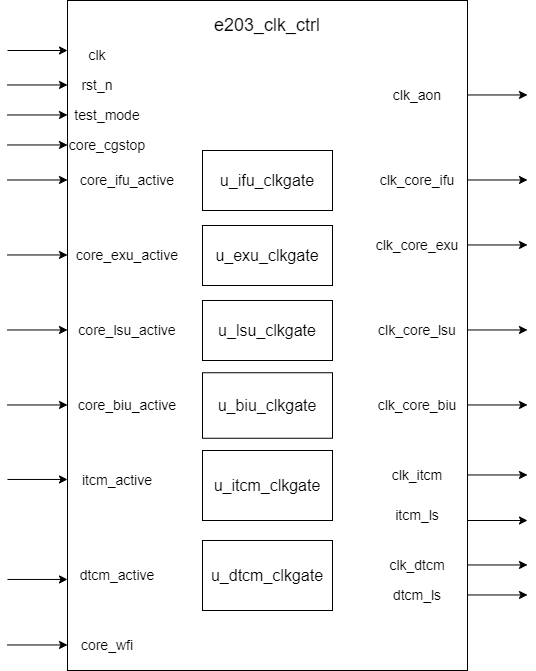

# e203_clk_ctrl Design Document

## 1. Introduction

The e203_clk_ctrl module is mainly responsible for clock control of each functional unit of the processor, including clock gating management of core modules (IFU, EXU, LSU, BIU) and storage modules (ITCM, DTCM). It supports low-power design and debugging functions.

## 2. Block Diagram

## 3. Interface

### 3.1 Basic Input Signal

| Signal Name | Direction | Width | Description |
|-------------|-----------|--------|-------------|
| clk | Input | 1 | System clock |
| rst_n | Input | 1 | Asynchronous reset (active low) |
| test_mode | Input | 1 | Test mode signal |
| core_cgstop | Input | 1 | Clock-gated stop signal, from the CSR register |

### 3.2 Functional Unit Activity State Signal

| Signal Name | Direction | Width | Description |
|-------------|-----------|--------|-------------|
| core_ifu_active | input | 1 | Instruction Fetch Unit active status |
| core_exu_active | input | 1 | Execution unit active state |
| core_lsu_active | input | 1 | Load storage cell active state |
| core_biu_active | input | 1 | Bus interface unit active statedt |
| core_wfi | input | 1 | Wait for interrupt status signal |

### 3.3 Clock Output Signal

| Signal Name | Direction | Width | Description |
|-------------|-----------|--------|-------------|
| clk_aon | output | 1 | Normally on clock |
| clk_core_ifu | output | 1 | IFU module clock |
| clk_core_exu | output | 1 | EXU module clock |
| clk_core_lsu | output | 1 | LSU module clock |
| clk_core_biu | output | 1 | BIU module clock |

### 3.4 Optional Signal

if `E203_HAS_ITCM` is defined, signals related with ITCM (e.g., `itcm_active`,`itcm_ls`,`clk_itcm`) are available.

if `E203_HAS_DTCM` is defined, signals related with DTCM (e.g., `dtcm_active`,`dtcm_ls`,`clk_dtcm`) are available.

| Signal Name | Direction | Width | Description                |
| ----------- | --------- | ----- | -------------------------- |
| itcm_active | input     | 1     | ITCM active status         |
| itcm_ls     | output    | 1     | ITCM clock low power state |
| dtcm_active | input     | 1     | DTCM active status         |
| dtcm_ls     | output    | 1     | DTCM clock low power state |
| clk_itcm    | output    | 1     | ITCM module clock          |
| clk_dtcm    | output    | 1     | DTCM module clock          |

## 4. Submodule List

### 4.1 e203_clkgate

**Description**

The e203_clkgate module implements controllable clock switching functionality, managing clock propagation through enable signals, with support for test mode and FPGA implementation options.

**Interface**

| Signal Name | Direction | Width | Description             |
| ----------- | --------- | ----- | ----------------------- |
| clk_in      | Input     | 1     | Input clock signal      |
| test_mode   | Input     | 1     | Test mode enable signal |
| clock_en    | Input     | 1     | Clock enable signal     |
| clk_out     | Output    | 1     | Output clock signal     |

### 4.2 sirv_gnrl_dffr

**Description**

Verilog module sirv_gnrl DFF with Reset, no load-enable. Default reset value is 0

**Parameter Configuration**

| Parameter Name | Default Value | Description |
|----------------|---------------|-------------|
| DW             | 32            | Data width (in bits) |

**Signal Interface**

| Port Name | Direction | Width | Description |
|-----------|-----------|-------|-------------|
| dnxt      | Input     | DW    | Input data |
| qout      | Output    | DW    | Output data |
| clk       | Input     | 1     | Clock signal |
| rst_n     | Input     | 1     | Active-low reset signal |

## 5. Implementation Details

### 5.1 Clock Enable Control Logic

1. IFU clock enablement conditions:
- core_cgstop = 1 or (core_ifu_active = 1 and core_wfi = 0)

2. ther core module clock enable conditions:
- core_cgstop = 1 or the active signal of the corresponding module is 1

### 5.2 Example of Clock Gating

- Instantiate separate clock gating units for each core module (e203_clkgate)
- All gating units share the test_mode signal
- Respective independent clock enable control

### 5.3 Memory Module Clock Control (optional function)

1. ITCM clock control:
- Use registers to record last cycle activity
- Clock enable = core_cgstop | itcm_active | itcm_active_r
- Provides a light sleep signal (ls) indicating sleep state
2. DTCM clock control:
- Implemented in the same way as ITCM

## 6. Corner Cases

1. Debug Mode Clock Control
   - When `core_cgstop` is high, force clock to continue running
   - May cause unnecessary power consumption
   - Requires careful management during debugging

2. State Transition Boundaries
   - Potential instability when previous and current cycle states change simultaneously
   - Risk of clock enable signal glitches
   - Requires robust state transition handling

3. Rapid Activity State Switching
   - Frequent transitions between active/inactive states
   - Potential increase in clock gating unit switching overhead
   - May impact overall power efficiency

## 7. Constraints

1. Signal Mutual Exclusion
   - `core_cgstop` is mutually exclusive with normal clock gating logic
   - When high, override other activity state considerations
   - Prioritizes debug and manual control

2. Timing Constraints
   - State recording flip-flop setup and hold times
   - Ensure stable state capture at clock edges
   - Minimize timing-related performance penalties

3. Power-Performance Trade-offs
   - Clock gating should not significantly increase switching overhead
   - State recording cost must be less than dynamic power savings
   - Balance between granularity and efficiency

4. Reliability Limitations
   - Prevent unexpected storage access interruptions
   - Ensure sleep signal (`ls`) transitions are clean and predictable
   - Maintain system responsiveness during state changes