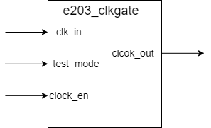

# e203_clkgate Design Document

## 1. Introduction

The e203_clkgate module implements controllable clock switching functionality, managing clock propagation through enable signals, with support for test mode and FPGA implementation options.

## 2. Block Diagram

## 3. Interface

| Signal Name | Direction | Width | Description |
|-------------|-----------|--------|-------------|
| clk_in | Input | 1 | Input clock signal |
| test_mode | Input | 1 | Test mode enable signal |
| clock_en | Input | 1 | Clock enable signal |
| clk_out | Output | 1 | Output clock signal |

## 4. Implementation Details

### 4.1 Basic Structure
The module implements different strategies based on the `FPGA_SOURCE` compilation macro:

1. FPGA Mode
   - Direct connection between input clock `clk_in` and output clock `clk_out`
   - No gating operations performed
2. Gating Mode
   - Use `enb` signal to mask `clk_in`. When `enb` is high, `clk_out` is connected to `clk_in`, else `clk_out` is set to `0`.
   - Uses latch method to maintain enable state. `enb` is only updated during `clk_in` low period.
   - The enable signal (`enb`) is asserted when either the clock enable (`clock_en`) is active or the system is in test mode (`test_mode`). 

### 4.2 Clock Gating Process
1. Enable Signal Processing
   - Evaluates clock_en and test_mode signals during clock low period
   - Generates internal enable signal when either signal is high

2. Clock Output Generation
   - Performs AND operation between internal enable signal and input clock
   - Generates final gated clock output

## 5. Corner Cases

1. Clock Switching Boundaries
   - Enable signal changes near clock edges
   - Simultaneous changes of test mode and normal enable signals

2. Rapid Enable Switching
   - Behavior during high-frequency enable signal toggling
   - Ensuring output clock stability

3. Mode Switching
   - Correctness of FPGA/Gating mode compilation selection
   - Ensuring functional consistency across different modes

## 6. Constraints

### 6.1 Timing Constraints
1. Enable Signal Requirements
   - Appropriate setup and hold time settings
   - Enable signal stability before clock falling edge

2. Output Clock Requirements
   - Minimum pulse width limitations
   - Clock edge alignment requirements

### 6.2 Implementation Constraints
1. Compilation Macro Definition
   - Proper setting of FPGA_SOURCE macro
   - Ensuring correct implementation for target platform

2. Test Mode Usage
   - Stability requirements for test mode signal
   - Special timing constraints during testing