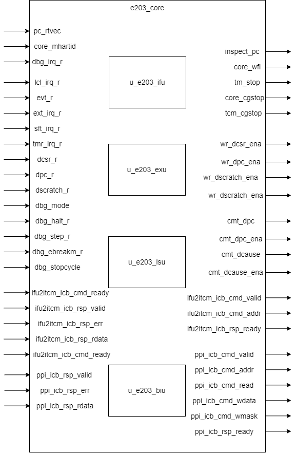

# e203_core Module Design Document

## 1. Introduction

The `e203_core` module is the core module of the E203 processor, responsible for implementing the functions of Instruction Fetch (IFU), Execution (EXU), Load/Store (LSU), and Bus Interface (BIU). It is a modularly designed core with abundant interfaces to adapt to different peripheral and memory configurations (such as DTCM, ITCM, and NICE). The module supports exception handling, debugging functions, and provides powerful extensibility.

## 2. Module Diagram

## 3. Interface List

### 3.1 System Interface

| **Interface Name** | **Direction** | **Bit Width** | **Description** |
|---------------------|---------------|---------------|------------------------------------------------------|
| `inspect_pc` | Output | `E203_PC_SIZE` | The value of the current Program Counter (PC) being executed. |
| `core_wfi` | Output | 1 | Indicates whether the core is in the Wait for Interrupt (WFI) state. |
| `tm_stop` | Output | 1 | Debug stop signal used to externally stop the processor. |
| `core_cgstop` | Output | 1 | Core clock gating stop signal. |
| `tcm_cgstop` | Output | 1 | TCM clock gating stop signal. |
| `pc_rtvec` | Input | `E203_PC_SIZE` | Reset vector address (the starting address of the program). |
| `core_mhartid` | Input | `E203_HART_ID_W` | The Hardware Thread ID of the current core. |
| `dbg_irq_r` | Input | 1 | Debug interrupt signal. |
| `lcl_irq_r` | Input | `E203_LIRQ_NUM` | Local interrupt signal vector. |
| `evt_r` | Input | `E203_EVT_NUM` | Special event trigger signal. |
| `ext_irq_r` | Input | 1 | External interrupt signal. |
| `sft_irq_r` | Input | 1 | Software interrupt signal. |
| `tmr_irq_r` | Input | 1 | Timer interrupt signal. |
| `wr_dcsr_ena` | Output | 1 | Enable signal for writing to the Debug CSR (`dcsr`). |
| `wr_dpc_ena` | Output | 1 | Enable signal for writing to the Debug PC (`dpc`). |
| `wr_dscratch_ena` | Output | 1 | Enable signal for writing to the Debug Register (`dscratch`). |
| `wr_csr_nxt` | Output | 32 | The data value to be written to the CSR. |
| `dcsr_r` | Input | 32 | The current value of the Debug Control Register. |
| `dpc_r` | Input | `E203_PC_SIZE` | The current value of the Debug PC. |
| `dscratch_r` | Input | 32 | The current value of the Debug Register. |
| `cmt_dpc` | Output | `E203_PC_SIZE` | The committed PC value (used for exceptions or debugging). |
| `cmt_dpc_ena` | Output | 1 | Enable signal for the committed PC value. |
| `cmt_dcause` | Output | 3 | Cause code for the committed exception. |
| `cmt_dcause_ena` | Output | 1 | Enable signal for the cause code of the committed exception. |
| `dbg_mode` | Input | 1 | Debug mode flag signal. |
| `dbg_halt_r` | Input | 1 | Debug stop signal. |
| `dbg_step_r` | Input | 1 | Debug single-step execution signal. |
| `dbg_ebreakm_r` | Input | 1 | Debug signal triggered by the `ebreak` instruction in M mode. |
| `dbg_stopcycle` | Input | 1 | Debug stop cycle signal. |

### 3.2 Bus Interface to ITCM

if `E203_HAS_ITCM` is defined, this part of interfaces is available.

| Signal Name            | Direction | Bit Width            | Description                               |
| ---------------------- | --------- | -------------------- | ----------------------------------------- |
| ifu2itcm_holdup        | Input     | 1                    | The IFU to ITCM holdup signal             |
| itcm_region_indic      | Input     | E203_ADDR_SIZE       | The ITCM address region indication signal |
| ifu2itcm_icb_cmd_valid | Output    | 1                    | ITCM command valid signal                 |
| ifu2itcm_icb_cmd_ready | Input     | 1                    | ITCM ready to receive command signal      |
| ifu2itcm_icb_cmd_addr  | Output    | E203_ITCM_ADDR_WIDTH | ITCM access address                       |
| ifu2itcm_icb_rsp_valid | Input     | 1                    | ITCM response valid signal                |
| ifu2itcm_icb_rsp_ready | Output    | 1                    | IFU ready to receive response signal      |
| ifu2itcm_icb_rsp_err   | Input     | 1                    | ITCM access error indication              |
| ifu2itcm_icb_rsp_rdata | Input     | E203_ITCM_DATA_WIDTH | ITCM read data                            |

### 3.3 ICB Protocol Template

The interface signals for inter-module communication using the ICB protocol have the same suffix, and the prefix of the signals is determined by the connected module, represented by `*` in the template below. Unless otherwise specified, the bit width of the interface signals is the value in the table below.

| Interface Name      | Direction | Width            | Description                                                  |
| ------------------- | --------- | ---------------- | ------------------------------------------------------------ |
| `*_icb_enable`      | Input     | 1                | Enables or disables module on the ICB bus.                   |
| `*_icb_cmd_valid`   | Output    | 1                | Valid signal for the ICB command channel.                    |
| `*_icb_cmd_ready`   | Input     | 1                | Ready signal for the ICB command channel.                    |
| `*_icb_cmd_addr`    | Output    | `E203_ADDR_SIZE` | ICB command address signal.                                  |
| `*_icb_cmd_read`    | Output    | 1                | ICB command read/write signal.                               |
| `*_icb_cmd_wdata`   | Output    | `E203_XLEN`      | ICB command write data signal.                               |
| `*_icb_cmd_wmask`   | Output    | `E203_XLEN/8`    | ICB command write mask signal.                               |
| `*_icb_cmd_lock`    | Output    | 1                | Indicates whether the command is locked for exclusive access. |
| `*_icb_cmd_excl`    | Output    | 1                | Indicates whether the command is part of an exclusive transaction. |
| `*_icb_cmd_size`    | Output    | 2                | Specifies the size of the data for the ICB transaction.      |
| `*_icb_rsp_valid`   | Input     | 1                | Valid signal for the  ICB response channel.                  |
| `*_icb_rsp_ready`   | Output    | 1                | Ready signal for the  ICB response channel.                  |
| `*_icb_rsp_err`     | Input     | 1                | ICB response error signal.                                   |
| `*_icb_rsp_excl_ok` | Input     | 1                | Indicates whether an exclusive access transaction was successful. |
| `*_icb_rsp_rdata`   | Input     | `E203_XLEN`      | ICB response data signal.                                    |

### 3.4 Interfaces using ICB protocol

The relationship between connected module names and signal prefixes is shown in the table below.

| Module Name | The string represented by `*` |
| ----------- | ----------------------------- |
| PPI         | ppi                           |
| CLINT       | clint                         |
| PLIC        | plic                          |
| FIO         | fio                           |
| Ifetch      | mem                           |
| ITCM        | lsu2itcm                      |
| DTCM        | lsu2dtcm                      |

1. PPI （Private Peripheral Interface）

   In addition to the ICB protocol signals, other signals from PPI are also received

   | Interface Name     | Direction | Width          | Description                                                  |
   | ------------------ | --------- | -------------- | ------------------------------------------------------------ |
   | `ppi_region_indic` | Input     | E203_ADDR_SIZE | Defines the address region assigned to the Private Peripheral Interface. |

2. CLINT

   In addition to the ICB protocol signals, other signals from CLINT are also received

   | **Signal Name**      | **Direction** | **Width**        | **Description**                                    |
   | -------------------- | ------------- | ---------------- | -------------------------------------------------- |
   | `clint_region_indic` | Input         | `E203_ADDR_SIZE` | Indicates the address region assigned to the CLINT |

3. PLIC

   In addition to the ICB protocol signals, other signals from PLIC are also received

   | **Signal Name**     | **Direction** | **Width**        | **Description**                                   |
   | ------------------- | ------------- | ---------------- | ------------------------------------------------- |
   | `plic_region_indic` | Input         | `E203_ADDR_SIZE` | Indicates the address region assigned to the PLIC |

4. FIO (Fast I/O) , if `E203_HAS_FIO` is defined.

   In addition to the ICB protocol signals, other signals from FIO are also received

   | **Signal Name**    | **Direction** | **Width**        | **Description**                                  |
   | ------------------ | ------------- | ---------------- | ------------------------------------------------ |
   | `fio_region_indic` | Input         | `E203_ADDR_SIZE` | Indicates the address region assigned to the FIO |
   
5. Ifetch, if `E203_HAS_MEM_ITF` is defined.

   Ifetch ICB signal group doesn't have `*_icb_enable` signal.

   Ifetch ICB signal group have `*_icb_cmd_burst` and `*_icb_cmd_beat`, both are 2 bits.

   (e.g.,mem_icb_enable)

6. ITCM, if `E203_HAS_ITCM` is defined.

   ITCM ICB signal group doesn't have `*_icb_enable` signal. (e.g.,lsu2itcm_icb_cmd_valid)

   Specifically, the bit width of `itcm_icb_cmd_addr` is `E203_ITCM_ADDR_WIDTH`.

7. DTCM, if `E203_HAS_DTCM` is defined.

   DTCM ICB signal group doesn't have `*_icb_enable` signal.

   In addition to the ICB protocol signals, other signals from DTCM are also received.

   Specifically, the bit width of `itcm_icb_cmd_addr` is `E203_ITCM_ADDR_WIDTH`.
   
   | **Signal Name**     | **Direction** | **Width**        | **Description**                                   |
   | ------------------- | ------------- | ---------------- | ------------------------------------------------- |
   | `dtcm_region_indic` | Input         | `E203_ADDR_SIZE` | Indicates the address region assigned to the DTCM |

### 3.5 NICE Interface

if `E203_HAS_NICE` is defined, this part of interfaces is available.

| **Signal Name**           | **Direction** | **Width**        | **Description**                                              |
| ------------------------- | ------------- | ---------------- | ------------------------------------------------------------ |
| `nice_mem_holdup`         | Input         | 1 bit            | Indicates that NICE occupies the memory to avoid deadlock scenarios. |
| `nice_req_valid`          | Output        | 1 bit            | Handshake signal indicating that the NICE request is valid.  |
| `nice_req_ready`          | Input         | 1 bit            | Handshake signal indicating that the NICE request has been accepted. |
| `nice_req_inst`           | Output        | `E203_XLEN` bits | Instruction sent to NICE.                                    |
| `nice_req_rs1`            | Output        | `E203_XLEN` bits | Operand 1 (RS1) for the instruction sent to NICE.            |
| `nice_req_rs2`            | Output        | `E203_XLEN` bits | Operand 2 (RS2) for the instruction sent to NICE.            |
| `nice_rsp_multicyc_valid` | Input         | 1 bit            | Indicates that the current instruction is multi-cycle.       |
| `nice_rsp_multicyc_ready` | Output        | 1 bit            | Indicates that NICE is ready to handle multi-cycle instructions. |
| `nice_rsp_multicyc_dat`   | Input         | `E203_XLEN` bits | Result of a multi-cycle instruction write-back.              |
| `nice_rsp_multicyc_err`   | Input         | 1 bit            | Indicates an error occurred during multi-cycle instruction execution. |
| `nice_icb_cmd_valid`      | Input         | 1 bit            | Indicates that NICE has a valid memory access request on the ICB. |
| `nice_icb_cmd_ready`      | Output        | 1 bit            | Indicates that the memory interface is ready to accept NICE's request. |
| `nice_icb_cmd_addr`       | Input         | `E203_XLEN` bits | Memory address for NICE's memory access request.             |
| `nice_icb_cmd_read`       | Input         | 1 bit            | Specifies whether the request is a read (`1`) or write (`0`). |
| `nice_icb_cmd_wdata`      | Input         | `E203_XLEN` bits | Data to be written to memory by NICE.                        |
| `nice_icb_cmd_size`       | Input         | 2 bits           | Specifies the data size for the memory transaction.          |
| `nice_icb_rsp_valid`      | Output        | 1 bit            | Indicates that the memory interface has a valid response for NICE. |
| `nice_icb_rsp_ready`      | Input         | 1 bit            | Indicates that NICE is ready to receive a response from the memory interface. |
| `nice_icb_rsp_rdata`      | Output        | `E203_XLEN` bits | Data read from memory as the result of NICE's request.       |
| `nice_icb_rsp_err`        | Output        | 1 bit            | Indicates an error occurred during NICE's memory transaction. |

## 4. Submodule List

### 4.1 e203_ifu (Instruction Fetch Unit)

**Function**:
The instruction fetch module is responsible for loading instructions from ITCM or external memory and providing them to the execution module (EXU). It supports instruction address generation, branching, exception detection, and cache access functions.

**Top-Level Interaction**:

- Sends fetch requests to ITCM and receives responses through the bus interface.
- Passes the fetched instructions to the EXU for decoding and execution.
- Generates corresponding exception signals when a fetch exception (such as unaligned access) occurs.

**Interface List**:

#### 4.1.1 system Interface

| Signal Name | Direction | Bit Width    | Description                     |
| ----------- | --------- | ------------ | ------------------------------- |
| clk         | Input     | 1            | System clock                    |
| rst_n       | Input     | 1            | Active low reset signal         |
| inspect_pc  | Output    | E203_PC_SIZE | Current PC value for inspection |
| ifu_active  | Output    | 1            | IFU activity indicator          |
| itcm_nohold | Input     | 1            | ITCM hold control signal        |
| pc_rtvec    | Input     | E203_PC_SIZE | Reset vector address            |

#### 4.1.2 IR stage to Execution Unit Interface

| Signal Name      | Direction | Bit Width        | Description                                                  |
| ---------------- | --------- | ---------------- | ------------------------------------------------------------ |
| ifu_o_ir         | Output    | E203_INSTR_SIZE  | Instruction register data                                    |
| ifu_o_pc         | Output    | E203_PC_SIZE     | PC value of the current instruction                          |
| ifu_o_pc_vld     | Output    | 1                | Indication signal for valid PC value                         |
| ifu_o_misalgn    | Output    | 1                | Instruction misalignment indication                          |
| ifu_o_buserr     | Output    | 1                | Bus error indication                                         |
| ifu_o_rs1idx     | Output    | E203_RFIDX_WIDTH | Index of the first source operand register                   |
| ifu_o_rs2idx     | Output    | E203_RFIDX_WIDTH | Index of the second source operand register                  |
| ifu_o_prdt_taken | Output    | 1                | Indication for branch prediction taken                       |
| ifu_o_muldiv_b2b | Output    | 1                | Indication for consecutive multiplication and division instructions |
| ifu_o_valid      | Output    | 1                | Output data valid signal                                     |
| ifu_o_ready      | Input     | 1                | Signal indicating that the downstream module is ready to receive data |

#### 4.1.3 Pipeline Control Interface

| Signal Name        | Direction | Bit Width    | Description                                             |
| ------------------ | --------- | ------------ | ------------------------------------------------------- |
| pipe_flush_req     | Input     | 1            | Pipeline flush request                                  |
| pipe_flush_ack     | Output    | 1            | Pipeline flush acknowledgment                           |
| pipe_flush_add_op1 | Input     | E203_PC_SIZE | First operand for PC calculation during pipeline flush  |
| pipe_flush_add_op2 | Input     | E203_PC_SIZE | Second operand for PC calculation during pipeline flush |

if `E203_TIMING_BOOST` is defined, `pipe_flush_pc` is available.

| Signal Name   | Direction | Bit Width    | Description                                    |
| ------------- | --------- | ------------ | ---------------------------------------------- |
| pipe_flush_pc | Input     | E203_PC_SIZE | Flush PC value used when enabling timing boost |

#### 4.1.4 ITCM Interface

if `E203_HAS_ITCM` is defined, this part of interfaces is available.

| Signal Name            | Direction | Bit Width            | Description                               |
| ---------------------- | --------- | -------------------- | ----------------------------------------- |
| ifu2itcm_holdup        | Input     | 1                    | The IFU to ITCM holdup signal             |
| itcm_region_indic      | Input     | E203_ADDR_SIZE       | The ITCM address region indication signal |
| ifu2itcm_icb_cmd_valid | Output    | 1                    | ITCM command valid signal                 |
| ifu2itcm_icb_cmd_ready | Input     | 1                    | ITCM ready to receive command signal      |
| ifu2itcm_icb_cmd_addr  | Output    | E203_ITCM_ADDR_WIDTH | ITCM access address                       |
| ifu2itcm_icb_rsp_valid | Input     | 1                    | ITCM response valid signal                |
| ifu2itcm_icb_rsp_ready | Output    | 1                    | IFU ready to receive response signal      |
| ifu2itcm_icb_rsp_err   | Input     | 1                    | ITCM access error indication              |
| ifu2itcm_icb_rsp_rdata | Input     | E203_ITCM_DATA_WIDTH | ITCM read data                            |

#### 4.1.5 System Memory Interface

if `E203_HAS_MEM_ITF` is defined, this part of interfaces is available.

| Signal Name           | Direction | Bit Width              | Description                          |
| --------------------- | --------- | ---------------------- | ------------------------------------ |
| ifu2biu_icb_cmd_valid | Output    | 1                      | BIU command valid signal             |
| ifu2biu_icb_cmd_ready | Input     | 1                      | BIU ready to receive command signal  |
| ifu2biu_icb_cmd_addr  | Output    | E203_ADDR_SIZE         | BIU access address                   |
| ifu2biu_icb_rsp_valid | Input     | 1                      | BIU response valid signal            |
| ifu2biu_icb_rsp_ready | Output    | 1                      | IFU ready to receive response signal |
| ifu2biu_icb_rsp_err   | Input     | 1                      | BIU access error indication          |
| ifu2biu_icb_rsp_rdata | Input     | E203_SYSMEM_DATA_WIDTH | BIU read data                        |

#### 4.1.6 Halt Control Interface

| Signal Name  | Direction | Bit Width | Description                           |
| ------------ | --------- | --------- | ------------------------------------- |
| ifu_halt_req | Input     | 1         | Instruction fetch halt request        |
| ifu_halt_ack | Output    | 1         | Instruction fetch halt acknowledgment |

#### 4.1.7 Other Input Interfaces

| Signal Name    | Direction | Bit Width        | Description                            |
| -------------- | --------- | ---------------- | -------------------------------------- |
| oitf_empty     | Input     | 1                | Instruction buffer empty signal        |
| rf2ifu_x1      | Input     | E203_XLEN        | Value of register `x1`                 |
| rf2ifu_rs1     | Input     | E203_XLEN        | Value of register `rs1`                |
| dec2ifu_rs1en  | Input     | 1                | Enable signal for register `rs1`       |
| dec2ifu_rden   | Input     | 1                | Enable signal for destination register |
| dec2ifu_rdidx  | Input     | E203_RFIDX_WIDTH | Index of destination register          |
| dec2ifu_mulhsu | Input     | 1                | Identification of MULHSU instruction   |
| dec2ifu_div    | Input     | 1                | Identification of DIV instruction      |
| dec2ifu_rem    | Input     | 1                | Identification of REM instruction      |
| dec2ifu_divu   | Input     | 1                | Identification of DIVU instruction     |
| dec2ifu_remu   | Input     | 1                | Identification of REMU instruction     |

### 4.2 e203_exu (Execution Unit)

defined only if `E203_HAS_CSR_NICE` is defined

**Function**:
The execution module is responsible for instruction decoding, operand calculation, result generation, and exception handling. It supports ALU operations, branch jumps, exception detection, and write-back functions.

**Top-Level Interaction**:

- Receives instructions from the IFU, decodes them and execute them.
- Collaborates with the LSU to handle load and store instructions.
- Manages exception handling and privilege level switching, such as handling the `MRET` instruction.

**Interface List**:

#### 4.2.1 Basic Interface

| Direction | Port Name        | Width            | Description                                                  |
| --------- | ---------------- | ---------------- | ------------------------------------------------------------ |
| output    | commit_mret      | 1                | Indicates that an MRET instruction has been committed.       |
| output    | commit_trap      | 1                | Indicates that a trap (e.g., exception) has been committed.  |
| output    | exu_active       | 1                | Indicates whether the execution unit is currently active.    |
| output    | excp_active      | 1                | Indicates whether an exception is currently active.          |
| output    | core_wfi         | 1                | Indicates that the core is in a waiting-for-interrupt (WFI) state. |
| output    | tm_stop          | 1                | Indicates that the timer should stop.                        |
| output    | itcm_nohold      | 1                | Indicates no hold on the instruction TCM.                    |
| output    | core_cgstop      | 1                | Core clock gating stop signal.                               |
| output    | tcm_cgstop       | 1                | TCM clock gating stop signal.                                |
| input     | core_mhartid     | E203_HART_ID_W   | Hardware thread ID of the core.                              |
| input     | dbg_irq_r        | 1                | Debug interrupt request signal.                              |
| input     | lcl_irq_r        | E203_LIRQ_NUM    | Local interrupt request signals.                             |
| input     | evt_r            | E203_EVT_NUM     | Event request signals.                                       |
| input     | ext_irq_r        | 1                | External interrupt request signal.                           |
| input     | sft_irq_r        | 1                | Software interrupt request signal.                           |
| input     | tmr_irq_r        | 1                | Timer interrupt request signal.                              |
| output    | wfi_halt_ifu_req | 1                | Request signal for IFU halt during WFI.                      |
| input     | wfi_halt_ifu_ack | 1                | Acknowledge signal for IFU halt during WFI.                  |
| output    | oitf_empty       | 1                | Indicates whether the OITF is empty.                         |
| output    | rf2ifu_x1        | E203_XLEN        | Value of register x1 for IFU.                                |
| output    | rf2ifu_rs1       | E203_XLEN        | Value of source register rs1 for IFU.                        |
| output    | dec2ifu_rden     | 1                | Indicates whether the current instruction writes to a register. |
| output    | dec2ifu_rs1en    | 1                | Indicates whether the current instruction reads from rs1.    |
| output    | dec2ifu_rdidx    | E203_RFIDX_WIDTH | Destination register index for the current instruction.      |
| output    | dec2ifu_mulhsu   | 1                | Indicates whether the current instruction is a signed/unsigned multiplier. |
| output    | dec2ifu_div      | 1                | Indicates whether the current instruction is a division operation. |
| output    | dec2ifu_rem      | 1                | Indicates whether the current instruction is a remainder operation. |
| output    | dec2ifu_divu     | 1                | Indicates whether the current instruction is an unsigned division. |
| output    | dec2ifu_remu     | 1                | Indicates whether the current instruction is an unsigned remainder. |
| input     | test_mode        | 1                | Indicates that the core is in test mode.                     |
| input     | clk_aon          | 1                | Always-on clock signal.                                      |
| input     | clk              | 1                | Main clock signal.                                           |
| input     | rst_n            | 1                | Active-low reset signal.                                     |

#### 4.2.2 From/To debug ctrl module

| Direction | Name            | Width        | Description                                                  |
| --------- | --------------- | ------------ | ------------------------------------------------------------ |
| output    | cmt_dpc         | E203_PC_SIZE | Debug Program Counter (DPC) value.                           |
| output    | cmt_dpc_ena     | 1            | Indicates that the DPC value is enabled.                     |
| output    | cmt_dcause      | 3            | Debug cause code for the committed instruction.              |
| output    | cmt_dcause_ena  | 1            | Indicates that the debug cause code is enabled.              |
| output    | wr_dcsr_ena     | 1            | Write enable signal for the Debug Control and Status Register (DCSR). |
| output    | wr_dpc_ena      | 1            | Write enable signal for the Debug Program Counter (DPC).     |
| output    | wr_dscratch_ena | 1            | Write enable signal for the Debug Scratch Register.          |
| output    | wr_csr_nxt      | E203_XLEN    | Data to write to the next CSR.                               |
| input     | dcsr_r          | E203_XLEN    | Debug Control and Status Register value.                     |
| input     | dpc_r           | E203_PC_SIZE | Debug Program Counter value.                                 |
| input     | dscratch_r      | E203_XLEN    | Debug Scratch Register value.                                |
| input     | dbg_mode        | 1            | Indicates that the core is in debug mode.                    |
| input     | dbg_halt_r      | 1            | Debug halt request signal.                                   |
| input     | dbg_step_r      | 1            | Debug step request signal.                                   |
| input     | dbg_ebreakm_r   | 1            | Debug ebreak request signal.                                 |
| input     | dbg_stopcycle   | 1            | Debug stop cycle signal.                                     |

#### 4.2.3 IFU IR stage to EXU interface

| Direction | Name         | Width            | Description                                              |
| --------- | ------------ | ---------------- | -------------------------------------------------------- |
| input     | i_valid      | 1                | Valid signal for instructions entering the EXU.          |
| output    | i_ready      | 1                | Ready signal for instructions entering the EXU.          |
| input     | i_ir         | E203_INSTR_SIZE  | Instruction register containing the current instruction. |
| input     | i_pc         | E203_PC_SIZE     | Program Counter (PC) value for the current instruction.  |
| input     | i_pc_vld     | 1                | Valid signal for the PC value.                           |
| input     | i_misalgn    | 1                | Indicates a fetch misalignment exception.                |
| input     | i_buserr     | 1                | Indicates a fetch bus error exception.                   |
| input     | i_prdt_taken | 1                | Predicted branch taken signal.                           |
| input     | i_muldiv_b2b | 1                | Back-to-back multiplier/divider instruction signal.      |
| input     | i_rs1idx     | E203_RFIDX_WIDTH | Source register 1 index.                                 |
| input     | i_rs2idx     | E203_RFIDX_WIDTH | Source register 2 index.                                 |

#### 4.2.4 Flush interface to IFU

| Direction | Name               | Width        | Description                            |
| --------- | ------------------ | ------------ | -------------------------------------- |
| input     | pipe_flush_ack     | 1            | Acknowledge signal for pipeline flush. |
| output    | pipe_flush_req     | 1            | Request signal for pipeline flush.     |
| output    | pipe_flush_add_op1 | E203_PC_SIZE | Operand 1 for flush PC calculation.    |
| output    | pipe_flush_add_op2 | E203_PC_SIZE | Operand 2 for flush PC calculation.    |

if `E203_TIMING_BOOST` is defined, `pipe_flush_pc` signal is available

| Direction | Name          | Width        | Description     |
| --------- | ------------- | ------------ | --------------- |
| output    | pipe_flush_pc | E203_PC_SIZE | Flush PC value. |

#### 4.2.5 LSU Write-Back Interface

| Direction | Name              | Width           | Description                                 |
| --------- | ----------------- | --------------- | ------------------------------------------- |
| input     | lsu_o_valid       | 1               | Valid signal for LSU write-back.            |
| output    | lsu_o_ready       | 1               | Ready signal for LSU write-back.            |
| input     | lsu_o_wbck_wdat   | E203_XLEN       | Write-back data from the LSU.               |
| input     | lsu_o_wbck_itag   | E203_ITAG_WIDTH | Instruction tag for LSU write-back.         |
| input     | lsu_o_wbck_err    | 1               | Error signal for LSU write-back.            |
| input     | lsu_o_cmt_ld      | 1               | Load operation commit signal from the LSU.  |
| input     | lsu_o_cmt_st      | 1               | Store operation commit signal from the LSU. |
| input     | lsu_o_cmt_badaddr | E203_ADDR_SIZE  | Bad address for LSU exceptions.             |
| input     | lsu_o_cmt_buserr  | 1               | Bus error signal from the LSU.              |

#### 4.2.6 AGU ICB Interface to LSU-ctrl

| Direction | Name                 | Width           | Description                                       |
| --------- | -------------------- | --------------- | ------------------------------------------------- |
| output    | agu_icb_cmd_valid    | 1               | Valid signal for AGU command.                     |
| input     | agu_icb_cmd_ready    | 1               | Ready signal for AGU command.                     |
| output    | agu_icb_cmd_addr     | E203_ADDR_SIZE  | Address for AGU command.                          |
| output    | agu_icb_cmd_read     | 1               | Read/write signal for AGU command.                |
| output    | agu_icb_cmd_wdata    | E203_XLEN       | Write data for AGU command.                       |
| output    | agu_icb_cmd_wmask    | E203_XLEN/8     | Write mask for AGU command.                       |
| output    | agu_icb_cmd_lock     | 1               | Lock signal for AGU command.                      |
| output    | agu_icb_cmd_excl     | 1               | Exclusive access signal for AGU command.          |
| output    | agu_icb_cmd_size     | 1:0             | Size of AGU command access.                       |
| output    | agu_icb_cmd_back2agu | 1               | Back-to-AGU response signal.                      |
| output    | agu_icb_cmd_usign    | 1               | Unsigned access signal for AGU command.           |
| output    | agu_icb_cmd_itag     | E203_ITAG_WIDTH | Instruction tag for AGU command.                  |
| input     | agu_icb_rsp_valid    | 1               | Valid signal for AGU response.                    |
| output    | agu_icb_rsp_ready    | 1               | Ready signal for AGU response.                    |
| input     | agu_icb_rsp_err      | 1               | Error signal for AGU response.                    |
| input     | agu_icb_rsp_excl_ok  | 1               | Exclusive access success signal for AGU response. |
| input     | agu_icb_rsp_rdata    | E203_XLEN       | Read data for AGU response.                       |

#### 4.2.7 CSR_NICE Interface(optional)

if `E203_HAS_CSR_NICE` macro is defined, this part of interfaces is available.

| Direction | Name           | Width | Description                       |
| --------- | -------------- | ----- | --------------------------------- |
| output    | nice_csr_valid | 1     | Valid signal for NICE CSR access. |
| input     | nice_csr_ready | 1     | Ready signal for NICE CSR access. |
| output    | nice_csr_addr  | 32    | Address for NICE CSR access.      |
| output    | nice_csr_wr    | 1     | Write enable for NICE CSR access. |
| output    | nice_csr_wdata | 32    | Write data for NICE CSR access.   |
| input     | nice_csr_rdata | 32    | Read data for NICE CSR access.    |

#### 4.2.8 NICE Interface(optional)

if `E203_HAS_NICE` macro is defined, this part of interfaces is available.

| Direction | Name                    | Width     | Description                                 |
| --------- | ----------------------- | --------- | ------------------------------------------- |
| output    | nice_req_valid          | 1         | Valid signal for NICE instruction request.  |
| input     | nice_req_ready          | 1         | Ready signal for NICE instruction request.  |
| output    | nice_req_inst           | E203_XLEN | Instruction for NICE request.               |
| output    | nice_req_rs1            | E203_XLEN | Source register 1 for NICE request.         |
| output    | nice_req_rs2            | E203_XLEN | Source register 2 for NICE request.         |
| input     | nice_rsp_multicyc_valid | 1         | Valid signal for NICE multi-cycle response. |
| output    | nice_rsp_multicyc_ready | 1         | Ready signal for NICE multi-cycle response. |
| input     | nice_rsp_multicyc_dat   | E203_XLEN | Data for NICE multi-cycle response.         |
| input     | nice_rsp_multicyc_err   | 1         | Error signal for NICE multi-cycle response. |

### 4.3 e203_lsu (Load-Store Unit)

**Function**:
The load/store unit is responsible for loading data from ITCM/DTCM or peripherals, or storing data into memory. It supports data alignment checking, load/store exception detection, etc.

**Top-Level Interaction**:

- Receives load/store requests, including addresses and data, from the EXU.
- Transfers data with DTCM or peripherals through the BIU.
- Returns the loaded data to the EXU and generates corresponding error signals when errors occur.

**Interface List**:

#### 4.3.1 Control Signals

| Signal Name | Direction | Width | Description                |
| ----------- | --------- | ----- | -------------------------- |
| commit_mret | input     | 1     | Machine mode return signal |
| commit_trap | input     | 1     | Exception trap signal      |
| excp_active | input     | 1     | Exception active signal    |
| lsu_active  | output    | 1     | LSU working status signal  |

#### 4.3.2 System Signals

| Signal Name | Direction | Width | Description              |
| ----------- | --------- | ----- | ------------------------ |
| clk         | input     | 1     | clock signal             |
| rst_n       | input     | 1     | reset signal(active low) |

#### 4.3.3 LSU Write-Back Interface

| Signal Name       | Direction | Width           | Description                       |
| ----------------- | --------- | --------------- | --------------------------------- |
| lsu_o_valid       | output    | 1               | Write-back handshake valid signal |
| lsu_o_ready       | input     | 1               | Write-back handshake ready signal |
| lsu_o_wbck_wdat   | output    | E203_XLEN       | Write-back data                   |
| lsu_o_wbck_itag   | output    | E203_ITAG_WIDTH | Write-back instruction tag        |
| lsu_o_wbck_err    | output    | 1               | Write-back error flag             |
| lsu_o_cmt_ld      | output    | 1               | Load instruction commit flag      |
| lsu_o_cmt_st      | output    | 1               | Store instruction commit flag     |
| lsu_o_cmt_badaddr | output    | E203_ADDR_SIZE  | Error address                     |
| lsu_o_cmt_buserr  | output    | 1               | Bus error exception flag          |

#### 4.3.4 AGU ICB Interface  

| Signal Name          | Direction | Width           | Description               |
| -------------------- | --------- | --------------- | ------------------------- |
| agu_icb_cmd_valid    | input     | 1               | Command valid             |
| agu_icb_cmd_ready    | output    | 1               | Command ready             |
| agu_icb_cmd_addr     | input     | E203_ADDR_SIZE  | Access address            |
| agu_icb_cmd_read     | input     | 1               | Read/Write flag           |
| agu_icb_cmd_wdata    | input     | E203_XLEN       | Write data                |
| agu_icb_cmd_wmask    | input     | E203_XLEN/8     | Write mask                |
| agu_icb_cmd_lock     | input     | 1               | Lock flag                 |
| agu_icb_cmd_excl     | input     | 1               | Exclusive access flag     |
| agu_icb_cmd_size     | input     | 2               | Access size               |
| agu_icb_cmd_back2agu | input     | 1               | Response back to AGU flag |
| agu_icb_cmd_usign    | input     | 1               | Unsigned flag             |
| agu_icb_cmd_itag     | input     | E203_ITAG_WIDTH | Instruction tag           |
| agu_icb_rsp_valid    | output    | 1               | Response valid            |
| agu_icb_rsp_ready    | input     | 1               | Response ready            |
| agu_icb_rsp_err      | output    | 1               | Response error            |
| agu_icb_rsp_excl_ok  | output    | 1               | Exclusive access success  |
| agu_icb_rsp_rdata    | output    | E203_XLEN       | Read data                 |

#### 4.3.5 Other ICB Interfaces (NICE/ITCM/DTCM/DCache/BIU)

**ICB interface template**

The interface signals for inter-module communication using the ICB protocol have the same suffix, and the prefix of the signals is determined by the connected module, represented by `*` in the template below. Unless otherwise specified, the bit width of the interface signals is the value in the table below.

| Signal Name       | Direction | Bit Width      | Description                             |
| :---------------- | --------- | -------------- | --------------------------------------- |
| *_icb_cmd_valid   | Input     | 1              | command valid signal                    |
| *_icb_cmd_ready   | Output    | 1              | current ready to receive command signal |
| *_icb_cmd_addr    | Input     | E203_ADDR_SIZE | command address                         |
| *_icb_cmd_read    | Input     | 1              | read command indication                 |
| *_icb_cmd_wdata   | Input     | E203_XLEN      | write data                              |
| *_icb_cmd_wmask   | Input     | E203_XLEN/8    | write mask                              |
| *_icb_cmd_lock    | Input     | 1              | locked access signal                    |
| *_icb_cmd_excl    | Input     | 1              | exclusive access signal                 |
| *_icb_cmd_size    | Input     | 2              | access size                             |
| *_icb_rsp_valid   | Output    | 1              | response valid signal                   |
| *_icb_rsp_ready   | Input     | 1              | ready to receive response signal        |
| *_icb_rsp_err     | Output    | 1              | response error signal                   |
| *_icb_rsp_excl_ok | Output    | 1              | exclusive access success signal         |
| *_icb_rsp_rdata   | Output    | E203_XLEN      | response data                           |

**Other ICB Interfaces**

The relationship between connected module names and signal prefixes is shown in the table below.

| Module Name | The string represented by `*` |
| ----------- | ----------------------------- |
| ITCM        | itcm                          |
| DTCM        | dtcm                          |
| NICE        | nice                          |
| BIU         | biu                           |

1. NICE

   if `E203_HAS_NICE` is defined, the ICB signal group to NICE is available. And we also have `nice_mem_holdup` defined as below.

   | Signal Name     | Direction | Width | Description           |
   | --------------- | --------- | ----- | --------------------- |
   | nice_mem_holdup | input     | 1     | Memory access hold-up |

   Specifically, the bit width of `nice_icb_cmd_wmask` is `E203_XLEN_MW`.

2. ITCM

   if `E203_HAS_ITCM` is defined, the ICB signal group to ITCM is available. And we also have `itcm_region_indic` defined as below.

   | Signal Name       | Direction | Width          | Description               |
   | ----------------- | --------- | -------------- | ------------------------- |
   | itcm_region_indic | input     | E203_ADDR_SIZE | Indicates the ITCM region |

   Specifically, the bit width of `itcm_icb_cmd_addr` is `E203_ITCM_ADDR_WIDTH`.

3. DTCM

   if `E203_HAS_DTCM` is defined, the ICB signal group to DTCM is available. And we also have `dtcm_region_indic` defined as below.

   | Signal Name       | Direction | Width          | Description               |
   | ----------------- | --------- | -------------- | ------------------------- |
   | dtcm_region_indic | input     | E203_ADDR_SIZE | Indicates the DTCM region |

   Specifically, the bit width of `dtcm_icb_cmd_addr` is `E203_DTCM_ADDR_WIDTH`.

4. BIU

   The ICB signal group to BIU is always available. 

### 4.4 e203_biu (Bus Interface Unit)
**Function**:
The bus interface unit is responsible for the communication between the LSU and peripherals. It supports access to interfaces such as PPI, PLIC, and CLINT.

**Top-Level Interaction**:
- Receives bus access requests from the IFU and LSU.
- Routes requests to corresponding targets, such as ITCM, DTCM, or peripherals, according to the address range.
- Manages communication with external devices to ensure the correctness and validity of data transmission.

**Interface List**:

#### 4.4.1 Control Signals

| Signal Name | Direction | Bit Width | Description                                         |
| ----------- | --------- | --------- | --------------------------------------------------- |
| biu_active  | Output    | 1         | Indication signal for the working status of the BIU |
| clk         | Input     | 1         | System clock                                        |
| rst_n       | Input     | 1         | Active-low reset signal                             |

#### 4.4.2 ICB Interface

##### ICB interface template

The interface signals for inter-module communication using the ICB protocol have the same suffix, and the prefix of the signals is determined by the connected module, represented by `*` in the template below.

| Signal Name       | Direction | Bit Width      | Description                             |
| :---------------- | --------- | -------------- | --------------------------------------- |
| *_icb_cmd_valid   | Input     | 1              | command valid signal                    |
| *_icb_cmd_ready   | Output    | 1              | current ready to receive command signal |
| *_icb_cmd_addr    | Input     | E203_ADDR_SIZE | command address                         |
| *_icb_cmd_read    | Input     | 1              | read command indication                 |
| *_icb_cmd_wdata   | Input     | E203_XLEN      | write data                              |
| *_icb_cmd_wmask   | Input     | E203_XLEN/8    | write mask                              |
| *_icb_cmd_burst   | Input     | 2              | burst transfer type                     |
| *_icb_cmd_beat    | Input     | 2              | burst transfer beat number              |
| *_icb_cmd_lock    | Input     | 1              | locked access signal                    |
| *_icb_cmd_excl    | Input     | 1              | exclusive access signal                 |
| *_icb_cmd_size    | Input     | 2              | access size                             |
| *_icb_rsp_valid   | Output    | 1              | response valid signal                   |
| *_icb_rsp_ready   | Input     | 1              | ready to receive response signal        |
| *_icb_rsp_err     | Output    | 1              | response error signal                   |
| *_icb_rsp_excl_ok | Output    | 1              | exclusive access success signal         |
| *_icb_rsp_rdata   | Output    | E203_XLEN      | response data                           |

##### Modules connected to the module via ICB

1. LSU

   Substitute`*` with `lsu2biu`, e.g.,`*_icb_cmd_valid` → `lsu2biu_icb_cmd_valid`

2. IFU if `E203_HAS_MEM_ITF` is defined

   Substitute`*` with `ifu2biu`, e.g.,`*_icb_cmd_valid` → `ifu2biu_icb_cmd_valid`

3. PPI ( Private Peripheral Interface )

   Substitute`*` with `ppi`, e.g.,`*_icb_cmd_valid` → `ppi_icb_cmd_valid`

   In addition to the ICB protocol, the module also receives other outputs from PPI

   | Signal Name      | Direction | Bit Width      | Description                 |
   | ---------------- | --------- | -------------- | --------------------------- |
   | ppi_region_indic | Input     | E203_ADDR_SIZE | PPI region indicator        |
   | ppi_icb_enable   | Input     | 1              | PPI interface enable signal |

4. CLINT

   Substitute`*` with `clint`, e.g.,`*_icb_cmd_valid` → `clint_icb_cmd_valid`

   In addition to the ICB protocol, the module also receives other outputs from CLINT

   | Signal Name        | Direction | Bit Width      | Description                   |
   | ------------------ | --------- | -------------- | ----------------------------- |
   | clint_region_indic | Input     | E203_ADDR_SIZE | CLINT region indicator        |
   | clint_icb_enable   | Input     | 1              | CLINT interface enable signal |

5. PLIC 

   Substitute`*` with `plic`, e.g.,`*_icb_cmd_valid` → `plic_icb_cmd_valid`

   In addition to the ICB protocol, the module also receives other outputs from PLIC

   | Signal Name       | Direction | Bit Width      | Description                  |
   | ----------------- | --------- | -------------- | ---------------------------- |
   | plic_region_indic | Input     | E203_ADDR_SIZE | PLIC region indicator        |
   | plic_icb_enable   | Input     | 1              | PLIC interface enable signal |

6. FIO (Fast I/O) if `E203_HAS_FIO` macro is defined

   Substitute`*` with `fio`, e.g.,`*_icb_cmd_valid` → `fio_icb_cmd_valid`

   In addition to the ICB protocol, the module also receives other outputs from PLIC

   | Signal Name      | Direction | Bit Width      | Description                  |
   | ---------------- | --------- | -------------- | ---------------------------- |
   | fio_region_indic | Input     | E203_ADDR_SIZE | PLIC region indicator        |
   | fio_icb_enable   | Input     | 1              | PLIC interface enable signal |

7. MEM if `E203_HAS_MEM_ITF` is defined

   Substitute`*` with `lsu2biu`, e.g.,`*_icb_cmd_valid` → `mem_icb_cmd_valid`

   In addition to the ICB protocol, the module also receives other outputs from MEM

   | Signal Name    | Direction | Bit Width | Description                 |
   | -------------- | --------- | --------- | --------------------------- |
   | mem_icb_enable | Input     | 1         | MEM interface enable signal |

## 5. Implementation Details

The `e203_core` module, as the top-level module of the E203 processor, coordinates the collaboration among multiple functional sub-modules (such as `e203_ifu`, `e203_exu`, `e203_lsu`, `e203_biu`) to complete the entire process of instruction fetching, execution, and data access.

#### **Instruction Flow Processing**

The `e203_core` module manages each stage of the instruction flow, from instruction fetching (IFU), execution (EXU), to load/store (LSU). The processing of the instruction flow is manifested in the following steps:

1. **Instruction Fetching (IFU -> EXU)**:
    - Instructions are loaded from ITCM or external memory through the `ifu2itcm_icb` or `ifu2biu_icb` interfaces. The instruction addresses are generated by the IFU itself or provided by the EXU (such as for jump instructions).
    - Instructions are passed to the EXU through the `ifu_o_valid` and `ifu_o_ir` signals, along with the instruction address (`ifu_o_pc`).
    - In the event of a branch jump or an exception, the EXU triggers the `pipe_flush_req` signal to force the IFU to flush and reset the PC address.

2. **Instruction Execution (Internal Collaboration within EXU)**:
    - The EXU is responsible for receiving the instruction stream (`ifu_o_ir`) from the IFU, decoding the instructions, and determining the required operations.
    - If they are load/store instructions, the EXU will hand over the relevant data to the LSU for processing through load/store request signals (such as `lsu_o_valid` and `agu_icb_cmd_*`).

3. **Data Access (LSU -> BIU/ITCM/DTCM)**:
    - For load instructions, the LSU interacts with ITCM, DTCM, or the external bus (BIU) to read data, which is then returned to the EXU.
    - For store instructions, data is written to the target storage unit through the LSU.
    - The LSU selects the specific data path according to address range indications (such as `itcm_region_indic` and `dtcm_region_indic`), and reports errors (such as alignment errors or bus errors) to the EXU through signals like `lsu_o_cmt_buserr` when they occur.

#### **Exception and Interrupt Handling**

The `e203_core` module monitors and handles exception and interrupt events throughout the instruction flow to ensure that the processor can respond promptly in special situations.

1. **Exception Detection and Handling**:
    - Exception signals (such as `ifu_o_misalgn`, `ifu_o_buserr`, `lsu_o_cmt_buserr`) are passed along the instruction flow to the EXU.
    - The EXU generates an exception cause code (`cmt_dcause`) based on the exception type and triggers the exception process (`commit_trap`).
    - The pipeline flush mechanism (`pipe_flush_req`) forces the current instruction flow to be cleared and loads the entry address of the exception handling routine.

2. **Interrupt Handling**:
    - The `e203_core` module receives external interrupt signals (`ext_irq_r`, `sft_irq_r`, `tmr_irq_r`) and local interrupt signals (`lcl_irq_r`), and inputs these signals into the EXU.
    - When the EXU detects an interrupt, it gives priority to handling the interrupt, saves the current PC to `cmt_dpc`, and transfers to the interrupt handling routine by flushing the pipeline.

3. **Recovery Mechanism**:
    - The `MRET` instruction triggers the `commit_mret` signal, and the EXU restores the state before the exception or interrupt, including restoring the PC and the privilege level.

#### **Load/Store Data Path**

Load and store operations are important parts of the data flow in the `e203_core` module, and the LSU is used to distribute and respond to load and store requests.

1. **Address Range Selection**:
    - The LSU judges whether the access is within the range of ITCM/DTCM according to address range indications (such as `itcm_region_indic` and `dtcm_region_indic`). If it is within the range, the access will be completed directly through the corresponding interface (such as `lsu2itcm_icb_*`).
    - If the address exceeds the range of ITCM/DTCM, the LSU will send a request to the external memory through the BIU (`lsu2biu_icb_*`).

2. **Load Operation**:
    - After the LSU sends a load request, it waits for the response signal (such as `lsu2itcm_icb_rsp_valid`) from the target module (ITCM, DTCM, or external memory).
    - The loaded data is returned to the EXU through `lsu_o_wbck_wdat` for use as operands for subsequent instructions or for writing back to registers.

3. **Store Operation**:
    - The store data provided by the EXU is sent to the target storage unit through `lsu2itcm_icb_cmd_wdata` or `lsu2biu_icb_cmd_wdata`, and an acknowledgment signal (`lsu_o_ready`) is returned after the storage is completed.

4. **Error Detection**:
    - Issues such as address misalignment and bus errors will be reported to the EXU through the `lsu_o_cmt_buserr` signal, stopping the instruction flow and triggering exception handling.

#### **Bus and Peripheral Access**

The `e203_core` module uses the BIU to communicate with peripherals, ensuring that the processor can cooperate with peripheral modules such as PPI, PLIC, and CLINT.

1. **Request Scheduling**:
    - External access requests from the LSU and IFU are sent to the BIU through the ICB protocol (such as `lsu2biu_icb_cmd_valid` and `ifu2biu_icb_cmd_valid`).
    - The BIU determines the target peripheral based on region selection signals (such as `ppi_region_indic`, `plic_region_indic`) and routes the requests to the correct module.

2. **Response Handling**:
    - Data returned by the BIU (such as `ppi_icb_rsp_rdata` or `clint_icb_rsp_rdata`) is passed to the EXU through the LSU or IFU to complete instruction execution.
    - Error signals (such as `ppi_icb_rsp_err`) will trigger exception handling.

#### **Clock and Reset Management**

The `e203_core` module uses multiple clock signals (such as `clk_core_ifu`, `clk_core_exu`, etc.) to drive different functional modules separately to reduce power consumption and improve performance.

1. **Clock Gating**:
    - The core module and TCM clocks are controlled through the signals `core_cgstop` and `tcm_cgstop` to enable dynamic power consumption control.

2. **Reset Mechanism**:
    - When the global reset signal `rst_n` is low, all modules of the `e203_core` enter the reset state and clear their internal states.
    - After the reset is released, the modules start loading instructions from the address specified by `pc_rtvec`.

#### **Pipeline Control and Collaboration**

The `e203_core` module uses top-level control logic to achieve the collaboration among functional modules and maintain the order of the instruction flow.

1. **Pipeline Handshake**:
    - The IFU, EXU, and LSU communicate through handshake signals (such as `ifu_o_valid`, `ifu_o_ready`, etc.) to ensure the sequential transfer of the instruction flow.
    - The LSU and BIU use a handshake mechanism (such as `lsu2biu_icb_cmd_valid` and `lsu2biu_icb_cmd_ready`) to ensure the correctness of data access.

2. **Instruction Flow Synchronization**:
    - Exceptions, interrupts, or jumps will trigger the `pipe_flush_req` signal, forcing the IFU to clear the pipeline and reset the PC.
    - The EXU ensures that the processing priority of exceptions and jumps is higher than that of ordinary instructions.

## 6. Corner Cases

- **Instruction Fetch Exceptions**: When the `ifu_o_misalgn` or `ifu_o_buserr` signal is valid, the IFU will initiate a pipeline flush.
- **Bus Conflicts**: If multiple modules access the BIU simultaneously, the handshake signals of the interfaces will be controlled according to the priority.
- **Storage Alignment**: The LSU ensures that the storage address and width must be aligned; otherwise, an exception will be reported.

## 7. Constraints

1. The `ifu2itcm_icb_cmd_valid` and `ifu2itcm_icb_cmd_ready` signals cannot both be low at the same time to ensure the validity of the instruction fetch channel.
2. The `lsu2biu_icb_cmd_valid` signal must handshake with the `lsu2biu_icb_cmd_ready` signal; otherwise, stored data may be lost.
3. The `pipe_flush_req` and `ifu_o_valid` signals cannot be valid simultaneously to avoid conflicts between instructions and exceptions. 