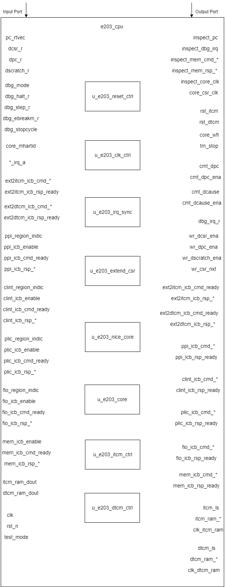

# e203_cpu Design Document

## 1. Introduction

The e203_cpu module is the top-level module of a RISC-V architecture processor, responsible for integrating the core logic and peripheral modules. It includes multiple sub-modules such as reset control, clock control, interrupt synchronization, core computing module, instruction and data storage control modules, and peripheral interfaces. It also supports custom extensions (such as NICE, ITCM, and DTCM). Through modular design, the E203_CPU has high flexibility and extensibility.

## 2. Module Diagram

## 3. Interface List

### 3.1 Core Interfaces

| **Interface Name**      | **Direction** | **Bit Width**  | **Description**                                              |
| ----------------------- | ------------- | -------------- | ------------------------------------------------------------ |
| `inspect_pc`            | Output        | E203_PC        | Current instruction address, used for external debugging or monitoring |
| `inspect_dbg_irq`       | Output        | `1`            | Debug interrupt signal                                       |
| `inspect_mem_cmd_valid` | Output        | `1`            | Memory command valid signal                                  |
| `inspect_mem_cmd_ready` | Output        | `1`            | Memory command ready signal                                  |
| `inspect_mem_rsp_valid` | Output        | `1`            | Memory response valid signal                                 |
| `inspect_mem_rsp_ready` | Output        | `1`            | Memory response ready signal                                 |
| `inspect_core_clk`      | Output        | `1`            | Core module clock signal                                     |
| `core_csr_clk`          | Output        | `1`            | Clock signal for CSR registers                               |
| `core_wfi`              | Output        | `1`            | Core work completion signal (waiting for interrupt)          |
| `tm_stop`               | Output        | `1`            | Timer stop signal, used for debugging purposes               |
| `pc_rtvec`              | Input         | E203_PC        | Jump address after reset                                     |
| `core_mhartid`          | Input         | E203_HARD_ID_W | Hardware thread identifier of the current core               |
| `dbg_irq_a`             | Input         | `1`            | Original debug interrupt signal                              |
| `ext_irq_a`             | Input         | `1`            | Original external interrupt signal                           |
| `sft_irq_a`             | Input         | `1`            | Original software interrupt signal                           |
| `tmr_irq_a`             | Input         | `1`            | Original timer interrupt signal                              |
| `test_mode`             | Input         | `1`            | Test mode signal                                             |

### 3.2 ITCM Interfaces (Optional)

available if `E203_HAS_ITCM` is defined

| Name            | Direction | Width            | Description                    |
| --------------- | --------- | ---------------- | ------------------------------ |
| `rst_itcm`      | Output    | 1                | Reset signal for the ITCM      |
| `itcm_ls`       | Output    | `1`              | ITCM clock inactivation signal |
| `itcm_ram_cs`   | Output    | `1`              | ITCM memory chip select signal |
| `itcm_ram_we`   | Output    | `1`              | ITCM write enable signal       |
| `itcm_ram_addr` | Output    | E203_ITCM_RAM_AW | ITCM memory address            |
| `itcm_ram_wem`  | Output    | E203_ITCM_RAM_MW | ITCM write mask signal         |
| `itcm_ram_din`  | Output    | E203_ITCM_RAM_DW | ITCM write data                |
| `itcm_ram_dout` | Input     | E203_ITCM_RAM_DW | ITCM output data               |
| `clk_itcm_ram`  | Output    | `1`              | ITCM memory clock signal       |

### 3.3 DTCM Interfaces (Optional) 

available if `E203_HAS_DTCM` is defined

| Name            | Direction | Width            | Description                      |
| --------------- | --------- | ---------------- | -------------------------------- |
| `rst_dtcm`      | Output    | `1`              | Reset signal for the DTCM module |
| `dtcm_ls`       | Output    | `1`              | DTCM clock inactivation signal   |
| `dtcm_ram_cs`   | Output    | `1`              | DTCM memory chip select signal   |
| `dtcm_ram_we`   | Output    | `1`              | DTCM write enable signal         |
| `dtcm_ram_addr` | Output    | E203_ITCM_RAM_AW | DTCM memory address              |
| `dtcm_ram_wem`  | Output    | E203_ITCM_RAM_MW | DTCM write mask signal           |
| `dtcm_ram_din`  | Output    | E203_ITCM_RAM_DW | DTCM write data                  |
| `dtcm_ram_dout` | Input     | E203_ITCM_RAM_DW | DTCM output data                 |

### 3.4 Debug Related Interface

| Name              | Direction | Width   | Description                                        |
| ----------------- | --------- | ------- | -------------------------------------------------- |
| `cmt_dpc`         | Output    | E203_PC | Program counter value in Debug mode                |
| `cmt_dpc_ena`     | Output    | `1`     | DPC register update signal in Debug mode           |
| `cmt_dcause`      | Output    | `3`     | Interrupt or exception cause in Debug mode         |
| `cmt_dcause_ena`  | Output    | `1`     | DCAUSE register update signal in Debug mode        |
| `dbg_irq_r`       | Output    | `1`     | Debug interrupt signal after synchronization       |
| `wr_dcsr_ena`     | Output    | `1`     | Enable signal for writing to the DCSR register     |
| `wr_dpc_ena`      | Output    | `1`     | Enable signal for writing to the DPC register      |
| `wr_dscratch_ena` | Output    | `1`     | Enable signal for writing to the DSCRATCH register |
| `wr_csr_nxt`      | Output    | `32`    | Data for the next write to the CSR register        |
| `dcsr_r`          | Input     | `32`    | Current value of the DCSR register                 |
| `dpc_r`           | Input     | E203_PC | Current value of the DPC register                  |
| `dscratch_r`      | Input     | `32`    | Current value of the DSCRATCH register             |
| `dbg_mode`        | Input     | `1`     | Whether in Debug mode                              |
| `dbg_halt_r`      | Input     | `1`     | Pause signal in Debug mode                         |
| `dbg_step_r`      | Input     | `1`     | Single-step execution signal in Debug mode         |
| `dbg_ebreakm_r`   | Input     | `1`     | EBREAK instruction signal in Debug mode            |
| `dbg_stopcycle`   | Input     | `1`     | Stop cycle signal in Debug mode                    |

### 3.5 External-agent ICB to ITCM

available if `E203_HAS_ITCM_EXTITF` is defined

| **Signal Name**          | **Direction** | **Width**              | **Description**                                              |
| ------------------------ | ------------- | ---------------------- | ------------------------------------------------------------ |
| `ext2itcm_icb_cmd_valid` | Input         | 1                      | Indicates that an external agent has a valid command for ITCM. |
| `ext2itcm_icb_cmd_ready` | Output        | 1                      | Indicates that ITCM is ready to accept a command from the external agent. |
| `ext2itcm_icb_cmd_addr`  | Input         | `E203_ITCM_ADDR_WIDTH` | Specifies the address for the command transaction on the ITCM bus. |
| `ext2itcm_icb_cmd_read`  | Input         | 1                      | Indicates whether the command is a read (`1`) or write (`0`). |
| `ext2itcm_icb_cmd_wdata` | Input         | `E203_XLEN`            | Contains the data to be written to ITCM in a write transaction. |
| `ext2itcm_icb_cmd_wmask` | Input         | `E203_XLEN/8`          | Specifies the byte mask for the write transaction.           |
| `ext2itcm_icb_rsp_valid` | Output        | 1                      | Indicates that ITCM has a valid response for the external agent. |
| `ext2itcm_icb_rsp_ready` | Input         | 1                      | Indicates that the external agent is ready to accept the response from ITCM. |
| `ext2itcm_icb_rsp_err`   | Output        | 1                      | Indicates that an error occurred during the transaction.     |
| `ext2itcm_icb_rsp_rdata` | Output        | `E203_XLEN`            | Contains the data read from ITCM in a read transaction.      |

### 3.6 External-agent ICB to DTCM

available if `E203_HAS_DTCM_EXTITF` is defined

| **Signal Name**          | **Direction** | **Width**              | **Description**                                              |
| ------------------------ | ------------- | ---------------------- | ------------------------------------------------------------ |
| `ext2dtcm_icb_cmd_valid` | Input         | 1                      | Indicates that an external agent has a valid command for DTCM. |
| `ext2dtcm_icb_cmd_ready` | Output        | 1                      | Indicates that DTCM is ready to accept a command from the external agent. |
| `ext2dtcm_icb_cmd_addr`  | Input         | `E203_DTCM_ADDR_WIDTH` | Specifies the address for the command transaction on the DTCM bus. |
| `ext2dtcm_icb_cmd_read`  | Input         | 1                      | Indicates whether the command is a read (`1`) or write (`0`). |
| `ext2dtcm_icb_cmd_wdata` | Input         | `E203_XLEN`            | Contains the data to be written to DTCM in a write transaction. |
| `ext2dtcm_icb_cmd_wmask` | Input         | `E203_XLEN/8`          | Specifies the byte mask for the write transaction.           |
| `ext2dtcm_icb_rsp_valid` | Output        | 1                      | Indicates that DTCM has a valid response for the external agent. |
| `ext2dtcm_icb_rsp_ready` | Input         | 1                      | Indicates that the external agent is ready to accept the response from DTCM. |
| `ext2dtcm_icb_rsp_err`   | Output        | 1                      | Indicates that an error occurred during the transaction.     |
| `ext2dtcm_icb_rsp_rdata` | Output        | `E203_XLEN`            | Contains the data read from DTCM in a read transaction       |

### 3.7 Other ICB Interface

#### 3.7.1 ICB Protocol

The interface signals for inter-module communication using the ICB protocol have the same suffix, and the prefix of the signals is determined by the connected module, represented by `*` in the template below.

| Interface Name      | Direction | Width            | Description                                                  |
| ------------------- | --------- | ---------------- | ------------------------------------------------------------ |
| `*_icb_enable`      | Input     | 1                | Enables or disables module on the ICB bus.                   |
| `*_icb_cmd_valid`   | Output    | 1                | Valid signal for the ICB command channel.                    |
| `*_icb_cmd_ready`   | Input     | 1                | Ready signal for the ICB command channel.                    |
| `*_icb_cmd_addr`    | Output    | `E203_ADDR_SIZE` | ICB command address signal.                                  |
| `*_icb_cmd_read`    | Output    | 1                | ICB command read/write signal.                               |
| `*_icb_cmd_wdata`   | Output    | `E203_XLEN`      | ICB command write data signal.                               |
| `*_icb_cmd_wmask`   | Output    | `E203_XLEN/8`    | ICB command write mask signal.                               |
| `*_icb_cmd_lock`    | Output    | 1                | Indicates whether the command is locked for exclusive access. |
| `*_icb_cmd_excl`    | Output    | 1                | Indicates whether the command is part of an exclusive transaction. |
| `*_icb_cmd_size`    | Output    | 2                | Specifies the size of the data for the ICB transaction.      |
| `*_icb_rsp_valid`   | Input     | 1                | Valid signal for the  ICB response channel.                  |
| `*_icb_rsp_ready`   | Output    | 1                | Ready signal for the  ICB response channel.                  |
| `*_icb_rsp_err`     | Input     | 1                | ICB response error signal.                                   |
| `*_icb_rsp_excl_ok` | Input     | 1                | Indicates whether an exclusive access transaction was successful. |
| `*_icb_rsp_rdata`   | Input     | `E203_XLEN`      | ICB response data signal.                                    |

#### 3.7.2 Interface groups of ICB Protocol

The relationship between connected module names and signal prefixes is shown in the table below.

| Module Name | The string represented by `*` |
| ----------- | ----------------------------- |
| PPI         | ppi                           |
| CLINT       | clint                         |
| PLIC        | plic                          |
| FIO         | fio                           |
| Ifetch      | mem                           |

1. PPI （Private Peripheral Interface）

   In addition to the ICB protocol signals, other signals from PPI are also received

   | Interface Name     | Direction | Width          | Description                                                  |
   | ------------------ | --------- | -------------- | ------------------------------------------------------------ |
   | `ppi_region_indic` | Input     | E203_ADDR_SIZE | Defines the address region assigned to the Private Peripheral Interface. |

2. CLINT

   In addition to the ICB protocol signals, other signals from CLINT are also received

   | **Signal Name**      | **Direction** | **Width**        | **Description**                                    |
   | -------------------- | ------------- | ---------------- | -------------------------------------------------- |
   | `clint_region_indic` | Input         | `E203_ADDR_SIZE` | Indicates the address region assigned to the CLINT |

3. PLIC

   In addition to the ICB protocol signals, other signals from PLIC are also received

   | **Signal Name**     | **Direction** | **Width**        | **Description**                                   |
   | ------------------- | ------------- | ---------------- | ------------------------------------------------- |
   | `plic_region_indic` | Input         | `E203_ADDR_SIZE` | Indicates the address region assigned to the PLIC |

4. FIO (Fast I/O) 

   available If `E203_HAS_FIO` is defined.

   In addition to the ICB protocol signals, other signals from FIO are also received

   | **Signal Name**    | **Direction** | **Width**        | **Description**                                  |
   | ------------------ | ------------- | ---------------- | ------------------------------------------------ |
   | `fio_region_indic` | Input         | `E203_ADDR_SIZE` | Indicates the address region assigned to the FIO |

5. Ifetch

   available if `E203_HAS_MEM_ITF` is defined 

   (e.g.,mem_icb_enable)

### 3.8 Clock and Reset Signals

| Name    | Direction | Width | Description       |
| ------- | --------- | ----- | ----------------- |
| `clk`   | Input     | `1`   | Main clock signal |
| `rst_n` | Input     | `1`   | Main reset signal |

## **4. Submodule List**

### **4.1 `e203_reset_ctrl`**
**Function Introduction**:
The `e203_reset_ctrl` module is responsible for implementing the synchronization and control logic of the reset signal to ensure the stability of the system reset signal. It supports different reset behaviors for the main core and slave cores.

**Interface List**:

| **Interface Name**  | **Direction** | **Bit Width**                     | **Description**                                |
|---------------------|--------------|----------------------------------|-----------------------------------------------|
| `clk`                | Input         | `1`                              | Main clock signal                              |
| `rst_n`              | Input         | `1`                              | Asynchronous reset signal                      |
| `test_mode`          | Input         | `1`                              | Test mode signal, used to skip reset synchronization logic |
| `rst_core`           | Output        | `1`                              | Reset signal for the core module                |
| `rst_itcm`           | Output        | `1`                              | Reset signal for the ITCM (optional)            |
| `rst_dtcm`           | Output        | `1`                              | Reset signal for the DTCM (optional)            |
| `rst_aon`            | Output        | `1`                              | Always-on reset signal                         |

### **4.2 `e203_clk_ctrl`**
**Function Introduction**:
The `e203_clk_ctrl` module is used to manage the clock gating logic of the core and subsystems. It controls the clocks of each module through clock enable signals and supports the core and storage modules (ITCM and DTCM).

**Interface List**:

Basic Input Signal

| Signal Name | Direction | Width | Description                                    |
| ----------- | --------- | ----- | ---------------------------------------------- |
| clk         | Input     | 1     | System clock                                   |
| rst_n       | Input     | 1     | Asynchronous reset (active low)                |
| test_mode   | Input     | 1     | Test mode signal                               |
| core_cgstop | Input     | 1     | Clock-gated stop signal, from the CSR register |

Functional Unit Activity State Signal

| Signal Name     | Direction | Width | Description                          |
| --------------- | --------- | ----- | ------------------------------------ |
| core_ifu_active | input     | 1     | Instruction Fetch Unit active status |
| core_exu_active | input     | 1     | Execution unit active state          |
| core_lsu_active | input     | 1     | Load storage cell active state       |
| core_biu_active | input     | 1     | Bus interface unit active statedt    |
| core_wfi        | input     | 1     | Wait for interrupt status signal     |

Clock Output Signal

| Signal Name  | Direction | Width | Description       |
| ------------ | --------- | ----- | ----------------- |
| clk_aon      | output    | 1     | Normally on clock |
| clk_core_ifu | output    | 1     | IFU module clock  |
| clk_core_exu | output    | 1     | EXU module clock  |
| clk_core_lsu | output    | 1     | LSU module clock  |
| clk_core_biu | output    | 1     | BIU module clock  |

Optional Signal

if `E203_HAS_ITCM` is defined, signals related with ITCM (e.g., itcm_active) are available.

if `E203_HAS_DTCM` is defined, signals related with DTCM (e.g., dtcm_active) are available.

| Signal Name | Direction | Width | Description                |
| ----------- | --------- | ----- | -------------------------- |
| itcm_active | input     | 1     | ITCM active status         |
| itcm_ls     | output    | 1     | ITCM clock low power state |
| dtcm_active | input     | 1     | DTCM active status         |
| dtcm_ls     | output    | 1     | DTCM clock low power state |
| clk_itcm    | output    | 1     | ITCM module clock          |
| clk_dtcm    | output    | 1     | DTCM module clock          |

### **4.3 `e203_irq_sync`**
**Function Introduction**:
The `e203_irq_sync` module is responsible for synchronizing external interrupt signals (including debug interrupt, external interrupt, software interrupt, and timer interrupt) to the system clock domain to avoid metastability issues across clock domains.

**Interface List**:

| **Interface Name**  | **Direction** | **Bit Width**                     | **Description**                                |
|---------------------|--------------|----------------------------------|-----------------------------------------------|
| `clk`                | Input         | `1`                              | Main clock signal                              |
| `rst_n`              | Input         | `1`                              | Reset signal                                  |
| `dbg_irq_a`          | Input         | `1`                              | Asynchronous debug interrupt signal            |
| `ext_irq_a`          | Input         | `1`                              | Asynchronous external interrupt signal        |
| `sft_irq_a`          | Input         | `1`                              | Asynchronous software interrupt signal        |
| `tmr_irq_a`          | Input         | `1`                              | Asynchronous timer interrupt signal            |
| `dbg_irq_r`          | Output        | `1`                              | Synchronized debug interrupt signal            |
| `ext_irq_r`          | Output        | `1`                              | Synchronized external interrupt signal        |
| `sft_irq_r`          | Output        | `1`                              | Synchronized software interrupt signal        |
| `tmr_irq_r`          | Output        | `1`                              | Synchronized timer interrupt signal            |

### **4.4 `e203_extend_csr`**
**Function Introduction**:
The `e203_extend_csr` module provides the CSR interface for NICE. Currently, it is an empty module, and users can expand it according to their needs.

**Interface List**:

| **Interface Name**  | **Direction** | **Bit Width**                     | **Description**                                |
|---------------------|--------------|----------------------------------|-----------------------------------------------|
| `nice_csr_valid`     | Input         | `1`                              | NICE CSR operation valid signal                |
| `nice_csr_ready`     | Output        | `1`                              | NICE CSR ready signal                          |
| `nice_csr_addr`      | Input         | `32`                             | NICE CSR address                              |
| `nice_csr_wr`        | Input         | `1`                              | NICE CSR write signal                          |
| `nice_csr_wdata`     | Input         | `32`                             | NICE CSR write data                            |
| `nice_csr_rdata`     | Output        | `32`                             | NICE CSR read data                             |
| `clk`                | Input         | `1`                              | Clock signal for CSR operations                 |
| `rst_n`              | Input         | `1`                              | Reset signal for CSR operations                |

### **4.5 `e203_subsys_nice_core`**
**Function Introduction**:
The `e203_subsys_nice_core` module implements the core logic of the NICE subsystem, including request processing, multi-cycle response support, and memory access interfaces.

**Interface List**:

| **Interface Name**  | **Direction** | **Bit Width**                     | **Description**                                |
|---------------------|--------------|----------------------------------|-----------------------------------------------|
| `nice_clk`           | Input         | `1`                              | NICE subsystem clock signal                     |
| `nice_rst_n`         | Input         | `1`                              | NICE subsystem reset signal                     |
| `nice_active`        | Output        | `1`                              | NICE module activity signal                     |
| `nice_mem_holdup`    | Input         | `1`                              | NICE module memory occupancy signal             |
| `nice_req_valid`     | Output        | `1`                              | NICE request valid signal                       |
| `nice_req_ready`     | Input         | `1`                              | NICE request ready signal                       |
| `nice_req_inst`      | Output        | E203_XLEN             | NICE request instruction                       |
| `nice_req_rs1`       | Output        | E203_XLEN              | NICE request operand 1                          |
| `nice_req_rs2`       | Output        | E203_XLEN              | NICE request operand 2                          |
| `nice_rsp_valid`     | Output        | `1`                              | NICE response valid signal                      |
| `nice_rsp_ready`     | Input         | `1`                              | NICE response ready signal                      |
| `nice_rsp_rdat`      | Output        | E203_XLEN              | NICE response data                              |
| `nice_rsp_err`       | Output        | `1`                              | NICE response error signal                      |
| `nice_icb_cmd_valid` | Input         | `1`                              | NICE ICB command valid signal                    |
| `nice_icb_cmd_ready` | Output        | `1`                              | NICE ICB command ready signal                    |
| `nice_icb_cmd_addr`  | Input         | E203_XLEN              | NICE ICB command address                        |
| `nice_icb_cmd_read`  | Input         | `1`                              | NICE ICB read command signal                    |
| `nice_icb_cmd_wdata` | Input         | E203_XLEN              | NICE ICB write data                             |
| `nice_icb_cmd_size`  | Input         | `2`                              | NICE ICB data size                              |
| `nice_icb_rsp_valid` | Output        | `1`                              | NICE ICB response valid signal                    |
| `nice_icb_rsp_ready` | Input         | `1`                              | NICE ICB response ready signal                    |
| `nice_icb_rsp_rdata` | Output        | E203_XLEN              | NICE ICB response data                          |
| `nice_icb_rsp_err`   | Output        | `1`                              | NICE ICB response error signal                    |

### **4.6 `e203_core`**
**Function Introduction**:
The `e203_core` module implements the core control logic, including instruction execution, exception handling, and interface communication with peripherals and storage.

**Interface List**

4.6.1 System Interface

| **Interface Name** | **Direction** | **Bit Width**    | **Description**                                              |
| ------------------ | ------------- | ---------------- | ------------------------------------------------------------ |
| `inspect_pc`       | Output        | `E203_PC_SIZE`   | The value of the current Program Counter (PC) being executed. |
| `core_wfi`         | Output        | 1                | Indicates whether the core is in the Wait for Interrupt (WFI) state. |
| `tm_stop`          | Output        | 1                | Debug stop signal used to externally stop the processor.     |
| `core_cgstop`      | Output        | 1                | Core clock gating stop signal.                               |
| `tcm_cgstop`       | Output        | 1                | TCM clock gating stop signal.                                |
| `pc_rtvec`         | Input         | `E203_PC_SIZE`   | Reset vector address (the starting address of the program).  |
| `core_mhartid`     | Input         | `E203_HART_ID_W` | The Hardware Thread ID of the current core.                  |
| `dbg_irq_r`        | Input         | 1                | Debug interrupt signal.                                      |
| `lcl_irq_r`        | Input         | `E203_LIRQ_NUM`  | Local interrupt signal vector.                               |
| `evt_r`            | Input         | `E203_EVT_NUM`   | Special event trigger signal.                                |
| `ext_irq_r`        | Input         | 1                | External interrupt signal.                                   |
| `sft_irq_r`        | Input         | 1                | Software interrupt signal.                                   |
| `tmr_irq_r`        | Input         | 1                | Timer interrupt signal.                                      |
| `wr_dcsr_ena`      | Output        | 1                | Enable signal for writing to the Debug CSR (`dcsr`).         |
| `wr_dpc_ena`       | Output        | 1                | Enable signal for writing to the Debug PC (`dpc`).           |
| `wr_dscratch_ena`  | Output        | 1                | Enable signal for writing to the Debug Register (`dscratch`). |
| `wr_csr_nxt`       | Output        | 32               | The data value to be written to the CSR.                     |
| `dcsr_r`           | Input         | 32               | The current value of the Debug Control Register.             |
| `dpc_r`            | Input         | `E203_PC_SIZE`   | The current value of the Debug PC.                           |
| `dscratch_r`       | Input         | 32               | The current value of the Debug Register.                     |
| `cmt_dpc`          | Output        | `E203_PC_SIZE`   | The committed PC value (used for exceptions or debugging).   |
| `cmt_dpc_ena`      | Output        | 1                | Enable signal for the committed PC value.                    |
| `cmt_dcause`       | Output        | 3                | Cause code for the committed exception.                      |
| `cmt_dcause_ena`   | Output        | 1                | Enable signal for the cause code of the committed exception. |
| `dbg_mode`         | Input         | 1                | Debug mode flag signal.                                      |
| `dbg_halt_r`       | Input         | 1                | Debug stop signal.                                           |
| `dbg_step_r`       | Input         | 1                | Debug single-step execution signal.                          |
| `dbg_ebreakm_r`    | Input         | 1                | Debug signal triggered by the `ebreak` instruction in M mode. |
| `dbg_stopcycle`    | Input         | 1                | Debug stop cycle signal.                                     |

4.6.2 Bus Interface to ITCM

if `E203_HAS_ITCM` is defined, this part of interfaces is available.

| Signal Name            | Direction | Bit Width            | Description                               |
| ---------------------- | --------- | -------------------- | ----------------------------------------- |
| ifu2itcm_holdup        | Input     | 1                    | The IFU to ITCM holdup signal             |
| itcm_region_indic      | Input     | E203_ADDR_SIZE       | The ITCM address region indication signal |
| ifu2itcm_icb_cmd_valid | Output    | 1                    | ITCM command valid signal                 |
| ifu2itcm_icb_cmd_ready | Input     | 1                    | ITCM ready to receive command signal      |
| ifu2itcm_icb_cmd_addr  | Output    | E203_ITCM_ADDR_WIDTH | ITCM access address                       |
| ifu2itcm_icb_rsp_valid | Input     | 1                    | ITCM response valid signal                |
| ifu2itcm_icb_rsp_ready | Output    | 1                    | IFU ready to receive response signal      |
| ifu2itcm_icb_rsp_err   | Input     | 1                    | ITCM access error indication              |
| ifu2itcm_icb_rsp_rdata | Input     | E203_ITCM_DATA_WIDTH | ITCM read data                            |

4.6.3 ICB Protocol Template

The interface signals for inter-module communication using the ICB protocol have the same suffix, and the prefix of the signals is determined by the connected module, represented by `*` in the template below.

| Interface Name      | Direction | Width            | Description                                                  |
| ------------------- | --------- | ---------------- | ------------------------------------------------------------ |
| `*_icb_enable`      | Input     | 1                | Enables or disables module on the ICB bus.                   |
| `*_icb_cmd_valid`   | Output    | 1                | Valid signal for the ICB command channel.                    |
| `*_icb_cmd_ready`   | Input     | 1                | Ready signal for the ICB command channel.                    |
| `*_icb_cmd_addr`    | Output    | `E203_ADDR_SIZE` | ICB command address signal.                                  |
| `*_icb_cmd_read`    | Output    | 1                | ICB command read/write signal.                               |
| `*_icb_cmd_wdata`   | Output    | `E203_XLEN`      | ICB command write data signal.                               |
| `*_icb_cmd_wmask`   | Output    | `E203_XLEN/8`    | ICB command write mask signal.                               |
| `*_icb_cmd_lock`    | Output    | 1                | Indicates whether the command is locked for exclusive access. |
| `*_icb_cmd_excl`    | Output    | 1                | Indicates whether the command is part of an exclusive transaction. |
| `*_icb_cmd_size`    | Output    | 2                | Specifies the size of the data for the ICB transaction.      |
| `*_icb_rsp_valid`   | Input     | 1                | Valid signal for the  ICB response channel.                  |
| `*_icb_rsp_ready`   | Output    | 1                | Ready signal for the  ICB response channel.                  |
| `*_icb_rsp_err`     | Input     | 1                | ICB response error signal.                                   |
| `*_icb_rsp_excl_ok` | Input     | 1                | Indicates whether an exclusive access transaction was successful. |
| `*_icb_rsp_rdata`   | Input     | `E203_XLEN`      | ICB response data signal.                                    |

4.6.4 Interfaces using ICB protocol

The relationship between connected module names and signal prefixes is shown in the table below.

| Module Name | The string represented by `*` |
| ----------- | ----------------------------- |
| PPI         | ppi                           |
| CLINT       | clint                         |
| PLIC        | plic                          |
| FIO         | fio                           |
| Ifetch      | mem                           |
| ITCM        | lsu2itcm                      |
| DTCM        | lsu2dtcm                      |

1. PPI （Private Peripheral Interface）

   In addition to the ICB protocol signals, other signals from PPI are also received

   | Interface Name     | Direction | Width          | Description                                                  |
   | ------------------ | --------- | -------------- | ------------------------------------------------------------ |
   | `ppi_region_indic` | Input     | E203_ADDR_SIZE | Defines the address region assigned to the Private Peripheral Interface. |

2. CLINT

   In addition to the ICB protocol signals, other signals from CLINT are also received

   | **Signal Name**      | **Direction** | **Width**        | **Description**                                    |
   | -------------------- | ------------- | ---------------- | -------------------------------------------------- |
   | `clint_region_indic` | Input         | `E203_ADDR_SIZE` | Indicates the address region assigned to the CLINT |

3. PLIC

   In addition to the ICB protocol signals, other signals from PLIC are also received

   | **Signal Name**     | **Direction** | **Width**        | **Description**                                   |
   | ------------------- | ------------- | ---------------- | ------------------------------------------------- |
   | `plic_region_indic` | Input         | `E203_ADDR_SIZE` | Indicates the address region assigned to the PLIC |

4. FIO (Fast I/O) , if `E203_HAS_FIO` is defined.

   In addition to the ICB protocol signals, other signals from FIO are also received

   | **Signal Name**    | **Direction** | **Width**        | **Description**                                  |
   | ------------------ | ------------- | ---------------- | ------------------------------------------------ |
   | `fio_region_indic` | Input         | `E203_ADDR_SIZE` | Indicates the address region assigned to the FIO |

5. Ifetch, if `E203_HAS_MEM_ITF` is defined.

   Ifetch ICB signal group doesn't have `*_icb_enable` signal.

   Ifetch ICB signal group have `*_icb_cmd_burst` and `*_icb_cmd_beat`, both are 2 bits.

   (e.g.,mem_icb_enable)

6. ITCM, if `E203_HAS_ITCM` is defined.

   ITCM ICB signal group doesn't have `*_icb_enable` signal.

   (e.g.,lsu2itcm_icb_cmd_valid)

7. DTCM, if `E203_HAS_DTCM` is defined.

   DTCM ICB signal group doesn't have `*_icb_enable` signal.

   In addition to the ICB protocol signals, other signals from DTCM are also received

   | **Signal Name**     | **Direction** | **Width**        | **Description**                                   |
   | ------------------- | ------------- | ---------------- | ------------------------------------------------- |
   | `dtcm_region_indic` | Input         | `E203_ADDR_SIZE` | Indicates the address region assigned to the DTCM |

4.6.5 NICE Interface

if `E203_HAS_NICE` is defined, this part of interfaces is available.

| **Signal Name**           | **Direction** | **Width**        | **Description**                                              |
| ------------------------- | ------------- | ---------------- | ------------------------------------------------------------ |
| `nice_mem_holdup`         | Input         | 1 bit            | Indicates that NICE occupies the memory to avoid deadlock scenarios. |
| `nice_req_valid`          | Output        | 1 bit            | Handshake signal indicating that the NICE request is valid.  |
| `nice_req_ready`          | Input         | 1 bit            | Handshake signal indicating that the NICE request has been accepted. |
| `nice_req_inst`           | Output        | `E203_XLEN` bits | Instruction sent to NICE.                                    |
| `nice_req_rs1`            | Output        | `E203_XLEN` bits | Operand 1 (RS1) for the instruction sent to NICE.            |
| `nice_req_rs2`            | Output        | `E203_XLEN` bits | Operand 2 (RS2) for the instruction sent to NICE.            |
| `nice_rsp_multicyc_valid` | Input         | 1 bit            | Indicates that the current instruction is multi-cycle.       |
| `nice_rsp_multicyc_ready` | Output        | 1 bit            | Indicates that NICE is ready to handle multi-cycle instructions. |
| `nice_rsp_multicyc_dat`   | Input         | `E203_XLEN` bits | Result of a multi-cycle instruction write-back.              |
| `nice_rsp_multicyc_err`   | Input         | 1 bit            | Indicates an error occurred during multi-cycle instruction execution. |
| `nice_icb_cmd_valid`      | Input         | 1 bit            | Indicates that NICE has a valid memory access request on the ICB. |
| `nice_icb_cmd_ready`      | Output        | 1 bit            | Indicates that the memory interface is ready to accept NICE's request. |
| `nice_icb_cmd_addr`       | Input         | `E203_XLEN` bits | Memory address for NICE's memory access request.             |
| `nice_icb_cmd_read`       | Input         | 1 bit            | Specifies whether the request is a read (`1`) or write (`0`). |
| `nice_icb_cmd_wdata`      | Input         | `E203_XLEN` bits | Data to be written to memory by NICE.                        |
| `nice_icb_cmd_size`       | Input         | 2 bits           | Specifies the data size for the memory transaction.          |
| `nice_icb_rsp_valid`      | Output        | 1 bit            | Indicates that the memory interface has a valid response for NICE. |
| `nice_icb_rsp_ready`      | Input         | 1 bit            | Indicates that NICE is ready to receive a response from the memory interface. |
| `nice_icb_rsp_rdata`      | Output        | `E203_XLEN` bits | Data read from memory as the result of NICE's request.       |
| `nice_icb_rsp_err`        | Output        | 1 bit            | Indicates an error occurred during NICE's memory transaction. |

### **4.7 `e203_itcm_ctrl`**
**Function Introduction**:
The `e203_itcm_ctrl` module manages the Instruction Tightly Coupled Memory (ITCM), including its read and write logic and external interface communication.

**Interface List**:

4.7.1 System Interfaces

| Signal Name | Direction | Width | Description              |
| ----------- | --------- | ----- | ------------------------ |
| clk         | Input     | 1     | System clock             |
| rst_n       | Input     | 1     | Active low reset         |
| test_mode   | Input     | 1     | Test mode enable         |
| itcm_active | Output    | 1     | ITCM active status       |
| tcm_cgstop  | Input     | 1     | Clock gating stop signal |

4.7.2 IFU Interface

| Signal Name            | Direction | Width      | Description    |
| ---------------------- | --------- | ---------- | -------------- |
| ifu2itcm_icb_cmd_valid | Input     | 1          | Command valid  |
| ifu2itcm_icb_cmd_ready | Output    | 1          | Command ready  |
| ifu2itcm_icb_cmd_addr  | Input     | ADDR_WIDTH | Access address |
| ifu2itcm_icb_cmd_read  | Input     | 1          | Read enable    |
| ifu2itcm_icb_cmd_wdata | Input     | DATA_WIDTH | Write data     |
| ifu2itcm_icb_cmd_wmask | Input     | WMSK_WIDTH | Write mask     |
| ifu2itcm_icb_rsp_valid | Output    | 1          | Response valid |
| ifu2itcm_icb_rsp_ready | Input     | 1          | Response ready |
| ifu2itcm_icb_rsp_err   | Output    | 1          | Response error |
| ifu2itcm_icb_rsp_rdata | Output    | DATA_WIDTH | Read data      |

4.7.3 LSU Interface  

(Same structure as IFU Interface, signal names prefixed with lsu2itcm_)

4.7.4 External Interface

(Same structure as IFU Interface, signal names prefixed with ext2itcm_, only exists when E203_HAS_ITCM_EXTITF is defined)

4.7.5 RAM Interface

| Signal Name   | Direction | Width  | Description  |
| ------------- | --------- | ------ | ------------ |
| itcm_ram_cs   | Output    | 1      | Chip select  |
| itcm_ram_we   | Output    | 1      | Write enable |
| itcm_ram_addr | Output    | RAM_AW | Address      |
| itcm_ram_wem  | Output    | RAM_MW | Write mask   |
| itcm_ram_din  | Output    | RAM_DW | Write data   |
| itcm_ram_dout | Input     | RAM_DW | Read data    |
| clk_itcm_ram  | Output    | 1      | RAM clock    |

### **4.8 `e203_dtcm_ctrl`**
**Function Introduction**:
The `e203_dtcm_ctrl` module manages the Data Tightly Coupled Memory (DTCM), including its read and write logic and external interface communication.

**Interface List**:

4.8.1 System Interfaces

| Signal Name | Direction | Width | Description                    |
| ----------- | --------- | ----- | ------------------------------ |
| clk         | Input     | 1     | System clock                   |
| rst_n       | Input     | 1     | Asynchronous reset, active low |
| test_mode   | Input     | 1     | Test mode signal               |
| tcm_cgstop  | Input     | 1     | Clock gating stop signal       |
| dtcm_active | Output    | 1     | DTCM activity state indicator  |

4.8.2 LSU ICB Bus Interface

| **Signal Name**          | **Direction** | **Width**              | **Description**                                              |
| ------------------------ | ------------- | ---------------------- | ------------------------------------------------------------ |
| `lsu2dtcm_icb_cmd_valid` | Input         | 1                      | Indicates that the LSU has a valid command for the DTCM. This is part of the handshake mechanism. |
| `lsu2dtcm_icb_cmd_ready` | Output        | 1                      | Indicates that the DTCM is ready to accept the command from the LSU. This is part of the handshake mechanism. |
| `lsu2dtcm_icb_cmd_addr`  | Input         | `E203_DTCM_ADDR_WIDTH` | Specifies the starting address of the bus transaction. The address must be naturally aligned. |
| `lsu2dtcm_icb_cmd_read`  | Input         | 1                      | Specifies whether the transaction is a read (`1`) or write (`0`). |
| `lsu2dtcm_icb_cmd_wdata` | Input         | 32                     | Contains the write data when performing a write transaction. |
| `lsu2dtcm_icb_cmd_wmask` | Input         | 4                      | Specifies the write mask for the write transaction. Each bit corresponds to one byte of the data. |
| `lsu2dtcm_icb_rsp_valid` | Output        | 1                      | Indicates that the DTCM has a valid response for the LSU. This is part of the handshake mechanism. |
| `lsu2dtcm_icb_rsp_ready` | Input         | 1                      | Indicates that the LSU is ready to accept the response from the DTCM. This is part of the handshake mechanism. |
| `lsu2dtcm_icb_rsp_err`   | Output        | 1                      | Indicates whether there was an error in the transaction.     |
| `lsu2dtcm_icb_rsp_rdata` | Output        | 32                     | Contains the read data when performing a read transaction. The response data is aligned with AXI definitions. |

4.8.3 External ICB Bus Interface (Optional)

This part of the interface is valid when the `E203_HAS_DTCM_EXTITF` macro is defined.

| **Signal Name**          | **Direction** | **Width**              | **Description**                                              |
| ------------------------ | ------------- | ---------------------- | ------------------------------------------------------------ |
| `ext2dtcm_icb_cmd_valid` | Input         | 1                      | Indicates that the external agent has a valid command for the DTCM. This is part of the handshake mechanism. |
| `ext2dtcm_icb_cmd_ready` | Output        | 1                      | Indicates that the DTCM is ready to accept the command from the external agent. This is part of the handshake mechanism. |
| `ext2dtcm_icb_cmd_addr`  | Input         | `E203_DTCM_ADDR_WIDTH` | Specifies the starting address of the bus transaction. The address must be naturally aligned. |
| `ext2dtcm_icb_cmd_read`  | Input         | 1                      | Specifies whether the transaction is a read (`1`) or write (`0`). |
| `ext2dtcm_icb_cmd_wdata` | Input         | 32                     | Contains the write data when performing a write transaction. |
| `ext2dtcm_icb_cmd_wmask` | Input         | 4                      | Specifies the write mask for the write transaction. Each bit corresponds to one byte of the data. |
| `ext2dtcm_icb_rsp_valid` | Output        | 1                      | Indicates that the DTCM has a valid response for the external agent. This is part of the handshake mechanism. |
| `ext2dtcm_icb_rsp_ready` | Input         | 1                      | Indicates that the external agent is ready to accept the response from the DTCM. This is part of the handshake mechanism. |
| `ext2dtcm_icb_rsp_err`   | Output        | 1                      | Indicates whether there was an error in the transaction.     |
| `ext2dtcm_icb_rsp_rdata` | Output        | 32                     | Contains the read data when performing a read transaction. The response data is aligned with AXI definitions. |

4.8.4 DTCM RAM Interface

| Signal Name   | Direction | Width            | Description             |
| ------------- | --------- | ---------------- | ----------------------- |
| dtcm_ram_cs   | Output    | 1                | RAM chip select signal  |
| dtcm_ram_we   | Output    | 1                | RAM write enable signal |
| dtcm_ram_addr | Output    | E203_DTCM_RAM_AW | RAM address             |
| dtcm_ram_wem  | Output    | E203_DTCM_RAM_MW | RAM write mask          |
| dtcm_ram_din  | Output    | E203_DTCM_RAM_DW | RAM write data          |
| dtcm_ram_dout | Input     | E203_DTCM_RAM_DW | RAM read data           |
| clk_dtcm_ram  | Output    | 1                | RAM clock signal        |

### 4.9 e203_subsys_nice_core

Function: The `e203_subsys_nice_core` module implements a simple custom extension (NICE core) for handling custom RISC-V instructions. It supports custom `custom3` instructions, including operations like loading data from memory to a row buffer (`lbuf`), storing data from the row buffer to memory (`sbuf`), and accumulating data from memory (`rowsum`). The module interacts with memory through a load-store unit (LSU),  processes multi-cycle operations, and facilitates command-response  communication between the core and external components. It is designed  for efficient execution of specialized tasks while ensuring memory  access and error handling.

Interface:

4.9.1 System Signals

| **Signal Name**   | **Bit Width** | **Direction** | **Description**                                             |
| ----------------- | ------------- | ------------- | ----------------------------------------------------------- |
| `nice_clk`        | 1             | Input         | Clock signal for the NICE core module.                      |
| `nice_rst_n`      | 1             | Input         | Active-low reset signal for resetting the NICE core module. |
| `nice_active`     | 1             | Output        | Indicates whether the NICE core is active.                  |
| `nice_mem_holdup` | 1             | Output        | Signal to indicate memory holdup during NICE operations.    |

4.9.2 Control Command Request Signals

| **Signal Name**  | **Bit Width** | **Direction** | **Description**                                              |
| ---------------- | ------------- | ------------- | ------------------------------------------------------------ |
| `nice_req_valid` | 1             | Input         | Indicates that a valid request is sent to the NICE core.     |
| `nice_req_ready` | 1             | Output        | Indicates that the NICE core is ready to accept a new request. |
| `nice_req_inst`  | `E203_XLEN`   | Input         | Instruction to be executed by the NICE core.                 |
| `nice_req_rs1`   | `E203_XLEN`   | Input         | Source operand RS1 passed to the NICE core.                  |
| `nice_req_rs2`   | `E203_XLEN`   | Input         | Source operand RS2 passed to the NICE core.                  |

4.9.3 Control Command Response Signals

| **Signal Name**  | **Bit Width** | **Direction** | **Description**                                              |
| ---------------- | ------------- | ------------- | ------------------------------------------------------------ |
| `nice_rsp_valid` | 1             | Output        | Indicates that a response is available from the NICE core.   |
| `nice_rsp_ready` | 1             | Input         | Indicates that the upstream module is ready to accept the response. |
| `nice_rsp_rdat`  | `E203_XLEN`   | Output        | Response data generated by the NICE core.                    |
| `nice_rsp_err`   | 1             | Output        | Indicates an error in the response, such as an illegal instruction or memory error. |

4.9.4 Memory LSU Command Request Signals

| **Signal Name**      | **Bit Width**    | **Direction** | **Description**                                              |
| -------------------- | ---------------- | ------------- | ------------------------------------------------------------ |
| `nice_icb_cmd_valid` | 1                | Output        | Indicates a valid memory command request from the NICE core. |
| `nice_icb_cmd_ready` | 1                | Input         | Indicates that the memory interface is ready to accept the command. |
| `nice_icb_cmd_addr`  | `E203_ADDR_SIZE` | Output        | Address for the memory operation.                            |
| `nice_icb_cmd_read`  | 1                | Output        | Indicates whether the memory operation is a read (`1`) or write (`0`). |
| `nice_icb_cmd_wdata` | `E203_XLEN`      | Output        | Write data for the memory operation.                         |
| `nice_icb_cmd_size`  | 2                | Output        | Size of the memory operation in bytes (e.g., 00: 1B, 01: 2B, 10: 4B). |

------

4.9.5 Memory LSU Response Signals

| **Signal Name**      | **Bit Width** | **Direction** | **Description**                                              |
| -------------------- | ------------- | ------------- | ------------------------------------------------------------ |
| `nice_icb_rsp_valid` | 1             | Input         | Indicates that a memory response is valid.                   |
| `nice_icb_rsp_ready` | 1             | Output        | Indicates that the NICE core is ready to accept the memory response. |
| `nice_icb_rsp_rdata` | `E203_XLEN`   | Input         | Read data from the memory response.                          |
| `nice_icb_rsp_err`   | 1             | Input         | Indicates an error in the memory response, such as a bus error. |

## 5. Implementation Details

### **5.1 Module Initialization and Reset Logic**

1. **Reset Control (`e203_reset_ctrl`)**:
    - During module initialization, the `e203_reset_ctrl` module synchronizes the external asynchronous reset signal (`rst_n`) into the clock domain to generate reset signals (`rst_core`, `rst_itcm`, `rst_dtcm`) for the core module and sub-modules (such as ITCM and DTCM).
    - The synchronization logic of the reset signal is implemented by multiple registers to ensure the stability of the reset signal when crossing clock domains.
    - If in the test mode (`test_mode`), the synchronization logic is skipped and the external reset signal is used directly.

2. **Reset Signal Distribution**:
    - The main clock reset signal (`rst_aon`) is always active and is used for the clock module and the reset logic itself.
    - For the ITCM and DTCM modules, the reset signals are managed and synchronously output by the `e203_reset_ctrl` module.

### **5.2 Clock Control Logic**

1. **Clock Gating (`e203_clk_ctrl`)**:
    - The control of the clock signal mainly relies on the activity status of the sub-modules (such as `core_ifu_active`, `core_exu_active`, etc.). These signals are generated in real-time by the core module to indicate whether each functional module is in an active state.
    - The `e203_clk_ctrl` module generates the clock enable signals for each module according to the activity status signals. For example:
        - If `core_ifu_active` is high, the clock of the IFU module (`clk_core_ifu`) remains on; if the activity status is low, the clock is turned off to save power.
        - The clock enable signals for the ITCM and DTCM modules (`clk_itcm` and `clk_dtcm`) are controlled in combination with their own activity signals (`itcm_active` and `dtcm_active`) and low-power signals (`itcm_ls` and `dtcm_ls`).
    - In the test mode, all clocks are forced to be turned on.

2. **Module-specific Clock Signals**:
    - The IFU, EXU, LSU, and BIU modules receive independent clock signals respectively to support independent clock gating for each module.
    - The sub-storage modules ITCM and DTCM support efficient memory access through independent clock signals.

### **5.3 Interrupt Signal Synchronization**

1. ### **Asynchronous Interrupt Signal Synchronization (`e203_irq_sync`)**:
  
    - External interrupt signals (including debug interrupt, external interrupt, software interrupt, and timer interrupt) are usually asynchronous signals, and directly inputting them into the core may cause metastability.
    - These signals are synchronized into the system clock domain through the `e203_irq_sync` module:
        - Signal synchronization is achieved by using multiple registers. For example, `ext_irq_r` is the result of synchronizing the asynchronous signal `ext_irq_a`.
        - If the `E203_HAS_LOCKSTEP` mode is enabled, the synchronization logic is skipped and the signals are directly passed through.
    
2. **Interrupt Signal Distribution**:
    - The synchronized interrupt signals (such as `dbg_irq_r`, `ext_irq_r`, etc.) are input to the core module (`e203_core`) for processing.
    - The debug interrupt and timer interrupt signals are passed through additional paths to the peripheral modules for debugging and timer control.

### **5.4 Core Module Logic**

1. **Core Module Invocation (`e203_core`)**:
    - The core module is the core of the entire CPU design, including functions such as instruction fetching, decoding, execution, memory access, and interrupt handling.
    - It receives the external `pc_rtvec` as the initial PC address for the core to execute after reset.
    - The core module drives the activity signals of the sub-modules (such as `core_ifu_active`) and the instruction execution status (such as `core_wfi`) through internal logic.

2. **Interrupt Handling**:
    - The synchronized interrupt signals (such as `ext_irq_r`) are input to the core module to trigger the exception handling logic.
    - If entering the debug mode, the core module outputs relevant signals (such as `cmt_dpc`, `cmt_dcause`) to update the debug status registers.

3. **CSR Operation Expansion**:
    - The core module supports the expansion of CSR (Control and Status Register) operations through the `e203_extend_csr` module. Currently, this function is an empty module, and users can expand it by themselves.

### **5.5 ITCM/DTCM Storage Module Logic**

1. **ITCM Control Logic (`e203_itcm_ctrl`)**:
    - The Instruction Cache Module (ITCM) supports access from the core module (IFU and LSU) as well as external interfaces.
    - When the IFU accesses the ITCM, it sends requests through `ifu2itcm_icb_cmd_valid` and `ifu2itcm_icb_cmd_addr`, and the ITCM returns instruction data according to the address.
    - The LSU accesses the ITCM for reading and writing instruction storage, and interacts through signals such as `lsu2itcm_icb_cmd_valid` and `lsu2itcm_icb_cmd_addr`.
    - The external access interface (if `E203_HAS_ITCM_EXTITF` is enabled) allows peripherals to access the ITCM through the ICB bus.

2. **DTCM Control Logic (`e203_dtcm_ctrl`)**:
    - The Data Cache Module (DTCM) supports access from the core module (LSU) as well as external interfaces.
    - The LSU sends requests to the DTCM through `lsu2dtcm_icb_cmd_valid` and `lsu2dtcm_icb_cmd_addr`, and the DTCM returns data or writes data.
    - The external access interface (if `E203_HAS_DTCM_EXTITF` is enabled) allows peripherals to access the DTCM through the ICB bus.

**5.6 NICE Accelerator Interface**

1. **NICE Subsystem (`e203_subsys_nice_core`)**:
    - The NICE module provides a hardware acceleration interface for handling special computing tasks.
    - The core module sends requests to the NICE through signals such as `nice_req_valid` and `nice_req_inst`. The NICE returns results through `nice_rsp_valid` and `nice_rsp_rdat`.
    - If the NICE needs to access the main memory, it sends memory requests through signals such as `nice_icb_cmd_valid` and `nice_icb_cmd_addr`, and the memory responses are returned through `nice_icb_rsp_valid` and `nice_icb_rsp_rdata`.

2. **Multi-cycle Instruction Support**:
    - The NICE module supports multi-cycle instructions, and uses the `nice_rsp_multicyc_valid` signal to indicate whether the current operation requires multiple cycles to complete.
    - The NICE internally manages the execution status of instructions and returns responses when the execution is completed.

### **5.7 Peripheral and Storage Interfaces**

1. **PPI, CLINT, PLIC, and FIO Interfaces**:
    - The core module interacts with peripherals (such as PPI, CLINT, PLIC, FIO) through the ICB bus.
    - Each peripheral module has an independent command channel (`*_icb_cmd_*`) and a response channel (`*_icb_rsp_*`).
    - The access rights of the peripheral modules are controlled by the `*_icb_enable` signals.

2. **Main Memory Interface**:
    - The main memory interface supports instruction fetching and data access through the ICB bus.
    - If `E203_HAS_MEM_ITF` is enabled, the core module accesses the main memory through `mem_icb_cmd_*` and `mem_icb_rsp_*`.

### **5.8 Constraint Conditions**

- The clock signals of the core module and the storage modules (ITCM/DTCM) cannot be turned off simultaneously.
- The memory access signals of the NICE module (such as `nice_icb_cmd_valid`) and those of the core module need to avoid conflicts through protocols.
- If entering the debug mode, the core's WFI signal (`core_wfi`) and the interrupt signals need to be correctly decoupled.

## **6. Corner Cases**

1. **Reset Signal Synchronization Problem**: If there is a cross-clock domain operation between the main clock and the reset signal, the system may enter an uncertain state. This is solved by the multi-stage register synchronization in the `e203_reset_ctrl` module.
2. **Conflict in Clock Control**: When the `core_cgstop` signal and the module's `active` signal are both valid, the clock control module needs to give priority to the debug mode (controlled by `core_cgstop`).
3. **Memory Access Competition of the NICE Module**: When the NICE module and the core module access the memory simultaneously, a deadlock may occur, which is avoided by the handshake signal `nice_icb_cmd_ready`.

## **7. Constraints**

1. In the reset state, all the `valid` signals of the modules should remain at a low level.
2. At any time, `nice_icb_cmd_valid` and `mem_icb_cmd_valid` will not be high simultaneously to avoid memory access conflicts.
3. In the debug mode, `core_cgstop` should override all the core activity signals to ensure that the clock is always on. 