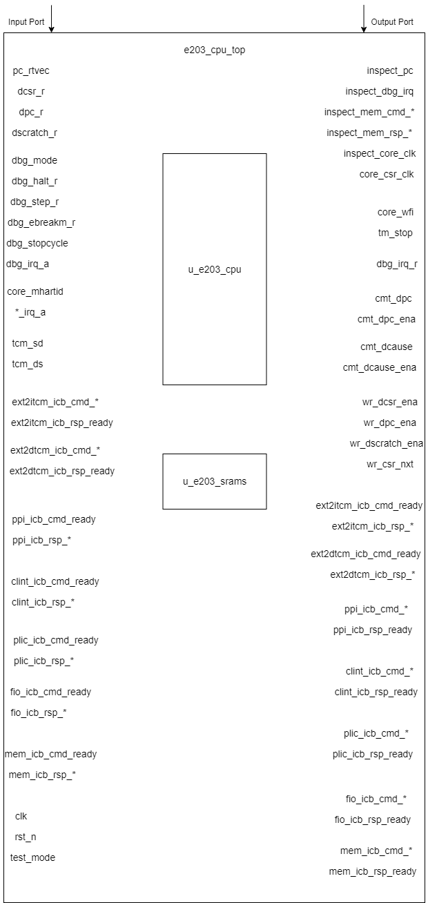

### **e203_cpu_top Design Document**

### **1. Introduction**

`e203_cpu_top` is the top-level module in the E203 series, responsible for integrating the CPU core, SRAM control logic, and the logic of peripheral interfaces. It plays a role in connecting the E203 core with on-chip memory, external buses, debugging interfaces, and other modules at the system-level architecture. Meanwhile, it includes unified management and distribution of signals such as clocks and resets.

This module supports multiple memory interfaces (such as ITCM and DTCM), external interrupt management, and private interfaces for several on-chip peripherals. Through flexible parameter configuration, some functional modules (such as ITCM, DTCM, FIO, etc.) can be enabled or disabled.

### **2. Module Diagram**

### **3. Interface List**

#### 3.1 Basic Interfaces

The following is the complete interface list of the module, including the name, direction, bit width, and description.

| **Interface Name**         | **Direction** | **Bit Width**                  | **Description**                                                                 |
|----------------------------|---------------|-------------------------------|------------------------------------------------------------------------------------|
| `inspect_pc`                | Output        | `E203_PC_SIZE`                | The value of the current Program Counter (PC), used for external debugging or monitoring. |
| `inspect_dbg_irq`           | Output        | 1                             | Represents the current debug interrupt signal.                                       |
| `inspect_mem_cmd_valid`    | Output        | 1                             | Indicates that the memory command is valid.                                          |
| `inspect_mem_cmd_ready`    | Output        | 1                             | Indicates that the memory command is ready to be received.                            |
| `inspect_mem_rsp_valid`    | Output        | 1                             | Indicates that the memory response is valid.                                          |
| `inspect_mem_rsp_ready`    | Output        | 1                             | Indicates that the memory response is ready to be received.                            |
| `inspect_core_clk`          | Output        | 1                             | The core clock signal, used for external monitoring.                                 |
| `core_csr_clk`              | Output        | 1                             | The core CSR (Control and Status Register) clock signal.                              |
| `core_wfi`                  | Output        | 1                             | Indicates that the core is currently in the WFI (Wait for Interrupt) state.          |
| `tm_stop`                   | Output        | 1                             | Indicates whether the core has paused the MTIME timer.                                |
| `pc_rtvec`                  | Input         | `E203_PC_SIZE`                | The address vector to which the core jumps after reset.                              |
| `core_mhartid` | Input | E203_HARD_ID_W | Hardware thread identifier of the current core |
| `ext_irq_a` | Input | `1` | The External Interrupt signal from PLIC |
| `sft_irq_a` | Input | `1` | The Software Interrupt signal from CLINT |
| `tmr_irq_a` | Input | `1` | The Timer Interrupt signal from CLINT |
| `tcm_sd`                    | Input         | 1                             | The PMU control signal from PMU to control the TCM Shutdown |
| `tcm_ds`                    | Input         | 1                             | The PMU control signal from PMU to control the TCM Deep-Sleep |

#### 3.2 Interface to Debug Module

| Name              | Direction | Width   | Description                                        |
| ----------------- | --------- | ------- | -------------------------------------------------- |
| `dbg_irq_r`       | Output    | `1`     | Debug interrupt signal after synchronization       |
| `cmt_dpc`         | Output    | E203_PC | Program counter value in Debug mode                |
| `cmt_dpc_ena`     | Output    | `1`     | DPC register update signal in Debug mode           |
| `cmt_dcause`      | Output    | `3`     | Interrupt or exception cause in Debug mode         |
| `cmt_dcause_ena`  | Output    | `1`     | DCAUSE register update signal in Debug mode        |
| `wr_dcsr_ena`     | Output    | `1`     | Enable signal for writing to the DCSR register     |
| `wr_dpc_ena`      | Output    | `1`     | Enable signal for writing to the DPC register      |
| `wr_dscratch_ena` | Output    | `1`     | Enable signal for writing to the DSCRATCH register |
| `wr_csr_nxt`      | Output    | `32`    | Data for the next write to the CSR register        |
| `dcsr_r`          | Input     | `32`    | Current value of the DCSR register                 |
| `dpc_r`           | Input     | E203_PC | Current value of the DPC register                  |
| `dscratch_r`      | Input     | `32`    | Current value of the DSCRATCH register             |
| `dbg_mode`        | Input     | `1`     | Whether in Debug mode                              |
| `dbg_halt_r`      | Input     | `1`     | Pause signal in Debug mode                         |
| `dbg_step_r`      | Input     | `1`     | Single-step execution signal in Debug mode         |
| `dbg_ebreakm_r`   | Input     | `1`     | EBREAK instruction signal in Debug mode            |
| `dbg_stopcycle`   | Input     | `1`     | Stop cycle signal in Debug mode                    |
| `dbg_irq_a`       | Input     | `1`     | Original debug interrupt signal                    |

#### 3.3 Interface using ICB Protocol

##### ICB interface template

The interface signals for inter-module communication using the ICB protocol have the same suffix, and the prefix of the signals is determined by the connected module, represented by `*` in the template below. Unless otherwise specified, the bit width of the interface signals is the value in the table below.

| Signal Name     | Direction | Bit Width      | Description                             |
| :-------------- | --------- | -------------- | --------------------------------------- |
| *_icb_cmd_valid | Input     | 1              | command valid signal                    |
| *_icb_cmd_ready | Output    | 1              | current ready to receive command signal |
| *_icb_cmd_addr  | Input     | E203_ADDR_SIZE | command address                         |
| *_icb_cmd_read  | Input     | 1              | read command indication                 |
| *_icb_cmd_wdata | Input     | E203_XLEN      | write data                              |
| *_icb_cmd_wmask | Input     | E203_XLEN/8    | write mask                              |
| *_icb_rsp_valid | Output    | 1              | response valid signal                   |
| *_icb_rsp_ready | Input     | 1              | ready to receive response signal        |
| *_icb_rsp_err   | Output    | 1              | response error signal                   |
| *_icb_rsp_rdata | Output    | E203_XLEN      | response data                           |

##### Interface groups using ICB

1. External interface (ICB) to access ITCM, if `E203_HAS_ITCM_EXTITF` is defined.

   Substitute`*` with `ext2itcm`, e.g.,`*_icb_cmd_valid` → `ext2itcm_icb_cmd_valid`.
   
   Specifically, the bit width of `ext2itcm_icb_cmd_addr` is `E203_ITCM_ADDR_WIDTH`.

2. External interface (ICB) to access DTCM, if`E203_HAS_DTCM_EXTITF` is defined.

   Substitute`*` with `ext2dtcm`, e.g.,`*_icb_cmd_valid` → `ext2dtcm_icb_cmd_valid`.

   Specifically, the bit width of `dtcm_icb_cmd_addr` is `E203_DTCM_ADDR_WIDTH`.

3. The Private Peripheral Interface (ICB)

   These interfaces are always available.

   Substitute`*` with `ppi`, e.g.,`*_icb_cmd_valid` → `ppi_icb_cmd_valid`

4. The CLINT Interface (ICB)

   These interfaces are always available.

   Substitute`*` with `clint`, e.g.,`*_icb_cmd_valid` → `clint_icb_cmd_valid`

5. The PLIC Interface (ICB)

   These interfaces are always available.

   Substitute`*` with `plic`, e.g.,`*_icb_cmd_valid` → `plic_icb_cmd_valid`

6. The Fast IO Interface (ICB)

   These interfaces are always available.

   Substitute`*` with `fio`, e.g.,`*_icb_cmd_valid` → `fio_icb_cmd_valid`

7. The System Memory Interface (ICB)

   These interfaces are always available.

   Substitute`*` with `mem`, e.g.,`*_icb_cmd_valid` → `mem_icb_cmd_valid`

### **4. Called Module List**

#### **4.1 e203_cpu**
- **Function Introduction**:
    - `e203_cpu` is the core module of the E203 series, responsible for executing RISC-V instructions, handling interrupts and exceptions, managing the interaction between instruction streams and data streams, and providing core functions such as memory access, instruction decoding, instruction execution, and write-back.
    - This module also supports debugging functions, sleep mode (WFI), and memory interface docking (such as ITCM and DTCM).

- **Interface List**:

##### 4.1.1 Core Interfaces

| **Interface Name**      | **Direction** | **Bit Width**  | **Description**                                              |
| ----------------------- | ------------- | -------------- | ------------------------------------------------------------ |
| `inspect_pc`            | Output        | E203_PC        | Current instruction address, used for external debugging or monitoring |
| `inspect_dbg_irq`       | Output        | `1`            | Debug interrupt signal                                       |
| `inspect_mem_cmd_valid` | Output        | `1`            | Memory command valid signal                                  |
| `inspect_mem_cmd_ready` | Output        | `1`            | Memory command ready signal                                  |
| `inspect_mem_rsp_valid` | Output        | `1`            | Memory response valid signal                                 |
| `inspect_mem_rsp_ready` | Output        | `1`            | Memory response ready signal                                 |
| `inspect_core_clk`      | Output        | `1`            | Core module clock signal                                     |
| `core_csr_clk`          | Output        | `1`            | Clock signal for CSR registers                               |
| `core_wfi`              | Output        | `1`            | Core work completion signal (waiting for interrupt)          |
| `tm_stop`               | Output        | `1`            | Timer stop signal, used for debugging purposes               |
| `pc_rtvec`              | Input         | E203_PC        | Jump address after reset                                     |
| `dbg_irq_a`             | Input         | `1`            | Original debug interrupt signal                              |
| `core_mhartid`          | Input         | E203_HARD_ID_W | Hardware thread identifier of the current core               |
| `ext_irq_a`             | Input         | `1`            | Original external interrupt signal                           |
| `sft_irq_a`             | Input         | `1`            | Original software interrupt signal                           |
| `tmr_irq_a`             | Input         | `1`            | Original timer interrupt signal                              |

##### 4.1.2 ITCM Interfaces (Optional)

available if `E203_HAS_ITCM` is defined

| Name            | Direction | Width            | Description                    |
| --------------- | --------- | ---------------- | ------------------------------ |
| `itcm_ls`       | Output    | `1`              | ITCM clock inactivation signal |
| `itcm_ram_cs`   | Output    | `1`              | ITCM memory chip select signal |
| `itcm_ram_we`   | Output    | `1`              | ITCM write enable signal       |
| `itcm_ram_addr` | Output    | E203_ITCM_RAM_AW | ITCM memory address            |
| `itcm_ram_wem`  | Output    | E203_ITCM_RAM_MW | ITCM write mask signal         |
| `itcm_ram_din`  | Output    | E203_ITCM_RAM_DW | ITCM write data                |
| `itcm_ram_dout` | Input     | E203_ITCM_RAM_DW | ITCM output data               |
| `clk_itcm_ram`  | Output    | `1`              | ITCM memory clock signal       |

##### 4.1.3 DTCM Interfaces (Optional) 

available if `E203_HAS_DTCM` is defined

| Name            | Direction | Width            | Description                      |
| --------------- | --------- | ---------------- | -------------------------------- |
| `rst_dtcm`      | Output    | `1`              | Reset signal for the DTCM module |
| `dtcm_ls`       | Output    | `1`              | DTCM clock inactivation signal   |
| `dtcm_ram_cs`   | Output    | `1`              | DTCM memory chip select signal   |
| `dtcm_ram_we`   | Output    | `1`              | DTCM write enable signal         |
| `dtcm_ram_addr` | Output    | E203_ITCM_RAM_AW | DTCM memory address              |
| `dtcm_ram_wem`  | Output    | E203_ITCM_RAM_MW | DTCM write mask signal           |
| `dtcm_ram_din`  | Output    | E203_ITCM_RAM_DW | DTCM write data                  |
| `dtcm_ram_dout` | Input     | E203_ITCM_RAM_DW | DTCM output data                 |

##### 4.1.4 Debug Related Interface

| Name              | Direction | Width   | Description                                        |
| ----------------- | --------- | ------- | -------------------------------------------------- |
| `dbg_irq_r`       | Output    | `1`     | Debug interrupt signal after synchronization       |
| `cmt_dpc`         | Output    | E203_PC | Program counter value in Debug mode                |
| `cmt_dpc_ena`     | Output    | `1`     | DPC register update signal in Debug mode           |
| `cmt_dcause`      | Output    | `3`     | Interrupt or exception cause in Debug mode         |
| `cmt_dcause_ena`  | Output    | `1`     | DCAUSE register update signal in Debug mode        |
| `wr_dcsr_ena`     | Output    | `1`     | Enable signal for writing to the DCSR register     |
| `wr_dpc_ena`      | Output    | `1`     | Enable signal for writing to the DPC register      |
| `wr_dscratch_ena` | Output    | `1`     | Enable signal for writing to the DSCRATCH register |
| `wr_csr_nxt`      | Output    | `32`    | Data for the next write to the CSR register        |
| `dcsr_r`          | Input     | `32`    | Current value of the DCSR register                 |
| `dpc_r`           | Input     | E203_PC | Current value of the DPC register                  |
| `dscratch_r`      | Input     | `32`    | Current value of the DSCRATCH register             |
| `dbg_mode`        | Input     | `1`     | Whether in Debug mode                              |
| `dbg_halt_r`      | Input     | `1`     | Pause signal in Debug mode                         |
| `dbg_step_r`      | Input     | `1`     | Single-step execution signal in Debug mode         |
| `dbg_ebreakm_r`   | Input     | `1`     | EBREAK instruction signal in Debug mode            |
| `dbg_stopcycle`   | Input     | `1`     | Stop cycle signal in Debug mode                    |

##### 4.1.5 External-agent ICB to ITCM

| **Signal Name**          | **Direction** | **Width**              | **Description**                                              |
| ------------------------ | ------------- | ---------------------- | ------------------------------------------------------------ |
| `ext2itcm_icb_cmd_valid` | Input         | 1                      | Indicates that an external agent has a valid command for ITCM. |
| `ext2itcm_icb_cmd_ready` | Output        | 1                      | Indicates that ITCM is ready to accept a command from the external agent. |
| `ext2itcm_icb_cmd_addr`  | Input         | `E203_ITCM_ADDR_WIDTH` | Specifies the address for the command transaction on the ITCM bus. |
| `ext2itcm_icb_cmd_read`  | Input         | 1                      | Indicates whether the command is a read (`1`) or write (`0`). |
| `ext2itcm_icb_cmd_wdata` | Input         | `E203_XLEN`            | Contains the data to be written to ITCM in a write transaction. |
| `ext2itcm_icb_cmd_wmask` | Input         | `E203_XLEN/8`          | Specifies the byte mask for the write transaction.           |
| `ext2itcm_icb_rsp_valid` | Output        | 1                      | Indicates that ITCM has a valid response for the external agent. |
| `ext2itcm_icb_rsp_ready` | Input         | 1                      | Indicates that the external agent is ready to accept the response from ITCM. |
| `ext2itcm_icb_rsp_err`   | Output        | 1                      | Indicates that an error occurred during the transaction.     |
| `ext2itcm_icb_rsp_rdata` | Output        | `E203_XLEN`            | Contains the data read from ITCM in a read transaction.      |

##### 4.1.6 External-agent ICB to DTCM

| **Signal Name**          | **Direction** | **Width**              | **Description**                                              |
| ------------------------ | ------------- | ---------------------- | ------------------------------------------------------------ |
| `ext2dtcm_icb_cmd_valid` | Input         | 1                      | Indicates that an external agent has a valid command for DTCM. |
| `ext2dtcm_icb_cmd_ready` | Output        | 1                      | Indicates that DTCM is ready to accept a command from the external agent. |
| `ext2dtcm_icb_cmd_addr`  | Input         | `E203_DTCM_ADDR_WIDTH` | Specifies the address for the command transaction on the DTCM bus. |
| `ext2dtcm_icb_cmd_read`  | Input         | 1                      | Indicates whether the command is a read (`1`) or write (`0`). |
| `ext2dtcm_icb_cmd_wdata` | Input         | `E203_XLEN`            | Contains the data to be written to DTCM in a write transaction. |
| `ext2dtcm_icb_cmd_wmask` | Input         | `E203_XLEN/8`          | Specifies the byte mask for the write transaction.           |
| `ext2dtcm_icb_rsp_valid` | Output        | 1                      | Indicates that DTCM has a valid response for the external agent. |
| `ext2dtcm_icb_rsp_ready` | Input         | 1                      | Indicates that the external agent is ready to accept the response from DTCM. |
| `ext2dtcm_icb_rsp_err`   | Output        | 1                      | Indicates that an error occurred during the transaction.     |
| `ext2dtcm_icb_rsp_rdata` | Output        | `E203_XLEN`            | Contains the data read from DTCM in a read transaction       |

##### 4.1.7 Other ICB Interface

###### 4.1.7.1 ICB Protocol

The interface signals for inter-module communication using the ICB protocol have the same suffix, and the prefix of the signals is determined by the connected module, represented by `*` in the template below.

| Interface Name      | Direction | Width            | Description                                                  |
| ------------------- | --------- | ---------------- | ------------------------------------------------------------ |
| `*_icb_enable`      | Input     | 1                | Enables or disables module on the ICB bus.                   |
| `*_icb_cmd_valid`   | Output    | 1                | Valid signal for the ICB command channel.                    |
| `*_icb_cmd_ready`   | Input     | 1                | Ready signal for the ICB command channel.                    |
| `*_icb_cmd_addr`    | Output    | `E203_ADDR_SIZE` | ICB command address signal.                                  |
| `*_icb_cmd_read`    | Output    | 1                | ICB command read/write signal.                               |
| `*_icb_cmd_wdata`   | Output    | `E203_XLEN`      | ICB command write data signal.                               |
| `*_icb_cmd_wmask`   | Output    | `E203_XLEN/8`    | ICB command write mask signal.                               |
| `*_icb_cmd_lock`    | Output    | 1                | Indicates whether the command is locked for exclusive access. |
| `*_icb_cmd_excl`    | Output    | 1                | Indicates whether the command is part of an exclusive transaction. |
| `*_icb_cmd_size`    | Output    | 2                | Specifies the size of the data for the ICB transaction.      |
| `*_icb_rsp_valid`   | Input     | 1                | Valid signal for the  ICB response channel.                  |
| `*_icb_rsp_ready`   | Output    | 1                | Ready signal for the  ICB response channel.                  |
| `*_icb_rsp_err`     | Input     | 1                | ICB response error signal.                                   |
| `*_icb_rsp_excl_ok` | Input     | 1                | Indicates whether an exclusive access transaction was successful. |
| `*_icb_rsp_rdata`   | Input     | `E203_XLEN`      | ICB response data signal.                                    |

###### 4.1.7.2 Interface groups of ICB Protocol

The relationship between connected module names and signal prefixes is shown in the table below.

| Module Name | The string represented by `*` |
| ----------- | ----------------------------- |
| PPI         | ppi                           |
| CLINT       | clint                         |
| PLIC        | plic                          |
| FIO         | fio                           |
| Ifetch      | mem                           |

1. PPI （Private Peripheral Interface）

   In addition to the ICB protocol signals, other signals from PPI are also received

   | Interface Name     | Direction | Width          | Description                                                  |
   | ------------------ | --------- | -------------- | ------------------------------------------------------------ |
   | `ppi_region_indic` | Input     | E203_ADDR_SIZE | Defines the address region assigned to the Private Peripheral Interface. |

2. CLINT

   In addition to the ICB protocol signals, other signals from CLINT are also received

   | **Signal Name**      | **Direction** | **Width**        | **Description**                                    |
   | -------------------- | ------------- | ---------------- | -------------------------------------------------- |
   | `clint_region_indic` | Input         | `E203_ADDR_SIZE` | Indicates the address region assigned to the CLINT |

3. PLIC

   In addition to the ICB protocol signals, other signals from PLIC are also received

   | **Signal Name**     | **Direction** | **Width**        | **Description**                                   |
   | ------------------- | ------------- | ---------------- | ------------------------------------------------- |
   | `plic_region_indic` | Input         | `E203_ADDR_SIZE` | Indicates the address region assigned to the PLIC |

4. FIO (Fast I/O) 

   available If `E203_HAS_FIO` is defined.

   In addition to the ICB protocol signals, other signals from FIO are also received

   | **Signal Name**    | **Direction** | **Width**        | **Description**                                  |
   | ------------------ | ------------- | ---------------- | ------------------------------------------------ |
   | `fio_region_indic` | Input         | `E203_ADDR_SIZE` | Indicates the address region assigned to the FIO |

5. Ifetch

   available if `E203_HAS_MEM_ITF` is defined 

   (e.g.,mem_icb_enable)

##### 4.1.8 Clock and Reset Signals

| Name    | Direction | Width | Description       |
| ------- | --------- | ----- | ----------------- |
| `clk`   | Input     | `1`   | Main clock signal |
| `rst_n` | Input     | `1`   | Main reset signal |

#### **4.2 e203_srams**
- **Function Introduction**:
    - The `e203_srams` module is responsible for managing the memory control of ITCM and DTCM, including read and write operations and the handling of low-power modes (Shutdown and Deep Sleep).
    - This module also implements the interface logic of on-chip SRAM, supporting efficient read and write access and handling of abnormal situations.

- **Interface List**:

| **Interface Name**           | **Direction** | **Bit Width**                  | **Description**                                                                 |
|------------------------------|---------------|-------------------------------|------------------------------------------------------------------------------------|
| `itcm_ram_sd`                 | Input         | 1                             | The shutdown mode signal of ITCM.                                                    |
| `itcm_ram_ds`                 | Input         | 1                             | The deep sleep mode signal of ITCM.                                                  |
| `itcm_ram_ls`                 | Input         | 1                             | The low-power mode signal of ITCM.                                                    |
| `itcm_ram_cs`                 | Input         | 1                             | The chip select signal of ITCM.                                                      |
| `itcm_ram_we`                 | Input         | 1                             | The write enable signal of ITCM.                                                      |
| `itcm_ram_addr`               | Input         | `E203_ITCM_RAM_AW`            | The address bus signal of ITCM.                                                      |
| `itcm_ram_wem`                | Input         | `E203_ITCM_RAM_MW`            | The write mask signal of ITCM.                                                      |
| `itcm_ram_din`                | Input         | `E203_ITCM_RAM_DW`            | The write data signal of ITCM.                                                      |
| `itcm_ram_dout`               | Output        | `E203_ITCM_RAM_DW`            | The read data signal of ITCM.                                                        |
| `clk_itcm_ram`                | Input         | 1                             | The clock signal of ITCM.                                                           |
| `rst_itcm`                    | Input         | 1                             | The reset signal of ITCM.                                                           |
| `dtcm_ram_sd`                 | Input         | 1                             | The shutdown mode signal of DTCM.                                                    |
| `dtcm_ram_ds`                 | Input         | 1                             | The deep sleep mode signal of DTCM.                                                  |
| `dtcm_ram_ls`                 | Input         | 1                             | The low-power mode signal of DTCM.                                                    |
| `dtcm_ram_cs`                 | Input         | 1                             | The chip select signal of DTCM.                                                      |
| `dtcm_ram_we`                 | Input         | 1                             | The write enable signal of DTCM.                                                      |
| `dtcm_ram_addr`               | Input         | `E203_DTCM_RAM_AW`            | The address bus signal of DTCM.                                                      |
| `dtcm_ram_wem`                | Input         | `E203_DTCM_RAM_MW`            | The write mask signal of DTCM.                                                      |
| `dtcm_ram_din`                | Input         | `E203_DTCM_RAM_DW`            | The write data signal of DTCM.                                                      |
| `dtcm_ram_dout`               | Output        | `E203_DTCM_RAM_DW`            | The read data signal of DTCM.                                                        |
| `clk_dtcm_ram`                | Input         | 1                             | The clock signal of DTCM.                                                           |
| `rst_dtcm`                    | Input         | 1                             | The reset signal of DTCM.                                                           |
| `test_mode`                   | Input         | 1                             | The test mode signal.                                                                |

### **5. Implementation Details**

The implementation logic of `e203_cpu_top` can be divided into the following parts:

#### **5.1 Integration of the Core Module and Memory Interfaces**
- Through the `e203_cpu` sub-module, the logical implementation of the core functions is completed.
- Use the `e203_srams` module to manage the read and write logic of TCM, supporting ITCM and DTCM.
- Through conditional compilation statements (such as `ifdef`), support for optional memory modules (ITCM/DTCM) is implemented.

#### **5.2 Implementation of Peripheral Interfaces**
- Use the standard ICB protocol (Instruction Bus) to implement peripheral access.
- The access to each peripheral module is completed through the unified `ppi_icb`, `clint_icb`, `plic_icb` interfaces.
- Through dedicated signals (such as `enable` and `region_indic`), specify whether each peripheral is enabled and its address range.

#### **5.3 Management of Clocks and Resets**
- Use `clk` and `rst_n` as global input signals, which are distributed to each sub-module after internal processing by the sub-modules.
- The reset signal combines synchronous and asynchronous reset logic to ensure the stability of module initialization.

#### **5.4 Flexibility of Conditional Compilation**
- Conditional compilation (`ifdef`) is widely used in the module to facilitate enabling or disabling functional modules according to actual hardware requirements.
- For example, the interfaces and control logic of ITCM and DTCM will be completely hidden when the corresponding macros are not defined.

#### **5.5 Support for TCM Deep Sleep and Shutdown**
- Through the `tcm_sd` and `tcm_ds` signals, dynamic energy-saving control for ITCM and DTCM is supported.
- These control signals are directly connected to the internal processing of the `e203_srams` sub-module.

### **6. Corner Cases**
- Simultaneous access to ITCM and DTCM may cause conflicts, and consistency is ensured through conditional compilation.
- Interrupt signals in the debugging mode and the normal mode may compete with each other, and they are distinguished by signals such as `dbg_irq_a` and `ext_irq_a`.

### **7. Constraints**
- `clk` and `rst_n` must be globally stable to avoid errors in module initialization.
- The address ranges of different peripherals must not overlap and need to be strictly configured through `*_region_indic` signals. 