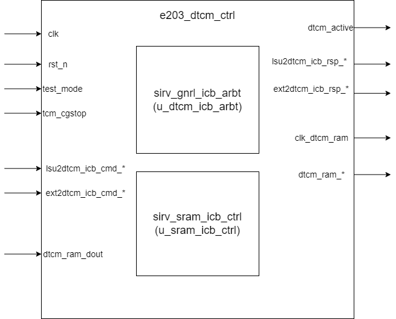

# e203_dtcm_ctrl Design Document

## 1. Introduction
The `e203_dtcm_ctrl` module is the Data Tight-Coupled Memory (DTCM) controller in the E203 processor. It is mainly responsible for managing access control to the DTCM. This module supports LSU (Load Store Unit) access and optional external interface access, and implements arbitration and SRAM control functions.

## 2. Block Diagram

## 3. Interface Definitions

### System Interfaces
| Signal Name    | Direction | Width | Description              |
|----------------|-----------|-------|--------------------------|
| clk            | Input     | 1     | System clock             |
| rst_n          | Input     | 1     | Asynchronous reset, active low |
| test_mode      | Input     | 1     | Test mode signal         |
| tcm_cgstop     | Input     | 1     | Clock gating stop signal |
| dtcm_active    | Output    | 1     | DTCM activity state indicator |

### LSU ICB Bus Interface

| **Signal Name**          | **Direction** | **Width**              | **Description**                                              |
| ------------------------ | ------------- | ---------------------- | ------------------------------------------------------------ |
| `lsu2dtcm_icb_cmd_valid` | Input         | 1                      | Indicates that the LSU has a valid command for the DTCM. This is part of the handshake mechanism. |
| `lsu2dtcm_icb_cmd_ready` | Output        | 1                      | Indicates that the DTCM is ready to accept the command from the LSU. This is part of the handshake mechanism. |
| `lsu2dtcm_icb_cmd_addr`  | Input         | `E203_DTCM_ADDR_WIDTH` | Specifies the starting address of the bus transaction. The address must be naturally aligned. |
| `lsu2dtcm_icb_cmd_read`  | Input         | 1                      | Specifies whether the transaction is a read (`1`) or write (`0`). |
| `lsu2dtcm_icb_cmd_wdata` | Input         | 32                     | Contains the write data when performing a write transaction. |
| `lsu2dtcm_icb_cmd_wmask` | Input         | 4                      | Specifies the write mask for the write transaction. Each bit corresponds to one byte of the data. |
| `lsu2dtcm_icb_rsp_valid` | Output        | 1                      | Indicates that the DTCM has a valid response for the LSU. This is part of the handshake mechanism. |
| `lsu2dtcm_icb_rsp_ready` | Input         | 1                      | Indicates that the LSU is ready to accept the response from the DTCM. This is part of the handshake mechanism. |
| `lsu2dtcm_icb_rsp_err`   | Output        | 1                      | Indicates whether there was an error in the transaction.     |
| `lsu2dtcm_icb_rsp_rdata` | Output        | 32                     | Contains the read data when performing a read transaction. The response data is aligned with AXI definitions. |

### External ICB Bus Interface (Optional)

This part of the interface is valid when the `E203_HAS_DTCM_EXTITF` macro is defined.

| **Signal Name**          | **Direction** | **Width**              | **Description**                                              |
| ------------------------ | ------------- | ---------------------- | ------------------------------------------------------------ |
| `ext2dtcm_icb_cmd_valid` | Input         | 1                      | Indicates that the external agent has a valid command for the DTCM. This is part of the handshake mechanism. |
| `ext2dtcm_icb_cmd_ready` | Output        | 1                      | Indicates that the DTCM is ready to accept the command from the external agent. This is part of the handshake mechanism. |
| `ext2dtcm_icb_cmd_addr`  | Input         | `E203_DTCM_ADDR_WIDTH` | Specifies the starting address of the bus transaction. The address must be naturally aligned. |
| `ext2dtcm_icb_cmd_read`  | Input         | 1                      | Specifies whether the transaction is a read (`1`) or write (`0`). |
| `ext2dtcm_icb_cmd_wdata` | Input         | 32                     | Contains the write data when performing a write transaction. |
| `ext2dtcm_icb_cmd_wmask` | Input         | 4                      | Specifies the write mask for the write transaction. Each bit corresponds to one byte of the data. |
| `ext2dtcm_icb_rsp_valid` | Output        | 1                      | Indicates that the DTCM has a valid response for the external agent. This is part of the handshake mechanism. |
| `ext2dtcm_icb_rsp_ready` | Input         | 1                      | Indicates that the external agent is ready to accept the response from the DTCM. This is part of the handshake mechanism. |
| `ext2dtcm_icb_rsp_err`   | Output        | 1                      | Indicates whether there was an error in the transaction.     |
| `ext2dtcm_icb_rsp_rdata` | Output        | 32                     | Contains the read data when performing a read transaction. The response data is aligned with AXI definitions. |

### DTCM RAM Interface
| Signal Name    | Direction | Width  | Description           |
|----------------|-----------|--------|-----------------------|
| dtcm_ram_cs    | Output    | 1      | RAM chip select signal |
| dtcm_ram_we    | Output    | 1      | RAM write enable signal |
| dtcm_ram_addr  | Output    | E203_DTCM_RAM_AW | RAM address           |
| dtcm_ram_wem   | Output    | E203_DTCM_RAM_MW | RAM write mask        |
| dtcm_ram_din   | Output    | E203_DTCM_RAM_DW | RAM write data        |
| dtcm_ram_dout  | Input     | E203_DTCM_RAM_DW | RAM read data         |
| clk_dtcm_ram   | Output    | 1      | RAM clock signal      |

## 4. Submodule List

### Bus Arbiter (`sirv_gnrl_icb_arbt`)

#### Configuration Parameters Table

If `E203_HAS_DTCM_EXTITF` macro is defined, `DTCM_ARBT_I_NUM = 2`,`DTCM_ARBT_I_PTR_W = 1`, otherwise `DTCM_ARBT_I_NUM = 1`,`DTCM_ARBT_I_PTR_W = 1`.

| Parameter Name        | Value              | Description                   |
|-----------------------|--------------------|-------------------------------|
| ARBT_SCHEME           | 0                  | Priority-based arbitration scheme |
| ALLOW_0CYCL_RSP       | 0                  | Disables 0-cycle response to ensure proper DTCM access timing |
| FIFO_OUTS_NUM         | E203_DTCM_OUTS_NUM | Output FIFO depth configuration |
| FIFO_CUT_READY        | 0                  | Disables FIFO ready cut-off functionality |
| USR_W                 | 1                  | User data width configuration  |
| ARBT_NUM              | DTCM_ARBT_I_NUM    | Number of arbitration input interfaces |
| AW                    | E203_DTCM_ADDR_WIDTH | Address bus width            |
| DW                    | E203_DTCM_DATA_WIDTH | Data bus width              |
| ARBT_PTR_W | DTCM_ARBT_I_PTR_W | Width of the arbitration pointer |

#### Interface Signal Table

| Port Name             | Direction | Width          | Description                   |
| --------------------- | --------- | -------------- | ----------------------------- |
| o_icb_cmd_valid       | Output    | 1              | Command valid to slave        |
| o_icb_cmd_ready       | Input     | 1              | Command ready from slave      |
| o_icb_cmd_read        | Output    | 1              | Read/write indicator (1=read) |
| o_icb_cmd_addr        | Output    | AW             | Command address               |
| o_icb_cmd_wdata       | Output    | DW             | Write data                    |
| o_icb_cmd_wmask       | Output    | DW/8           | Write mask                    |
| o_icb_cmd_burst       | Output    | 2              | Burst type                    |
| o_icb_cmd_beat        | Output    | 2              | Beat type                     |
| o_icb_cmd_lock        | Output    | 1              | Lock signal                   |
| o_icb_cmd_excl        | Output    | 1              | Exclusive access              |
| o_icb_cmd_size        | Output    | 2              | Transfer size                 |
| o_icb_cmd_usr         | Output    | USR_W          | User-defined signal           |
| o_icb_rsp_valid       | Input     | 1              | Response valid from slave     |
| o_icb_rsp_ready       | Output    | 1              | Response ready to slave       |
| o_icb_rsp_err         | Input     | 1              | Response error                |
| o_icb_rsp_excl_ok     | Input     | 1              | Exclusive access ok           |
| o_icb_rsp_rdata       | Input     | DW             | Read data                     |
| o_icb_rsp_usr         | Input     | USR_W          | User-defined response signal  |
| i_bus_icb_cmd_ready   | Output    | ARBT_NUM       | Command ready to masters      |
| i_bus_icb_cmd_valid   | Input     | ARBT_NUM       | Command valid from masters    |
| i_bus_icb_cmd_read    | Input     | ARBT_NUM       | Read/write indicators         |
| i_bus_icb_cmd_addr    | Input     | ARBT_NUM*AW    | Command addresses             |
| i_bus_icb_cmd_wdata   | Input     | ARBT_NUM*DW    | Write data                    |
| i_bus_icb_cmd_wmask   | Input     | ARBT_NUM*DW/8  | Write masks                   |
| i_bus_icb_cmd_burst   | Input     | ARBT_NUM*2     | Burst types                   |
| i_bus_icb_cmd_beat    | Input     | ARBT_NUM*2     | Beat types                    |
| i_bus_icb_cmd_lock    | Input     | ARBT_NUM       | Lock signals                  |
| i_bus_icb_cmd_excl    | Input     | ARBT_NUM       | Exclusive access              |
| i_bus_icb_cmd_size    | Input     | ARBT_NUM*2     | Transfer sizes                |
| i_bus_icb_cmd_usr     | Input     | ARBT_NUM*USR_W | User-defined signals          |
| i_bus_icb_rsp_valid   | Output    | ARBT_NUM       | Response valid to masters     |
| i_bus_icb_rsp_ready   | Input     | ARBT_NUM       | Response ready from masters   |
| i_bus_icb_rsp_err     | Output    | ARBT_NUM       | Response errors               |
| i_bus_icb_rsp_excl_ok | Output    | ARBT_NUM       | Exclusive access ok           |
| i_bus_icb_rsp_rdata   | Output    | ARBT_NUM*DW    | Read data to masters          |
| i_bus_icb_rsp_usr     | Output    | ARBT_NUM*USR_W | User-defined signals          |
| clk                   | Input     | 1              | Clock                         |
| rst_n                 | Input     | 1              | Reset (active low)            |

### SRAM Controller (`sirv_sram_icb_ctrl`)

#### Configuration Parameters Table
| Parameter Name        | Value              | Description                   |
|-----------------------|--------------------|-------------------------------|
| DW                    | E203_DTCM_DATA_WIDTH | DTCM data width              |
| AW                    | E203_DTCM_ADDR_WIDTH | DTCM address width            |
| MW                    | E203_DTCM_WMSK_WIDTH | Write mask width              |
| AW_LSB                | 2                  | 32-bit data alignment setting |
| USR_W                 | 1                  | User data width configuration |

#### Interface Signal Table

| Port Name        | Direction | Width     | Description                                       |
| ---------------- | --------- | --------- | ------------------------------------------------- |
| sram_ctrl_active | Output    | 1         | Active status indicator for clock gating control  |
| tcm_cgstop       | Input     | 1         | Clock gating stop signal from CSR (for debugging) |
| i_icb_cmd_valid  | Input     | 1         | ICB command valid signal                          |
| i_icb_cmd_ready  | Output    | 1         | ICB command ready signal                          |
| i_icb_cmd_read   | Input     | 1         | Read/write indicator (1 = read)                   |
| i_icb_cmd_addr   | Input     | AW        | Command address                                   |
| i_icb_cmd_wdata  | Input     | DW        | Write data                                        |
| i_icb_cmd_wmask  | Input     | MW        | Write mask                                        |
| i_icb_cmd_usr    | Input     | USR_W     | User-defined command signals                      |
| i_icb_rsp_valid  | Output    | 1         | ICB response valid signal                         |
| i_icb_rsp_ready  | Input     | 1         | ICB response ready signal                         |
| i_icb_rsp_rdata  | Output    | DW        | Read data response                                |
| i_icb_rsp_usr    | Output    | USR_W     | User-defined response signals                     |
| ram_cs           | Output    | 1         | RAM chip select                                   |
| ram_we           | Output    | 1         | RAM write enable                                  |
| ram_addr         | Output    | AW-AW_LSB | RAM address                                       |
| ram_wem          | Output    | MW        | RAM write enable mask                             |
| ram_din          | Output    | DW        | RAM data input                                    |
| ram_dout         | Input     | DW        | RAM data output                                   |
| clk_ram          | Output    | 1         | RAM clock signal                                  |
| test_mode        | Input     | 1         | Test mode enable                                  |
| clk              | Input     | 1         | System clock                                      |
| rst_n            | Input     | 1         | Reset signal (active low)                         |

## 5. Detailed Implementation

### 5.1 Priority Arbitration Implementation

1. **Bus Arbitration Signal Organization**

   - Constructing Unified ICB Bus Signals Using Bit Concatenation
     - The signals `arbt_bus_icb_cmd_*` and `arbt_bus_icb_rsp_*` are constructed by concatenating signals from different sources (LSU and external interfaces).
   
   - LSU Access Signals Are Placed in Lower Bits to Ensure Higher Priority During Arbitration
     - This is achieved by the order of signals such as `arbt_bus_icb_cmd_valid`, where LSU signals are in the lower bits (`lsu2dtcm_icb_cmd_*`), and external interface signals are placed in higher bits (`ext2dtcm_icb_cmd_*`).
   
   - External Interface Signals (e.g., Enable) Are Placed in Higher Bits
     - Consistent with the above, external interface signals are placed in the higher bits of the concatenated signal to ensure their lower priority.

   - Command Channel Includes Handshake, Address, Read/Write Control, Data, and Mask Signals
     - For example, `lsu2dtcm_icb_cmd_valid`, `lsu2dtcm_icb_cmd_addr`, etc., are used for the command channel.

   - Response Channel Includes Handshake, Error Flags, and Read Data Signals
     - This includes `arbt_icb_rsp_valid`, `arbt_icb_rsp_err`, and `arbt_icb_rsp_rdata`.

2. **Arbiter Core Configuration**

   - Priority-Based Arbitration, Where High-Priority Requests Can Interrupt Low-Priority Requests
     - The priority-based arbiter `sirv_gnrl_icb_arbt` module is used, configured with `ARBT_SCHEME(0)` to implement priority-based arbitration.

   - Prevents Zero-Cycle Response, Enforcing a Minimum of One Cycle for Each Access
     - The `ALLOW_0CYCL_RSP(0)` configuration disables 0-cycle responses, ensuring that every access takes at least one cycle.

   - Output FIFO Depth Controlled by `E203_DTCM_OUTS_NUM` Parameter to Handle Uncompleted Requests
     - FIFO configuration is set in the `sirv_gnrl_icb_arbt` module using the `FIFO_OUTS_NUM` parameter.

   - Disables FIFO Ready Cut to Maintain Request-Response Continuity
     - In the `sirv_gnrl_icb_arbt` module, `FIFO_CUT_READY(0)` disables the FIFO ready cut function.

   - User Bit Used to Pass Read/Write Type Flags
     - The user bit is passed through `USR_W(1)`, with `arbt_icb_cmd_usr` and `arbt_icb_rsp_usr` signals used to mark requests and responses.

3. **Handshake Mechanism Design**

   - The Command Channel Uses Valid to Indicate a New Request, Ready to Indicate Target Readiness
     - `lsu2dtcm_icb_cmd_valid` and `lsu2dtcm_icb_cmd_ready` are handshake signals for the command channel.

   - The Response Channel Uses Valid to Indicate Data Readiness, Ready to Indicate Source Readiness
     - `lsu2dtcm_icb_rsp_valid` and `lsu2dtcm_icb_rsp_ready` are handshake signals for the response channel.

   - Each Request Must Wait for Its Corresponding Response Before New Requests Are Initiated
     - Signals such as `arbt_icb_cmd_ready` and `arbt_icb_rsp_ready` ensure that requests and responses are matched.

   - Supports Backpressure Mechanism: The Source Holds Request Status When the Target Cannot Receive
     - The backpressure mechanism is implemented through signals like `arbt_bus_icb_cmd_ready` and `arbt_bus_icb_rsp_ready`.

### 5.2 SRAM Controller Implementation

1. **Address Decoding and Control Logic**

   - ICB Bus Address Mapped to DTCM Physical Address Space, Removing High Bits
     - Address transmission is handled via signals like `arbt_icb_cmd_addr`, and the address space is controlled by the bit width parameter.

   - Lower 2 Bits Used for Byte Selection, Supporting Unaligned Access
     - The address width is controlled by `E203_DTCM_ADDR_WIDTH`, with the lower 2 bits used for byte selection.

   - Generate Chip Select and Write Enable Signals Based on Read/Write Type and Byte Selection
     - The write enable signal `dtcm_ram_wem` and chip select signal `dtcm_ram_cs` are generated based on the transmitted address and read/write control.

   - RAM Control Signals Meet Setup and Hold Time Requirements
     - `dtcm_ram_*` signals control the operation timing of DTCM RAM.

2. **Data Path Management**

   - Write Operation: Parse Write Mask to Generate Byte-Level Write Enable Signals
     - The write mask `lsu2dtcm_icb_cmd_wmask` is used to generate byte-level write enable signals, controlling `dtcm_ram_wem`.

   - Read Operation: Extract Required Data Based on Byte Selection
     - Read data is extracted via `dtcm_ram_dout` and returned to the response channel.

   - Unaligned Access Automatically Reassembles Data, Transparent to Software
     - Unaligned access is automatically handled through signals like `sram_icb_cmd_addr` and `sram_icb_cmd_wmask`.

   - Write Request Data and Mask Directly Passed to RAM Interface
     - Write data `lsu2dtcm_icb_cmd_wdata` and mask `lsu2dtcm_icb_cmd_wmask` are passed directly to the SRAM control interface.

3. **Clock Management Mechanism**

   - Generate `dtcm_active` Signal Based on Valid Access Requests
     - The `dtcm_active` signal indicates whether there are valid access requests.

   - The `tcm_cgstop` Signal Disables Clock Gating During Debug
     - The `tcm_cgstop` signal controls the DTCM clock gating via `sirv_sram_icb_ctrl` during debugging.

   - RAM Clock Can Be Shut Off When No Access to Save Power
     - The `clk_dtcm_ram` signal controls the DTCM RAM clock, turning it off when there is no access to save power.

   - RAM Clock Automatically Turns On When a New Request Arrives
     - The `dtcm_active` signal automatically drives the clock when a new access request occurs.

### 5.3 Error Handling Mechanism

1. **ECC Support**

   - Generate Data Parity During Write Operations
     - If ECC is enabled, hardware checks and corrects single-bit errors during write operations.

   - Detect Errors During Read Operations and Correct Single-Bit Errors
     - If ECC is disabled (controlled by the `E203_HAS_ECC` macro), ECC handling is not implemented in this module.

   - Multi-Bit Errors are Reported Through the Response Channel
     - The error flag is returned through `lsu2dtcm_icb_rsp_err` if a multi-bit error is detected.

   - Error Correction Is Transparent to Software, No Special Handling Required
     - Error correction is handled by hardware and is transparent to software.

2. **Status Monitoring System**

   - Monitor Internal Channel States, Including Request and Response Queues
     - Signals like `arbt_icb_cmd_*` and `arbt_icb_rsp_*` monitor the request and response statuses.

   - Track Each Request’s Processing Stage to Ensure Request-Response Pairing
     - Handshake signals ensure request-response pairing.

   - Record Error Events and Their Locations for Diagnostics
     - Error events are returned via `lsu2dtcm_icb_rsp_err` and `arbt_icb_rsp_err`.

   - Configurable Error Handling Strategies, Supporting Error Reporting and Automatic Recover
     - Error handling can be enabled through configuration parameters.

### 5.4 External Interface Support

1. **Interface Configuration Management**

   - Control external interface enable through the `E203_HAS_DTCM_EXTITF` macro
     - The external interface is controlled by the macro `E203_HAS_DTCM_EXTITF`, which determines whether the external interface feature is enabled. This macro decides if there will be an external access path to the DTCM. By concatenating signals, the system supports command requests from both the external interface and LSU, and the arbitration process.
     - When the `E203_HAS_DTCM_EXTITF` macro is defined, external interface signals (such as `ext2dtcm_icb_cmd_*`) are included in the arbitration process. If the macro is not defined, the external interface signals are not used.

2. **External Interface Command and Response Channels**
  
   - External interface command and response signals are concatenated onto the bus for arbitration
     - The external interface's command signals are concatenated with LSU's command signals for transmission.
     - Similarly, the external interface's response signals are concatenated with LSU's response signals, forming a unified response return path.
   
   - Supports scalability for multiple external interfaces
     - The module supports multiple external interfaces through proper signal width extension (such as `DTCM_ARBT_I_NUM` and `DTCM_ARBT_I_PTR_W`). In the case of multiple external interfaces, the module ensures proper request arbitration and ensures that high-priority LSU requests are not interrupted by low-priority external interface requests.

3. **External Interface Timing Control**
  
   - The timing for external access is managed by the arbiter to ensure valid access
     - External interface requests are processed by the arbiter module (`sirv_gnrl_icb_arbt`), which schedules the access based on predefined priorities. The access requests from both external interfaces and LSU share a common bus, and the arbiter dynamically schedules them to avoid conflicts, ensuring that the external interfaces and internal requests do not interfere with each other.

### 5.5 Power Management and Clock Control

1. **Clock Gating and Power Optimization**
  
   - Control clock gating through the `tcm_cgstop` signal
     - The `tcm_cgstop` signal is used to disable the clock gating of the DTCM SRAM during debugging. In normal operation, clock gating is used to reduce the power consumption of the DTCM. During debugging, clock gating is manually disabled using the `tcm_cgstop` signal to ensure that access is not affected by clock gating.

2. **Clock Control Logic and Dynamic Clock Enable/Disable**
  
   - Dynamically enable/disable clocks based on access requests
     - The `dtcm_active` signal dynamically controls the DTCM SRAM clock. The clock is only enabled when there is an active access request, helping to save power when there is no access. The clock is controlled via the `clk_dtcm_ram` signal, ensuring that it is only driven when there is an actual access.

   - RAM clock control
     - The DTCM RAM clock is controlled by the `clk_dtcm_ram` signal. The clock is enabled when there is an access request and is disabled when there is no access, reducing power consumption during idle periods.

3. **Low Power Mode Support**
  
   - Clock gating and low-power operational mode
     - When there are no active requests, the DTCM will shut off its clock to save power. In test mode, the clock's enable/disable operation can be further controlled using the `test_mode` signal. The system's clock management strategy ensures that the DTCM remains operational only when necessary, thus effectively saving power.

4. **Power Optimization and System Scheduling**
  
   - Adjust power mode based on system needs
     - Based on system access request control signals (such as `lsu2dtcm_icb_cmd_valid` and `ext2dtcm_icb_cmd_valid`) and clock control signals (such as `dtcm_active` and `clk_dtcm_ram`), the module can adjust its power mode according to the actual load. The system dynamically adjusts power consumption based on the request type and timing, ensuring that power is optimized while maintaining performance.

   - Support for advanced power management strategies
     - The dynamic clock enable/disable mechanism supports more advanced power management strategies. Based on actual hardware access and control requirements, the DTCM RAM's clock management can be further optimized, particularly for high-performance, low-power designs.

## 6. Corner Case Handling

### Potential Issues
1. Concurrent requests from multiple access sources.
2. Access address out-of-bounds.
3. Clock gating timing during transitions.
4. Access requests during the reset process.

### Special Handling
1. **Priority Arbitration**: Ensure access order through priority arbitration.
2. **Address Check and Alignment**: Implement address checks and ensure proper alignment.
3. **Clock Gating Safety**: Ensure safe switching of clock gating.
4. **Access Request Masking During Reset**: Mask access requests during the reset process.

## 7. Constraints

1. **Bus Protocol Constraints**
   - Only single transfers are supported, burst transfers are not supported.
   - Data must be naturally aligned.
   - Responses do not support zero-cycle delays.

2. **Timing Constraints**
   - RAM access signals must meet setup and hold times.
   - Clock gating transitions require appropriate delay protection.

3. **Configuration Constraints**
   - External interface functionality is controlled by macros.
   - RAM parameters must be correctly configured.

4. **Functional Constraints**
   - LSU access has a higher priority than external access.
   - Burst transfer mode is not supported.
   - ECC functionality is optional and mutually exclusive.