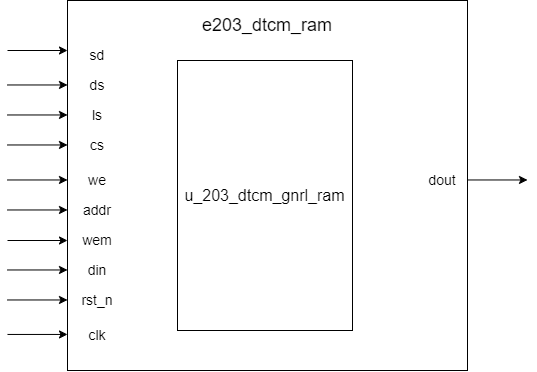

# e203_dtcm_ram Design Document

## 1. Introduction
The e203_dtcm_ram module is a Data Tightly Coupled Memory (DTCM) RAM module for the E203 processor. The module is encapsulated based on a generic RAM module, primarily used for data storage and access. The module is controlled by the macro definition `E203_HAS_DTCM`.

## 2. Module Block Diagram

## 3. Interface Definition

| Signal Name | Direction | Width | Description |
|------------|-----------|-------|-------------|
| sd | Input | 1 | Power domain shutdown enable signal for power management |
| ds | Input | 1 | Deep sleep mode enable, controlling complete power area shutdown |
| ls | Input | 1 | Light sleep mode enable, reducing power without full shutdown |
| cs | Input | 1 | Chip select signal, controlling RAM selection |
| we | Input | 1 | Write enable signal, controlling write operation |
| addr | Input | E203_DTCM_RAM_AW | Address input, specifying read/write location |
| wem | Input | E203_DTCM_RAM_MW | Write mask, controlling specific byte writing |
| din | Input | E203_DTCM_RAM_DW | Data input to be written |
| rst_n | Input | 1 | Asynchronous reset signal (active low) |
| clk | Input | 1 | System clock |
| dout | Output | E203_DTCM_RAM_DW | Data output, read data |

## 4. Submodule List

###  u_203_dtcm_gnrl_ram(sirv_gnrl_ram)

**Function**

The `sirv_gnrl_ram` module is a general-purpose RAM wrapper that serves as the top-level RAM module in the system. It provides a configurable memory implementation that can adapt to different target environments (FPGA, ASIC, or simulation) by conditionally instantiating the appropriate underlying RAM model.

**Parameter**

| Parameter Name | Value            | Description                          |
| -------------- | ---------------- | ------------------------------------ |
| DP             | E203_DTCM_RAM_DP | Depth of the RAM (number of entries) |
| DW             | E203_DTCM_RAM_DW | Data width (in bits)                 |
| FORCE_X2ZERO   | 1                | Forces uninitialized memory to zero  |
| MW             | E203_DTCM_RAM_MW | Write mask width (in bits)           |
| AW             | E203_DTCM_RAM_AW | Address width (in bits)              |

**Interface**

| Port Name | Direction | Width | Description                     |
| --------- | --------- | ----- | ------------------------------- |
| sd        | Input     | 1     | Power shutdown control signal   |
| ds        | Input     | 1     | Deep sleep mode enable signal   |
| ls        | Input     | 1     | Light sleep mode enable signal  |
| rst_n     | Input     | 1     | Active-low reset signal         |
| clk       | Input     | 1     | Clock signal                    |
| cs        | Input     | 1     | Chip select (enable) signal     |
| we        | Input     | 1     | Write enable signal             |
| addr      | Input     | AW    | Memory address                  |
| din       | Input     | DW    | Data input (write data)         |
| wem       | Input     | MW    | Write enable mask (byte-enable) |
| dout      | Output    | DW    | Data output (read data)         |

## 5. Implementation Details
1. Module implements data storage and access through underlying generic RAM module
2. Supports flexible read/write control with byte-level writing precision
3. Provides low-power management interface supporting power domain control (sd,ds,ls). Currently, these signals are not actually used in the implementation due to:
   1. Reserved low-power interface
   2. Possible future extensions
   3. Maintain consistency with other module interfaces
4. Flexibly adapts to different RAM depths and widths based on configuration parameters
5. The interfaces of this module are connected to the corresponding interfaces of the submodules

## 6. Constraints
1. `cs` and `we` signals should not be high simultaneously (prevent accidental writing)
2. Address `addr` must be within defined RAM depth range
3. Write mask `wem` must match data width
4. Clock (`clk`) must be stable without glitches
5. Reset signal (`rst_n`) must satisfy setup and hold time requirements
6. Low-power control signals (sd, ds, ls) must comply with power management specifications