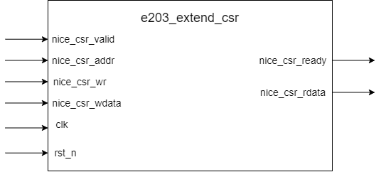

# e203_extend_csr Design Document

## 1. Introduction
The e203_extend_csr module is a simple stub module that currently only provides basic interface definitions without actual functional implementation. The module is controlled by the macro definition `E203_HAS_CSR_NICE` to enable or disable its functionality.

## 2. Module Block Diagram

## 3. Interface
### 3.1 Signal Definitions

| Signal Name | Direction | Width | Description |
|------------|-----------|-------|-------------|
| clk | Input | 1 | System clock |
| rst_n | Input | 1 | Asynchronous reset signal (active low) |
| nice_csr_valid | Input | 1 | CSR access request valid signal |
| nice_csr_ready | Output | 1 | CSR access ready signal, always 1 |
| nice_csr_addr | Input | 32 | CSR address (currently unused) |
| nice_csr_wr | Input | 1 | CSR write enable signal (currently unused) |
| nice_csr_wdata | Input | 32 | CSR write data (currently unused) |
| nice_csr_rdata | Output | 32 | CSR read data, always 0 |

## 4. Current Implementation
The module currently implements only the most basic interface definitions:
* `nice_csr_ready` is fixed to 1, indicating the module is always in a ready state
* `nice_csr_rdata` is fixed to 0, with all read operations returning a zero value
* Other input signals (`nice_csr_addr`, `nice_csr_wr`, `nice_csr_wdata`) are currently unused

## 5. Potential Extension Directions
This module reserves an interface for custom CSR implementation. In the future, it can be used to implement:
1. Actual CSR register read and write functionality
2. Custom control registers
3. Status monitoring features