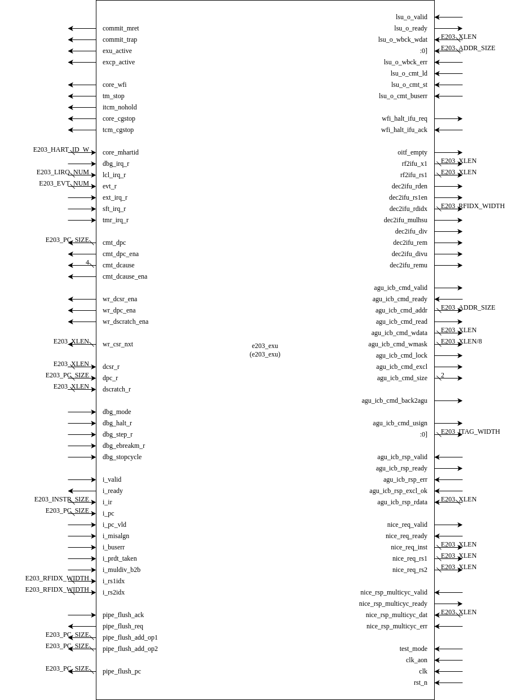

# e203_exu Design Specification

## 1 Introduction

The `e203_exu` module represents the execution unit (EXU) of a processor core, responsible for executing instructions received from the instruction fetch unit (IFU) and handling exceptions, pipeline flushes, and write-back operations. This module integrates submodules for decoding, dispatching, ALU operations, commit handling, and more, ensuring proper execution of instructions and system state management.

## 2 Module Diagram

## 3 Interface

### 3.1 Basic Interface

| Direction | Port Name        | Width            | Description                                                  |
| --------- | ---------------- | ---------------- | ------------------------------------------------------------ |
| output    | commit_mret      | 1                | Indicates that an MRET instruction has been committed.       |
| output    | commit_trap      | 1                | Indicates that a trap (e.g., exception) has been committed.  |
| output    | exu_active       | 1                | Indicates whether the execution unit is currently active.    |
| output    | excp_active      | 1                | Indicates whether an exception is currently active.          |
| output    | core_wfi         | 1                | Indicates that the core is in a waiting-for-interrupt (WFI) state. |
| output    | tm_stop          | 1                | Indicates that the timer should stop.                        |
| output    | itcm_nohold      | 1                | Indicates no hold on the instruction TCM.                    |
| output    | core_cgstop      | 1                | Core clock gating stop signal.                               |
| output    | tcm_cgstop       | 1                | TCM clock gating stop signal.                                |
| input     | core_mhartid     | E203_HART_ID_W   | Hardware thread ID of the core.                              |
| input     | dbg_irq_r        | 1                | Debug interrupt request signal.                              |
| input     | lcl_irq_r        | E203_LIRQ_NUM    | Local interrupt request signals.                             |
| input     | evt_r            | E203_EVT_NUM     | Event request signals.                                       |
| input     | ext_irq_r        | 1                | External interrupt request signal.                           |
| input     | sft_irq_r        | 1                | Software interrupt request signal.                           |
| input     | tmr_irq_r        | 1                | Timer interrupt request signal.                              |
| output    | wfi_halt_ifu_req | 1                | Request signal for IFU halt during WFI.                      |
| input     | wfi_halt_ifu_ack | 1                | Acknowledge signal for IFU halt during WFI.                  |
| output    | oitf_empty       | 1                | Indicates whether the OITF is empty.                         |
| output    | rf2ifu_x1        | E203_XLEN        | Value of register x1 for IFU.                                |
| output    | rf2ifu_rs1       | E203_XLEN        | Value of source register rs1 for IFU.                        |
| output    | dec2ifu_rden     | 1                | Indicates whether the current instruction writes to a register. |
| output    | dec2ifu_rs1en    | 1                | Indicates whether the current instruction reads from rs1.    |
| output    | dec2ifu_rdidx    | E203_RFIDX_WIDTH | Destination register index for the current instruction.      |
| output    | dec2ifu_mulhsu   | 1                | Indicates whether the current instruction is a signed/unsigned multiplier. |
| output    | dec2ifu_div      | 1                | Indicates whether the current instruction is a division operation. |
| output    | dec2ifu_rem      | 1                | Indicates whether the current instruction is a remainder operation. |
| output    | dec2ifu_divu     | 1                | Indicates whether the current instruction is an unsigned division. |
| output    | dec2ifu_remu     | 1                | Indicates whether the current instruction is an unsigned remainder. |
| input     | test_mode        | 1                | Indicates that the core is in test mode.                     |
| input     | clk_aon          | 1                | Always-on clock signal.                                      |
| input     | clk              | 1                | Main clock signal.                                           |
| input     | rst_n            | 1                | Active-low reset signal.                                     |

### 3.2 From/To debug ctrl module

| Direction | Name            | Width        | Description                                                  |
| --------- | --------------- | ------------ | ------------------------------------------------------------ |
| output    | cmt_dpc         | E203_PC_SIZE | Debug Program Counter (DPC) value.                           |
| output    | cmt_dpc_ena     | 1            | Indicates that the DPC value is enabled.                     |
| output    | cmt_dcause      | 3            | Debug cause code for the committed instruction.              |
| output    | cmt_dcause_ena  | 1            | Indicates that the debug cause code is enabled.              |
| output    | wr_dcsr_ena     | 1            | Write enable signal for the Debug Control and Status Register (DCSR). |
| output    | wr_dpc_ena      | 1            | Write enable signal for the Debug Program Counter (DPC).     |
| output    | wr_dscratch_ena | 1            | Write enable signal for the Debug Scratch Register.          |
| output    | wr_csr_nxt      | E203_XLEN    | Data to write to the next CSR.                               |
| input     | dcsr_r          | E203_XLEN    | Debug Control and Status Register value.                     |
| input     | dpc_r           | E203_PC_SIZE | Debug Program Counter value.                                 |
| input     | dscratch_r      | E203_XLEN    | Debug Scratch Register value.                                |
| input     | dbg_mode        | 1            | Indicates that the core is in debug mode.                    |
| input     | dbg_halt_r      | 1            | Debug halt request signal.                                   |
| input     | dbg_step_r      | 1            | Debug step request signal.                                   |
| input     | dbg_ebreakm_r   | 1            | Debug ebreak request signal.                                 |
| input     | dbg_stopcycle   | 1            | Debug stop cycle signal.                                     |

### 3.3 IFU IR stage to EXU interface

| Direction | Name         | Width            | Description                                              |
| --------- | ------------ | ---------------- | -------------------------------------------------------- |
| input     | i_valid      | 1                | Valid signal for instructions entering the EXU.          |
| output    | i_ready      | 1                | Ready signal for instructions entering the EXU.          |
| input     | i_ir         | E203_INSTR_SIZE  | Instruction register containing the current instruction. |
| input     | i_pc         | E203_PC_SIZE     | Program Counter (PC) value for the current instruction.  |
| input     | i_pc_vld     | 1                | Valid signal for the PC value.                           |
| input     | i_misalgn    | 1                | Indicates a fetch misalignment exception.                |
| input     | i_buserr     | 1                | Indicates a fetch bus error exception.                   |
| input     | i_prdt_taken | 1                | Predicted branch taken signal.                           |
| input     | i_muldiv_b2b | 1                | Back-to-back multiplier/divider instruction signal.      |
| input     | i_rs1idx     | E203_RFIDX_WIDTH | Source register 1 index.                                 |
| input     | i_rs2idx     | E203_RFIDX_WIDTH | Source register 2 index.                                 |

### 3.4 Flush interface to IFU

| Direction | Name               | Width        | Description                            |
| --------- | ------------------ | ------------ | -------------------------------------- |
| input     | pipe_flush_ack     | 1            | Acknowledge signal for pipeline flush. |
| output    | pipe_flush_req     | 1            | Request signal for pipeline flush.     |
| output    | pipe_flush_add_op1 | E203_PC_SIZE | Operand 1 for flush PC calculation.    |
| output    | pipe_flush_add_op2 | E203_PC_SIZE | Operand 2 for flush PC calculation.    |

if `E203_TIMING_BOOST` is defined, `pipe_flush_pc` signal is available

| Direction | Name          | Width        | Description     |
| --------- | ------------- | ------------ | --------------- |
| output    | pipe_flush_pc | E203_PC_SIZE | Flush PC value. |

### 3.5 LSU Write-Back Interface

| Direction | Name              | Width           | Description                                 |
| --------- | ----------------- | --------------- | ------------------------------------------- |
| input     | lsu_o_valid       | 1               | Valid signal for LSU write-back.            |
| output    | lsu_o_ready       | 1               | Ready signal for LSU write-back.            |
| input     | lsu_o_wbck_wdat   | E203_XLEN       | Write-back data from the LSU.               |
| input     | lsu_o_wbck_itag   | E203_ITAG_WIDTH | Instruction tag for LSU write-back.         |
| input     | lsu_o_wbck_err    | 1               | Error signal for LSU write-back.            |
| input     | lsu_o_cmt_ld      | 1               | Load operation commit signal from the LSU.  |
| input     | lsu_o_cmt_st      | 1               | Store operation commit signal from the LSU. |
| input     | lsu_o_cmt_badaddr | E203_ADDR_SIZE  | Bad address for LSU exceptions.             |
| input     | lsu_o_cmt_buserr  | 1               | Bus error signal from the LSU.              |

### 3.6 AGU ICB Interface to LSU-ctrl

| Direction | Name                 | Width           | Description                                       |
| --------- | -------------------- | --------------- | ------------------------------------------------- |
| output    | agu_icb_cmd_valid    | 1               | Valid signal for AGU command.                     |
| input     | agu_icb_cmd_ready    | 1               | Ready signal for AGU command.                     |
| output    | agu_icb_cmd_addr     | E203_ADDR_SIZE  | Address for AGU command.                          |
| output    | agu_icb_cmd_read     | 1               | Read/write signal for AGU command.                |
| output    | agu_icb_cmd_wdata    | E203_XLEN       | Write data for AGU command.                       |
| output    | agu_icb_cmd_wmask    | E203_XLEN/8     | Write mask for AGU command.                       |
| output    | agu_icb_cmd_lock     | 1               | Lock signal for AGU command.                      |
| output    | agu_icb_cmd_excl     | 1               | Exclusive access signal for AGU command.          |
| output    | agu_icb_cmd_size     | 1:0             | Size of AGU command access.                       |
| output    | agu_icb_cmd_back2agu | 1               | Back-to-AGU response signal.                      |
| output    | agu_icb_cmd_usign    | 1               | Unsigned access signal for AGU command.           |
| output    | agu_icb_cmd_itag     | E203_ITAG_WIDTH | Instruction tag for AGU command.                  |
| input     | agu_icb_rsp_valid    | 1               | Valid signal for AGU response.                    |
| output    | agu_icb_rsp_ready    | 1               | Ready signal for AGU response.                    |
| input     | agu_icb_rsp_err      | 1               | Error signal for AGU response.                    |
| input     | agu_icb_rsp_excl_ok  | 1               | Exclusive access success signal for AGU response. |
| input     | agu_icb_rsp_rdata    | E203_XLEN       | Read data for AGU response.                       |

### 3.7 CSR_NICE Interface(optional)

if `E203_HAS_CSR_NICE` macro is defined, this part of interfaces is available.

| Direction | Name           | Width | Description                       |
| --------- | -------------- | ----- | --------------------------------- |
| output    | nice_csr_valid | 1     | Valid signal for NICE CSR access. |
| input     | nice_csr_ready | 1     | Ready signal for NICE CSR access. |
| output    | nice_csr_addr  | 32    | Address for NICE CSR access.      |
| output    | nice_csr_wr    | 1     | Write enable for NICE CSR access. |
| output    | nice_csr_wdata | 32    | Write data for NICE CSR access.   |
| input     | nice_csr_rdata | 32    | Read data for NICE CSR access.    |

### 3.8 NICE Interface(optional)

if `E203_HAS_NICE` macro is defined, this part of interfaces is available.

| Direction | Name                    | Width     | Description                                 |
| --------- | ----------------------- | --------- | ------------------------------------------- |
| output    | nice_req_valid          | 1         | Valid signal for NICE instruction request.  |
| input     | nice_req_ready          | 1         | Ready signal for NICE instruction request.  |
| output    | nice_req_inst           | E203_XLEN | Instruction for NICE request.               |
| output    | nice_req_rs1            | E203_XLEN | Source register 1 for NICE request.         |
| output    | nice_req_rs2            | E203_XLEN | Source register 2 for NICE request.         |
| input     | nice_rsp_multicyc_valid | 1         | Valid signal for NICE multi-cycle response. |
| output    | nice_rsp_multicyc_ready | 1         | Ready signal for NICE multi-cycle response. |
| input     | nice_rsp_multicyc_dat   | E203_XLEN | Data for NICE multi-cycle response.         |
| input     | nice_rsp_multicyc_err   | 1         | Error signal for NICE multi-cycle response. |

## 4 Submodule List

### 4.1 e203_exu_regfile: Manages the core's register file

#### Function

The module supports two read ports and one write port. It contains both sequential and combinational logic circuits and does not respond to reset operations.

#### Interface

| Direction | Port Name     | Width            | Description                           |
| --------- | ------------- | ---------------- | ------------------------------------- |
| input     | read_src1_idx | E203_RFIDX_WIDTH | Register index for source operand 1   |
| input     | read_src2_idx | E203_RFIDX_WIDTH | Register index for source operand 2   |
| output    | read_src1_dat | E203_XLEN        | Read result for source operand 1      |
| output    | read_src2_dat | E203_XLEN        | Read result for source operand 2      |
| input     | wbck_dest_wen | 1                | Register write enable                 |
| input     | wbck_dest_idx | E203_RFIDX_WIDTH | Register index to write               |
| input     | wbck_dest_dat | E203_XLEN        | Data to write to the register         |
| output    | x1_r          | E203_XLEN        | Output for general-purpose register 1 |
| input     | test_mode     | 1                | Whether in test mode                  |
| input     | clk           | 1                | Clock signal                          |
| input     | rst_n         | 1                | Reset signal                          |

### 4.2 e203_exu_decode: Decodes incoming instructions

#### Function

This module is used to decode 32-bit and 16-bit instructions according to the RISC-V instruction encoding rules. It generates instruction type information, read and write operand register indices, and other related signals.

#### Interface

**Basic Interface**

| Direction | Port Name       | Width              | Description                                                  |
| --------- | --------------- | ------------------ | ------------------------------------------------------------ |
| input     | i_instr         | E203_INSTR_SIZE    | 32-bit instruction                                           |
| input     | i_pc            | E203_PC_SIZE       | The current instruction's corresponding PC value             |
| input     | i_prdt_taken    | 1                  | Prediction of whether the branch is taken                    |
| input     | i_misalgn       | 1                  | Indicates that the current instruction has an alignment exception |
| input     | i_buserr        | 1                  | Indicates that the current instruction caused a bus access error |
| input     | i_muldiv_b2b    | 1                  | The back-to-back case for multiply/divide instructions       |
| input     | dbg_mode        | 1                  | Debug mode                                                   |
| output    | dec_rs1x0       | 1                  | Indicates that the source operand 1 register index is x0     |
| output    | dec_rs2x0       | 1                  | Indicates that the source operand 2 register index is x0     |
| output    | dec_rs1en       | 1                  | Indicates that the instruction needs to read source operand 1 |
| output    | dec_rs2en       | 1                  | Indicates that the instruction needs to read source operand 2 |
| output    | dec_rdwen       | 1                  | Indicates that the instruction needs to write the result     |
| output    | dec_rs1idx      | E203_RFIDX_WIDTH   | The index of the source register 1                           |
| output    | dec_rs2idx      | E203_RFIDX_WIDTH   | The index of the source register 2                           |
| output    | dec_rdidx       | E203_RFIDX_WIDTH   | The index of the destination register                        |
| output    | dec_info        | E203_DECINFO_WIDTH | Other information about the instruction, grouped into a wide signal called the information bus |
| output    | dec_imm         | E203_XLEN          | The immediate value used by the instruction                  |
| output    | dec_pc          | E203_PC_SIZE       | The PC value of the current instruction                      |
| output    | dec_misalgn     | 1                  | Indicates that the instruction caused an alignment exception |
| output    | dec_buserr      | 1                  | Indicates that the instruction caused a bus error            |
| output    | dec_ilegl       | 1                  | Indicates that the decoded instruction is illegal            |
| output    | dec_mulhsu      | 1                  | Indicates that the instruction is `mulhsu`                   |
| output    | dec_mul         | 1                  | Indicates that the instruction is `mul`                      |
| output    | dec_div         | 1                  | Indicates that the instruction is `div`                      |
| output    | dec_rem         | 1                  | Indicates that the instruction is `rem`                      |
| output    | dec_divu        | 1                  | Indicates that the instruction is `divu`                     |
| output    | dec_remu        | 1                  | Indicates that the instruction is `remu`                     |
| output    | dec_rv32        | 1                  | Indicates whether the instruction is 32-bit or 16-bit        |
| output    | dec_bjp         | 1                  | Indicates that the instruction is `jal`, `jalr`, or branch instructions like `beqz` or `bnez` |
| output    | dec_jal         | 1                  | Indicates that the instruction is `jal`                      |
| output    | dec_jalr        | 1                  | Indicates that the instruction is `jalr` or `jr`             |
| output    | dec_bxx         | 1                  | Indicates that the instruction is a branch instruction       |
| output    | dec_jalr_rs1idx | E203_RFIDX_WIDTH   | The register index used for `jalr` jump instructions         |
| output    | dec_bjp_imm     | E203_XLEN          | The immediate value used by branch and jump instructions     |

**Optional Interface**

If `E203_HAS_NICE` is defined, the following interfaces are available:

| Direction | Name                | Width | Description                                                  |
| --------- | ------------------- | ----- | ------------------------------------------------------------ |
| input     | nice_xs_off         | 1     | Indicates that the NICE extension is disabled                |
| output    | dec_nice            | 1     | Indicates that the instruction is a NICE extension instruction |
| output    | nice_cmt_off_ilgl_o | 1     | Indicates that the NICE instruction is illegal if the NICE extension is disabled |

### 4.3 e203_exu_disp: Dispatches instructions for execution

#### Function

This module is responsible for dispatching instructions to different functional units, including the ALU and OITF. It handles operand forwarding, checks for dependencies (such as RAW and WAW), manages WFI (Wait-for-Interrupt) requests, and ensures that instructions are dispatched correctly based on the type of operation and the availability of functional units.

#### Interface

| Direction | Port Name            | Width              | Description                                                  |
| --------- | -------------------- | ------------------ | ------------------------------------------------------------ |
| input     | wfi_halt_exu_req     | 1                  | Request to halt the EXU (execution unit) during WFI operation |
| output    | wfi_halt_exu_ack     | 1                  | Acknowledgement of halt request for the EXU from WFI         |
| input     | oitf_empty           | 1                  | Indicates whether the OITF (Out-of-Order Instruction FIFO) is empty |
| input     | amo_wait             | 1                  | Indicates that an AMO (Atomic Memory Operation) instruction is pending |
| input     | disp_i_valid         | 1                  | Valid signal for an instruction to be dispatched             |
| output    | disp_i_ready         | 1                  | Ready signal indicating that the dispatch unit is ready to accept new instructions |
| input     | disp_i_rs1x0         | 1                  | Indicates if operand 1 is used or not (read-enable)          |
| input     | disp_i_rs2x0         | 1                  | Indicates if operand 2 is used or not (read-enable)          |
| input     | disp_i_rs1en         | 1                  | Read-enable signal for operand 1                             |
| input     | disp_i_rs2en         | 1                  | Read-enable signal for operand 2                             |
| input     | disp_i_rs1idx        | E203_RFIDX_WIDTH   | Register index for operand 1                                 |
| input     | disp_i_rs2idx        | E203_RFIDX_WIDTH   | Register index for operand 2                                 |
| input     | disp_i_rs1           | E203_XLEN          | Operand 1 data                                               |
| input     | disp_i_rs2           | E203_XLEN          | Operand 2 data                                               |
| input     | disp_i_rdwen         | 1                  | Write-enable signal for the destination register             |
| input     | disp_i_rdidx         | E203_RFIDX_WIDTH   | Destination register index                                   |
| input     | disp_i_info          | E203_DECINFO_WIDTH | Instruction decoding information                             |
| input     | disp_i_imm           | E203_XLEN          | Immediate value of the instruction                           |
| input     | disp_i_pc            | E203_PC_SIZE       | Program counter of the instruction                           |
| input     | disp_i_misalgn       | 1                  | Indicates if there was a misaligned address during instruction fetch |
| input     | disp_i_buserr        | 1                  | Indicates if there was a bus error during instruction fetch  |
| input     | disp_i_ilegl         | 1                  | Indicates if there was an illegal instruction error          |
| output    | disp_o_alu_valid     | 1                  | Indicates that the ALU is ready to accept a new instruction for execution |
| input     | disp_o_alu_ready     | 1                  | Ready signal for ALU to accept a new instruction             |
| input     | disp_o_alu_longpipe  | 1                  | Indicates if the ALU is executing a long-pipeline instruction |
| output    | disp_o_alu_rs1       | E203_XLEN          | Operand 1 data forwarded to the ALU                          |
| output    | disp_o_alu_rs2       | E203_XLEN          | Operand 2 data forwarded to the ALU                          |
| output    | disp_o_alu_rdwen     | 1                  | Write-enable signal for ALU destination register             |
| output    | disp_o_alu_rdidx     | E203_RFIDX_WIDTH   | Register index for ALU destination                           |
| output    | disp_o_alu_info      | E203_DECINFO_WIDTH | Instruction decoding information forwarded to ALU            |
| output    | disp_o_alu_imm       | E203_XLEN          | Immediate value forwarded to the ALU                         |
| output    | disp_o_alu_pc        | E203_PC_SIZE       | Program counter forwarded to the ALU                         |
| output    | disp_o_alu_itag      | E203_ITAG_WIDTH    | Instruction tag forwarded to the ALU for tracking            |
| output    | disp_o_alu_misalgn   | 1                  | Misalignment flag forwarded to ALU                           |
| output    | disp_o_alu_buserr    | 1                  | Bus error flag forwarded to ALU                              |
| output    | disp_o_alu_ilegl     | 1                  | Illegal instruction flag forwarded to ALU                    |
| input     | oitfrd_match_disprs1 | 1                  | Signal indicating a match for operand 1 in the OITF          |
| input     | oitfrd_match_disprs2 | 1                  | Signal indicating a match for operand 2 in the OITF          |
| input     | oitfrd_match_disprs3 | 1                  | Signal indicating a match for operand 3 in the OITF          |
| input     | oitfrd_match_disprd  | 1                  | Signal indicating a match for destination register in OITF   |
| input     | disp_oitf_ptr        | E203_ITAG_WIDTH    | Pointer to the OITF entry for this instruction               |
| output    | disp_oitf_ena        | 1                  | Enables the entry of the instruction into the OITF           |
| input     | disp_oitf_ready      | 1                  | Ready signal for the OITF to accept new entries              |
| output    | disp_oitf_rs1fpu     | 1                  | Indicates if operand 1 is from the FPU                       |
| output    | disp_oitf_rs2fpu     | 1                  | Indicates if operand 2 is from the FPU                       |
| output    | disp_oitf_rs3fpu     | 1                  | Indicates if operand 3 is from the FPU                       |
| output    | disp_oitf_rdfpu      | 1                  | Indicates if the result is from the FPU                      |
| output    | disp_oitf_rs1en      | 1                  | Enables operand 1 for dispatch to the OITF                   |
| output    | disp_oitf_rs2en      | 1                  | Enables operand 2 for dispatch to the OITF                   |
| output    | disp_oitf_rs3en      | 1                  | Enables operand 3 for dispatch to the OITF                   |
| output    | disp_oitf_rdwen      | 1                  | Enables write-back for the OITF entry                        |
| output    | disp_oitf_rs1idx     | E203_RFIDX_WIDTH   | Register index for operand 1 in the OITF                     |
| output    | disp_oitf_rs2idx     | E203_RFIDX_WIDTH   | Register index for operand 2 in the OITF                     |
| output    | disp_oitf_rs3idx     | E203_RFIDX_WIDTH   | Register index for operand 3 in the OITF                     |
| output    | disp_oitf_rdidx      | E203_RFIDX_WIDTH   | Register index for the destination in the OITF               |
| output    | disp_oitf_pc         | E203_PC_SIZE       | Program counter for the OITF entry                           |
| input     | clk                  | 1                  | Clock signal                                                 |
| input     | rst_n                | 1                  | Reset signal (active low)                                    |

### 4.4 e203_exu_oitf: Tracks outstanding instructions

#### Function

This module implements the Outstanding Instructions Track FIFO (OITF), which is used to track the status and information of all non-ALU long-pipeline instructions in the execution unit (EXU) of a RISC-V processor.

#### Interface

| Direction | Port Name            | Width            | Description                                                  |
| --------- | -------------------- | ---------------- | ------------------------------------------------------------ |
| output    | dis_ready            | 1                | Indicates if the OITF is ready to accept new dispatched instructions |
| input     | dis_ena              | 1                | Dispatch enable signal for new instructions                  |
| input     | ret_ena              | 1                | Retirement enable signal for completed instructions          |
| output    | dis_ptr              | E203_ITAG_WIDTH  | Pointer to the next available entry for dispatching          |
| output    | ret_ptr              | E203_ITAG_WIDTH  | Pointer to the next entry to be retired                      |
| output    | ret_rdidx            | E203_RFIDX_WIDTH | Destination register index of the retiring instruction       |
| output    | ret_rdwen            | 1                | Write enable signal for the retiring instruction's destination register |
| output    | ret_rdfpu            | 1                | Indicates if the retiring instruction's destination is an FPU register |
| output    | ret_pc               | E203_PC_SIZE     | Program counter (PC) of the retiring instruction             |
| input     | disp_i_rs1en         | 1                | Source register 1 enable signal for the dispatched instruction |
| input     | disp_i_rs2en         | 1                | Source register 2 enable signal for the dispatched instruction |
| input     | disp_i_rs3en         | 1                | Source register 3 enable signal for the dispatched instruction |
| input     | disp_i_rdwen         | 1                | Destination register write enable signal for the dispatched instruction |
| input     | disp_i_rs1fpu        | 1                | Indicates if source register 1 is an FPU register            |
| input     | disp_i_rs2fpu        | 1                | Indicates if source register 2 is an FPU register            |
| input     | disp_i_rs3fpu        | 1                | Indicates if source register 3 is an FPU register            |
| input     | disp_i_rdfpu         | 1                | Indicates if the destination register is an FPU register     |
| input     | disp_i_rs1idx        | E203_RFIDX_WIDTH | Source register 1 index for the dispatched instruction       |
| input     | disp_i_rs2idx        | E203_RFIDX_WIDTH | Source register 2 index for the dispatched instruction       |
| input     | disp_i_rs3idx        | E203_RFIDX_WIDTH | Source register 3 index for the dispatched instruction       |
| input     | disp_i_rdidx         | E203_RFIDX_WIDTH | Destination register index for the dispatched instruction    |
| input     | disp_i_pc            | E203_PC_SIZE     | Program counter (PC) of the dispatched instruction           |
| output    | oitfrd_match_disprs1 | 1                | Indicates if the dispatched instruction's source register 1 matches any outstanding destination register |
| output    | oitfrd_match_disprs2 | 1                | Indicates if the dispatched instruction's source register 2 matches any outstanding destination register |
| output    | oitfrd_match_disprs3 | 1                | Indicates if the dispatched instruction's source register 3 matches any outstanding destination register |
| output    | oitfrd_match_disprd  | 1                | Indicates if the dispatched instruction's destination register matches any outstanding destination register |
| output    | oitf_empty           | 1                | Indicates if the OITF is empty                               |
| input     | clk                  | 1                | Clock signal                                                 |
| input     | rst_n                | 1                | Reset signal (active low)                                    |

### 4.5 e203_exu_alu: Executes arithmetic and logic operations

#### Function

The `e203_exu_alu` module is a key component of the E203 processor's execution unit (EXU). It implements the ALU (Arithmetic Logic Unit) and AGU (Address Generation Unit) functionalities. Additionally, it handles shared implementations of multiplication/division (MUL/DIV) instructions and NICE (Nuclei Instruction Custom Extension) operations when enabled. The module interacts with various submodules to process arithmetic, logic, branch, load/store, and CSR (Control Status Register) instructions.

#### Interface

| Direction | Port Name               | Width              | Description                                                |
| --------- | ----------------------- | ------------------ | ---------------------------------------------------------- |
| Input     | i_valid                 | 1                  | Indicates a valid instruction is available.                |
| Output    | i_ready                 | 1                  | Indicates the module is ready to accept a new instruction. |
| Output    | i_longpipe              | 1                  | Indicates the instruction is a long pipeline operation.    |
| Output    | nice_csr_valid          | 1                  | Valid signal for NICE CSR request.                         |
| Input     | nice_csr_ready          | 1                  | Ready signal for NICE CSR response.                        |
| Output    | nice_csr_addr           | 31:0               | Address for NICE CSR.                                      |
| Output    | nice_csr_wr             | 1                  | Write enable for NICE CSR.                                 |
| Output    | nice_csr_wdata          | 31:0               | Data for NICE CSR write operation.                         |
| Input     | nice_csr_rdata          | 31:0               | Data from NICE CSR read operation.                         |
| Input     | nice_xs_off             | 1                  | NICE extension off signal.                                 |
| Output    | amo_wait                | 1                  | Indicates waiting for atomic memory operations.            |
| Input     | oitf_empty              | 1                  | Indicates if the operation issue tracking FIFO is empty.   |
| Input     | i_itag                  | E203_ITAG_WIDTH    | Instruction tag for tracking.                              |
| Input     | i_rs1                   | E203_XLEN          | First source operand.                                      |
| Input     | i_rs2                   | E203_XLEN          | Second source operand.                                     |
| Input     | i_imm                   | E203_XLEN          | Immediate operand.                                         |
| Input     | i_info                  | E203_DECINFO_WIDTH | Instruction decode information.                            |
| Input     | i_pc                    | E203_PC_SIZE       | Program counter of the instruction.                        |
| Input     | i_instr                 | E203_INSTR_SIZE    | Instruction word.                                          |
| Input     | i_pc_vld                | 1                  | Indicates the program counter is valid.                    |
| Input     | i_rdidx                 | E203_RFIDX_WIDTH   | Destination register index.                                |
| Input     | i_rdwen                 | 1                  | Write-enable signal for the destination register.          |
| Input     | i_ilegl                 | 1                  | Indicates an illegal instruction.                          |
| Input     | i_buserr                | 1                  | Indicates a bus error occurred.                            |
| Input     | i_misalgn               | 1                  | Indicates a misaligned memory access.                      |
| Input     | flush_req               | 1                  | Flush request signal.                                      |
| Input     | flush_pulse             | 1                  | Flush pulse signal.                                        |
| Output    | cmt_o_valid             | 1                  | Commit handshake valid signal.                             |
| Input     | cmt_o_ready             | 1                  | Commit handshake ready signal.                             |
| Output    | cmt_o_pc_vld            | 1                  | Indicates the program counter is valid for commit.         |
| Output    | cmt_o_pc                | E203_PC_SIZE       | Program counter to be committed.                           |
| Output    | cmt_o_instr             | E203_INSTR_SIZE    | Instruction to be committed.                               |
| Output    | cmt_o_imm               | E203_XLEN          | Immediate value to be committed.                           |
| Output    | cmt_o_rv32              | 1                  | Indicates if the instruction is RV32.                      |
| Output    | cmt_o_bjp               | 1                  | Indicates a branch/jump prediction instruction.            |
| Output    | cmt_o_mret              | 1                  | Indicates an MRET instruction.                             |
| Output    | cmt_o_dret              | 1                  | Indicates a DRET instruction.                              |
| Output    | cmt_o_ecall             | 1                  | Indicates an ECALL instruction.                            |
| Output    | cmt_o_ebreak            | 1                  | Indicates an EBREAK instruction.                           |
| Output    | cmt_o_fencei            | 1                  | Indicates a FENCEI instruction.                            |
| Output    | cmt_o_wfi               | 1                  | Indicates a WFI instruction.                               |
| Output    | cmt_o_ifu_misalgn       | 1                  | Indicates an instruction fetch misalignment.               |
| Output    | cmt_o_ifu_buserr        | 1                  | Indicates an instruction fetch bus error.                  |
| Output    | cmt_o_ifu_ilegl         | 1                  | Indicates an illegal instruction fetch.                    |
| Output    | cmt_o_bjp_prdt          | 1                  | Predicted branch/jump outcome.                             |
| Output    | cmt_o_bjp_rslv          | 1                  | Resolved branch/jump outcome.                              |
| Output    | cmt_o_misalgn           | 1                  | Indicates a misaligned memory access.                      |
| Output    | cmt_o_ld                | 1                  | Indicates a load instruction.                              |
| Output    | cmt_o_stamo             | 1                  | Indicates a store/atomic instruction.                      |
| Output    | cmt_o_buserr            | 1                  | Indicates a bus error.                                     |
| Output    | cmt_o_badaddr           | E203_ADDR_SIZE     | Address causing an exception.                              |
| Output    | wbck_o_valid            | 1                  | Write-back handshake valid signal.                         |
| Input     | wbck_o_ready            | 1                  | Write-back handshake ready signal.                         |
| Output    | wbck_o_wdat             | E203_XLEN          | Data to be written back.                                   |
| Output    | wbck_o_rdidx            | E203_RFIDX_WIDTH   | Index of the destination register for write-back.          |
| Input     | mdv_nob2b               | 1                  | No back-to-back MUL/DIV instructions allowed.              |
| Output    | csr_ena                 | 1                  | Enable signal for CSR operations.                          |
| Output    | csr_wr_en               | 1                  | Write enable for CSR.                                      |
| Output    | csr_rd_en               | 1                  | Read enable for CSR.                                       |
| Output    | csr_idx                 | 12                 | Index for accessing CSR.                                   |
| Input     | nonflush_cmt_ena        | 1                  | Non-flush commit enable.                                   |
| Input     | csr_access_ilgl         | 1                  | Indicates an illegal CSR access.                           |
| Input     | read_csr_dat            | E203_XLEN          | Data read from CSR.                                        |
| Output    | wbck_csr_dat            | E203_XLEN          | Data written back to CSR.                                  |
| Output    | agu_icb_cmd_valid       | 1                  | AGU command valid signal.                                  |
| Input     | agu_icb_cmd_ready       | 1                  | AGU command ready signal.                                  |
| Output    | agu_icb_cmd_addr        | E203_ADDR_SIZE     | AGU command address.                                       |
| Output    | agu_icb_cmd_read        | 1                  | AGU command read signal.                                   |
| Output    | agu_icb_cmd_wdata       | E203_XLEN          | AGU write data.                                            |
| Output    | agu_icb_cmd_wmask       | E203_XLEN/8        | AGU write mask.                                            |
| Output    | agu_icb_cmd_lock        | 1                  | AGU lock signal.                                           |
| Output    | agu_icb_cmd_excl        | 1                  | AGU exclusive access signal.                               |
| Output    | agu_icb_cmd_size        | 1:0                | AGU data size.                                             |
| Output    | agu_icb_cmd_back2agu    | 1                  | AGU back-to-AGU signal.                                    |
| Output    | agu_icb_cmd_usign       | 1                  | AGU unsigned data indication.                              |
| Output    | agu_icb_cmd_itag        | E203_ITAG_WIDTH    | AGU instruction tag.                                       |
| Input     | agu_icb_rsp_valid       | 1                  | AGU response valid signal.                                 |
| Output    | agu_icb_rsp_ready       | 1                  | AGU response ready signal.                                 |
| Input     | agu_icb_rsp_err         | 1                  | AGU response error signal.                                 |
| Input     | agu_icb_rsp_excl_ok     | 1                  | AGU exclusive access success.                              |
| Input     | agu_icb_rsp_rdata       | E203_XLEN          | AGU response data.                                         |
| Output    | nice_req_valid          | 1                  | NICE request valid signal.                                 |
| Input     | nice_req_ready          | 1                  | NICE request ready signal.                                 |
| Output    | nice_req_instr          | E203_XLEN          | NICE instruction request.                                  |
| Output    | nice_req_rs1            | E203_XLEN          | NICE first source operand.                                 |
| Output    | nice_req_rs2            | E203_XLEN          | NICE second source operand.                                |
| Input     | nice_rsp_multicyc_valid | 1                  | NICE multi-cycle response valid signal.                    |
| Output    | nice_rsp_multicyc_ready | 1                  | NICE multi-cycle response ready signal.                    |
| Output    | nice_longp_wbck_valid   | 1                  | NICE long-pipeline write-back valid signal.                |
| Input     | nice_longp_wbck_ready   | 1                  | NICE long-pipeline write-back ready signal.                |
| Output    | nice_o_itag             | E203_ITAG_WIDTH    | NICE output instruction tag.                               |
| Input     | i_nice_cmt_off_ilgl     | 1                  | NICE illegal commit signal.                                |
| Input     | clk                     | 1                  | Clock signal.                                              |
| Input     | rst_n                   | 1                  | Active-low reset signal.                                   |

### 4.6 e203_exu_commit: Handles instruction commit and exception processing

#### Function

This module implements the commit stage of the core pipeline, responsible for committing instructions or flushing the pipeline based on various conditions like exceptions, interrupts, and control flow instructions.

#### Interface

| Direction | Port Name             | Width           | Description                                                  |
| --------- | --------------------- | --------------- | ------------------------------------------------------------ |
| output    | commit_mret           | 1               | Commit machine return (`mret`) operation                     |
| output    | commit_trap           | 1               | Commit trap operation (for exceptions or interrupts)         |
| output    | core_wfi              | 1               | Core halt request when WFI instruction is executed           |
| output    | nonflush_cmt_ena      | 1               | Enable signal for non-flushed commit                         |
| output    | excp_active           | 1               | Indicates if an exception or interrupt is active             |
| input     | amo_wait              | 1               | Signals that an atomic memory operation (AMO) is in progress |
| output    | wfi_halt_ifu_req      | 1               | Request to halt the IFU (Instruction Fetch Unit) when WFI is executed |
| output    | wfi_halt_exu_req      | 1               | Request to halt the EXU (Execution Unit) when WFI is executed |
| input     | wfi_halt_ifu_ack      | 1               | Acknowledge the IFU halt request                             |
| input     | wfi_halt_exu_ack      | 1               | Acknowledge the EXU halt request                             |
| input     | dbg_irq_r             | 1               | Debug interrupt request                                      |
| input     | lcl_irq_r             | E203_LIRQ_NUM   | Local interrupt requests                                     |
| input     | ext_irq_r             | 1               | External interrupt request                                   |
| input     | sft_irq_r             | 1               | Software interrupt request                                   |
| input     | tmr_irq_r             | 1               | Timer interrupt request                                      |
| input     | evt_r                 | E203_EVT_NUM    | Event register values                                        |
| input     | status_mie_r          | 1               | Machine interrupt enable status                              |
| input     | mtie_r                | 1               | Machine timer interrupt enable status                        |
| input     | msie_r                | 1               | Machine software interrupt enable status                     |
| input     | meie_r                | 1               | Machine external interrupt enable status                     |
| input     | alu_cmt_i_valid       | 1               | Indicates that the ALU commit input is valid                 |
| output    | alu_cmt_i_ready       | 1               | Ready signal for ALU commit                                  |
| input     | alu_cmt_i_pc          | E203_PC_SIZE    | ALU commit program counter                                   |
| input     | alu_cmt_i_instr       | E203_INSTR_SIZE | ALU commit instruction                                       |
| input     | alu_cmt_i_pc_vld      | 1               | Indicates that the ALU commit PC is valid                    |
| input     | alu_cmt_i_imm         | E203_XLEN       | ALU commit immediate value                                   |
| input     | alu_cmt_i_rv32        | 1               | Indicates if the instruction is RV32                         |
| input     | alu_cmt_i_bjp         | 1               | Branch instruction commit                                    |
| input     | alu_cmt_i_wfi         | 1               | WFI instruction commit                                       |
| input     | alu_cmt_i_fencei      | 1               | Fence instruction commit                                     |
| input     | alu_cmt_i_mret        | 1               | MRET instruction commit                                      |
| input     | alu_cmt_i_dret        | 1               | DRET instruction commit                                      |
| input     | alu_cmt_i_ecall       | 1               | ECALL instruction commit                                     |
| input     | alu_cmt_i_ebreak      | 1               | EBREAK instruction commit                                    |
| input     | alu_cmt_i_ifu_misalgn | 1               | IFU misalignment exception signal                            |
| input     | alu_cmt_i_ifu_buserr  | 1               | IFU bus error exception signal                               |
| input     | alu_cmt_i_ifu_ilegl   | 1               | IFU illegal instruction exception signal                     |
| input     | alu_cmt_i_bjp_prdt    | 1               | Branch prediction result                                     |
| input     | alu_cmt_i_bjp_rslv    | 1               | Branch resolution result                                     |
| input     | alu_cmt_i_misalgn     | 1               | Misalignment exception signal                                |
| input     | alu_cmt_i_ld          | 1               | Load instruction exception signal                            |
| input     | alu_cmt_i_stamo       | 1               | Store/AMO instruction exception signal                       |
| input     | alu_cmt_i_buserr      | 1               | Bus error exception signal                                   |
| input     | alu_cmt_i_badaddr     | E203_ADDR_SIZE  | Bad address resulting from an exception                      |
| output    | cmt_badaddr           | E203_ADDR_SIZE  | Commit bad address                                           |
| output    | cmt_badaddr_ena       | 1               | Enable signal for commit bad address                         |
| output    | cmt_epc               | E203_PC_SIZE    | Commit exception program counter                             |
| output    | cmt_epc_ena           | 1               | Enable signal for commit exception program counter           |
| output    | cmt_cause             | E203_XLEN       | Commit exception cause                                       |
| output    | cmt_cause_ena         | 1               | Enable signal for commit exception cause                     |
| output    | cmt_instret_ena       | 1               | Enable signal for commit instruction retirement              |
| output    | cmt_status_ena        | 1               | Enable signal for commit status register update              |
| output    | cmt_dpc               | E203_PC_SIZE    | Commit debug program counter                                 |
| output    | cmt_dpc_ena           | 1               | Enable signal for commit debug program counter               |
| output    | cmt_dcause            | 3               | Commit debug cause register value                            |
| output    | cmt_dcause_ena        | 1               | Enable signal for commit debug cause register update         |
| output    | cmt_mret_ena          | 1               | Enable signal for commit return from trap (MRET) operation   |
| input     | csr_epc_r             | E203_PC_SIZE    | CSR EPC register value                                       |
| input     | csr_dpc_r             | E203_PC_SIZE    | CSR DPC register value                                       |
| input     | csr_mtvec_r           | E203_XLEN       | CSR MTVec register value                                     |
| input     | dbg_mode              | 1               | Debug mode status                                            |
| input     | dbg_halt_r            | 1               | Debug halt request signal                                    |
| input     | dbg_step_r            | 1               | Debug step request signal                                    |
| input     | dbg_ebreakm_r         | 1               | Debug EBREAK request signal                                  |
| input     | oitf_empty            | 1               | Indicates if the OITF is empty                               |
| input     | u_mode                | 1               | User mode status (always 0)                                  |
| input     | s_mode                | 1               | Supervisor mode status (always 0)                            |
| input     | h_mode                | 1               | Hypervisor mode status (always 0)                            |
| input     | m_mode                | 1               | Machine mode status (always 1)                               |
| output    | longp_excp_i_ready    | 1               | Long-pipe exception input ready signal                       |
| input     | longp_excp_i_valid    | 1               | Long-pipe exception input valid signal                       |
| input     | longp_excp_i_ld       | 1               | Long-pipe exception load signal                              |
| input     | longp_excp_i_st       | 1               | Long-pipe exception store signal                             |
| input     | longp_excp_i_buserr   | 1               | Long-pipe exception bus error signal                         |
| input     | longp_excp_i_badaddr  | E203_ADDR_SIZE  | Long-pipe exception bad address signal                       |
| input     | longp_excp_i_insterr  | 1               | Long-pipe exception instruction error signal                 |
| input     | longp_excp_i_pc       | E203_PC_SIZE    | Long-pipe exception program counter                          |

### 4.7 e203_exu_csr: Performs CSR (Control and Status Register) operations

#### Function

The `e203_exu_csr` module implements the core's CSR interface, which manages the reading and writing of various CSR registers in the system. These registers include machine status, interrupt enable registers, machine exception program counter, trap cause, and additional custom registers specific to the implementation. The module also includes logic for managing privileged modes (user, supervisor, hypervisor, and machine), handling interrupts, and processing machine-level control operations.

#### Interface

**Basic Interface**

| Direction | Port Name        | Width          | Description                                                  |
| --------- | ---------------- | -------------- | ------------------------------------------------------------ |
| input     | nonflush_cmt_ena | 1              | // not used                                                  |
| input     | csr_ena          | 1              | Enable signal for CSR operations                             |
| input     | csr_wr_en        | 1              | Write enable signal for CSR                                  |
| input     | csr_rd_en        | 1              | Read enable signal for CSR                                   |
| input     | csr_idx          | 12             | Index of the CSR being accessed                              |
| output    | csr_access_ilgl  | 1              | Illegal access indicator for CSR operations                  |
| output    | tm_stop          | 1              | Stop signal for the time counter                             |
| output    | core_cgstop      | 1              | Core clock gating stop signal                                |
| output    | tcm_cgstop       | 1              | TCM clock gating stop signal                                 |
| output    | itcm_nohold      | 1              | ITCM no hold-up feature indicator                            |
| output    | mdv_nob2b        | 1              | Disable mul/div back-to-back feature indicator               |
| output    | read_csr_dat     | E203_XLEN      | Data read from the CSR                                       |
| input     | wbck_csr_dat     | E203_XLEN      | Data to be written to the CSR                                |
| input     | core_mhartid     | E203_HART_ID_W | Core hardware thread ID                                      |
| input     | ext_irq_r        | 1              | External interrupt request                                   |
| input     | sft_irq_r        | 1              | Software interrupt request                                   |
| input     | tmr_irq_r        | 1              | Timer interrupt request                                      |
| output    | status_mie_r     | 1              | Machine interrupt enable status                              |
| output    | mtie_r           | 1              | Machine timer interrupt enable status                        |
| output    | msie_r           | 1              | Machine software interrupt enable status                     |
| output    | meie_r           | 1              | Machine external interrupt enable status                     |
| output    | wr_dcsr_ena      | 1              | Write enable signal for `dcsr` register                      |
| output    | wr_dpc_ena       | 1              | Write enable signal for `dpc` register                       |
| output    | wr_dscratch_ena  | 1              | Write enable signal for `dscratch` register                  |
| input     | dcsr_r           | E203_XLEN      | Debug control and status register                            |
| input     | dpc_r            | E203_PC_SIZE   | Debug program counter register                               |
| input     | dscratch_r       | E203_XLEN      | Debug scratch register                                       |
| output    | u_mode           | 1              | User mode status (always set to 0)                           |
| output    | s_mode           | 1              | Supervisor mode status (always set to 0)                     |
| output    | h_mode           | 1              | Hypervisor mode status (always set to 0)                     |
| output    | m_mode           | 1              | Machine mode status (always set to 1)                        |
| input     | cmt_badaddr      | E203_ADDR_SIZE | Commit bad address for exception handling                    |
| input     | cmt_badaddr_ena  | 1              | Enable signal for commit bad address                         |
| input     | cmt_epc          | E203_PC_SIZE   | Commit exception program counter for exception handling      |
| input     | cmt_epc_ena      | 1              | Enable signal for commit exception program counter           |
| input     | cmt_cause        | E203_XLEN      | Commit exception cause for exception handling                |
| input     | cmt_cause_ena    | 1              | Enable signal for commit exception cause                     |
| input     | cmt_status_ena   | 1              | Enable signal for commit status register updates             |
| input     | cmt_instret_ena  | 1              | Enable signal for commit instruction retirement register updates |
| input     | cmt_mret_ena     | 1              | Enable signal for commit return from exception (MRET)        |
| output    | csr_epc_r        | E203_PC_SIZE   | Read machine exception program counter                       |
| output    | csr_dpc_r        | E203_PC_SIZE   | Read debug program counter                                   |
| output    | csr_mtvec_r      | E203_XLEN      | Machine trap vector register                                 |
| input     | clk_aon          | 1              | Always-on clock for counters                                 |
| input     | clk              | 1              | Main clock signal                                            |
| input     | rst_n            | 1              | Reset signal (active low)                                    |

**Optional Interface**

those interface is available when `E203_HAS_NICE` is defined.

| Direction | Name        | Width | Description                   |
| --------- | ----------- | ----- | ----------------------------- |
| output    | nice_xs_off | 1     | Indicates that NICE is closed |

### 4.8 e203_exu_longpwbck: Handles long-pipeline write-back operations

#### Function

This module implements the Write-Back (WB) logic for handling arbitration of the write-back requests from various long-pipeline modules, such as LSU (Load-Store Unit) and NICE modules, to the final write-back interface. It ensures that write-back data and exceptions are properly handled and synchronized.

#### Interface

**Basic Interface**

| Direction | Port Name            | Width            | Description                                                  |
| --------- | -------------------- | ---------------- | ------------------------------------------------------------ |
| input     | lsu_wbck_i_valid     | 1                | LSU write-back request valid signal                          |
| output    | lsu_wbck_i_ready     | 1                | LSU write-back request ready signal                          |
| input     | lsu_wbck_i_wdat      | E203_XLEN        | Data to be written back from LSU                             |
| input     | lsu_wbck_i_itag      | E203_ITAG_WIDTH  | Instruction tag from LSU write-back request                  |
| input     | lsu_wbck_i_err       | 1                | Error exception flag from LSU                                |
| input     | lsu_cmt_i_buserr     | 1                | Bus error exception flag from LSU                            |
| input     | lsu_cmt_i_badaddr    | E203_ADDR_SIZE   | Address of the exception for LSU                             |
| input     | lsu_cmt_i_ld         | 1                | Load operation flag from LSU                                 |
| input     | lsu_cmt_i_st         | 1                | Store operation flag from LSU                                |
| output    | longp_wbck_o_valid   | 1                | Write-back valid signal to final WB module                   |
| input     | longp_wbck_o_ready   | 1                | Write-back ready signal to final WB module                   |
| output    | longp_wbck_o_wdat    | E203_FLEN        | Write-back data to register file                             |
| output    | longp_wbck_o_flags   | 5                | Write-back flags (used for additional status)                |
| output    | longp_wbck_o_rdidx   | E203_RFIDX_WIDTH | Destination register index for write-back                    |
| output    | longp_wbck_o_rdfpu   | 1                | Indicates whether the write-back is for the floating-point unit (FPU) |
| output    | longp_excp_o_valid   | 1                | Exception valid signal to the commit stage                   |
| input     | longp_excp_o_ready   | 1                | Exception ready signal to the commit stage                   |
| output    | longp_excp_o_insterr | 1                | Instruction error flag for the exception                     |
| output    | longp_excp_o_ld      | 1                | Load exception flag for the exception                        |
| output    | longp_excp_o_st      | 1                | Store exception flag for the exception                       |
| output    | longp_excp_o_buserr  | 1                | Bus error exception flag for the exception                   |
| output    | longp_excp_o_badaddr | E203_ADDR_SIZE   | Address where the exception occurred                         |
| output    | longp_excp_o_pc      | E203_PC_SIZE     | Program counter at the time of the exception                 |
| input     | oitf_empty           | 1                | Indicates if the OITF (Out-Of-Order Instruction FIFO) is empty |
| input     | oitf_ret_ptr         | E203_ITAG_WIDTH  | Instruction tag of the top entry in the OITF                 |
| input     | oitf_ret_rdidx       | E203_RFIDX_WIDTH | Register destination index for the top entry in OITF         |
| input     | oitf_ret_pc          | E203_PC_SIZE     | Program counter of the top entry in OITF                     |
| input     | oitf_ret_rdwen       | 1                | Register write enable for the top entry in OITF              |
| input     | oitf_ret_rdfpu       | 1                | Floating-point register write enable for the top entry in OITF |
| output    | oitf_ret_ena         | 1                | Enable signal for the OITF to remove the top entry           |
| input     | clk                  | 1                | Clock signal                                                 |
| input     | rst_n                | 1                | Active low reset signal                                      |

**Configured Interface**

those interface is available when `E203_HAS_NICE` is defined

| Direction | Name                    | Width           | Description                                                |
| --------- | ----------------------- | --------------- | ---------------------------------------------------------- |
| input     | nice_longp_wbck_i_valid | 1               | NICE long-pipeline write-back valid signal                 |
| output    | nice_longp_wbck_i_ready | 1               | NICE long-pipeline write-back ready signal                 |
| input     | nice_longp_wbck_i_wdat  | E203_XLEN       | Data to be written back from NICE                          |
| input     | nice_longp_wbck_i_itag  | E203_ITAG_WIDTH | Instruction tag from NICE long-pipeline write-back request |
| input     | nice_longp_wbck_i_err   | 1               | Error exception flag from NICE                             |

### 4.9 e203_exu_wbck: Handles final instruction write-back

#### Function

The `e203_exu_wbck` module arbitrates between the write-back requests from the ALU and long-pipeline instructions. It ensures that the ALU write-back requests are handled only when there are no pending long-pipeline write-back requests, as ALU instructions have lower priority. The module then forwards the selected write-back data to the register file.

#### Interface

| Direction | Port Name          | Width            | Description                                          |
| --------- | ------------------ | ---------------- | ---------------------------------------------------- |
| input     | alu_wbck_i_valid   | 1                | ALU write-back handshake valid signal                |
| output    | alu_wbck_i_ready   | 1                | ALU write-back handshake ready signal                |
| input     | alu_wbck_i_wdat    | E203_XLEN        | ALU write-back data                                  |
| input     | alu_wbck_i_rdidx   | E203_RFIDX_WIDTH | ALU write-back destination register index            |
| input     | longp_wbck_i_valid | 1                | Long-pipeline write-back handshake valid signal      |
| output    | longp_wbck_i_ready | 1                | Long-pipeline write-back handshake ready signal      |
| input     | longp_wbck_i_wdat  | E203_FLEN        | Long-pipeline write-back data                        |
| input     | longp_wbck_i_flags | 5                | Long-pipeline write-back flags                       |
| input     | longp_wbck_i_rdidx | E203_RFIDX_WIDTH | Long-pipeline write-back destination register index  |
| input     | longp_wbck_i_rdfpu | 1                | Long-pipeline write-back destination is FPU register |
| output    | rf_wbck_o_ena      | 1                | Register file write enable signal                    |
| output    | rf_wbck_o_wdat     | E203_XLEN        | Register file write data                             |
| output    | rf_wbck_o_rdidx    | E203_RFIDX_WIDTH | Register file write destination index                |
| input     | clk                | 1                | Clock signal                                         |
| input     | rst_n              | 1                | Reset signal (active low)                            |

## 5 Function Description
The `e203_exu` module implements the Execution Unit (EXU) of the E203 RISC-V core. It is responsible for processing instructions fetched by the Instruction Fetch Unit (IFU) and generating results for write-back and commit stages. The primary functionalities of the `e203_exu` module include:

1. **Instruction Decode and Dispatch:**
   - Decodes the fetched instruction to determine its type and required execution unit.
   - Dispatches the instruction to the appropriate functional unit, such as ALU, AGU, or CSR.

2. **Arithmetic and Logic Operations:**
   - Executes arithmetic and logical operations via the ALU (Arithmetic Logic Unit).

3. **Address Generation:**
   - Handles address generation for load/store instructions using the AGU (Address Generation Unit).
   - Supports atomic memory operations (AMO) and unaligned memory accesses.

4. **Control and Status Register (CSR) Operations:**
   - Executes CSR read and write instructions.
   - Handles special debug-related CSR operations, including `dcsr`, `dpc`, and `dscratch`.

5. **Branch and Jump Processing:**
   - Executes branch and jump instructions, including conditional branches, `JAL`, and `JALR`.

6. **Pipeline Stages and Commit:**
   - Manages the pipeline stages for instruction execution and generates commit signals for instruction retirement.
   - Handles exceptions and flush requests.

7. **Exception Handling:**
   - Detects and processes exceptions such as misaligned memory accesses, illegal instructions, and bus errors.
   - Generates appropriate exception signals for the commit stage.

8. **Write-Back and Register File Management:**
   - Writes back results from executed instructions into the register file.
   - Implements the register file for storing general-purpose registers.

9. **NICE Extension Support (Optional):**
   - Supports custom instructions via the NICE (Nuclei Instruction Custom Extension) interface if enabled.

10. **Debug and Interrupt Handling:**
    - Handles debug mode, including `EBREAK` and single-step execution.
    - Responds to external, software, and timer interrupts.

## 6 Implementation Details
The `e203_exu` module integrates multiple submodules to implement its functionality. Key implementation details are as follows:

### 1. Instruction Fetch and Decode

- The module receives fetched instructions from the IFU through the `i_valid`, `i_ir`, and `i_pc` signals.
- The `e203_exu_decode` submodule decodes the instruction and extracts information such as operand indices (`rs1`, `rs2`), immediate values, and control signals (`dec_info`).

### 2. Functional Unit Dispatch
- The `e203_exu_disp` submodule dispatches instructions to the appropriate functional units based on their decoded type:
  - ALU for arithmetic and logic operations.
  - AGU for load/store instructions.
  - CSR for control and status register operations.
  - Optional NICE unit for custom instruction processing.

### 3. Arithmetic Logic Unit (ALU)
- The `e203_exu_alu` submodule executes arithmetic and logic operations.
- It supports operations such as addition, subtraction, comparison, logical shifts, and bitwise operations.
- The ALU also handles branch and jump instructions and generates branch prediction results.

### 4. Address Generation Unit (AGU)
- The `e203_exu_alu` submodule includes an AGU for load/store address calculation.
- It supports unaligned memory accesses, atomic operations, and address misalignment detection.

### 5. Control and Status Register (CSR)
- The `e203_exu_csr` submodule handles CSR read and write operations.
- It interfaces with the debug CSRs (`dcsr`, `dpc`, `dscratch`) and generates signals for writing back CSR results.

### 6. Write-Back and Commit
- The `e203_exu_wbck` submodule consolidates write-back results from the ALU, AGU, and long-pipeline operations.
- The `e203_exu_commit` submodule handles instruction commit and exception processing, including reporting bad addresses, exception causes, and trap vectors.

### 7. Register File
- The `e203_exu_regfile` submodule implements the register file, which stores general-purpose registers.
- It supports read and write operations for source and destination registers.

### 8. Exception Handling
- The EXU detects exceptions such as misaligned memory accesses, illegal instructions, and bus errors.
- Exception signals are generated and passed to the commit stage for handling.

### 9. Optional NICE Support
- If enabled, the NICE interface handles custom instructions.
- The `e203_exu_alu` submodule integrates the NICE instruction interface for processing custom operations.

### 10. Debug and Interrupt Handling
- The EXU handles debug mode operations such as `EBREAK`, single-step execution, and stopping the core.
- It processes external, software, and timer interrupts, as well as local events.

### 11. Execution Unit Activity

The `exu_active` signal indicates whether the EXU is active. It is active under the following conditions:

- The OITF (Outstanding Instruction Tracking FIFO) is not empty (`~oitf_empty`).
- A valid instruction is entering the EXU (`i_valid`).
- An exception is being processed (`excp_active`).

### 12. Register Dependency Information

The EXU provides dependency information to the IFU for branch prediction and hazard checking:

- **`dec2ifu_rden`**: Indicates whether a register is written by the current instruction (excluding FPU registers).
- Indicates whether the current instruction is to write an integer register
- Only 1 when the destination register write enable is valid and is not a floating point register

- **`dec2ifu_rs1en`**: Indicates whether the `rs1` register is read by the current instruction (excluding FPU registers).
- Indicates whether the current instruction reads the rs1 integer register
- 1 when rs1 is enabled and rs1 is not a floating point register

- **`dec2ifu_rdidx`**: Destination register index. Is an alias for the signal `dec_rdidx`
- **`rf2ifu_rs1`**: Value of the `rs1` register. Is an alias for the output variable `read_src1_dat` of the `e203_exu_regfile` module

## 7 Clock and Reset
- **Clock (`clk`):**
  - The `clk` signal drives all sequential logic within the EXU.
  - A separate always-on clock (`clk_aon`) is used for specific operations such as debug and CSR updates.

- **Reset (`rst_n`):**
  - The `rst_n` signal initializes all registers and state machines within the module.
  - It ensures proper reset of pipeline stages, functional units, and control logic.

## 8 Clock and Reset

This module does not respond to clock and reset signals, but only passes clock and reset signals to submodules.