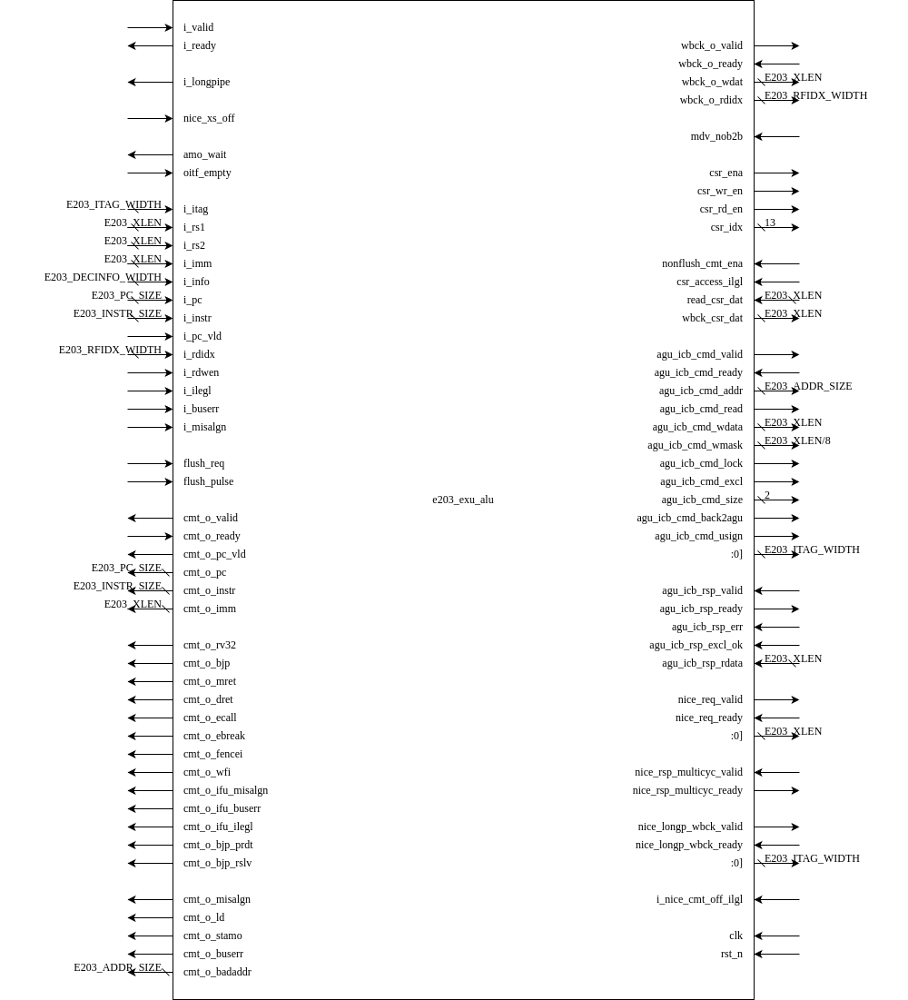

# e203_exu_alu Design Specification

## 1. Introduction
The `e203_exu_alu` module is a key component of the E203 processor's execution unit (EXU). It implements the ALU (Arithmetic Logic Unit) and AGU (Address Generation Unit) functionalities. Additionally, it handles shared implementations of multiplication/division (MUL/DIV) instructions and NICE (Nuclei Instruction Custom Extension) operations when enabled. The module interacts with various submodules to process arithmetic, logic, branch, load/store, and CSR (Control Status Register) instructions.

## 2. Module Diagram
The module diagram consists of the following major components:
- ALU datapath for arithmetic and logic operations.
- BJP (Branch Jump Prediction) for branch and jump instructions.
- AGU for load/store address generation.
- CSR controller for CSR operations.
- Optional submodules for MUL/DIV and NICE instruction handling.
- Interfaces for write-back, commit, and LSU (Load/Store Unit) communication.

## Interface

**Basic Interface**

| Direction | Port Name            | Width              | Description                                                |
| --------- | -------------------- | ------------------ | ---------------------------------------------------------- |
| Input     | i_valid              | 1                  | Indicates a valid instruction is available.                |
| Output    | i_ready              | 1                  | Indicates the module is ready to accept a new instruction. |
| Output    | i_longpipe           | 1                  | Indicates the instruction is a long pipeline operation.    |
| Output    | amo_wait             | 1                  | Indicates waiting for atomic memory operations.            |
| Input     | oitf_empty           | 1                  | Indicates if the operation issue tracking FIFO is empty.   |
| Input     | i_itag               | E203_ITAG_WIDTH    | Instruction tag for tracking.                              |
| Input     | i_rs1                | E203_XLEN          | First source operand.                                      |
| Input     | i_rs2                | E203_XLEN          | Second source operand.                                     |
| Input     | i_imm                | E203_XLEN          | Immediate operand.                                         |
| Input     | i_info               | E203_DECINFO_WIDTH | Instruction decode information.                            |
| Input     | i_pc                 | E203_PC_SIZE       | Program counter of the instruction.                        |
| Input     | i_instr              | E203_INSTR_SIZE    | Instruction word.                                          |
| Input     | i_pc_vld             | 1                  | Indicates the program counter is valid.                    |
| Input     | i_rdidx              | E203_RFIDX_WIDTH   | Destination register index.                                |
| Input     | i_rdwen              | 1                  | Write-enable signal for the destination register.          |
| Input     | i_ilegl              | 1                  | Indicates an illegal instruction.                          |
| Input     | i_buserr             | 1                  | Indicates a bus error occurred.                            |
| Input     | i_misalgn            | 1                  | Indicates a misaligned memory access.                      |
| Input     | flush_req            | 1                  | Flush request signal.                                      |
| Input     | flush_pulse          | 1                  | Flush pulse signal.                                        |
| Output    | cmt_o_valid          | 1                  | Commit handshake valid signal.                             |
| Input     | cmt_o_ready          | 1                  | Commit handshake ready signal.                             |
| Output    | cmt_o_pc_vld         | 1                  | Indicates the program counter is valid for commit.         |
| Output    | cmt_o_pc             | E203_PC_SIZE       | Program counter to be committed.                           |
| Output    | cmt_o_instr          | E203_INSTR_SIZE    | Instruction to be committed.                               |
| Output    | cmt_o_imm            | E203_XLEN          | Immediate value to be committed.                           |
| Output    | cmt_o_rv32           | 1                  | Indicates if the instruction is RV32.                      |
| Output    | cmt_o_bjp            | 1                  | Indicates a branch/jump prediction instruction.            |
| Output    | cmt_o_mret           | 1                  | Indicates an MRET instruction.                             |
| Output    | cmt_o_dret           | 1                  | Indicates a DRET instruction.                              |
| Output    | cmt_o_ecall          | 1                  | Indicates an ECALL instruction.                            |
| Output    | cmt_o_ebreak         | 1                  | Indicates an EBREAK instruction.                           |
| Output    | cmt_o_fencei         | 1                  | Indicates a FENCEI instruction.                            |
| Output    | cmt_o_wfi            | 1                  | Indicates a WFI instruction.                               |
| Output    | cmt_o_ifu_misalgn    | 1                  | Indicates an instruction fetch misalignment.               |
| Output    | cmt_o_ifu_buserr     | 1                  | Indicates an instruction fetch bus error.                  |
| Output    | cmt_o_ifu_ilegl      | 1                  | Indicates an illegal instruction fetch.                    |
| Output    | cmt_o_bjp_prdt       | 1                  | Predicted branch/jump outcome.                             |
| Output    | cmt_o_bjp_rslv       | 1                  | Resolved branch/jump outcome.                              |
| Output    | cmt_o_misalgn        | 1                  | Indicates a misaligned memory access.                      |
| Output    | cmt_o_ld             | 1                  | Indicates a load instruction.                              |
| Output    | cmt_o_stamo          | 1                  | Indicates a store/atomic instruction.                      |
| Output    | cmt_o_buserr         | 1                  | Indicates a bus error.                                     |
| Output    | cmt_o_badaddr        | E203_ADDR_SIZE     | Address causing an exception.                              |
| Output    | wbck_o_valid         | 1                  | Write-back handshake valid signal.                         |
| Input     | wbck_o_ready         | 1                  | Write-back handshake ready signal.                         |
| Output    | wbck_o_wdat          | E203_XLEN          | Data to be written back.                                   |
| Output    | wbck_o_rdidx         | E203_RFIDX_WIDTH   | Index of the destination register for write-back.          |
| Input     | mdv_nob2b            | 1                  | No back-to-back MUL/DIV instructions allowed.              |
| Output    | csr_ena              | 1                  | Enable signal for CSR operations.                          |
| Output    | csr_wr_en            | 1                  | Write enable for CSR.                                      |
| Output    | csr_rd_en            | 1                  | Read enable for CSR.                                       |
| Output    | csr_idx              | 12                 | Index for accessing CSR.                                   |
| Input     | nonflush_cmt_ena     | 1                  | Non-flush commit enable.                                   |
| Input     | csr_access_ilgl      | 1                  | Indicates an illegal CSR access.                           |
| Input     | read_csr_dat         | E203_XLEN          | Data read from CSR.                                        |
| Output    | wbck_csr_dat         | E203_XLEN          | Data written back to CSR.                                  |
| Output    | agu_icb_cmd_valid    | 1                  | AGU command valid signal.                                  |
| Input     | agu_icb_cmd_ready    | 1                  | AGU command ready signal.                                  |
| Output    | agu_icb_cmd_addr     | E203_ADDR_SIZE     | AGU command address.                                       |
| Output    | agu_icb_cmd_read     | 1                  | AGU command read signal.                                   |
| Output    | agu_icb_cmd_wdata    | E203_XLEN          | AGU write data.                                            |
| Output    | agu_icb_cmd_wmask    | E203_XLEN/8        | AGU write mask.                                            |
| Output    | agu_icb_cmd_lock     | 1                  | AGU lock signal.                                           |
| Output    | agu_icb_cmd_excl     | 1                  | AGU exclusive access signal.                               |
| Output    | agu_icb_cmd_size     | 1:0                | AGU data size.                                             |
| Output    | agu_icb_cmd_back2agu | 1                  | AGU back-to-AGU signal.                                    |
| Output    | agu_icb_cmd_usign    | 1                  | AGU unsigned data indication.                              |
| Output    | agu_icb_cmd_itag     | E203_ITAG_WIDTH    | AGU instruction tag.                                       |
| Input     | agu_icb_rsp_valid    | 1                  | AGU response valid signal.                                 |
| Output    | agu_icb_rsp_ready    | 1                  | AGU response ready signal.                                 |
| Input     | agu_icb_rsp_err      | 1                  | AGU response error signal.                                 |
| Input     | agu_icb_rsp_excl_ok  | 1                  | AGU exclusive access success.                              |
| Input     | agu_icb_rsp_rdata    | E203_XLEN          | AGU response data.                                         |
| Input     | clk                  | 1                  | Clock signal.                                              |
| Input     | rst_n                | 1                  | Active-low reset signal.                                   |

**CSR_NICE Interface**

these interfaces are available if `E203_HAS_CSR_NICE` is defined

| Direction | Port Name      | Width | Description                         |
| --------- | -------------- | ----- | ----------------------------------- |
| Output    | nice_csr_valid | 1     | Valid signal for NICE CSR request.  |
| Input     | nice_csr_ready | 1     | Ready signal for NICE CSR response. |
| Output    | nice_csr_addr  | 31:0  | Address for NICE CSR.               |
| Output    | nice_csr_wr    | 1     | Write enable for NICE CSR.          |
| Output    | nice_csr_wdata | 31:0  | Data for NICE CSR write operation.  |
| Input     | nice_csr_rdata | 31:0  | Data from NICE CSR read operation.  |

**NICE Interface**

these interfaces are available if `E203_HAS_NICE` is defined

| Direction | Port Name               | Width           | Description                                 |
| --------- | ----------------------- | --------------- | ------------------------------------------- |
| Input     | nice_xs_off             | 1               | NICE extension off signal.                  |
| Output    | nice_req_valid          | 1               | NICE request valid signal.                  |
| Input     | nice_req_ready          | 1               | NICE request ready signal.                  |
| Output    | nice_req_instr          | E203_XLEN       | NICE instruction request.                   |
| Output    | nice_req_rs1            | E203_XLEN       | NICE first source operand.                  |
| Output    | nice_req_rs2            | E203_XLEN       | NICE second source operand.                 |
| Input     | nice_rsp_multicyc_valid | 1               | NICE multi-cycle response valid signal.     |
| Output    | nice_rsp_multicyc_ready | 1               | NICE multi-cycle response ready signal.     |
| Output    | nice_longp_wbck_valid   | 1               | NICE long-pipeline write-back valid signal. |
| Input     | nice_longp_wbck_ready   | 1               | NICE long-pipeline write-back ready signal. |
| Output    | nice_o_itag             | E203_ITAG_WIDTH | NICE output instruction tag.                |
| Input     | i_nice_cmt_off_ilgl     | 1               | NICE illegal commit signal.                 |

## 3. Submodule List

### 3.1 e203_exu_alu_csrctrl

#### 3.1.1 Function:

This module implements control for CSR (Control and Status Register) read/write operations. The module does not perform calculations; instead, it generates control signals that request CSR read/write operations by interacting with the ALU data path.

#### 3.1.2 Interface

| Direction | Port Name       | Width                  | Description                           |
| --------- | --------------- | ---------------------- | ------------------------------------- |
| input     | csr_i_valid     | 1                      | Valid-ready handshake signal          |
| output    | csr_i_ready     | 1                      | Valid-ready handshake signal          |
| input     | csr_i_rs1       | E203_XLEN              | Source register 1                     |
| input     | csr_i_info      | E203_DECINFO_CSR_WIDTH | CSR instruction information           |
| input     | csr_i_rdwen     | 1                      | the destination reg need to be writen |
| output    | csr_ena         | 1                      | Enable signal for CSR module          |
| output    | csr_wr_en       | 1                      | Write signal for CSR                  |
| output    | csr_rd_en       | 1                      | Read signal for CSR                   |
| output    | csr_idx         | 12                     | CSR address index                     |
| input     | csr_access_ilgl | 1                      | Illegal access signal                 |
| input     | read_csr_dat    | E203_XLEN              | Data read from the CSR                |
| output    | wbck_csr_dat    | E203_XLEN              | Data written back to CSR              |
| output    | csr_o_valid     | 1                      | Valid signal for CSR output           |
| input     | csr_o_ready     | 1                      | Ready signal for CSR output           |
| output    | csr_o_wbck_wdat | E203_XLEN              | Special write-back data               |
| output    | csr_o_wbck_err  | 1                      | Special write-back error              |
| input     | clk             | 1                      | Clock signal                          |
| input     | rst_n           | 1                      | Reset signal                          |

### 3.2 e203_exu_alu_bjp

#### 3.2.1 Function

This module implements  conditional branch instructions and jump instructions and shares the datapath with the ALU adder to resolve comparison results in order to minimize gate count. The module processes branch and jump instructions based on conditions, using operands from registers or immediate values, and resolves the result of the comparison operation to determine the appropriate control signals for branching. The conditional branches include operations like BEQ, BNE, BLT, BGT, and their unsigned counterparts (BLTU, BGTU).

### 3.2.2 Interface

| Direction | Port Name           | Width                  | Description                                                  |
| --------- | ------------------- | ---------------------- | ------------------------------------------------------------ |
| input     | bjp_i_valid         | 1                      | Handshake valid signal for branch instruction input          |
| output    | bjp_i_ready         | 1                      | Handshake ready signal for branch instruction input          |
| input     | bjp_i_rs1           | E203_XLEN              | Operand 1 (register or immediate) for the branch and jump instruction |
| input     | bjp_i_rs2           | E203_XLEN              | Operand 2 (register) for the branch and jump instruction     |
| input     | bjp_i_imm           | E203_XLEN              | Immediate value for the branch and jump instruction          |
| input     | bjp_i_pc            | E203_PC_SIZE           | Program counter value for the instruction                    |
| input     | bjp_i_info          | E203_DECINFO_BJP_WIDTH | Branch instruction information bus                           |
| output    | bjp_o_valid         | 1                      | Handshake valid signal for the output of the branch and jump instruction |
| input     | bjp_o_ready         | 1                      | Handshake ready signal for the output of the branch and jump instruction |
| output    | bjp_o_wbck_wdat     | E203_XLEN              | Data to be written back for branch instructions (e.g., JAL, JALR) |
| output    | bjp_o_wbck_err      | 1                      | Write-back error signal (always set to 0 in this design)     |
| output    | bjp_o_cmt_bjp       | 1                      | Commit signal for branch instruction                         |
| output    | bjp_o_cmt_mret      | 1                      | Commit signal for `mret` (machine return) instruction        |
| output    | bjp_o_cmt_dret      | 1                      | Commit signal for `dret` (debug return) instruction          |
| output    | bjp_o_cmt_fencei    | 1                      | Commit signal for fence instruction (`fencei`)               |
| output    | bjp_o_cmt_prdt      | 1                      | Predicted result of the branch instruction (true/false)      |
| output    | bjp_o_cmt_rslv      | 1                      | Resolved result of the branch instruction (true/false)       |
| output    | bjp_req_alu_op1     | E203_XLEN              | Operand 1 for the ALU (could be `pc` or `rs1` depending on instruction type) |
| output    | bjp_req_alu_op2     | E203_XLEN              | Operand 2 for the ALU (could be immediate or `rs2` depending on instruction) |
| output    | bjp_req_alu_cmp_eq  | 1                      | Request for equality comparison operation in ALU             |
| output    | bjp_req_alu_cmp_ne  | 1                      | Request for inequality comparison operation in ALU           |
| output    | bjp_req_alu_cmp_lt  | 1                      | Request for less-than comparison operation in ALU            |
| output    | bjp_req_alu_cmp_gt  | 1                      | Request for greater-than comparison operation in ALU         |
| output    | bjp_req_alu_cmp_ltu | 1                      | Request for unsigned less-than comparison operation in ALU   |
| output    | bjp_req_alu_cmp_gtu | 1                      | Request for unsigned greater-than comparison operation in ALU |
| output    | bjp_req_alu_add     | 1                      | Request for addition operation in ALU (used for unconditional jumps) |
| input     | bjp_req_alu_cmp_res | 1                      | Comparison result from ALU (used for branch resolution)      |
| input     | bjp_req_alu_add_res | E203_XLEN              | Addition result from ALU (used for `jal` and `jalr` computations) |
| input     | clk                 | 1                      | Clock signal                                                 |
| input     | rst_n               | 1                      | Reset signal                                                 |

### 3.3 e203_exu_alu_lsuagu

#### 3.3.1 Function

The AGU is responsible for generating memory addresses for load/store and AMO instructions. It supports the following features:

1. Address computation for aligned and unaligned memory accesses.
2. Atomic operations like AMOSWAP, AMOADD, AMOAND, AMOOR, AMOXOR, AMOMAX, AMOMIN, AMOMAXU, and AMOMINU.
3. Exception handling for misaligned memory accesses and bus errors.
4. Interface with the LSU (Load/Store Unit) for memory transactions.
5. Sharing the ALU datapath for efficient address calculation and AMO operations.

#### 3.3.2 Interface

| Direction  | Port Name              | Width                    | Description                                                  |
| ---------- | ---------------------- | ------------------------ | ------------------------------------------------------------ |
| **Input**  | `agu_i_valid`          | 1                        | Valid signal for AGU operation.                              |
| **Output** | `agu_i_ready`          | 1                        | Ready signal for AGU operation.                              |
| **Input**  | `agu_i_rs1`            | `E203_XLEN`              | Source register 1 (base address for memory access).          |
| **Input**  | `agu_i_rs2`            | `E203_XLEN`              | Source register 2 (used in AMO or store operations).         |
| **Input**  | `agu_i_imm`            | `E203_XLEN`              | Immediate value for address generation.                      |
| **Input**  | `agu_i_info`           | `E203_DECINFO_AGU_WIDTH` | Instruction information for decoding and control.            |
| **Input**  | `agu_i_itag`           | `E203_ITAG_WIDTH`        | Instruction tag for tracking outstanding memory operations.  |
| **Output** | `agu_i_longpipe`       | 1                        | Indicates if the operation is a long pipeline instruction.   |
| **Input**  | `flush_req`            | 1                        | Flush request signal.                                        |
| **Input**  | `flush_pulse`          | 1                        | Flush pulse signal.                                          |
| **Output** | `amo_wait`             | 1                        | Indicates if the AMO operation is waiting for completion.    |
| **Input**  | `oitf_empty`           | 1                        | Indicates if the Outstanding Instruction Tracking FIFO (OITF) is empty. |
| **Output** | `agu_o_valid`          | 1                        | Valid signal for write-back/commit interface.                |
| **Input**  | `agu_o_ready`          | 1                        | Ready signal for write-back/commit interface.                |
| **Output** | `agu_o_wbck_wdat`      | `E203_XLEN`              | Write-back data for load or AMO operations.                  |
| **Output** | `agu_o_wbck_err`       | 1                        | Error signal for write-back operations.                      |
| **Output** | `agu_o_cmt_misalgn`    | 1                        | Misalignment exception indicator.                            |
| **Output** | `agu_o_cmt_ld`         | 1                        | Load instruction commit signal.                              |
| **Output** | `agu_o_cmt_stamo`      | 1                        | Store or AMO instruction commit signal.                      |
| **Output** | `agu_o_cmt_buserr`     | 1                        | Bus error exception indicator.                               |
| **Output** | `agu_o_cmt_badaddr`    | `E203_ADDR_SIZE`         | Address causing the misalignment or bus error.               |
| **Output** | `agu_icb_cmd_valid`    | 1                        | Valid signal for LSU ICB command interface.                  |
| **Input**  | `agu_icb_cmd_ready`    | 1                        | Ready signal for LSU ICB command interface.                  |
| **Output** | `agu_icb_cmd_addr`     | `E203_ADDR_SIZE`         | Address for LSU memory transactions.                         |
| **Output** | `agu_icb_cmd_read`     | 1                        | Read/write control signal for LSU transactions.              |
| **Output** | `agu_icb_cmd_wdata`    | `E203_XLEN`              | Write data for LSU transactions (store/AMO).                 |
| **Output** | `agu_icb_cmd_wmask`    | `E203_XLEN/8`            | Write mask for LSU transactions (byte-level granularity).    |
| **Output** | `agu_icb_cmd_back2agu` | 1                        | Indicates if the response should return to AGU.              |
| **Output** | `agu_icb_cmd_lock`     | 1                        | Lock signal for LSU transactions (not used in this implementation). |
| **Output** | `agu_icb_cmd_excl`     | 1                        | Exclusive access signal for LSU transactions (e.g., AMO).    |
| **Output** | `agu_icb_cmd_size`     | 2                        | Size of the memory access (byte, halfword, word).            |
| **Output** | `agu_icb_cmd_itag`     | `E203_ITAG_WIDTH`        | Instruction tag for the LSU transaction.                     |
| **Output** | `agu_icb_cmd_usign`    | 1                        | Unsigned access indicator.                                   |
| **Input**  | `agu_icb_rsp_valid`    | 1                        | Valid signal for LSU response interface.                     |
| **Output** | `agu_icb_rsp_ready`    | 1                        | Ready signal for LSU response interface.                     |
| **Input**  | `agu_icb_rsp_err`      | 1                        | Error signal for LSU responses.                              |
| **Input**  | `agu_icb_rsp_excl_ok`  | 1                        | Exclusive access success indicator.                          |
| **Input**  | `agu_icb_rsp_rdata`    | `E203_XLEN`              | Read data from LSU transactions.                             |
| **Output** | `agu_req_alu_op1`      | `E203_XLEN`              | Operand 1 for ALU (shared datapath).                         |
| **Output** | `agu_req_alu_op2`      | `E203_XLEN`              | Operand 2 for ALU (shared datapath).                         |
| **Output** | `agu_req_alu_swap`     | 1                        | Control signal for AMO SWAP operation.                       |
| **Output** | `agu_req_alu_add`      | 1                        | Control signal for ADD operation (address generation or AMO ADD). |
| **Output** | `agu_req_alu_and`      | 1                        | Control signal for AND operation (AMO AND).                  |
| **Output** | `agu_req_alu_or`       | 1                        | Control signal for OR operation (AMO OR).                    |
| **Output** | `agu_req_alu_xor`      | 1                        | Control signal for XOR operation (AMO XOR).                  |
| **Output** | `agu_req_alu_max`      | 1                        | Control signal for MAX operation (AMO MAX).                  |
| **Output** | `agu_req_alu_min`      | 1                        | Control signal for MIN operation (AMO MIN).                  |
| **Output** | `agu_req_alu_maxu`     | 1                        | Control signal for MAXU operation (unsigned AMO MAX).        |
| **Output** | `agu_req_alu_minu`     | 1                        | Control signal for MINU operation (unsigned AMO MIN).        |
| **Input**  | `agu_req_alu_res`      | `E203_XLEN`              | ALU result (shared datapath).                                |
| **Output** | `agu_sbf_0_ena`        | 1                        | Enable signal for shared buffer 0.                           |
| **Output** | `agu_sbf_0_nxt`        | `E203_XLEN`              | Next value for shared buffer 0.                              |
| **Input**  | `agu_sbf_0_r`          | `E203_XLEN`              | Current value of shared buffer 0.                            |
| **Output** | `agu_sbf_1_ena`        | 1                        | Enable signal for shared buffer 1.                           |
| **Output** | `agu_sbf_1_nxt`        | `E203_XLEN`              | Next value for shared buffer 1.                              |
| **Input**  | `agu_sbf_1_r`          | `E203_XLEN`              | Current value of shared buffer 1.                            |
| **Input**  | `clk`                  | 1                        | Clock signal.                                                |
| **Input**  | `rst_n`                | 1                        | Active-low reset signal.                                     |

### 3.4 e203_exu_alu_rglr

#### 3.4.1 Function

This module is used to implement regular ALU instructions.

#### 3.4.2 Interface

| Direction | Port Name        | Width                  | Description                                                  |
| --------- | ---------------- | ---------------------- | ------------------------------------------------------------ |
| input     | alu_i_valid      | 1                      | valid-ready handshake signal                                 |
| output    | alu_i_ready      | 1                      | valid-ready handshake signal                                 |
| input     | alu_i_rs1        | E203_XLEN              | Source register 1                                            |
| input     | alu_i_rs2        | E203_XLEN              | Source register 2                                            |
| input     | alu_i_imm        | E203_XLEN              | Instruction immediate                                        |
| input     | alu_i_pc         | E203_PC_SIZE           | PC value corresponding to instruction                        |
| input     | alu_i_info       | E203_DECINFO_ALU_WIDTH | ALU information bus, including instruction type and other information |
| output    | alu_o_valid      | 1                      | valid-ready handshake signal                                 |
| input     | alu_o_ready      | 1                      | valid-ready handshake signal                                 |
| output    | alu_o_wbck_wdat  | E203_XLEN              | Retrieved result of the operation data path                  |
| output    | alu_o_wbck_err   | 1                      | Write report error                                           |
| output    | alu_o_cmt_ecall  | 1                      | Submit ecall instruction                                     |
| output    | alu_o_cmt_ebreak | 1                      | Submit ebreak instruction                                    |
| output    | alu_o_cmt_wfi    | 1                      | Submit wfi instruction                                       |
| output    | alu_req_alu_add  | 1                      | Request add operation from alu module                        |
| output    | alu_req_alu_sub  | 1                      | Request sub operation from alu module                        |
| output    | alu_req_alu_xor  | 1                      | Request xor operation from alu module                        |
| output    | alu_req_alu_sll  | 1                      | Request sll operation from alu module                        |
| output    | alu_req_alu_srl  | 1                      | Request srl operation from alu module                        |
| output    | alu_req_alu_sra  | 1                      | Request sra operation from alu module                        |
| output    | alu_req_alu_or   | 1                      | Request or operation from alu module                         |
| output    | alu_req_alu_and  | 1                      | Request and operation from alu module                        |
| output    | alu_req_alu_slt  | 1                      | Request slt operation from alu module                        |
| output    | alu_req_alu_sltu | 1                      | Request sltu operation from alu module                       |
| output    | alu_req_alu_lui  | 1                      | Request lui operation from alu module                        |
| output    | alu_req_alu_op1  | E203_XLEN              | First source operand                                         |
| output    | alu_req_alu_op2  | E203_XLEN              | Second source operand                                        |
| output    | alu_req_alu_res  | E203_XLEN              | Calculation result of shared operation data path             |
| input     | clk              | 1                      | Clock signal                                                 |
| input     | rst_n            | 1                      | Reset signal                                                 |

### 3.5 e203_exu_alu_muldiv(optional)

This module is instantiated if `E203_SUPPORT_MULDIV` is defined.

#### 3.5.1 Function

The `e203_exu_alu_muldiv` module implements a 17-cycle multiplier and a 33-cycle divider unit. It is designed to share the datapath with the ALU datapath (`ALU_DPATH`) to minimize gate count. The module supports signed and unsigned multiplication and division operations, including remainder calculations. It also incorporates mechanisms to handle back-to-back operations and special cases such as division by zero or overflow.

#### 3.5.2 Interface

| **Direction** | **Port Name**        | **Width**                   | **Description**                                              |
| ------------- | -------------------- | --------------------------- | ------------------------------------------------------------ |
| input         | `mdv_nob2b`          | 1                           | Indicates no back-to-back operations are allowed.            |
| input         | `muldiv_i_valid`     | 1                           | Handshake valid signal for MUL/DIV input.                    |
| output        | `muldiv_i_ready`     | 1                           | Handshake ready signal for MUL/DIV input.                    |
| input         | `muldiv_i_rs1`       | `E203_XLEN`                 | Operand RS1 for multiplication or division.                  |
| input         | `muldiv_i_rs2`       | `E203_XLEN`                 | Operand RS2 for multiplication or division.                  |
| input         | `muldiv_i_imm`       | `E203_XLEN`                 | Immediate operand for multiplication or division.            |
| input         | `muldiv_i_info`      | `E203_DECINFO_MULDIV_WIDTH` | information bus for MUL/DIV                                  |
| input         | `muldiv_i_itag`      | `E203_ITAG_WIDTH`           | Instruction tag for MUL/DIV operations                       |
| output        | `muldiv_i_longpipe`  | 1                           | Indicates that the MUL/DIV operation is a long pipeline operation. |
| input         | `flush_pulse`        | 1                           | Flush signal to reset the MUL/DIV pipeline.                  |
| output        | `muldiv_o_valid`     | 1                           | Handshake valid signal for MUL/DIV output.                   |
| input         | `muldiv_o_ready`     | 1                           | Handshake ready signal for MUL/DIV output.                   |
| output        | `muldiv_o_wbck_wdat` | `E203_XLEN`                 | Write-back data resulting from the MUL/DIV operation.        |
| output        | `muldiv_o_wbck_err`  | 1                           | Write-back error signal (always 0, as there are no exceptions for MUL/DIV). |
| output        | `muldiv_req_alu_op1` | `E203_MULDIV_ADDER_WIDTH`   | Operand 1 for the shared ALU datapath.                       |
| output        | `muldiv_req_alu_op2` | `E203_MULDIV_ADDER_WIDTH`   | Operand 2 for the shared ALU datapath.                       |
| output        | `muldiv_req_alu_add` | 1                           | Indicates add operation for the shared ALU datapath.         |
| output        | `muldiv_req_alu_sub` | 1                           | Indicates subtract operation for the shared ALU datapath.    |
| input         | `muldiv_req_alu_res` | `E203_MULDIV_ADDER_WIDTH`   | Result from the shared ALU datapath.                         |
| output        | `muldiv_sbf_0_ena`   | 1                           | Enable signal for shared buffer 0.                           |
| output        | `muldiv_sbf_0_nxt`   | 33                          | Next value to write to shared buffer 0.                      |
| input         | `muldiv_sbf_0_r`     | 33                          | Current value of shared buffer 0.                            |
| output        | `muldiv_sbf_1_ena`   | 1                           | Enable signal for shared buffer 1.                           |
| output        | `muldiv_sbf_1_nxt`   | 33                          | Next value to write to shared buffer 1.                      |
| input         | `muldiv_sbf_1_r`     | 33                          | Current value of shared buffer 1.                            |
| input         | `clk`                | 1                           | Clock signal for synchronous operation.                      |
| input         | `rst_n`              | 1                           | Active-low reset signal for initializing the module.         |

### 3.6 e203_exu_nice (optional)

#### 3.6.1 Function

The `e203_exu_nice`module serves as a bridge between the E203 RISC-V core's execution unit and custom hardware accelerators. It handles the flow of instructions and data to custom accelerator blocks, while managing the handshaking protocols and instruction tagging necessary to maintain program correctness.

#### 3.6.2 Interface

| Direction | Port Name               | Width           | Description                                           |
| --------- | ----------------------- | --------------- | ----------------------------------------------------- |
| input     | nice_i_xs_off           | 1               | NICE accelerator disable signal                       |
| input     | nice_i_valid            | 1               | Input instruction valid signal                        |
| output    | nice_i_ready            | 1               | Ready signal to accept input instruction              |
| input     | nice_i_instr            | E203_XLEN       | Input instruction to be executed by NICE              |
| input     | nice_i_rs1              | E203_XLEN       | Input source register 1 value                         |
| input     | nice_i_rs2              | E203_XLEN       | Input source register 2 value                         |
| input     | nice_i_itag             | E203_ITAG_WIDTH | Input instruction tag for tracking                    |
| output    | nice_o_longpipe         | 1               | Indicates if instruction needs long pipeline handling |
| output    | nice_o_valid            | 1               | Valid signal for commit interface                     |
| input     | nice_o_ready            | 1               | Ready signal from commit interface                    |
| output    | nice_o_itag_valid       | 1               | Valid signal for instruction tag writeback            |
| input     | nice_o_itag_ready       | 1               | Ready signal for instruction tag writeback            |
| output    | nice_o_itag             | E203_ITAG_WIDTH | Instruction tag for writeback                         |
| input     | nice_rsp_multicyc_valid | 1               | Multi-cycle operation completion signal               |
| output    | nice_rsp_multicyc_ready | 1               | Ready signal for multi-cycle operation completion     |
| output    | nice_req_valid          | 1               | Valid signal for request to custom accelerator        |
| input     | nice_req_ready          | 1               | Ready signal from custom accelerator                  |
| output    | nice_req_instr          | E203_XLEN       | Instruction forwarded to custom accelerator           |
| output    | nice_req_rs1            | E203_XLEN       | Source register 1 forwarded to custom accelerator     |
| output    | nice_req_rs2            | E203_XLEN       | Source register 2 forwarded to custom accelerator     |
| input     | clk                     | 1               | System clock                                          |
| input     | rst_n                   | 1               | Active low reset signal                               |

### 3.7 e203_exu_alu_dpath

#### 3.7.2 Function

The `e203_exu_alu_dpath` module is the datapath implementation of the Arithmetic Logic Unit (ALU) in the E203 processor. This module is responsible for executing arithmetic, logic, shift, comparison, and other operations requested by various execution units, such as the `e203_exu_alu_rglr`, `e203_exu_alu_csrctrl`, `e203_exu_alu_lsuagu`, and optionally the `e203_exu_alu_muldiv`. It is designed to be efficient, highly reusable, and supports multiple functional units through shared resources.

#### 3.7.2 Interface

##### Inputs

| Signal Name          | Width                  | Description                                                  |
| -------------------- | ---------------------- | ------------------------------------------------------------ |
| `alu_req_alu`        | 1                      | Request signal for ALU operations                            |
| `alu_req_alu_add`    | 1                      | Indicates `ADD` operation is requested                       |
| `alu_req_alu_sub`    | 1                      | Indicates `SUB` operation is requested                       |
| `alu_req_alu_xor`    | 1                      | Indicates `XOR` operation is requested                       |
| `alu_req_alu_sll`    | 1                      | Indicates `Shift Left Logical (SLL)` operation               |
| `alu_req_alu_srl`    | 1                      | Indicates `Shift Right Logical (SRL)` operation              |
| `alu_req_alu_sra`    | 1                      | Indicates `Shift Right Arithmetic (SRA)` operation           |
| `alu_req_alu_or`     | 1                      | Indicates `OR` operation is requested                        |
| `alu_req_alu_and`    | 1                      | Indicates `AND` operation is requested                       |
| `alu_req_alu_op1`    | `E203_XLEN`            | Operand 1 for ALU operations                                 |
| `alu_req_alu_op2`    | `E203_XLEN`            | Operand 2 for ALU operations                                 |
| `bjp_req_alu`        | 1                      | Indicates that there is a calculation request from the bjp unit |
| `bjp_req_alu_op1`    | `E203_XLEN`            | Operand 1 for BJP operations                                 |
| `bjp_req_alu_op2`    | `E203_XLEN`            | Operand 2 for BJP operations                                 |
| `agu_req_alu`        | 1                      | Indicates that there is a calculation request from the agu unit |
| `agu_req_alu_op1`    | `E203_XLEN`            | Operand 1 for AGU operations                                 |
| `agu_req_alu_op2`    | `E203_XLEN`            | Operand 2 for AGU operations                                 |
| `muldiv_req_alu`     | 1                      | Indicates that there is a calculation request from the muldiv unit |
| `muldiv_req_alu_op1` | `E203_ALU_ADDER_WIDTH` | Operand 1 for MULDIV operations                              |
| `muldiv_req_alu_op2` | `E203_ALU_ADDER_WIDTH` | Operand 2 for MULDIV operations                              |
| `muldiv_req_alu_add` | 1                      | Indicates that the muldiv unit requests an addition operation |
| `muldiv_req_alu_sub` | 1                      | Indicates that the muldiv unit requests an subtraction operation |
| `muldiv_sbf_0_ena`   | 1                      | Shared buffer 0 enable signal                                |
| `muldiv_sbf_0_nxt`   | 33                     | The value to be stored in shared buffer 0                    |
| `muldiv_sbf_1_ena`   | 1                      | Shared buffer 1 enable signal                                |
| `muldiv_sbf_1_nxt`   | 33                     | The value to be stored in shared buffer 1                    |
| `clk`                | 1                      | Clock signal                                                 |
| `rst_n`              | 1                      | Active-low reset signal                                      |

##### Outputs

| Signal Name           | Width                  | Description                              |
| --------------------- | ---------------------- | ---------------------------------------- |
| `alu_req_alu_res`     | `E203_XLEN`            | Result of ALU operations.                |
| `bjp_req_alu_add_res` | `E203_XLEN`            | Result of BJP addition operation.        |
| `bjp_req_alu_cmp_res` | 1 bit                  | Result of BJP comparison (equal or not). |
| `agu_req_alu_res`     | `E203_XLEN`            | Result of AGU operations.                |
| `muldiv_req_alu_res`  | `E203_ALU_ADDER_WIDTH` | Result of MULDIV operations.             |
| `muldiv_sbf_0_r`      | 33                     | Current value of shared buffer 0         |
| `muldiv_sbf_1_r`      | 33                     | Current value of shared buffer 1         |

## 4. Function Description
The `e203_exu_alu` module is a core component of the execution unit (EXU) in the E203 RISC-V processor. It implements multiple functional units responsible for arithmetic, logic, control, and memory-related instructions. Specifically, the module includes the following functionalities:
1. **Arithmetic Logic Unit (ALU):**
   - Performs arithmetic and logical operations such as addition, subtraction, bit-shifting, logic AND/OR/XOR, comparison, and immediate-based operations.
   
2. **Address Generation Unit (AGU):**
   - Generates memory addresses for load and store instructions.
   - Handles atomic memory operations (AMO).

3. **Branch and Jump Prediction (BJP):**
   - Processes branch and jump instructions.
   - Predicts and resolves branch outcomes.

4. **Control and Status Register (CSR) Operations:**
   - Handles read and write operations for CSR registers.
   - Supports custom NICE (Nuclei Instruction Custom Extension) CSR access if enabled.

5. **Multiplication and Division (MUL/DIV):**
   - Provides shared implementation for multiplication and division instructions.
   - This functionality is optional and configurable.

6. **NICE Operations:**
   - Processes custom instructions when the NICE extension is enabled.
   - Handles instruction decoding, operand passing, and response collection.

7. **Write-Back and Commit:**
   - Manages write-back of results to the register file for completed instructions.
   - Interfaces with the commit stage to report instruction execution results and exceptions.

8. **Exception Handling:**
   - Detects and handles invalid instructions, misaligned memory accesses, and bus errors during instruction execution.

## 5. Implementation Details
The module architecture is designed to optimize resource usage by sharing a common datapath across various functional units. Below are the key implementation details:

### 5.1 Instruction Dispatch
- The module receives instructions from the dispatch stage via the `i_valid` and `i_info` signals.
- Based on the instruction type (`i_info`), the instruction is routed to one of the following functional units:
  - ALU for arithmetic and logic operations.
  - AGU for load/store instructions.
  - BJP for branch/jump prediction.
  - CSR controller for CSR operations.
  - MUL/DIV unit for multiplication and division.
  - NICE unit for custom instructions.

### 5.2 Functional Units
#### ALU:
- Handles arithmetic and logical operations using `e203_exu_alu_rglr`.
- Shared datapath supports operations such as addition, subtraction, comparison, shifting, and logic operations.
- Outputs results via `alu_o_valid` and `alu_o_wbck_wdat`.

#### AGU:
- Address generation for load/store instructions is handled by `e203_exu_alu_lsuagu`.
- Supports atomic operations and generates exceptions for misaligned accesses or bus errors.
- Communicates with the LSU via an interconnect bus interface.

#### BJP:
- Processes branch and jump instructions using `e203_exu_alu_bjp`.
- Predicts and resolves branch outcomes.
- Outputs branch-specific commit signals such as `cmt_o_bjp`, `cmt_o_bjp_prdt`, and `cmt_o_bjp_rslv`.

#### MUL/DIV:
- Optional unit (`e203_exu_alu_muldiv`) for multiplication and division.
- Shares the ALU datapath for intermediate calculations.

#### CSR:
- Handles CSR read and write operations via `e203_exu_alu_csrctrl`.
- Supports NICE CSR operations if the NICE extension is enabled.

#### NICE:
- Custom instruction processing is handled by `e203_exu_nice`.
- Interfaces with the ALU and optionally generates long-pipeline operations.

### 5.3 Write-Back and Commit
- The module arbitrates results from functional units and sends them to the write-back and commit stages.
- Results are written back to the register file via `wbck_o_wdat` and `wbck_o_valid`.
- Commit signals (`cmt_o_*`) are generated to indicate instruction execution status and any exceptions encountered.

### 5.4 Exception Handling
- Exceptions such as illegal instructions (`i_ilegl`), bus errors (`i_buserr`), and misaligned accesses (`i_misalgn`) are detected and reported.
- The module ensures proper exception signaling to the commit stage.

### 5.5 Pipeline Integration
- Long-pipeline instructions are identified using the `i_longpipe` signal.
- The module ensures proper handshaking with upstream and downstream pipeline stages using `i_ready`, `cmt_o_ready`, and `wbck_o_ready`.

## 6. Clock and Reset
- **Clock** (`clk`): Drives the module's sequential logic.
- **Reset** (`rst_n`): Active-low reset initializes the module.

## 7. Constraints
- Ensure proper timing closure for all critical paths, especially in the shared datapath.
- Maintain valid handshake protocols for all input and output interfaces.
- Optional submodules (MUL/DIV and NICE) must only be instantiated if supported by the configuration.