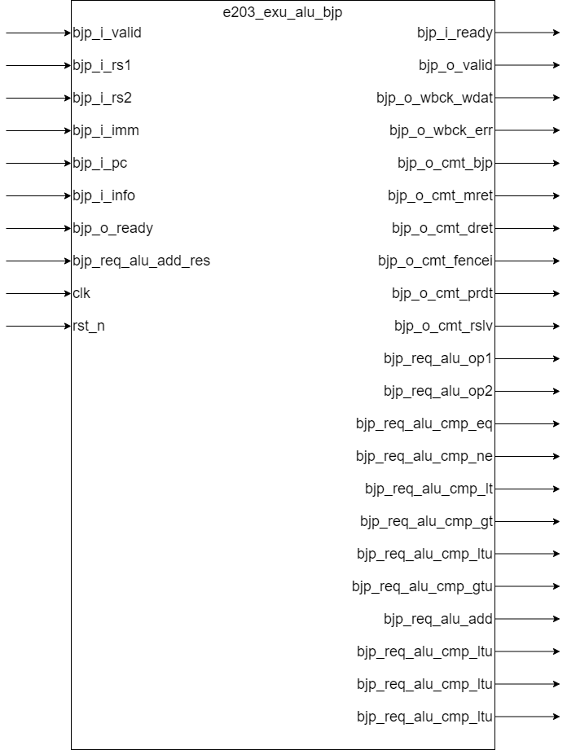

# **e203_exu_alu_bjp.v** Specification

## Introduction

**Module Description**

This module implements  conditional branch instructions and jump instructions and shares the datapath with the ALU adder to resolve comparison results in order to minimize gate count. The module processes branch and jump instructions based on conditions, using operands from registers or immediate values, and resolves the result of the comparison operation to determine the appropriate control signals for branching. The conditional branches include operations like BEQ, BNE, BLT, BGT, and their unsigned counterparts (BLTU, BGTU).

**Design Overview**

This module receives information about conditional branch instructions and jump instructions and generates corresponding ALU operation requests. It performs the necessary computations and generates control signals for the ALU, committing branch instruction results to the pipeline, including predicted jump result and resolved jump result. It uses a shared ALU datapath for comparison and addition operations. The module also generates the necessary commit signals for the instruction execution unit (EXU).

## Module Diagram

## Interface

**Basic Interface**

| Direction | Port Name           | Width                  | Description                                                  |
| --------- | ------------------- | ---------------------- | ------------------------------------------------------------ |
| input     | bjp_i_valid         | 1                      | Handshake valid signal for branch instruction input          |
| output    | bjp_i_ready         | 1                      | Handshake ready signal for branch instruction input          |
| input     | bjp_i_rs1           | E203_XLEN              | Operand 1 (register or immediate) for the branch and jump instruction |
| input     | bjp_i_rs2           | E203_XLEN              | Operand 2 (register) for the branch and jump instruction     |
| input     | bjp_i_imm           | E203_XLEN              | Immediate value for the branch and jump instruction          |
| input     | bjp_i_pc            | E203_PC_SIZE           | Program counter value for the instruction                    |
| input     | bjp_i_info          | E203_DECINFO_BJP_WIDTH | Branch instruction information bus                           |
| output    | bjp_o_valid         | 1                      | Handshake valid signal for the output of the branch and jump instruction |
| input     | bjp_o_ready         | 1                      | Handshake ready signal for the output of the branch and jump instruction |
| output    | bjp_o_wbck_wdat     | E203_XLEN              | Data to be written back for branch instructions (e.g., JAL, JALR) |
| output    | bjp_o_wbck_err      | 1                      | Write-back error signal (always set to 0 in this design)     |
| output    | bjp_o_cmt_bjp       | 1                      | Commit signal for branch instruction                         |
| output    | bjp_o_cmt_mret      | 1                      | Commit signal for `mret` (machine return) instruction        |
| output    | bjp_o_cmt_dret      | 1                      | Commit signal for `dret` (debug return) instruction          |
| output    | bjp_o_cmt_fencei    | 1                      | Commit signal for fence instruction (`fencei`)               |
| output    | bjp_o_cmt_prdt      | 1                      | Predicted result of the branch instruction (true/false)      |
| output    | bjp_o_cmt_rslv      | 1                      | Resolved result of the branch instruction (true/false)       |
| output    | bjp_req_alu_op1     | E203_XLEN              | Operand 1 for the ALU (could be `pc` or `rs1` depending on instruction type) |
| output    | bjp_req_alu_op2     | E203_XLEN              | Operand 2 for the ALU (could be immediate or `rs2` depending on instruction) |
| output    | bjp_req_alu_cmp_eq  | 1                      | Request for equality comparison operation in ALU             |
| output    | bjp_req_alu_cmp_ne  | 1                      | Request for inequality comparison operation in ALU           |
| output    | bjp_req_alu_cmp_lt  | 1                      | Request for less-than comparison operation in ALU            |
| output    | bjp_req_alu_cmp_gt  | 1                      | Request for greater-than comparison operation in ALU         |
| output    | bjp_req_alu_cmp_ltu | 1                      | Request for unsigned less-than comparison operation in ALU   |
| output    | bjp_req_alu_cmp_gtu | 1                      | Request for unsigned greater-than comparison operation in ALU |
| output    | bjp_req_alu_add     | 1                      | Request for addition operation in ALU (used for unconditional jumps) |
| input     | bjp_req_alu_cmp_res | 1                      | Comparison result from ALU (used for branch resolution)      |
| input     | bjp_req_alu_add_res | E203_XLEN              | Addition result from ALU (used for `jal` and `jalr` computations) |
| input     | clk                 | 1                      | Clock signal                                                 |
| input     | rst_n               | 1                      | Reset signal                                                 |

## Function Description

### Valid-Ready Handshake

This module only transmits the valid signal of the upstream(`bjp_i_valid` ) to the downstream (`bjp_o_valid`), and transmits the ready signal of the downstream module to the upstream module.

### Generating ALU Requests

The `bjp_i_info` bus contains information about the branch instruction. Each bit of the bus corresponds to a specific type of branch instruction. The main branch types this module handles include (These indication signals are **valid high**):

| Bits | Description |
| ----------------------- | ------------------------------------------------------------ |
| E203_DECINFO_BJP_BEQ | the instruction is a beq instruction |
| E203_DECINFO_BJP_BNE | the instruction is a bne instruction |
| E203_DECINFO_BJP_BLT | the instruction is a blt instruction |
| E203_DECINFO_BJP_BGT | the instruction is a bgt instruction |
| E203_DECINFO_BJP_BLTU | the instruction is a bltu instruction |
| E203_DECINFO_BJP_BGTU | the instruction is a bgtu instruction |
| E203_DECINFO_BJP_MRET | the instruction is an mret (machine return) instruction |
| E203_DECINFO_BJP_DRET | the instruction is a dret (debug return) instruction |
| E203_DECINFO_BJP_FENCEI | the instruction is a fencei instruction |
| E203_DECINFO_BJP_BXX | the instruction is a conditional branch instruction (beq, bne, blt, bgt, bltu, bgtu) |
| E203_DECINFO_BJP_JUMP | the instruction is an unconditional jump instruction (jal, jalr) |
| E203_DECINFO_RV32 | the instruction is a 32-bit instruction |
| E203_DECINFO_BJP_BPRDT | Predefined Prediction result of branch jump instruction |

When a branch instruction is a jump (e.g., `jal`, `jalr`), the module sets the `bjp_req_alu_add` signal to high to request an addition operation. For conditional branches (e.g., `beq`, `bne`), the appropriate comparison operation (e.g., `bjp_req_alu_cmp_eq`,`bjp_req_alu_cmp_ne`)is requested.

### Operand Selection

- **Operand 1**: If the instruction is a jump, `bjp_i_pc` is used as operand 1; otherwise, `bjp_i_rs1` is used.
- **Operand 2**: If the instruction is a jump, the operand is either 4 (for RV32) or 2 (for RV64), depending on the instruction set architecture; otherwise, `bjp_i_rs2` is used.

### Retrieving Results from the ALU

- The ALU returns comparison results via `bjp_req_alu_cmp_res`. If the branch condition is satisfied (e.g., equality or greater than), the module uses this result to determine whether to commit the branch instruction (`bjp_o_cmt_rslv`).
- For `jal` or `jalr` instructions, the module returns the addition result from the ALU via `bjp_o_wbck_wdat`.

### Communication with Commit Module

This module sends instruction type signals, branch prediction result signals, and branch jump resolution result signals to the commit module. The commit module can determine whether the instruction is successfully committed based on these signals.
- `bjp_o_cmt_bjp`: Indicates that the instruction is a branch jump instruction.
- `bjp_o_cmt_mret`: Indicates a machine return (`mret`).
- `bjp_o_cmt_dret`: Indicates a debug return (`dret`).
- `bjp_o_cmt_fencei`: Indicates a fence instruction (`fencei`).
- `bjp_o_cmt_prdt`: Indicates the predicted result for the branch.
- `bjp_o_cmt_rslv`: Indicates the resolved result for the branch.

## Implementation Detail

### BJP resolved result:

When the instruction is a jump instruction, the resolved result is 1, otherwise, the calculation result returned by the ALU operation path is used.

### Write Back Err Generation:

In this module, we simply assign `bjp_o_wbck_err` to 0.

### Write Back Data Transfer:

Although not always useful, we always return the alu summation result (`bjp_req_alu_add_res`) as the bjp module write back data (`bjp_o_wbck_wdat`)

## Clock and Reset

This module is composed entirely of combinational logic circuits and does not respond to clock and reset signals.****