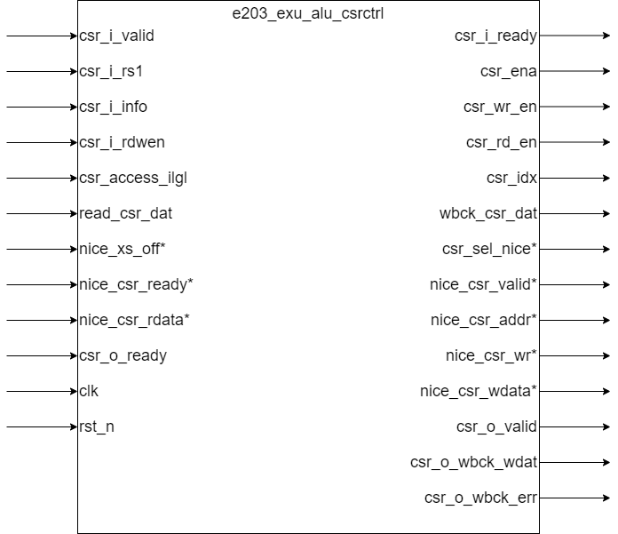

# e203_exu_alu_csrctrl Specification

## Introduction

This module implements control for CSR (Control and Status Register) read/write operations. The module does not perform calculations; instead, it generates control signals that request CSR read/write operations by interacting with the ALU data path.

## Module Diagram

## Interface

**Basic Interface**

| Direction | Port Name       | Width                  | Description                           |
| --------- | --------------- | ---------------------- | ------------------------------------- |
| input     | csr_i_valid     | 1                      | Valid-ready handshake signal          |
| output    | csr_i_ready     | 1                      | Valid-ready handshake signal          |
| input     | csr_i_rs1       | E203_XLEN              | Source register 1                     |
| input     | csr_i_info      | E203_DECINFO_CSR_WIDTH | CSR instruction information           |
| input     | csr_i_rdwen     | 1                      | the destination reg need to be writen |
| output    | csr_ena         | 1                      | Enable signal for CSR module          |
| output    | csr_wr_en       | 1                      | Write signal for CSR                  |
| output    | csr_rd_en       | 1                      | Read signal for CSR                   |
| output    | csr_idx         | 12                     | CSR address index                     |
| input     | csr_access_ilgl | 1                      | Illegal access signal                 |
| input     | read_csr_dat    | E203_XLEN              | Data read from the CSR                |
| output    | wbck_csr_dat    | E203_XLEN              | Data written back to CSR              |
| output    | csr_o_valid     | 1                      | Valid signal for CSR output           |
| input     | csr_o_ready     | 1                      | Ready signal for CSR output           |
| output    | csr_o_wbck_wdat | E203_XLEN              | Special write-back data               |
| output    | csr_o_wbck_err  | 1                      | Special write-back error              |
| input     | clk             | 1                      | Clock signal                          |
| input     | rst_n           | 1                      | Reset signal                          |

**Option Interface**

These interfaces are available if `E203_HAS_CSR_NICE` is defined.

| Direction | Name           | Width | Description                      |
| --------- | -------------- | ----- | -------------------------------- |
| input     | nice_xs_off    | 1     | Flag to disable NICE interface   |
| output    | csr_sel_nice   | 1     | Selects the NICE CSR range       |
| output    | nice_csr_valid | 1     | Indicates valid NICE CSR data    |
| input     | nice_csr_ready | 1     | Indicates that NICE CSR is ready |
| output    | nice_csr_addr  | 32    | Address of the NICE CSR          |
| output    | nice_csr_wr    | 1     | Write enable for NICE CSR        |
| output    | nice_csr_wdata | 32    | Write data for NICE CSR          |
| input     | nice_csr_rdata | 32    | Read data from NICE CSR          |

## Operation

### Introduction to csr input information bus

（Signal high level is valid）

| Bits | Description |
| ---------------------- | ------------------------------------------------------------ |
| E203_DECINFO_CSR_CSRRW | `CSRRW` instruction                                          |
| E203_DECINFO_CSR_CSRRS | `CSRRS` instruction |
| E203_DECINFO_CSR_CSRRC | `CSRRC` instruction |
| E203_DECINFO_CSR_RS1IMM | The current instruction uses an immediate value as the first source operand |
| E203_DECINFO_CSR_RS1IS0 | source register 1 is x0 |
| E203_DECINFO_CSR_ZIMMM | Immediate field with a bit width of 5 |
| E203_DECINFO_CSR_CSRIDX | CSR register index field with a bit width of 12 |

### Passing Valid-Ready Handshake Signals

The `valid-ready` handshake mechanism ensures that the communication between the CSR module and the other components (such as the ALU or NICE interface) happens correctly. The handshake signals `csr_i_valid` and `csr_i_ready` are used to synchronize data requests between the CSR module and the upstream components. Similarly, the handshake signals `csr_o_valid` and `csr_o_ready` are used to synchronize data between the CSR module and the downstream components.This module needs to pass the valid signal of the upstream module to the subsequent module, and pass the ready signal of the downstream module to the previous module.

### Preparing the Correct Source Operand Based on Instruction Information

**Operand 1**:

- If the instruction uses an immediate value, it extends the immediate value as an unsigned number and uses it as operand 1.
- If the instruction uses a register value, it uses the value from `csr_i_rs1` as operand 1.

### Generating Indicator Signals Based on Instruction Information

- **csr_rd_en**: This signal indicates whether a CSR read operation is enabled based on the instruction type. For `CSRRW` (CSR Read-Write), the read is enabled only if the destination register is also written. For `CSRRS` and `CSRRC` (CSR Set and CSR Clear), the read is always enabled.In addition to the instruction type, you must also ensure that the csr_i_valid signal is at a high level, that is, the input is valid, before you can pull the signal high.
  
- **csr_wr_en**: This signal indicates whether a CSR write operation is enabled. For `CSRRW`, the write is always enabled. For `CSRRS` and `CSRRC`, the write is enabled if the source register is not `x0` (the zero register).In addition to the instruction type, you must also ensure that the csr_i_valid signal is at a high level, that is, the input is valid, before you can pull the signal high.

- **csr_idx**: This signal indicates the CSR address index that is being read or written to.

- **csr_ena**: This signal indicates the overall enable signal for the CSR module. It is valid when the `csr_o_valid` signal is asserted and `csr_o_ready` is also asserted, and when the NICE interface is not selected.

### Preparing Data for CSR Write Operations

**wbck_csr_dat**: 

- For `CSRRW`, the data written to the CSR is directly the operand 1 (i.e., the value from `csr_op1`).
- For `CSRRS`, the data written to the CSR is a bitwise OR between the operand 1 and the current CSR value.
- For `CSRRC`, the data written to the CSR is a bitwise AND between the negated operand 1 and the current CSR value.

### Error Handling

- `csr_o_wbck_wdat` is used to return the value read from csr.
- `csr_o_wbck_err` is used to return csr access illegal errors.

## NICE Function Description

The NICE interface is an optional extension for handling specialized CSR accesses. If `E203_HAS_CSR_NICE` is defined in the configuration file, the module can access NICE related CSRs

When the CSR index corresponds to the NICE range (identified by `csr_idx[11:8] == 4'hE`) and `nice_xs_off` is not high, the module communicates with the NICE interface for both read and write operations.

### Additional I/O ports

| Direction | Name           | Width | Description                      |
| --------- | -------------- | ----- | -------------------------------- |
| input     | nice_xs_off    | 1     | Flag to disable NICE interface   |
| output    | csr_sel_nice   | 1     | Selects the NICE CSR range       |
| output    | nice_csr_valid | 1     | Indicates valid NICE CSR data    |
| input     | nice_csr_ready | 1     | Indicates that NICE CSR is ready |
| output    | nice_csr_addr  | 31:0  | Address of the NICE CSR          |
| output    | nice_csr_wr    | 1     | Write enable for NICE CSR        |
| output    | nice_csr_wdata | 31:0  | Write data for NICE CSR          |
| input     | nice_csr_rdata | 31:0  | Read data from NICE CSR          |

- **csr_sel_nice**: This signal indicates whether the CSR index corresponds to the NICE CSR range.
- **nice_csr_valid**: Indicates if the CSR request to the NICE interface is valid.
- **nice_csr_ready**: Indicates if the NICE interface is ready to accept CSR requests.
- **nice_csr_addr**: The address of the CSR in the NICE range.
- **nice_csr_wr**: The write enable for the NICE CSR interface.
- **nice_csr_wdata**: The data to be written to the NICE CSR.
- **nice_csr_rdata**: The data read from the NICE CSR. When the nice module is selected, the nice read data is used instead of the original csr read data.

### NICE CSR Operation

When nice is selected, csr_o_valid will be pulled high only when csr_i_valid and nice_csr_ready are both high

When nice is selected, nice_csr_valid will be pulled high only when csr_i_valid and csr_o_ready are both high

The module ensures that the CSR interface only sends data to the NICE interface when both the `csr_o_valid` and `nice_csr_ready` signals are asserted, and it properly synchronizes the read and write operations based on the readiness of the NICE interface.

## Illegal Access Interface

If an illegal CSR access occurs (indicated by the `csr_access_ilgl` signal), the `csr_o_wbck_err` signal is asserted to signal that an error occurred during the CSR access. This is used to prevent illegal writes or reads from proceeding.

## Clock and Reset

This module is composed entirely of combinational logic circuits and does not respond to clock and reset signals.