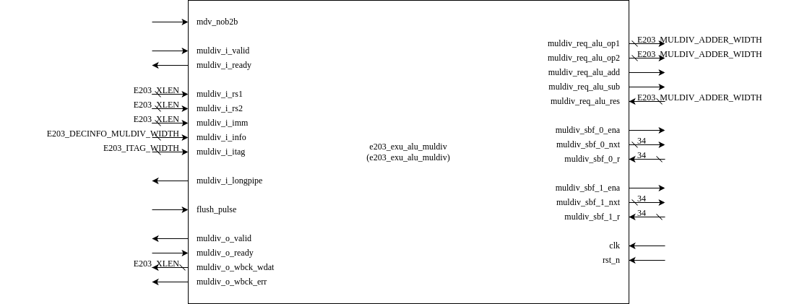

# e203_exu_alu_muldiv Design Specification

---

## Introduction

The `e203_exu_alu_muldiv` module implements a 17-cycle multiplier and a 33-cycle divider unit. It is designed to share the datapath with the ALU datapath (`ALU_DPATH`) to minimize gate count. The module supports signed and unsigned multiplication and division operations, including remainder calculations. It also incorporates mechanisms to handle back-to-back operations and special cases such as division by zero or overflow.

This module is available if `E203_SUPPORT_MULDIV` is defined.

---

## Module Diagram

---

## Interface

The interface of the module is described in the table below:

| **Direction** | **Port Name**            | **Width**                      | **Description**                                                                 |
|---------------|--------------------------|---------------------------------|---------------------------------------------------------------------------------|
| input         | `mdv_nob2b`             | 1                               | Indicates no back-to-back operations are allowed.                              |
| input         | `muldiv_i_valid`        | 1                               | Handshake valid signal for MUL/DIV input.                                      |
| output        | `muldiv_i_ready`        | 1                               | Handshake ready signal for MUL/DIV input.                                      |
| input         | `muldiv_i_rs1`          | `E203_XLEN`                     | Operand RS1 for multiplication or division.                                    |
| input         | `muldiv_i_rs2`          | `E203_XLEN`                     | Operand RS2 for multiplication or division.                                    |
| input         | `muldiv_i_imm`          | `E203_XLEN`                     | Immediate operand for multiplication or division.                              |
| input         | `muldiv_i_info`         | `E203_DECINFO_MULDIV_WIDTH`     | information bus for MUL/DIV                                |
| input         | `muldiv_i_itag`         | `E203_ITAG_WIDTH`               | Instruction tag for MUL/DIV operations                                        |
| output        | `muldiv_i_longpipe`     | 1                               | Indicates that the MUL/DIV operation is a long pipeline operation.             |
| input         | `flush_pulse`           | 1                               | Flush signal to reset the MUL/DIV pipeline.                                    |
| output        | `muldiv_o_valid`        | 1                               | Handshake valid signal for MUL/DIV output.                                     |
| input         | `muldiv_o_ready`        | 1                               | Handshake ready signal for MUL/DIV output.                                     |
| output        | `muldiv_o_wbck_wdat`    | `E203_XLEN`                     | Write-back data resulting from the MUL/DIV operation.                          |
| output        | `muldiv_o_wbck_err`     | 1                               | Write-back error signal (always 0, as there are no exceptions for MUL/DIV).    |
| output        | `muldiv_req_alu_op1`    | `E203_MULDIV_ADDER_WIDTH`       | Operand 1 for the shared ALU datapath.                                         |
| output        | `muldiv_req_alu_op2`    | `E203_MULDIV_ADDER_WIDTH`       | Operand 2 for the shared ALU datapath.                                         |
| output        | `muldiv_req_alu_add`    | 1                               | Indicates add operation for the shared ALU datapath.                           |
| output        | `muldiv_req_alu_sub`    | 1                               | Indicates subtract operation for the shared ALU datapath.                      |
| input         | `muldiv_req_alu_res`    | `E203_MULDIV_ADDER_WIDTH`       | Result from the shared ALU datapath.                                           |
| output        | `muldiv_sbf_0_ena`      | 1                               | Enable signal for shared buffer 0.                                             |
| output        | `muldiv_sbf_0_nxt`      | 33                              | Next value to write to shared buffer 0.                                        |
| input         | `muldiv_sbf_0_r`        | 33                              | Current value of shared buffer 0.                                              |
| output        | `muldiv_sbf_1_ena`      | 1                               | Enable signal for shared buffer 1.                                             |
| output        | `muldiv_sbf_1_nxt`      | 33                              | Next value to write to shared buffer 1.                                        |
| input         | `muldiv_sbf_1_r`        | 33                              | Current value of shared buffer 1.                                              |
| input         | `clk`                   | 1                               | Clock signal for synchronous operation.                                        |
| input         | `rst_n`                 | 1                               | Active-low reset signal for initializing the module.                           |

---

## Submodule List

### sirv_gnrl_dfflr
General-purpose d flip-flop with load-enable and reset functionality. Used for internal state storage and control signal generation.

#### Parameter Configuration

| Parameter Name | Default Value | Description |
|----------------|---------------|-------------|
| DW             | 32            | Data width (in bits) |

#### Signal Interface

| Port Name | Direction | Width | Description |
|-----------|-----------|-------|-------------|
| lden      | Input     | 1     | Load enable signal |
| dnxt      | Input     | DW    | Input data |
| qout      | Output    | DW    | Output data |
| clk       | Input     | 1     | Clock signal |
| rst_n     | Input     | 1     | Active-low reset signal |

---

## Operation

This section describes the operation of the `e203_exu_alu_muldiv` module, including the handshake signal flow, state machine transitions  for managing multiplier and divider operations, and key combinational  logic used in the module.

------

### **1. Handshake Signal Flow**

The handshake mechanism ensures proper communication between the module and its surrounding pipeline stages.

#### **Input Handshake**

- **`muldiv_i_valid`:** Indicates that valid multiplication or division instruction data is ready on the input interface.
- **`muldiv_i_ready`:** Generated by the module, signaling that it is ready to accept the instruction.

The input handshake completes when both `muldiv_i_valid` and `muldiv_i_ready` are asserted. This initiates the processing of the instruction.

#### **Output Handshake**

- **`muldiv_o_valid`:** Signals that the module has completed processing and the result is ready for write-back.
- **`muldiv_o_ready`:** Received from the downstream module, indicating readiness to accept the result.

The output handshake completes when both `muldiv_o_valid` and `muldiv_o_ready` are asserted, allowing the result to be committed.

#### **Flush Handling**

- **`flush_pulse`:** Used to reset or clear intermediate states during a pipeline flush, such as in the case of mispredictions or context switches.
- When a flush occurs, any ongoing computations are invalidated, and  the module transitions to an initial state to process subsequent  instructions.

------

### **2. Multiplier and Divider FSM State Transitions**

The module employs a 5-state finite state machine (FSM) to manage the execution of multiplication and division operations. The FSM ensures  efficient handling of different instruction types and edge cases like  division corrections.

#### **State Definitions**

1. **State 0 (`MULDIV_STATE_0TH`)**:
   - Initial state where instructions are decoded, operands are prepared, and the operation type is determined.
   - **Transition to State 1:** Occurs when a valid instruction is received, and no flush is triggered.
2. **State 1 (`MULDIV_STATE_EXEC`)**:
   - Execution state for both multiplication and division:
     - Multiplication uses Booth encoding for 16 cycles to compute the result.
     - Division uses iterative subtraction or addition for 32 cycles.
   - **Transition to State 2:** For division, if a correction is required.
   - **Transition to State 0:** For multiplication or division when execution completes without requiring correction or when a flush occurs.
3. **State 2 (`MULDIV_STATE_REMD_CHCK`)**:
   - Checks whether a correction is needed for the division remainder or quotient.
   - **Transition to State 3:** If a correction is required.
   - **Transition to State 0:** If no correction is needed or a flush occurs.
4. **State 3 (`MULDIV_STATE_QUOT_CORR`)**:
   - Corrects the quotient for division operations.
   - **Transition to State 4:** Always transitions to the remainder correction state.
5. **State 4 (`MULDIV_STATE_REMD_CORR`)**:
   - Corrects the remainder for division operations.
   - **Transition to State 0:** After correction is complete or if a flush occurs.

#### **State Transition Conditions**

The FSM transitions between states based on the following conditions:

- A valid instruction is received (`muldiv_i_valid`).
- The execution of multiplication or division completes, as determined by a cycle counter.
- Division correction requirements are identified during remainder checks.
- A flush pulse resets the FSM to the initial state.

------

### **3. Key Combinational Logic**

#### **Booth Encoding for Multiplication**

The module uses Booth-4 encoding to optimize the multiplication  process. This reduces the number of partial products by analyzing groups of 3 bits in the multiplier:

- The Booth code determines the operation for each partial product:
  - `000` or `111`: Partial product is 0.
  - `001` or `010`: Partial product is +1 × multiplicand.
  - `011`: Partial product is +2 × multiplicand.
  - `100`: Partial product is -2 × multiplicand.
  - `101` or `110`: Partial product is -1 × multiplicand.

#### **Partial Product Accumulation**

The high and low portions of the partial product are stored in registers and updated at each cycle:

- The high portion accumulates carry bits from the addition or subtraction of partial products.
- The low portion holds the shifted partial products for subsequent cycles.

#### **Division Correction**

For division, the module handles remainder and quotient corrections in a multi-step process:

- **Remainder Check:** Identifies whether the remainder requires correction based on its value and relationship with the divisor.
- **Quotient Correction:** Adjusts the quotient to account for rounding errors or overflow conditions.
- **Remainder Correction:** Computes the corrected remainder after the quotient has been adjusted.

#### **Special Case Handling**

The module detects and handles special cases during division:

- **Division by Zero:** The result is predefined based on the instruction type.
- **Overflow:** For specific combinations of dividend and divisor, the result is predefined to avoid incorrect computations.

---

## Implementation Details

1. **Datapath Sharing**: The module shares the ALU datapath to reduce gate count.
2. **Booth-4 Algorithm**: Implements Booth-4 algorithm for efficient multiplication.
3. **Non-Restoring Division**: Uses non-restoring signed division for division and remainder operations.
4. **Special Case Handling**: Handles edge cases such as:
   - Division by zero.
   - Signed division overflow (e.g., `INT_MIN / -1`).

---

## Clock and Reset

- **Clock (`clk`)**: The module operates synchronously with the clock signal.
- **Reset (`rst_n`)**: Active-low reset signal initializes internal states and clears pipelines.
