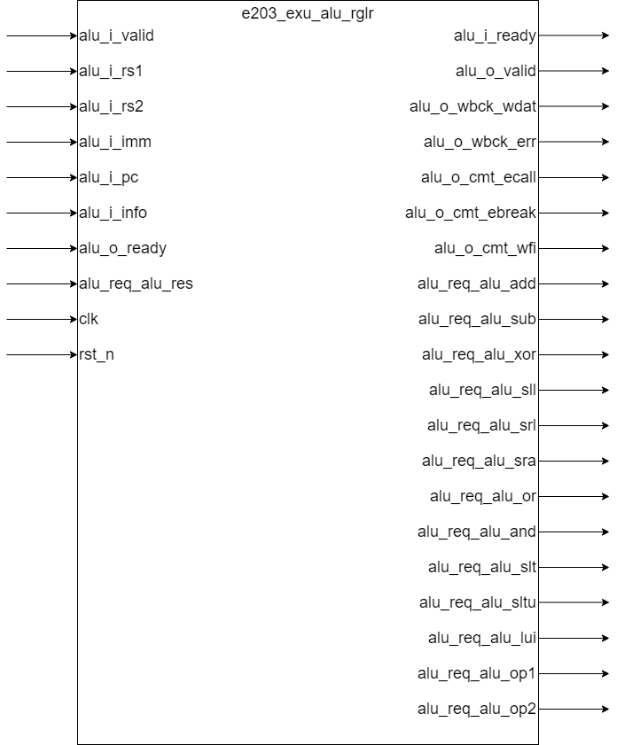

## e203_exu_alu_rglr.v Specification

## Introduction

This module is used to implement regular ALU instructions.

## Module Diagram

## Interface

| Direction | Port Name | Width | Description |
| --------- | ---------------- | ---------------------- | ---------------------------- |
| input | alu_i_valid | 1 | valid-ready handshake signal |
| output | alu_i_ready | 1 | valid-ready handshake signal |
| input | alu_i_rs1 | E203_XLEN | Source register 1 |
| input | alu_i_rs2 | E203_XLEN | Source register 2 |
| input | alu_i_imm | E203_XLEN | Instruction immediate |
| input | alu_i_pc | E203_PC_SIZE | PC value corresponding to instruction |
| input | alu_i_info | E203_DECINFO_ALU_WIDTH | ALU information bus, including instruction type and other information |
| output | alu_o_valid | 1 | valid-ready handshake signal |
| input | alu_o_ready | 1 | valid-ready handshake signal |
| output | alu_o_wbck_wdat | E203_XLEN | Retrieved result of the operation data path |
| output | alu_o_wbck_err | 1 | Write report error |
| output | alu_o_cmt_ecall | 1 | Submit ecall instruction |
| output | alu_o_cmt_ebreak | 1 | Submit ebreak instruction |
| output | alu_o_cmt_wfi | 1 | Submit wfi instruction |
| output | alu_req_alu_add | 1 | Request add operation from alu module |
| output | alu_req_alu_sub | 1 | Request sub operation from alu module |
| output | alu_req_alu_xor | 1 | Request xor operation from alu module |
| output | alu_req_alu_sll | 1 | Request sll operation from alu module |
| output | alu_req_alu_srl | 1 | Request srl operation from alu module |
| output | alu_req_alu_sra | 1 | Request sra operation from alu module |
| output | alu_req_alu_or | 1 | Request or operation from alu module |
| output | alu_req_alu_and | 1 | Request and operation from alu module |
| output | alu_req_alu_slt | 1 | Request slt operation from alu module |
| output | alu_req_alu_sltu | 1 | Request sltu operation from alu module |
| output | alu_req_alu_lui | 1 | Request lui operation from alu module |
| output | alu_req_alu_op1 | E203_XLEN | First source operand |
| output | alu_req_alu_op2 | E203_XLEN | Second source operand |
| output | alu_req_alu_res | E203_XLEN | Calculation result of shared operation data path |
| input | clk | 1 | Clock signal |
| input | rst_n | 1 | Reset signal |

## Function Description

### valid-ready handshake transmission

As the control module connecting the alu module and the calculation path, this module must pass the valid signal of the previous module to the subsequent module, and pass the ready signal of the subsequent module to the previous module

### Operation type that generates calculation

The information bus contains the type of instruction. The specific meaning of each bit in the bus needs to refer to the decoding module. This module is mainly responsible for the following instructions:

| Name             | Bits  |
| ---------------- | --------------------- |
| alu_req_alu_add  | E203_DECINFO_ALU_ADD  |
| alu_req_alu_sub  | E203_DECINFO_ALU_SUB  |
| alu_req_alu_xor  | E203_DECINFO_ALU_XOR  |
| alu_req_alu_sll  | E203_DECINFO_ALU_SLL  |
| alu_req_alu_srl  | E203_DECINFO_ALU_SRL  |
| alu_req_alu_sra  | E203_DECINFO_ALU_SRA  |
| alu_req_alu_or   | E203_DECINFO_ALU_OR   |
| alu_req_alu_and  | E203_DECINFO_ALU_AND  |
| alu_req_alu_slt  | E203_DECINFO_ALU_SLT  |
| alu_req_alu_sltu | E203_DECINFO_ALU_SLTU |
| alu_req_alu_lui  | E203_DECINFO_ALU_LUI  |

Note that nop is decoded as an ADDI instruction, so the nop case needs to be excluded when generating the `alu_req_alu_add` signal. The information indicating whether the instruction is a nop is stored in the `E203_DECINFO_ALU_NOP` bit of the alu information bus.

### Prepare the correct source operand according to the instruction information

The information bus contains the information of operand selection, as follows:

| Name | Position in info bus | Description |
| ------ | ----------------------- | ------------------------------------ |
| op2imm | E203_DECINFO_ALU_OP2IMM | When this bit is high, use the immediate value as the second source operand, otherwise, use source register 2 as the source operand |
| op1pc | E203_DECINFO_ALU_OP1PC | When the level is high, use pc as the first source operand, otherwise, use source register 1 as the source operand |

### Get the return result from the shared data path

`alu_o_wbck_wdat` gets the calculation result from the shared calculation data path module and returns it.

### Special instructions

This module is also responsible for delivering some special instructions

| Name | Position in info bus | Description |
| ------ | --------------------- | ---------------------------------------------- |
| ecall | E203_DECINFO_ALU_ECAL | Indicates that alu is going to submit an ecall instruction, pull up alu_o_cmt_ecall |
| ebreak | E203_DECINFO_ALU_EBRK | Indicates that alu is going to submit an ebreak instruction, alu_o_cmt_ebreak |
| wfi | E203_DECINFO_ALU_WFI | Indicates that alu is going to submit an wfi instruction, pull up alu_o_cmt_wfi |

When the instruction is ecall, ebreak, wfi, the calculation result cannot be written back, and the alu_o_wbck_err signal must be pulled to a high level

## Clock and Reset

This module is composed entirely of combinational logic circuits and does not respond to clock and reset signals.