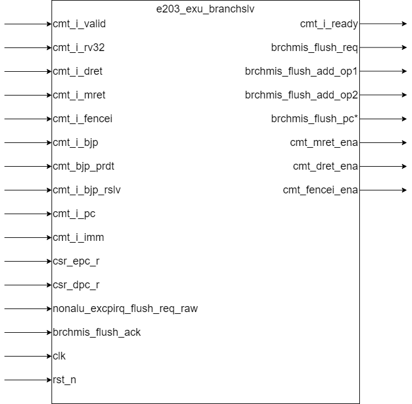

# e203_exu_branchslv.v Specification

## Introduction

This module is used to implement branch resolution in the RISC-V processor. It compares the predicted branch outcome with the actual resolved outcome, and triggers pipeline flushes when there's a misprediction. The module also handles special control flow instructions like MRET, DRET, and FENCEI.

## Module Diagram

## Interface
| Direction | Port Name | Width | Description |
|-----------|-----------|-------|-------------|
| input | cmt_i_valid | 1 | Indicates the current instruction is valid |
| output | cmt_i_ready | 1 | Indicates the branch resolver is ready to accept instruction |
| input | cmt_i_rv32 | 1 | Indicates the current instruction is 32-bit (RV32) |
| input | cmt_i_dret | 1 | Indicates the current instruction is DRET |
| input | cmt_i_mret | 1 | Indicates the current instruction is MRET |
| input | cmt_i_fencei | 1 | Indicates the current instruction is FENCE.I |
| input | cmt_i_bjp | 1 | Indicates the current instruction is a branch/jump instruction |
| input | cmt_i_bjp_prdt | 1 | The predicted outcome of the branch (taken/not taken) |
| input | cmt_i_bjp_rslv | 1 | The actual resolved outcome of the branch |
| input | cmt_i_pc | E203_PC_SIZE | The PC of the current instruction |
| input | cmt_i_imm | E203_XLEN | The immediate value from the instruction, used for branch target calculation |
| input | csr_epc_r | E203_PC_SIZE | The EPC (Exception Program Counter) register value |
| input | csr_dpc_r | E203_PC_SIZE | The DPC (Debug Program Counter) register value |
| input | nonalu_excpirq_flush_req_raw | 1 | Flush request from other modules (exceptions/interrupts) |
| input | brchmis_flush_ack | 1 | Acknowledgement of a branch mispredict flush |
| output | brchmis_flush_req | 1 | Request to flush pipeline due to branch misprediction |
| output | brchmis_flush_add_op1 | E203_PC_SIZE | First operand for calculating the flush address |
| output | brchmis_flush_add_op2 | E203_PC_SIZE | Second operand for calculating the flush address |
| output | brchmis_flush_pc | E203_PC_SIZE | The target PC for flush operations (available when `E203_TIMING_BOOST` is defined) |
| output | cmt_mret_ena | 1 | Indicates MRET instruction is being executed |
| output | cmt_dret_ena | 1 | Indicates DRET instruction is being executed |
| output | cmt_fencei_ena | 1 | Indicates FENCE.I instruction is being executed |
| input | clk | 1 | System clock |
| input | rst_n | 1 | Reset signal (active low) |

## Function Description

The Branch Resolve module performs the following key functions:

1. **Flush Need Generation**

   A flushing demand is generated when any one of the following conditions is met

   - The instruction is a branch instruction and the predicted result is different from the parsed result

   - The instruction is a FENCE.I instruction
   - The instruction is a MRET/DRET instruction

2. **Flush Target Calculation**:
   - For DRET: Sets target to debug PC register (`csr_dpc_r`)
   - For MRET: Sets target to exception PC register (`csr_epc_r`)
   - For mispredicted branches:
     - If predicted taken but actually not taken: PC+2/4 (depending on instruction width)
     - If predicted not taken but actually taken: PC+offset

3. **Pipeline Flush Control**:

   - Generates `brchmis_flush_req` when a flush is needed and `cmt_i_valid` is high, while `nonalu_excpirq_flush_req_raw` is low. Because non-alu flush (e.g., flush caused by exception and interruption) will override the ALU flush.

4. **Prioritizing Flush Sources**:
  
   - Branch misprediction flushes are masked by non-ALU exception/interrupt flushes
   
5. **Controls the ready signal for the instruction** (`cmt_i_ready`):

   The module is ready to accept submissions when one of the following conditions is met:

   - The instruction submitted is not a branch jump instruction, FENCEI instruction, MRET instruction, or DRET instruction.
   - There is no Non-ALU flush and there is no branch flush need.
   - There is no Non-ALU flush and flush has received ack.

6. **Special Signal Commit**：

   - for MRET, DRET, and FENCE.I instruction, assert corresponding commit signal (`cmt_mret_ena`, `cmt_dret_ena`, `cmt_fencei_ena`) when the current command is a special command and the req and ack of flush have already shaken hands.

### Detailed `brchmis_flush_pc` Calculation Logic

When the `E203_TIMING_BOOST` is defined, the module directly calculates the branch target address `brchmis_flush_pc` instead of just providing operands. This is implemented as a complex multiplexer with the following condition branches:

1. **First Condition Branch**: `(cmt_i_fencei | (cmt_i_bjp & cmt_i_bjp_prdt))`
   - Applies when the instruction is a FENCE.I instruction
   - Or when the instruction is a branch/jump instruction that was predicted as "taken" but is actually "not taken"
   - The target address should be the **next sequential instruction address**. The offset depends on whether the current instruction is 32-bit (RV32, increment by 4) or 16-bit (RV16, increment by 2)
2. **Second Condition Branch**: `(cmt_i_bjp & (~cmt_i_bjp_prdt))`
   - Applies when the instruction is a branch/jump instruction that was predicted as "not taken" but is actually "taken"
   - The target address should be the **branch target address**
   - Calculation: `cmt_i_pc + cmt_i_imm[`E203_PC_SIZE-1:0]`
   - Uses the immediate value (IMM) from the instruction as an offset to calculate the target address
3. **Third Condition Branch**: `cmt_i_dret`
   - Applies when the instruction is a DRET (Debug Return) instruction
   - The target address should be the **Debug Program Counter (DPC) register value**
   - Directly uses `csr_dpc_r` as the target address
5. **Default Case**:
   - If none of the above conditions are met, defaults to using `csr_epc_r` as the target address

## Clock and Reset

- The module is all combinational circuits. This module doesn't respond to `clk` and `rst_n`
