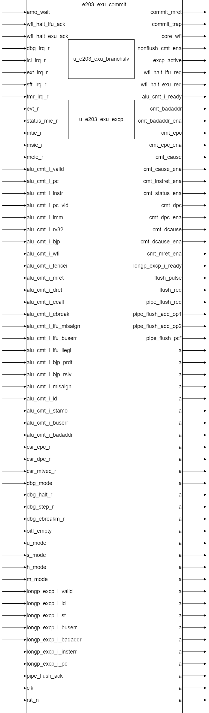

# e203_exu_commit.v Specification

## Introduction

This module implements the commit stage of the core pipeline, responsible for committing instructions or flushing the pipeline based on various conditions like exceptions, interrupts, and control flow instructions.

## Module Diagram

## Interface

| Direction | Port Name                     | Width                        | Description                                                                 |
| --------- | ------------------------------ | ---------------------------- | --------------------------------------------------------------------------- |
| output    | commit_mret                    | 1                            | Commit machine return (`mret`) operation                                    |
| output    | commit_trap                    | 1                            | Commit trap operation (for exceptions or interrupts)                        |
| output    | core_wfi                       | 1                            | Core halt request when WFI instruction is executed                          |
| output    | nonflush_cmt_ena               | 1                            | Enable signal for non-flushed commit                                       |
| output    | excp_active                    | 1                            | Indicates if an exception or interrupt is active                           |
| input     | amo_wait                       | 1                            | Signals that an atomic memory operation (AMO) is in progress                |
| output    | wfi_halt_ifu_req               | 1                            | Request to halt the IFU (Instruction Fetch Unit) when WFI is executed      |
| output    | wfi_halt_exu_req               | 1                            | Request to halt the EXU (Execution Unit) when WFI is executed              |
| input     | wfi_halt_ifu_ack               | 1                            | Acknowledge the IFU halt request                                           |
| input     | wfi_halt_exu_ack               | 1                            | Acknowledge the EXU halt request                                           |
| input     | dbg_irq_r                       | 1                            | Debug interrupt request                                                     |
| input     | lcl_irq_r                       | E203_LIRQ_NUM              | Local interrupt requests                                                    |
| input     | ext_irq_r                       | 1                            | External interrupt request                                                  |
| input     | sft_irq_r                       | 1                            | Software interrupt request                                                  |
| input     | tmr_irq_r                       | 1                            | Timer interrupt request                                                     |
| input     | evt_r                           | E203_EVT_NUM               | Event register values                                                        |
| input     | status_mie_r                   | 1                            | Machine interrupt enable status                                              |
| input     | mtie_r                          | 1                            | Machine timer interrupt enable status                                       |
| input     | msie_r                          | 1                            | Machine software interrupt enable status                                    |
| input     | meie_r                          | 1                            | Machine external interrupt enable status                                    |
| input     | alu_cmt_i_valid                | 1                            | Indicates that the ALU commit input is valid                               |
| output    | alu_cmt_i_ready                | 1                            | Ready signal for ALU commit                                                 |
| input     | alu_cmt_i_pc                   | E203_PC_SIZE               | ALU commit program counter                                                  |
| input     | alu_cmt_i_instr                | E203_INSTR_SIZE            | ALU commit instruction                                                      |
| input     | alu_cmt_i_pc_vld               | 1                            | Indicates that the ALU commit PC is valid                                   |
| input     | alu_cmt_i_imm                  | E203_XLEN                  | ALU commit immediate value                                                  |
| input     | alu_cmt_i_rv32                 | 1                            | Indicates if the instruction is RV32                                        |
| input     | alu_cmt_i_bjp                  | 1                            | Branch instruction commit                                                   |
| input     | alu_cmt_i_wfi                  | 1                            | WFI instruction commit                                                      |
| input     | alu_cmt_i_fencei               | 1                            | Fence instruction commit                                                    |
| input     | alu_cmt_i_mret                 | 1                            | MRET instruction commit                                                     |
| input     | alu_cmt_i_dret                 | 1                            | DRET instruction commit                                                     |
| input     | alu_cmt_i_ecall                | 1                            | ECALL instruction commit                                                    |
| input     | alu_cmt_i_ebreak               | 1                            | EBREAK instruction commit                                                   |
| input     | alu_cmt_i_ifu_misalgn          | 1                            | IFU misalignment exception signal                                           |
| input     | alu_cmt_i_ifu_buserr           | 1                            | IFU bus error exception signal                                              |
| input     | alu_cmt_i_ifu_ilegl            | 1                            | IFU illegal instruction exception signal                                    |
| input     | alu_cmt_i_bjp_prdt             | 1                            | Branch prediction result                                                     |
| input     | alu_cmt_i_bjp_rslv             | 1                            | Branch resolution result                                                     |
| input     | alu_cmt_i_misalgn              | 1                            | Misalignment exception signal                                               |
| input     | alu_cmt_i_ld                   | 1                            | Load instruction exception signal                                           |
| input     | alu_cmt_i_stamo                | 1                            | Store/AMO instruction exception signal                                      |
| input     | alu_cmt_i_buserr               | 1                            | Bus error exception signal                                                  |
| input     | alu_cmt_i_badaddr              | E203_ADDR_SIZE             | Bad address resulting from an exception                                      |
| output    | cmt_badaddr                    | E203_ADDR_SIZE             | Commit bad address                                                            |
| output    | cmt_badaddr_ena                | 1                            | Enable signal for commit bad address                                         |
| output    | cmt_epc                        | E203_PC_SIZE               | Commit exception program counter                                             |
| output    | cmt_epc_ena                    | 1                            | Enable signal for commit exception program counter                           |
| output    | cmt_cause                      | E203_XLEN                  | Commit exception cause                                                        |
| output    | cmt_cause_ena                  | 1                            | Enable signal for commit exception cause                                      |
| output    | cmt_instret_ena                | 1                            | Enable signal for commit instruction retirement                              |
| output    | cmt_status_ena                 | 1                            | Enable signal for commit status register update                              |
| output    | cmt_dpc                        | E203_PC_SIZE               | Commit debug program counter                                                  |
| output    | cmt_dpc_ena                    | 1                            | Enable signal for commit debug program counter                                |
| output    | cmt_dcause                     | 3                            | Commit debug cause register value                                            |
| output    | cmt_dcause_ena                 | 1                            | Enable signal for commit debug cause register update                         |
| output    | cmt_mret_ena                   | 1                            | Enable signal for commit return from trap (MRET) operation                   |
| input     | csr_epc_r                      | E203_PC_SIZE               | CSR EPC register value                                                         |
| input     | csr_dpc_r                      | E203_PC_SIZE               | CSR DPC register value                                                         |
| input     | csr_mtvec_r                    | E203_XLEN                  | CSR MTVec register value                                                      |
| input     | dbg_mode                       | 1                            | Debug mode status                                                              |
| input     | dbg_halt_r                     | 1                            | Debug halt request signal                                                      |
| input     | dbg_step_r                     | 1                            | Debug step request signal                                                      |
| input     | dbg_ebreakm_r                  | 1                            | Debug EBREAK request signal                                                    |
| input     | oitf_empty                     | 1                            | Indicates if the OITF is empty                                                |
| input     | u_mode                         | 1                            | User mode status (always 0)                                                   |
| input     | s_mode                         | 1                            | Supervisor mode status (always 0)                                             |
| input     | h_mode                         | 1                            | Hypervisor mode status (always 0)                                             |
| input     | m_mode                         | 1                            | Machine mode status (always 1)                                                |
| output    | longp_excp_i_ready             | 1                            | Long-pipe exception input ready signal                                        |
| input     | longp_excp_i_valid             | 1                            | Long-pipe exception input valid signal                                        |
| input     | longp_excp_i_ld                | 1                            | Long-pipe exception load signal                                               |
| input     | longp_excp_i_st                | 1                            | Long-pipe exception store signal                                              |
| input     | longp_excp_i_buserr            | 1                            | Long-pipe exception bus error signal                                          |
| input     | longp_excp_i_badaddr           | E203_ADDR_SIZE             | Long-pipe exception bad address signal                                        |
| input     | longp_excp_i_insterr           | 1                            | Long-pipe exception instruction error signal                                  |
| input     | longp_excp_i_pc                | E203_PC_SIZE               | Long-pipe exception program counter                                           |
| Output    | `flush_pulse`         | 1               | Indicates a flush pulse signal to the IFU.                   |
| Output    | `flush_req`           | 1               | Requests pipeline flush from a non-ALU source (e.g., MUL/div state machine) to avoid combinational loops. |
| Input     | `pipe_flush_ack`      | 1               | Acknowledges the pipeline flush request.                     |
| Output    | `pipe_flush_req`      | 1               | Sends a flush request to the pipeline.                       |
| Output    | `pipe_flush_add_op1`  | `E203_PC_SIZE`  | First operand for the flush PC adder in the IFU.             |
| Output    | `pipe_flush_add_op2`  | `E203_PC_SIZE`  | Second operand for the flush PC adder in the IFU.            |
| Output    | `pipe_flush_pc`       | `E203_PC_SIZE`  | Provides the flush PC directly to the IFU, enabled by the `E203_TIMING_BOOST` macro. |
| Input     | `clk`                 | 1               | Clock signal for synchronization.                            |
| Input     | `rst_n`               | 1               | Active-low reset signal. |

## Submodule List

### e203_exu_excp

**Function Introduction**:

The `e203_exu_excp` module is responsible for handling exceptions and interrupts in the RISC-V processor. It manages various types of exceptions, including ALU exceptions, long-pipe exceptions, and debug-related exceptions. The module also handles the WFI (Wait for Interrupt) instruction and ensures proper flushing of the pipeline when exceptions occur.

**Interface List**:

| Direction | Port Name                    | Width           | Description                                                  |
| --------- | ---------------------------- | --------------- | ------------------------------------------------------------ |
| output    | commit_trap                  | 1               | Indicates a trap has been committed                          |
| output    | core_wfi                     | 1               | Indicates the core is in WFI state                           |
| output    | wfi_halt_ifu_req             | 1               | Request to halt the IFU due to WFI                           |
| output    | wfi_halt_exu_req             | 1               | Request to halt the EXU due to WFI                           |
| input     | wfi_halt_ifu_ack             | 1               | Acknowledge from IFU for WFI halt request                    |
| input     | wfi_halt_exu_ack             | 1               | Acknowledge from EXU for WFI halt request                    |
| input     | amo_wait                     | 1               | Indicates AMO instruction is waiting                         |
| input     | alu_excp_i_valid             | 1               | ALU exception valid signal                                   |
| input     | alu_excp_i_ld                | 1               | ALU load exception                                           |
| input     | alu_excp_i_stamo             | 1               | ALU store/AMO exception                                      |
| input     | alu_excp_i_misalgn           | 1               | ALU misalignment exception                                   |
| input     | alu_excp_i_buserr            | 1               | ALU bus error exception                                      |
| input     | alu_excp_i_ecall             | 1               | ALU ecall exception                                          |
| input     | alu_excp_i_ebreak            | 1               | ALU ebreak exception                                         |
| input     | alu_excp_i_wfi               | 1               | ALU WFI exception                                            |
| input     | alu_excp_i_ifu_misalgn       | 1               | IFU misalignment exception                                   |
| input     | alu_excp_i_ifu_buserr        | 1               | IFU bus error exception                                      |
| input     | alu_excp_i_ifu_ilegl         | 1               | IFU illegal instruction exception                            |
| input     | alu_excp_i_pc                | E203_PC_SIZE    | PC value associated with ALU exception                       |
| input     | alu_excp_i_instr             | E203_INSTR_SIZE | Instruction causing ALU exception                            |
| input     | alu_excp_i_pc_vld            | 1               | PC value valid signal                                        |
| input     | longp_excp_i_valid           | 1               | Long-pipe exception valid signal                             |
| input     | longp_excp_i_ld              | 1               | Long-pipe load exception                                     |
| input     | longp_excp_i_st              | 1               | Long-pipe store exception                                    |
| input     | longp_excp_i_buserr          | 1               | Long-pipe bus error exception                                |
| input     | longp_excp_i_insterr         | 1               | Long-pipe instruction error                                  |
| input     | longp_excp_i_badaddr         | E203_ADDR_SIZE  | Bad address for long-pipe exception                          |
| input     | longp_excp_i_pc              | E203_PC_SIZE    | PC value associated with long-pipe exception                 |
| input     | excpirq_flush_ack            | 1               | Acknowledge for exception/interrupt flush                    |
| output    | excpirq_flush_req            | 1               | Request to flush pipeline due to exception/interrupt         |
| output    | nonalu_excpirq_flush_req_raw | 1               | Raw request to flush pipeline for non-ALU exceptions/interrupts |
| output    | excpirq_flush_add_op1        | E203_PC_SIZE    | Operand 1 for flush address calculation                      |
| output    | excpirq_flush_add_op2        | E203_PC_SIZE    | Operand 2 for flush address calculation                      |
| input     | csr_mtvec_r                  | E203_XLEN       | CSR mtvec value                                              |
| input     | cmt_dret_ena                 | 1               | Debug return enable                                          |
| input     | cmt_ena                      | 1               | Commit enable                                                |
| output    | cmt_badaddr                  | E203_ADDR_SIZE  | Bad address for exception                                    |
| output    | cmt_epc                      | E203_PC_SIZE    | Exception PC                                                 |
| output    | cmt_cause                    | E203_XLEN       | Exception cause                                              |
| output    | cmt_badaddr_ena              | 1               | Enable for bad address update                                |
| output    | cmt_epc_ena                  | 1               | Enable for EPC update                                        |
| output    | cmt_cause_ena                | 1               | Enable for cause update                                      |
| output    | cmt_status_ena               | 1               | Enable for status update                                     |
| output    | cmt_dpc                      | E203_PC_SIZE    | Debug PC                                                     |
| output    | cmt_dpc_ena                  | 1               | Enable for debug PC update                                   |
| output    | cmt_dcause                   | 3               | Debug cause                                                  |
| output    | cmt_dcause_ena               | 1               | Enable for debug cause update                                |
| input     | dbg_irq_r                    | 1               | Debug interrupt request                                      |
| input     | lcl_irq_r                    | E203_LIRQ_NUM   | Local interrupt requests                                     |
| input     | ext_irq_r                    | 1               | External interrupt request                                   |
| input     | sft_irq_r                    | 1               | Software interrupt request                                   |
| input     | tmr_irq_r                    | 1               | Timer interrupt request                                      |
| input     | status_mie_r                 | 1               | Machine interrupt enable                                     |
| input     | mtie_r                       | 1               | Machine timer interrupt enable                               |
| input     | msie_r                       | 1               | Machine software interrupt enable                            |
| input     | meie_r                       | 1               | Machine external interrupt enable                            |
| input     | dbg_mode                     | 1               | Debug mode                                                   |
| input     | dbg_halt_r                   | 1               | Debug halt request                                           |
| input     | dbg_step_r                   | 1               | Debug step request                                           |
| input     | dbg_ebreakm_r                | 1               | Debug ebreak request                                         |
| input     | oitf_empty                   | 1               | OITF empty signal                                            |
| input     | u_mode                       | 1               | User mode                                                    |
| input     | s_mode                       | 1               | Supervisor mode                                              |
| input     | h_mode                       | 1               | Hypervisor mode                                              |
| input     | m_mode                       | 1               | Machine mode                                                 |
| output    | excp_active                  | 1               | Exception active signal                                      |
| input     | clk                          | 1               | Clock signal                                                 |
| input     | rst_n                        | 1               | Reset signal                                                 |

### e203_exu_branchslv

**Function Introduction**

This module is used to implement branch resolution in the RISC-V processor, handling branch prediction outcomes and generating pipeline flush signals when branch misprediction occurs.

**Interface**

| Direction | Port Name                    | Width        | Description                                                  |
| --------- | ---------------------------- | ------------ | ------------------------------------------------------------ |
| input     | cmt_i_valid                  | 1            | Indicates the current instruction is valid                   |
| output    | cmt_i_ready                  | 1            | Indicates the branch resolver is ready to accept instruction |
| input     | cmt_i_rv32                   | 1            | Indicates the current instruction is 32-bit (RV32)           |
| input     | cmt_i_dret                   | 1            | Indicates the current instruction is DRET                    |
| input     | cmt_i_mret                   | 1            | Indicates the current instruction is MRET                    |
| input     | cmt_i_fencei                 | 1            | Indicates the current instruction is FENCE.I                 |
| input     | cmt_i_bjp                    | 1            | Indicates the current instruction is a branch/jump instruction |
| input     | cmt_i_bjp_prdt               | 1            | The predicted outcome of the branch (taken/not taken)        |
| input     | cmt_i_bjp_rslv               | 1            | The actual resolved outcome of the branch                    |
| input     | cmt_i_pc                     | E203_PC_SIZE | The PC of the current instruction                            |
| input     | cmt_i_imm                    | E203_XLEN    | The immediate value from the instruction, used for branch target calculation |
| input     | csr_epc_r                    | E203_PC_SIZE | The EPC (Exception Program Counter) register value           |
| input     | csr_dpc_r                    | E203_PC_SIZE | The DPC (Debug Program Counter) register value               |
| input     | nonalu_excpirq_flush_req_raw | 1            | Flush request from other modules (exceptions/interrupts)     |
| input     | brchmis_flush_ack            | 1            | Acknowledgement of a branch mispredict flush                 |
| output    | brchmis_flush_req            | 1            | Request to flush pipeline due to branch misprediction        |
| output    | brchmis_flush_add_op1        | E203_PC_SIZE | First operand for calculating the flush address              |
| output    | brchmis_flush_add_op2        | E203_PC_SIZE | Second operand for calculating the flush address             |
| output    | brchmis_flush_pc             | E203_PC_SIZE | The target PC for flush operations (when timing boost option is enabled) |
| output    | cmt_mret_ena                 | 1            | Indicates MRET instruction is being executed                 |
| output    | cmt_dret_ena                 | 1            | Indicates DRET instruction is being executed                 |
| output    | cmt_fencei_ena               | 1            | Indicates FENCE.I instruction is being executed              |
| input     | clk                          | 1            | System clock                                                 |
| input     | rst_n                        | 1            | Reset signal (active low)                                    |

## Function Description

### Commit and Flush Logic

- **Commit Signals**:

  - `commit_mret`: This signal indicates that a machine return (`mret`) has occurred.

  - `commit_trap`: This signal indicates that a trap (exception or interruption) has occurred.

  - `cmt_ena`: This signal indicates that `alu_cmt_i_valid` and `alu_cmt_i_ready` have completed the handshake and enabled the delivery

  - `cmt_instret_ena`: When the delivery is executed and no flush request for alu branch prediction error is received, pull this signal high to update the executed instruction count register.
  - `nonflush_cmt_ena`: Generates the signal as the real_commit enable (non_flush)

- **Exception Handling**:
  - exception-related operations are handled with submodule `e203_exu_excp`. This module just instantiate `e203_exu_excp` and connect related signals.

- **Flush Logic**:

    The module is capable of triggering a pipeline flush (`flush_req`,`flush_pulse`, `pipe_flush_req`) when required by exceptions, interrupts, or special instructions. It handles the request and acknowledgment between IFU and EXU to ensure proper pipeline flushing.

    - `pipe_flush_req`: Pull high when the exception handling module or branch resolution module issues a flush request

    - `flush_pulse`: Pull high when the flush request(`pipe_flush_req`) and response(`pipe_flush_ack`) are completed, indicating that a flush signal is generated

    - `flush_req`: To cut the combinational loop, we need this flush_req from non-alu source to flush ALU pipeline (e.g., MUL-div statemachine)

- PC Computation

    - When the pipeline is flushed, a new PC address needs to be selected according to the situation. This module generates `pipe_flush_add_op1` and `pipe_flush_add_op2` signals to support this function. If `E203_TIMING_BOOST` is defined, this module output `pipe_flush_pc` as the new PC address directly.
    - **PC Source Selection**: When the flush request comes from an exception or interrupt, the operand from the exception handling module is used, otherwise the operand from the branch resolution module is used.

## Clock and Reset

This module does not respond directly to clock and reset signals, but passes the clock and reset signals directly to the submodules.
