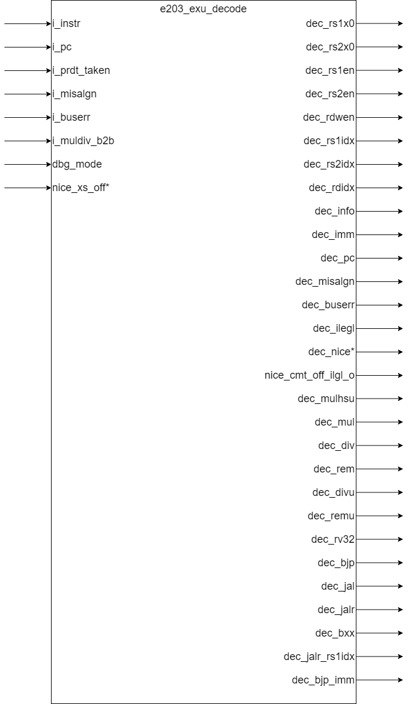

# e203_exu_decode.v Specification

## Introduction

This module is used to decode 32-bit and 16-bit instructions according to the RISC-V instruction encoding rules. It generates instruction type information, read and write operand register indices, and other related signals.

## Design Overview

## Interface

**Basic Interface**

| Direction | Port Name       | Width              | Description                                           |
| --------- | --------------- | ------------------ | ----------------------------------------------------- |
| input     | i_instr         | E203_INSTR_SIZE    | 32-bit instruction                                    |
| input     | i_pc            | E203_PC_SIZE       | The current instruction's corresponding PC value      |
| input     | i_prdt_taken    | 1                  | Prediction of whether the branch is taken            |
| input     | i_misalgn       | 1                  | Indicates that the current instruction has an alignment exception |
| input     | i_buserr        | 1                  | Indicates that the current instruction caused a bus access error |
| input     | i_muldiv_b2b    | 1                  | The back-to-back case for multiply/divide instructions |
| input     | dbg_mode        | 1                  | Debug mode                                            |
| output    | dec_rs1x0       | 1                  | Indicates that the source operand 1 register index is x0 |
| output    | dec_rs2x0       | 1                  | Indicates that the source operand 2 register index is x0 |
| output    | dec_rs1en       | 1                  | Indicates that the instruction needs to read source operand 1 |
| output    | dec_rs2en       | 1                  | Indicates that the instruction needs to read source operand 2 |
| output    | dec_rdwen       | 1                  | Indicates that the instruction needs to write the result |
| output    | dec_rs1idx      | E203_RFIDX_WIDTH   | The index of the source register 1                   |
| output    | dec_rs2idx      | E203_RFIDX_WIDTH   | The index of the source register 2                   |
| output    | dec_rdidx       | E203_RFIDX_WIDTH   | The index of the destination register                |
| output    | dec_info        | E203_DECINFO_WIDTH | Other information about the instruction, grouped into a wide signal called the information bus |
| output    | dec_imm         | E203_XLEN          | The immediate value used by the instruction          |
| output    | dec_pc          | E203_PC_SIZE       | The PC value of the current instruction              |
| output    | dec_misalgn     | 1                  | Indicates that the instruction caused an alignment exception |
| output    | dec_buserr      | 1                  | Indicates that the instruction caused a bus error    |
| output    | dec_ilegl       | 1                  | Indicates that the decoded instruction is illegal    |
| output    | dec_mulhsu      | 1                  | Indicates that the instruction is `mulhsu`           |
| output    | dec_mul         | 1                  | Indicates that the instruction is `mul`              |
| output    | dec_div         | 1                  | Indicates that the instruction is `div`              |
| output    | dec_rem         | 1                  | Indicates that the instruction is `rem`              |
| output    | dec_divu        | 1                  | Indicates that the instruction is `divu`             |
| output    | dec_remu        | 1                  | Indicates that the instruction is `remu`             |
| output    | dec_rv32        | 1                  | Indicates whether the instruction is 32-bit or 16-bit |
| output    | dec_bjp         | 1                  | Indicates that the instruction is `jal`, `jalr`, or branch instructions like `beqz` or `bnez` |
| output    | dec_jal         | 1                  | Indicates that the instruction is `jal`              |
| output    | dec_jalr        | 1                  | Indicates that the instruction is `jalr` or `jr`     |
| output    | dec_bxx         | 1                  | Indicates that the instruction is a branch instruction |
| output    | dec_jalr_rs1idx | E203_RFIDX_WIDTH   | The register index used for `jalr` jump instructions |
| output    | dec_bjp_imm     | E203_XLEN          | The immediate value used by branch and jump instructions |

**Optional Interface**

If `E203_HAS_NICE` is defined, the following interfaces are available:

| Direction | Name                | Width | Description                   |
| --------- | ------------------- | ----- | ----------------------------- |
| input     | nice_xs_off         | 1     | Indicates that the NICE extension is disabled |
| output    | dec_nice            | 1     | Indicates that the instruction is a NICE extension instruction |
| output    | nice_cmt_off_ilgl_o | 1     | Indicates that the NICE instruction is illegal if the NICE extension is disabled |

## Operation

### Instruction Decoding

The `e203_exu_decode` module decodes the input instruction into the information bus and several control signals, as detailed below:

- `dec_rs1x0`: 1 if the first operand register index is `x0`, otherwise 0.
- `dec_rs2x0`: 1 if the second operand register index is `x0`, otherwise 0.
- `dec_rs1en`: 1 if the instruction requires source operand 1 (applies to both 32-bit and 16-bit instructions), otherwise 0.
- `dec_rs2en`: 1 if the instruction requires source operand 2 (applies to both 32-bit and 16-bit instructions), otherwise 0.
- `dec_rdwen`: 1 if the instruction writes back to a register, otherwise 0.
- `dec_rs1idx`: The decoded index of source register 1.
- `dec_rs2idx`: The decoded index of source register 2.
- `dec_rdidx`: The decoded index of the destination register.
- `dec_info`: The decoded information bus, with specific meanings for each bit defined in the subsequent sections.
- `dec_imm`: The immediate value used by the instruction.
- `dec_pc`: The program counter value of the instruction.
- `dec_misalgn`: Propagates the misalignment error signal during instruction fetch.
- `dec_buserr`: Propagates the bus error signal during instruction fetch.
- `dec_ilegl`: Indicates various cases of illegal instructions, detailed later.
- `nice_xs_off`: 1 if the NICE coprocessor is disabled.
- `dec_nice`: Indicates that the instruction is a NICE instruction.
- `nice_cmt_off_ilgl_o`: 1 if the instruction is a NICE instruction and the NICE coprocessor is disabled, otherwise 0.
- `dec_mulhsu`: 1 if the instruction is one of `mulh`, `mulhu`, or `mulhsu`, otherwise 0.
- `dec_mul`: 1 if the instruction is `mul`, otherwise 0.
- `dec_div`: 1 if the instruction is `div`, otherwise 0.
- `dec_rem`: 1 if the instruction is `rem`, otherwise 0.
- `dec_divu`: 1 if the instruction is `divu`, otherwise 0.
- `dec_remu`: 1 if the instruction is `remu`, otherwise 0.
- `dec_rv32`: 1 for 32-bit instructions, 0 for 16-bit instructions.
- `dec_bjp`: 1 for `jal`, `jalr`, or branch instructions (`beqz`, `bnez`), otherwise 0.
- `dec_jal`: 1 for `jal`, otherwise 0.
- `dec_jalr`: 1 for `jalr`, otherwise 0.
- `dec_bxx`: 1 for branch instructions or `beqz`, `bnez`, otherwise 0.
- `dec_jalr_rs1idx`: The decoded index of the register used for `jalr` instructions.
- `dec_bjp_imm`: The immediate value used for branch and jump instructions.

### Information Bus

The lower bits of `dec_info` are connected to one of the following buses: `alu_info_bus`, `agu_info_bus`, `bjp_info_bus`, `csr_info_bus`, `muldiv_info_bus`, or `nice_info_bus`, depending on which group the instruction belongs to. The remaining higher bits are grounded.

#### General Info Bus

| Bit                 | Description                                                  |
| ------------------- | ------------------------------------------------------------ |
| `E203_DECINFO_GRP`  | Instruction group identifier, set to `E203_DECINFO_GRP_AGU`, indicating Address Generation Unit (AGU) instructions. |
| `E203_DECINFO_RV32` | Indicates whether the instruction is in 32-bit RISC-V mode.  |

#### ALU Info Bus 

| **Bit**                   | Description                                                  |
| ------------------------- | ------------------------------------------------------------ |
| `E203_DECINFO_ALU_ADD`    | Indicates addition instructions, including `ADD`, `ADDI`, `AUIPC`, and their 16-bit counterparts like `ADDI4SPN`, `ADDI`, `ADDI16SP`, and `ADD`. Also includes `LI` and `MV` because they add `x0` with a register or immediate and write into `RD`. |
| `E203_DECINFO_ALU_SUB`    | Indicates subtraction instructions, such as `SUB` and `SUB` in 16-bit instructions. |
| `E203_DECINFO_ALU_SLT`    | Indicates set-less-than instructions, including `SLT` and `SLTI`. |
| `E203_DECINFO_ALU_SLTU`   | Indicates set-less-than-unsigned instructions, including `SLTU` and `SLTIU`. |
| `E203_DECINFO_ALU_XOR`    | Indicates XOR instructions, including `XOR`, `XORI`, and their 16-bit counterpart. |
| `E203_DECINFO_ALU_SLL`    | Indicates shift-left-logical instructions, including `SLL`, `SLLI`, and their 16-bit counterpart. |
| `E203_DECINFO_ALU_SRL`    | Indicates shift-right-logical instructions, including `SRL`, `SRLI`, and their 16-bit counterpart. |
| `E203_DECINFO_ALU_SRA`    | Indicates shift-right-arithmetic instructions, including `SRA`, `SRAI`, and their 16-bit counterpart. |
| `E203_DECINFO_ALU_OR`     | Indicates OR instructions, including `OR`, `ORI`, and their 16-bit counterpart. |
| `E203_DECINFO_ALU_AND`    | Indicates AND instructions, including `AND`, `ANDI`, and their 16-bit counterparts like `ANDI` and `AND`. |
| `E203_DECINFO_ALU_LUI`    | Indicates load-upper-immediate instructions, such as `LUI` and its 16-bit counterpart. |
| `E203_DECINFO_ALU_OP2IMM` | Indicates that the second operand is an immediate value (`need_imm`). |
| `E203_DECINFO_ALU_OP1PC`  | Indicates that the first operand is the current program counter (`AUIPC`). |
| `E203_DECINFO_ALU_NOP`    | Indicates no-operation instructions, including `NOP` and its 16-bit counterpart. |
| `E203_DECINFO_ALU_ECAL`   | Indicates environment call instructions (`ECALL`).           |
| `E203_DECINFO_ALU_EBRK`   | Indicates environment break instructions, including `EBREAK` and its 16-bit counterpart. |
| `E203_DECINFO_ALU_WFI`    | Indicates wait-for-interrupt instructions (`WFI`).           |

#### AGU Info Bus

| **Bit**                  | Description                                     |
| ------------------------ | ---------------------------------------------------------- |
| `E203_DECINFO_AGU_LOAD`  | Indicates load instructions, such as `LOAD`, `LR.W`, and their 16-bit counterparts. |
| `E203_DECINFO_AGU_STORE` | Indicates store instructions, such as `STORE`, `SC.W`, and their 16-bit counterparts. |
| `E203_DECINFO_AGU_SIZE`  | Specifies the size of the load/store operation (e.g., byte, halfword, word). |
| `E203_DECINFO_AGU_USIGN` | Indicates whether the load/store operation is unsigned. |
| `E203_DECINFO_AGU_EXCL`  | Indicates exclusive instructions, such as `LR.W` and `SC.W`. |
| `E203_DECINFO_AGU_AMO`   | Indicates atomic memory operation (AMO) instructions, excluding `LR.W` and `SC.W`. |
| `E203_DECINFO_AGU_AMOSWAP` | Indicates atomic swap operations (`AMOSWAP.W`). |
| `E203_DECINFO_AGU_AMOADD`  | Indicates atomic addition operations (`AMOADD.W`). |
| `E203_DECINFO_AGU_AMOAND`  | Indicates atomic AND operations (`AMOAND.W`). |
| `E203_DECINFO_AGU_AMOOR`   | Indicates atomic OR operations (`AMOOR.W`). |
| `E203_DECINFO_AGU_AMOXOR`  | Indicates atomic XOR operations (`AMOXOR.W`). |
| `E203_DECINFO_AGU_AMOMAX`  | Indicates atomic signed maximum operations (`AMOMAX.W`). |
| `E203_DECINFO_AGU_AMOMIN`  | Indicates atomic signed minimum operations (`AMOMIN.W`). |
| `E203_DECINFO_AGU_AMOMAXU` | Indicates atomic unsigned maximum operations (`AMOMAXU.W`). |
| `E203_DECINFO_AGU_AMOMINU` | Indicates atomic unsigned minimum operations (`AMOMINU.W`). |
| `E203_DECINFO_AGU_OP2IMM`  | Indicates that the second operand is an immediate value. |

#### BJP Info Bus

| **Bit**                   | **Meaning**                                                  |
| ------------------------- | ------------------------------------------------------------ |
| `E203_DECINFO_BJP_JUMP`   | Indicates jump instructions, such as `JAL` and `JALR`.       |
| `E203_DECINFO_BJP_BPRDT`  | Indicates the branch prediction result (`i_prdt_taken`).     |
| `E203_DECINFO_BJP_BEQ`    | Indicates conditional branch instructions `BEQ` or `BEQZ`.   |
| `E203_DECINFO_BJP_BNE`    | Indicates conditional branch instructions `BNE` or `BNEZ`.   |
| `E203_DECINFO_BJP_BLT`    | Indicates conditional branch instructions `BLT` (signed less than). |
| `E203_DECINFO_BJP_BGT`    | Indicates conditional branch instructions `BGT` (signed greater than). |
| `E203_DECINFO_BJP_BLTU`   | Indicates conditional branch instructions `BLTU` (unsigned less than). |
| `E203_DECINFO_BJP_BGTU`   | Indicates conditional branch instructions `BGTU` (unsigned greater than). |
| `E203_DECINFO_BJP_BXX`    | Indicates generic conditional branch instructions (`dec_bxx`). |
| `E203_DECINFO_BJP_MRET`   | Indicates the `MRET` (Machine Mode Return) privilege instruction. |
| `E203_DECINFO_BJP_DRET`   | Indicates the `DRET` (Debug Mode Return) debug instruction.  |
| `E203_DECINFO_BJP_FENCE`  | Indicates memory barrier instructions (`FENCE`).             |
| `E203_DECINFO_BJP_FENCEI` | Indicates instruction barrier instructions (`FENCE.I`).      |

#### CSR Info Bus

| **Bit**                   | **Meaning**                                                  |
| ------------------------- | ------------------------------------------------------------ |
| `E203_DECINFO_CSR_CSRRW`  | Indicates CSR read/write instructions (`CSRRW`, `CSRRWI`).   |
| `E203_DECINFO_CSR_CSRRS`  | Indicates CSR set instructions (`CSRRS`, `CSRRSI`).          |
| `E203_DECINFO_CSR_CSRRC`  | Indicates CSR clear instructions (`CSRRC`, `CSRRCI`).        |
| `E203_DECINFO_CSR_RS1IMM` | Indicates that the source operand (`RS1`) is an immediate value. |
| `E203_DECINFO_CSR_ZIMMM`  | Represents the `RS1` operand value, possibly an immediate.   |
| `E203_DECINFO_CSR_RS1IS0` | Indicates whether `RS1` is the zero register (`x0`).         |
| `E203_DECINFO_CSR_CSRIDX` | Indicates the index of the CSR (`CSR` address in bits `[31:20]`). |

#### MULDIV Info Bus

| **Bit**                  | **Meaning**                                                |
| ------------------------ | ---------------------------------------------------------- |
| `E203_DECINFO_MULDIV_MUL`| Indicates the `MUL` instruction.                           |
| `E203_DECINFO_MULDIV_MULH`| Indicates the `MULH` instruction for signed high multiplication. |
| `E203_DECINFO_MULDIV_MULHSU`| Indicates the `MULHSU` instruction for mixed-sign high multiplication. |
| `E203_DECINFO_MULDIV_MULHU`| Indicates the `MULHU` instruction for unsigned high multiplication. |
| `E203_DECINFO_MULDIV_DIV`| Indicates the `DIV` instruction for signed division.       |
| `E203_DECINFO_MULDIV_DIVU`| Indicates the `DIVU` instruction for unsigned division.   |
| `E203_DECINFO_MULDIV_REM`| Indicates the `REM` instruction for signed remainder.      |
| `E203_DECINFO_MULDIV_REMU`| Indicates the `REMU` instruction for unsigned remainder.  |
| `E203_DECINFO_MULDIV_B2B`| Indicates whether the instruction is in Back-to-Back mode for multiply/divide operations (`i_muldiv_b2b`). |

#### NICE Info Bus

| **Bit**                   | **Meaning**                                                  |
| ------------------------- | ------------------------------------------------------------ |
| `E203_DECINFO_NICE_INSTR` | Indicates that the instruction is a custom NICE instruction. |

### Handle Illegal Conditions

`dec_ilegl` is the union of all illegal cases. When the following illegal situations occur, dec_ilegl is set to 1

| Illegal Condition          | Description                                               |
| -------------------------- | --------------------------------------------------------- |
| All-0/1 instructions       | 32-bit/16-bit instructions with all bits set to 0 or 1.   |
| Invalid register index      | If `E203_RFREG_NUM_IS_32` is defined, no error; if `E203_RFREG_NUM_IS_16`, illegal if the decoded `rs1/rs2/rd` index exceeds 16; similar rules apply for `E203_RFREG_NUM_IS_8` and `E203_RFREG_NUM_IS_4`. |
| Illegal `addi16sp`         | `C.ADDI16SP` is illegal if the immediate is 0.            |
| Illegal `addi4spn`         | `C.ADDI4SPN` is illegal if the immediate is 0.            |
| Illegal `li/lui`           | `C.LI` is illegal if `rd` equals `x0`; `C.LUI` is illegal if `rd` is `x0` or `x2` or the immediate is 0. |
| Illegal 16-bit shift offset| For shift instructions (`C.SLLI`, `C.SRLI`, `C.SRAI`), the highest bit of the offset must be 0, and the lower bits cannot all be 0. |
| Illegal 32-bit shift offset| For shift instructions (`slli`, `srli`, `srai`), the highest bit of the offset must be 0. |
| Illegal `dret`             | `dret` is illegal if the processor is not in debug mode (`dbg_mode != 1`). |
| Illegal `lwsp`             | `lwsp` is illegal if `rd` equals 0.                       |
| Illegal operands           | Illegal if the operands do not match any defined instructions. |

## Intruction Set

The instructions supported by the processor are as follows

### R-Type

R-type instruction format:

| **Bit Range** | **Field** | **Meaning**                                 |
| ------------- | --------- | ------------------------------------------- |
| [31:25]       | `funct7`  | Function code to differentiate operations   |
| [24:20]       | `rs2`     | Source register 2                           |
| [19:15]       | `rs1`     | Source register 1                           |
| [14:12]       | `funct3`  | Sub-operation code                          |
| [11:7]        | `rd`      | Destination register                        |
| [6:0]         | `opcode`  | Operation type (e.g., `0110011` for R-Type) |

R-type Instructions in RV32I

| **Instruction** | **Description**          | func7   | funct3 | opcode  |
| --------------- | ------------------------ | ------- | ------ | ------- |
| `add`           | Add                      | 0000000 | 000    | 0110011 |
| `sub`           | Subtract                 | 0100000 | 000    | 0110011 |
| `sll`           | Shift left logical       | 0000000 | 001    | 0110011 |
| `slt`           | Set less than (signed)   | 0000000 | 010    | 0110011 |
| `sltu`          | Set less than (unsigned) | 0000000 | 011    | 0110011 |
| `xor`           | Exclusive OR             | 0000000 | 100    | 0110011 |
| `srl`           | Shift right logical      | 0000000 | 101    | 0110011 |
| `sra`           | Shift right arithmetic   | 0100000 | 101    | 0110011 |
| `or`            | OR                       | 0000000 | 110    | 0110011 |
| `and`           | AND                      | 0000000 | 111    | 0110011 |

R-type Instructions in RV32A:

| **Instruction** | **Description**          | func7   | funct3 | opcode  |
| --------------- | ------------------------ | ------- | ------ | ------- |
| `lr.w`          | Load Reserved: Reads a word from memory and sets up a reservation. | `{00010,aq,rl}` | `010`  | `0101111` |
| `sc.w`          | Store Conditional: Writes a word to memory if the reservation is still valid. | `{00011,aq,rl}` | `010`  | `0101111` |
| `amoswap.w`     | Atomic Swap: Swaps a value in memory with a register value.  | `{00001,aq,rl}` | `010`  | `0101111` |
| `amoadd.w`      | Atomic Add: Adds a value from a register to a memory location atomically. | `{00000,aq,rl}` | `010`  | `0101111` |
| `amoxor.w`      | Atomic XOR: Performs a bitwise XOR between a value in memory and a register. | `{00100,aq,rl}` | `010`  | `0101111` |
| `amoand.w`      | Atomic AND: Performs a bitwise AND between a value in memory and a register. | `{01100,aq,rl}` | `010`  | `0101111` |
| `amoor.w`       | Atomic OR: Performs a bitwise OR between a value in memory and a register. | `{01000,aq,rl}` | `010`  | `0101111` |
| `amomin.w`      | Atomic Minimum: Writes the smaller of a memory value and a register value. | `{10000,aq,rl}` | `010`  | `0101111` |
| `amomax.w`      | Atomic Maximum: Writes the larger of a memory value and a register value. | `{10100,aq,rl}` | `010`  | `0101111` |
| `amominu.w`     | Atomic Minimum Unsigned: Writes the smaller unsigned value of memory and reg. | `{11000,aq,rl}` | `010`  | `0101111` |
| `amomaxu.w`     | Atomic Maximum Unsigned: Writes the larger unsigned value of memory and reg. | `{11100,aq,rl}` | `010` | `0101111` |

rs2 field of `lr.w` instruction is always 00000. 

R-type Instructions in RV32M:

This part of instructions is available if `E203_SUPPORT_MULDIV` is defined.

| **Instruction** | **Description**              | func7   | funct3 | opcode  |
| --------------- | ---------------------------- | ------- | ------ | ------- |
| `mul`           | Multiply                     | 0000001 | 000    | 0110011 |
| `mulh`          | Multiply upper Half          | 0000001 | 001    | 0110011 |
| `mulhsu`        | MULtiply upper Half Unsigned | 0000001 | 010    | 0110011 |
| `mulhu`         | MULtiply upper Half Sign/Uns | 0000001 | 011    | 0110011 |
| `div`           | DIVide                       | 0000001 | 100    | 0110011 |
| `divu`          | DIVide Unsigned              | 0000001 | 101    | 0110011 |
| `rem`           | REMainder                    | 0000001 | 110    | 0110011 |
| `remu`          | REMainder Unsigned           | 0000001 | 111    | 0110011 |

### I-Type

| **Bit Range** | **Field**   | **Meaning**                                 |
| ------------- | ----------- | ------------------------------------------- |
| [31:20]       | `imm[11:0]` | 12-bit immediate value (sign-extended)      |
| [19:15]       | `rs1`       | Source register                             |
| [14:12]       | `funct3`    | Sub-operation code                          |
| [11:7]        | `rd`        | Destination register                        |
| [6:0]         | `opcode`    | Operation type (e.g., `0010011` for I-Type) |

| Instruction | Description                                                  | imm              | funct3 | opcode    |
| ----------- | ------------------------------------------------------------ | ---------------- | ------ | --------- |
| `addi`      | Add immediate                                                | -                | 000    | 0010011   |
| `slti`      | Set less than immediate (signed)                             | -                | 010    | 0010011   |
| `sltiu`     | Set less than immediate (unsigned)                           | -                | 011    | 0010011   |
| `xori`      | Exclusive OR immediate                                       | -                | 100    | 0010011   |
| `ori`       | OR immediate                                                 | -                | 110    | 0010011   |
| `andi`      | AND immediate                                                | -                | 111    | 0010011   |
| `slli`      | Shift left logical immediate                                 | {0000000,shamt}  | 001    | 0010011   |
| `srli`      | Shift right logical immediate                                | {0000000,shamt}  | 101    | 0010011   |
| `srai`      | Shift right arithmetic immediate                             | {0100000,shamt}  | 101    | 0010011   |
| `lb`        | Load byte                                                    | -                | 000    | 0000011   |
| `lh`        | Load halfword                                                | -                | 001    | 0000011   |
| `lw`        | Load word                                                    | -                | 010    | 0000011   |
| `lbu`       | Load byte (unsigned)                                         | -                | 100    | 0000011   |
| `lhu`       | Load halfword (unsigned)                                     | -                | 101    | 0000011   |
| `jalr`      | Jump and link register                                       | -                | 000    | 1100111   |
| ecall       | Environment Call                                             | 000000000000     | 000    | 1110011   |
| ebreak      | Environment Break                                            | 000000000001     | 000    | 1110011   |
| mret        | Machine Return                                               | 001100000010     | 000    | 1110011   |
| dret        | Debug Return                                                 | 011110110010     | 000    | 1110011   |
| wfi         | Wait For Interruption                                        | 000100000101     | 000    | 1110011   |
| fence       | FENCE                                                        | {0000,pred,succ} | 000    | 0001111   |
| fencei      | FENCE.I                                                      | {0000,0000,0000} | 001    | 0001111   |
| `csrrw`     | Atomic read/write of a CSR. Writes the value from `RS1` to the CSR and writes the old CSR value to `RD`. | csr              | `001`  | `1110011` |
| `csrrs`     | Atomic read and set of a CSR. Reads the CSR value, sets bits specified in `RS1`, and writes the old CSR value to `RD`. | csr              | `010`  | `1110011` |
| `csrrc`     | Atomic read and clear of a CSR. Reads the CSR value, clears bits specified in `RS1`, and writes the old CSR value to `RD`. | csr              | `011`  | `1110011` |
| `csrrwi`    | Atomic read/write of a CSR using an immediate value. Writes the immediate value to the CSR and writes the old CSR value to `RD`. | csr              | `101`  | `1110011` |
| `csrrsi`    | Atomic read and set of a CSR using an immediate value. Sets bits in the CSR  specified by the immediate value and writes the old CSR value to `RD`. | csr              | `110`  | `1110011` |
| `csrrci`    | Atomic read and clear of a CSR using an immediate value. Clears bits in the  CSR specified by the immediate value and writes the old CSR value to `RD`. | csr              | `111`  | `1110011` |

The `CSRRWI`, `CSRRSI`, and `CSRRCI` instructions use the **`RS1` field** to encode an **immediate value** called `zimm` (zero-extended immediate)

### S-Type

| **Bit Range** | **Field**   | **Meaning**                                |
| ------------- | ----------- | ------------------------------------------ |
| [31:25]       | `imm[11:5]` | High 7 bits of a 12-bit immediate          |
| [24:20]       | `rs2`       | Source register (data to store)            |
| [19:15]       | `rs1`       | Source register (base address)             |
| [14:12]       | `funct3`    | Sub-operation code                         |
| [11:7]         | `imm[4:0]`  | Low 5 bits of a 12-bit immediate           |
| [6:0]         | `opcode`    | Operation type (e.g., `0100011` for store) |

| **Instruction** | **Description** | funct3 | opcode  |
| --------------- | --------------- | ------ | ------- |
| `sb`            | Store byte      | 000    | 0100011 |
| `sh`            | Store halfword  | 001    | 0100011 |
| `sw`            | Store word      | 010    | 0100011 |

### SB-Type

| **Bit Range** | **Field**   | **Meaning**                                 |
| ------------- | ----------- | ------------------------------------------- |
| [31]          | `imm[12]`   | 12th bit of immediate (sign bit)            |
| [30:25]       | `imm[10:5]` | Bits 10 to 5 of immediate                   |
| [24:20]       | `rs2`       | Source register 2                           |
| [19:15]       | `rs1`       | Source register 1                           |
| [14:12]       | `funct3`    | Sub-operation code                          |
| [11:8]        | `imm[4:1]`  | Bits 4 to 1 of immediate                    |
| [7]           | `imm[11]`   | 11th bit of immediate                       |
| [6:0]         | `opcode`    | Operation type (e.g., `1100011` for branch) |

| **Instruction** | **Description**                            | funct3 | opcode  |
| --------------- | ------------------------------------------ | ------ | ------- |
| `beq`           | Branch if equal                            | 000    | 1100011 |
| `bne`           | Branch if not equal                        | 001    | 1100011 |
| `blt`           | Branch if less than (signed)               | 100    | 1100011 |
| `bge`           | Branch if greater than or equal (signed)   | 101    | 1100011 |
| `bltu`          | Branch if less than (unsigned)             | 110    | 1100011 |
| `bgeu`          | Branch if greater than or equal (unsigned) | 111    | 1100011 |

### U-Type

| **Bit Range** | **Field**    | **Meaning**                                 |
| ------------- | ------------ | ------------------------------------------- |
| [31:12]       | `imm[31:12]` | 20-bit immediate value                      |
| [11:7]        | `rd`         | Destination register                        |
| [6:0]         | `opcode`     | Operation type (e.g., `0110111` for U-Type) |

| **Instruction** | **Description**                        | opcode  |
| --------------- | -------------------------------------- | ------- |
| `lui`           | Load upper immediate                   | 0110111 |
| `auipc`         | Add upper immediate to program counter | 0010111 |

### UJ-Type

| **Bit Range** | **Field**    | **Meaning**                               |
| ------------- | ------------ | ----------------------------------------- |
| [31]          | `imm[20]`    | 20th bit of immediate (sign bit)          |
| [30:21]       | `imm[10:1]`  | Bits 10 to 1 of immediate                 |
| [20]          | `imm[11]`    | 11th bit of immediate                     |
| [19:12]       | `imm[19:12]` | Bits 19 to 12 of immediate                |
| [11:7]        | `rd`         | Destination register                      |
| [6:0]         | `opcode`     | Operation type (e.g., `1101111` for jump) |

| **Instruction** | **Description** | opcode  |
| --------------- | --------------- | ------- |
| `jal`           | Jump and link   | 1101111 |

### RV32C

rs1',rs2',rd':

| RVC Register Number      | 000  | 001  | 010  | 011  | 100  | 101  | 110  | 111  |
| ------------------------ | ---- | ---- | ---- | ---- | ---- | ---- | ---- | ---- |
| Integer Register Number  | x8   | x9   | x10  | x11  | x12  | x13  | x14  | x15  |

#### Quadrant 0 (Opcode = `00`)

| Bit Range | Field  | Meaning                  |
| --------- | ------ | ------------------------ |
| [15:13]   | funct3 | Encodes the operation    |
| [12:10]   | imm1   | part of immediate number |
| [9:7]     | rs1'   | base                     |
| [6:5]     | imm2   | part of immediate number |
| [4:2]     | rd'    | dest                     |
| [1:0]     | opcode | Operation Type           |

| **Instruction** | **Description**       | funct3 | imm1      | imm2       | opcode |
| --------------- | --------------------- | ------ | --------- | ---------- | ------ |
| `c.lw`          | Load word from memory | 010    | uimm[5:3] | uimm[2\|6] | 00     |
| `c.sw`          | Store word to memory  | 110    | uimm[5:3] | uimm[2\|6] | 00     |

`c.addi4spn` (Add immediate to stack pointer):

- [15:13] : 000(funct3)
- [12:5] : nzuimm[5:4|9:6|2|3]
- [4:2] : rd'
- [1:0] : 00(opcode)

#### Quadrant 1 (Opcode = 01)

| Instruction | Description | funct3([15:13]) | [12]      | [11:7]             | [6:2]               | opcode([1:0]) |
| ----------- | ----------- | --------------- | --------- | ------------------ | ------------------- | ------------- |
| c.nop       | No operation| 000             | 0         | 00000              | 00000               | 01            |
| c.addi      | Add imm to reg | 000          | imm[5]    | rs1/rd≠0           | imm[4:0]            | 01            |
| c.jal       | Jump and link  | 001          | imm[11]   | imm[4\|9:8\|10\|6] | imm[7\|3:1\|5]      | 01            |
| c.li        | Load immediate | 010          | imm[5]    | rd≠0               | imm[4:0]            | 01            |
| c.addi16sp  | Add imm to SP  | 011          | nzimm[9]  | 2                  | nzimm[4\|6\|8:7\|5] | 01            |
| c.lui       | Load upper imm | 011          | nzimm[17] | rd≠{0,2}           | nzimm[16:12]        | 01            |
| c.srli      | Shift right log| 100          | nzuimm[5] | {00,rs1'/rd'}      | nzuimm[4:0]         | 01            |
| c.srai      | Shift right ari| 100          | nzuimm[5] | {01,rs1'/rd'}      | nzuimm[4:0]         | 01            |
| c.andi      | AND with imm   | 100          | imm[5]    | {10,rs1'/rd'}      | imm[4:0]            | 01            |
| c.sub       | Subtract       | 100          | 0         | {11,rs1'/rd'}      | {00,rs2'}           | 01            |
| c.xor       | Exclusive OR   | 100          | 0         | {11,rs1'/rd'}      | {01,rs2'}           | 01            |
| c.or        | OR             | 100          | 0         | {11,rs1'/rd'}      | {10,rs2'}           | 01            |
| c.and       | AND            | 100          | 0         | {11,rs1'/rd'}      | {11,rs2'}           | 01            |
| c.j         | Jump           | 101          | imm[11]   | imm[4\|9:8\|10\|6] | imm[7\|3:1\|5]      | 01            |
| c.beqz      | Branch if == 0 | 110          | imm[8]    | {imm[4:3],rs1'}    | imm[7:6\|2:1\|5]    | 01            |
| c.bnez      | Branch if != 0 | 111          | imm[8]    | {imm[4:3],rs1'}    | imm[7:6\|2:1\|5]    | 01            |

#### Quadrant 2 (Opcode = 10)

| Instruction | Description | funct3([15:13]) | [12]      | [11:7]             | [6:2]            | opcode([1:0]) |
| ----------- | ----------- | --------------- | --------- | ------------------ | ---------------- | ------------- |
| c.slli      | Shift left logical | 000      | nzuimm[5] | rs1/rd≠0           | nzuimm[4:0]      | 10            |
| c.lwsp      | Load word from SP  | 010      | uimm[5]   | rd≠0               | uimm[4:2\|7:6]   | 10            |
| c.jr        | Jump register      | 100      | 0         | rs1≠0              | 00000            | 10            |
| c.mv        | Move register      | 100      | 0         | rd≠0               | rs2≠0            | 10            |
| c.ebreak    | Break              | 100      | 1         | 00000              | 00000            | 10            |
| c.jalr      | Jump and link reg  | 100      | 1         | rs1≠0              | 00000            | 10            |
| c.add       | Add                | 100      | 1         | rs1/rd≠0           | rs2≠0            | 10            |
| c.swsp      | Store word to SP   | 110      | uimm[5:3] | uimm[8:6]          | rs2              | 10            |