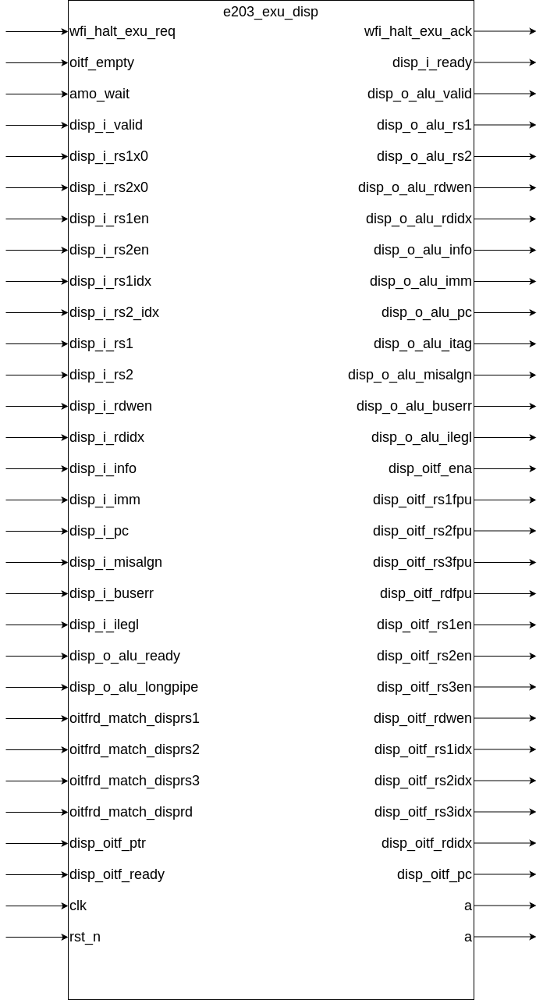

# e203_exu_disp.v Specification

## Introduction

This module is responsible for dispatching instructions to different functional units, including the ALU and OITF. It handles operand forwarding, checks for dependencies (such as RAW and WAW), manages WFI (Wait-for-Interrupt) requests, and ensures that instructions are dispatched correctly based on the type of operation and the availability of functional units.

## Module Diagram

## Interface

| Direction | Port Name                        | Width                         | Description                                                                                  |
| --------- | --------------------------------- | ----------------------------- | -------------------------------------------------------------------------------------------- |
| input     | wfi_halt_exu_req                 | 1                             | Request to halt the EXU (execution unit) during WFI operation                              |
| output    | wfi_halt_exu_ack                 | 1                             | Acknowledgement of halt request for the EXU from WFI                                        |
| input     | oitf_empty                       | 1                             | Indicates whether the OITF (Out-of-Order Instruction FIFO) is empty                         |
| input     | amo_wait                         | 1                             | Indicates that an AMO (Atomic Memory Operation) instruction is pending                     |
| input     | disp_i_valid                     | 1                             | Valid signal for an instruction to be dispatched                                            |
| output    | disp_i_ready                     | 1                             | Ready signal indicating that the dispatch unit is ready to accept new instructions           |
| input     | disp_i_rs1x0                     | 1                             | Indicates if operand 1 is used or not (read-enable)                                          |
| input     | disp_i_rs2x0                     | 1                             | Indicates if operand 2 is used or not (read-enable)                                          |
| input     | disp_i_rs1en                     | 1                             | Read-enable signal for operand 1                                                            |
| input     | disp_i_rs2en                     | 1                             | Read-enable signal for operand 2                                                            |
| input     | disp_i_rs1idx                    | E203_RFIDX_WIDTH              | Register index for operand 1                                                                |
| input     | disp_i_rs2idx                    | E203_RFIDX_WIDTH              | Register index for operand 2                                                                |
| input     | disp_i_rs1                        | E203_XLEN                     | Operand 1 data                                                                                |
| input     | disp_i_rs2                        | E203_XLEN                     | Operand 2 data                                                                                |
| input     | disp_i_rdwen                      | 1                             | Write-enable signal for the destination register                                            |
| input     | disp_i_rdidx                      | E203_RFIDX_WIDTH              | Destination register index                                                                   |
| input     | disp_i_info                       | E203_DECINFO_WIDTH            | Instruction decoding information                                                              |
| input     | disp_i_imm                        | E203_XLEN                     | Immediate value of the instruction                                                            |
| input     | disp_i_pc                         | E203_PC_SIZE                  | Program counter of the instruction                                                           |
| input     | disp_i_misalgn                    | 1                             | Indicates if there was a misaligned address during instruction fetch                        |
| input     | disp_i_buserr                     | 1                             | Indicates if there was a bus error during instruction fetch                                  |
| input     | disp_i_ilegl                      | 1                             | Indicates if there was an illegal instruction error                                          |
| output    | disp_o_alu_valid                  | 1                             | Indicates that the ALU is ready to accept a new instruction for execution                   |
| input     | disp_o_alu_ready                  | 1                             | Ready signal for ALU to accept a new instruction                                            |
| input     | disp_o_alu_longpipe               | 1                             | Indicates if the ALU is executing a long-pipeline instruction                               |
| output    | disp_o_alu_rs1                    | E203_XLEN                     | Operand 1 data forwarded to the ALU                                                          |
| output    | disp_o_alu_rs2                    | E203_XLEN                     | Operand 2 data forwarded to the ALU                                                          |
| output    | disp_o_alu_rdwen                  | 1                             | Write-enable signal for ALU destination register                                            |
| output    | disp_o_alu_rdidx                  | E203_RFIDX_WIDTH              | Register index for ALU destination                                                           |
| output    | disp_o_alu_info                   | E203_DECINFO_WIDTH            | Instruction decoding information forwarded to ALU                                           |
| output    | disp_o_alu_imm                    | E203_XLEN                     | Immediate value forwarded to the ALU                                                         |
| output    | disp_o_alu_pc                     | E203_PC_SIZE                  | Program counter forwarded to the ALU                                                         |
| output    | disp_o_alu_itag                   | E203_ITAG_WIDTH               | Instruction tag forwarded to the ALU for tracking                                          |
| output    | disp_o_alu_misalgn                | 1                             | Misalignment flag forwarded to ALU                                                           |
| output    | disp_o_alu_buserr                 | 1                             | Bus error flag forwarded to ALU                                                              |
| output    | disp_o_alu_ilegl                  | 1                             | Illegal instruction flag forwarded to ALU                                                   |
| input     | oitfrd_match_disprs1              | 1                             | Signal indicating a match for operand 1 in the OITF                                          |
| input     | oitfrd_match_disprs2              | 1                             | Signal indicating a match for operand 2 in the OITF                                          |
| input     | oitfrd_match_disprs3              | 1                             | Signal indicating a match for operand 3 in the OITF                                          |
| input     | oitfrd_match_disprd               | 1                             | Signal indicating a match for destination register in OITF                                  |
| input     | disp_oitf_ptr                     | E203_ITAG_WIDTH               | Pointer to the OITF entry for this instruction                                               |
| output    | disp_oitf_ena                     | 1                             | Enables the entry of the instruction into the OITF                                            |
| input     | disp_oitf_ready                   | 1                             | Ready signal for the OITF to accept new entries                                              |
| output    | disp_oitf_rs1fpu                  | 1                             | Indicates if operand 1 is from the FPU                                                       |
| output    | disp_oitf_rs2fpu                  | 1                             | Indicates if operand 2 is from the FPU                                                       |
| output    | disp_oitf_rs3fpu                  | 1                             | Indicates if operand 3 is from the FPU                                                       |
| output    | disp_oitf_rdfpu                   | 1                             | Indicates if the result is from the FPU                                                      |
| output    | disp_oitf_rs1en                   | 1                             | Enables operand 1 for dispatch to the OITF                                                   |
| output    | disp_oitf_rs2en                   | 1                             | Enables operand 2 for dispatch to the OITF                                                   |
| output    | disp_oitf_rs3en                   | 1                             | Enables operand 3 for dispatch to the OITF                                                   |
| output    | disp_oitf_rdwen                   | 1                             | Enables write-back for the OITF entry                                                       |
| output    | disp_oitf_rs1idx                  | E203_RFIDX_WIDTH              | Register index for operand 1 in the OITF                                                     |
| output    | disp_oitf_rs2idx                  | E203_RFIDX_WIDTH              | Register index for operand 2 in the OITF                                                     |
| output    | disp_oitf_rs3idx                  | E203_RFIDX_WIDTH              | Register index for operand 3 in the OITF                                                     |
| output    | disp_oitf_rdidx                   | E203_RFIDX_WIDTH              | Register index for the destination in the OITF                                                |
| output    | disp_oitf_pc                      | E203_PC_SIZE                  | Program counter for the OITF entry                                                           |
| input     | clk                              | 1                             | Clock signal                                                                                 |
| input     | rst_n                            | 1                             | Reset signal (active low)                                                                    |

## Operation Description

### Dispatch Group

The group of the instruction is determined by the E203_DECINFO_GRP bit of the information bus.

**disp__i_info**

| Bits                    | Description                                       |
| ----------------------- | ------------------------------------------------- |
| E203_DECINFO_GRP        | The group number to which the instruction belongs |
| E203_DECINFO_BJP_FENCE  | Whether the command is Fence                      |
| E203_DECINFO_BJP_FENCEI | Whether the command is Fencei                     |

**disp_i_info [`E203_DECINFO_GRP]**

| Value                | Description               |
| -------------------- | ------------------------- |
| E203_DECINFO_GRP_CSR | CSR accessing instruction |
| E203_DECINFO_GRP_AGU | load/store instructions   |
| E203_DECINFO_GRP_BJP | Branch Jump Instructions  |

A command is considered a fence command only if it belongs to the BJP group and the E203_DECINFO_BJP_FENCE bit is valid. It's the same with FENCEI.

### Instruction Dispatching Logic

- **ALU Dispatch**: 
  - All instructions are dispatched to the ALU interface and then inside ALU it will issue instructions to different unit such as arithmetic unit, load/store unit and NICE. 
  - The ALU interface receives operands, the destination register index, and additional control information such as immediate values and flags. The detailed list:
    - `disp_o_alu_rs1`
    - `disp_o_alu_rs2`
    - `disp_o_alu_rdwen`
    - `disp_o_alu_rdidx`
    - `disp_o_alu_info`
    - `disp_o_alu_imm`
    - `disp_o_alu_pc`
    - `disp_o_alu_itag`
    - `disp_o_alu_misalgn`
    - `disp_o_alu_buserr`
    - `disp_o_alu_ilegl`
- **OITF Dispatch**
  - When dispatching a long pipeline instruction, the dispatch module sends the instruction-related information to the OITF module to check the dependency of the subsequent dispatched instructions.
  - instruction-related information include: 
    - `disp_oitf_rs1fpu`
    - `disp_oitf_rs2fpu`
    - `disp_oitf_rs3fpu`
    - `disp_oitf_rdfpu`
    - `disp_oitf_rs1en`
    - `disp_oitf_rs2en`
    - `disp_oitf_rs3en`
    - `disp_oitf_rdwen`
    - `disp_oitf_rs1idx`
    - `disp_oitf_rs2idx`
    - `disp_oitf_rs3idx`
    - `disp_oitf_rdidx`
    - `disp_oitf_pc`

  - OITF is enabled only when the instruction is dispatched as long pipe and dispatch module has shaken hand with ALU.

### WFI Handling

- **WFI (Wait-for-Interrupt)**:
  - The module generates the `wfi_halt_exu_ack` signal when the OITF is empty  and also there is no AMO oustanding uops 
  - Dispatch operations are stalled if a WFI request is pending or if other special conditions (like AMO or Fence) are active.

## Implementation Details

### Dependency Management

In this implementation, instructions being dispatched can only have RAW and WAW dependencies with long instructions that have not yet been executed.

- **RAW (Read-After-Write) Dependencies**:
  - Check if there is an instruction in OITF whose write-back register is the same as the source register(`rs1,rs2,rs3`) of the currently dispatched instruction

- **WAW (Write-After-Write) Dependencies**:
  - Check if there is an instruction in OITF whose write-back register is the same as the destination register(`rd`) of the currently dispatched instruction
  - Note: Initially, the implementation considered only checking WAW dependencies for non-long-pipe instructions, but the final implementation checks WAW dependencies for all instructions because it doesn't significantly impact benchmark performance.

### Dispatch Condition

1. To be more conservtive, any accessing CSR instruction need to wait the oitf to be empty
2. To handle the Fence: just stall dispatch until the OITF is empty
3. If it was a WFI instruction commited halt req, then it will stall the disaptch
4. No dependency (No RAW dependency, No WAW dependency)
5. To reduce critical timing paths, the module always assumes that LSU-type instructions (AGU group) need to check if the OITF is ready, rather than using the more precise but potentially timing-impacting disp_alu_longp_real signal

### Operand and Instruction Masking

- **Masking Operands**:
  - The module masks unused operands (e.g., when `disp_i_rs1x0` or `disp_i_rs2x0` are set) to ensure that no invalid data is dispatched to the ALU or OITF.
  - This is done by applying a bitwise mask to the operands before dispatch.

### FPU Dispatch

if `E03_HAS_FPU` is not defined, FPU related indication signals are set to 0.(e.g., `disp_oitf_rs1fpu`). The OITF dispatch interface is directly connected to the decoded information interface received by the module, `disp_oitf_rs3en` and `disp_oitf_rs3idx` are assigned to 0.

## Clock and Reset

This module has `clk` and `rst_n` inputs but doesn't actively use them in the current implementation, as it primarily consists of combinational logic. These inputs might be reserved for future use or for maintaining consistent interface with other modules.
