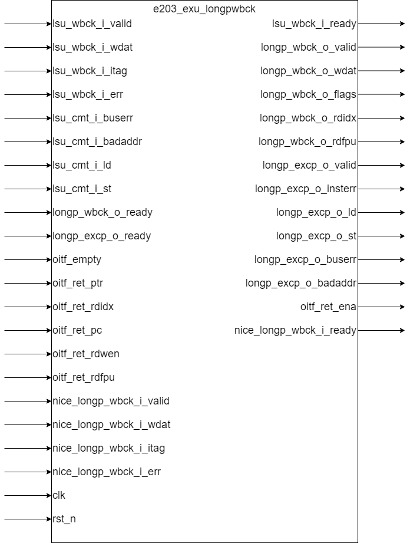

# e203_exu_longpwbck.v Specification

## Introduction

**Module Description**

This module implements the Write-Back (WB) logic for handling arbitration of the write-back requests from various long-pipeline modules, such as LSU (Load-Store Unit) and NICE modules, to the final write-back interface. It ensures that write-back data and exceptions are properly handled and synchronized.

## Module Diagram

## Interface

**Basic Interface**

| Direction | Port Name                    | Width               | Description                                                              |
| --------- | ----------------------------- | ------------------- | ------------------------------------------------------------------------ |
| input     | lsu_wbck_i_valid              | 1                   | LSU write-back request valid signal                                      |
| output    | lsu_wbck_i_ready              | 1                   | LSU write-back request ready signal                                      |
| input     | lsu_wbck_i_wdat               | E203_XLEN           | Data to be written back from LSU                                          |
| input     | lsu_wbck_i_itag               | E203_ITAG_WIDTH     | Instruction tag from LSU write-back request                              |
| input     | lsu_wbck_i_err                | 1                   | Error exception flag from LSU                                            |
| input     | lsu_cmt_i_buserr              | 1                   | Bus error exception flag from LSU                                         |
| input     | lsu_cmt_i_badaddr             | E203_ADDR_SIZE      | Address of the exception for LSU                                          |
| input     | lsu_cmt_i_ld                  | 1                   | Load operation flag from LSU                                              |
| input     | lsu_cmt_i_st                  | 1                   | Store operation flag from LSU                                             |
| output    | longp_wbck_o_valid            | 1                   | Write-back valid signal to final WB module                                 |
| input     | longp_wbck_o_ready            | 1                   | Write-back ready signal to final WB module                                 |
| output    | longp_wbck_o_wdat             | E203_FLEN           | Write-back data to register file                                          |
| output    | longp_wbck_o_flags            | 5                   | Write-back flags (used for additional status)                             |
| output    | longp_wbck_o_rdidx            | E203_RFIDX_WIDTH    | Destination register index for write-back                                 |
| output    | longp_wbck_o_rdfpu            | 1                   | Indicates whether the write-back is for the floating-point unit (FPU)     |
| output    | longp_excp_o_valid            | 1                   | Exception valid signal to the commit stage                                |
| input     | longp_excp_o_ready            | 1                   | Exception ready signal to the commit stage                                |
| output    | longp_excp_o_insterr          | 1                   | Instruction error flag for the exception                                  |
| output    | longp_excp_o_ld               | 1                   | Load exception flag for the exception                                     |
| output    | longp_excp_o_st               | 1                   | Store exception flag for the exception                                    |
| output    | longp_excp_o_buserr           | 1                   | Bus error exception flag for the exception                                |
| output    | longp_excp_o_badaddr          | E203_ADDR_SIZE      | Address where the exception occurred                                      |
| output    | longp_excp_o_pc               | E203_PC_SIZE        | Program counter at the time of the exception                              |
| input     | oitf_empty                    | 1                   | Indicates if the OITF (Out-Of-Order Instruction FIFO) is empty            |
| input     | oitf_ret_ptr                  | E203_ITAG_WIDTH     | Instruction tag of the top entry in the OITF                              |
| input     | oitf_ret_rdidx                | E203_RFIDX_WIDTH    | Register destination index for the top entry in OITF                     |
| input     | oitf_ret_pc                   | E203_PC_SIZE        | Program counter of the top entry in OITF                                  |
| input     | oitf_ret_rdwen                | 1                   | Register write enable for the top entry in OITF                           |
| input     | oitf_ret_rdfpu                | 1                   | Floating-point register write enable for the top entry in OITF           |
| output    | oitf_ret_ena                  | 1                   | Enable signal for the OITF to remove the top entry                       |
| input     | clk                           | 1                   | Clock signal                                                             |
| input     | rst_n                         | 1                   | Active low reset signal                                                  |

**Configured Interface**

those interface is available when `E203_HAS_NICE` is defined

| Direction | Name                    | Width           | Description                                                |
| --------- | ----------------------- | --------------- | ---------------------------------------------------------- |
| input     | nice_longp_wbck_i_valid | 1               | NICE long-pipeline write-back valid signal                 |
| output    | nice_longp_wbck_i_ready | 1               | NICE long-pipeline write-back ready signal                 |
| input     | nice_longp_wbck_i_wdat  | E203_XLEN       | Data to be written back from NICE                          |
| input     | nice_longp_wbck_i_itag  | E203_ITAG_WIDTH | Instruction tag from NICE long-pipeline write-back request |
| input     | nice_longp_wbck_i_err   | 1               | Error exception flag from NICE                             |

## Function Description

### Control Logic

- **Write-Back Needs**: The module checks whether the write-back is necessary by verifying if the instruction has write-back enabled (`wbck_i_rdwen`) and there is no error (`wbck_i_err`).
- **Exception Needs**: Similarly, if there is an error in the instruction (e.g., the lsu module needs to write back, and `lsu_wbck_i_err` is high), the module generate an exception need. Note that when `E203_HAS_NICE` is defined, NICE errors are handled differently and not included in exception generation.
- **OITF Control Logic**: The module uses `wbck_i_ready` and `wbck_i_valid` signals to synchronize the write-back operation and enable oitf instruction retire. The retire enable operation will only proceed if both signals are asserted, ensuring proper timing of the data transfer.
  - `wbck_i_ready` is asserted when the following two conditions are met: 
    - if the instruction have write back need and `longp_wbck_o_ready` is 1. If this instruction doesn't need to write back into regfile, this condition is always satisfied.
    - if the instruction have exception need and `longp_excp_o_ready` is 1. If this instruction doesn't need to raise an exception, this condition is always satisfied.
  - `wbck_i_valid` is asserted based on source selection: it's derived from `lsu_wbck_i_valid` when LSU is selected, or from `nice_longp_wbck_i_valid` when NICE is selected (if `E203_HAS_NICE` is defined).

### Write-Back Arbitration Logic

The `e203_exu_longpwbck` module performs arbitration between multiple sources of write-back requests:

- **LSU Write-Back Request**: The LSU can send a write-back request, which will be processed if the instruction tag (`lsu_wbck_i_itag`) matches the instruction tag at the top of the OITF (`oitf_ret_ptr`) and the OITF is not empty.
- **NICE Write-Back Request**: When `E203_HAS_NICE` is defined, the module also handles nice requests. Similar to the LSU, the NICE module can also send a write-back request, and the arbitration logic handles it in the same manner, ensuring it does not conflict with other requests.
- **Long-Pipeline Write-Back**: The final output `longp_wbck_o_valid` is asserted when
  - there is a write back need 
  - valid signal (`wbck_i_valid`) is 1.
  - there is no exception need or exception interface is ready(`longp_excp_o_ready` is 1)

### Exception Handling

- **Exception Signals**: If the write-back operation results in an error, an exception (e.g., load/store error, bus error) is generated. These exceptions are forwarded to the commit stage via the `longp_excp_o_*` signals. Note that in the current implementation, when LSU is selected, `longp_excp_o_insterr` is set to 0.
- **Exception Valid Signal**: output `longp_excp_o_valid` is asserted when
  - there is an exception need 
  - valid signal (`wbck_i_valid`) is 1.
  - there is no write back need or write back interface is ready(`longp_wbck_o_ready` is 1)
- **Bus Error and Addressing**: If a bus error occurs, the relevant address and error flags are included in the exception signals to provide complete error information.

### FIFO and OITF Management

- **OITF Management**: The module checks the OITF toppest entry (`oitf_ret_ptr`) and current instruction tag to determine if the instruction can be processed. The OITF provides rdwen, rdfpu, register index, and program counter information of this instruction. These information is used for write back operation or exception handling.

## Clock and Reset

- **Clock**: The `clk` signal drives all synchronous elements in the module, ensuring proper timing and synchronization of the interfaces.
- **Reset**: The `rst_n` is an active low reset signal.

## Corner Case

- **Multiple Write-Back Requests**: The arbitration ensures that if multiple modules (LSU, NICE) request write-back, only one request is granted at a time. This is managed by checking the instruction tags and ensuring that the top entry in the OITF is the one being processed.
- **Exception Handling Priority**: If an error occurs during the write-back, the module will prioritize sending the exception signals to the commit stage, overriding the normal write-back operation. This ensures that the processor handles errors properly.