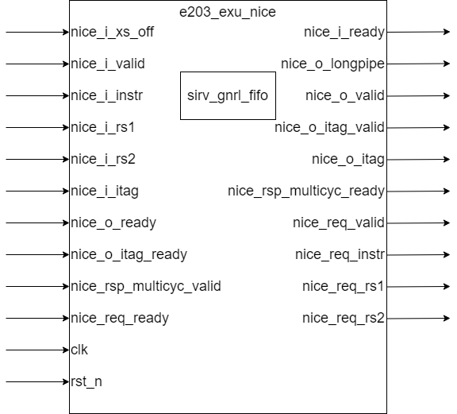

# e203_exu_nice.v Specification

## Introduction

The `e203_exu_nice`module serves as a bridge between the E203 RISC-V core's execution unit and custom hardware accelerators. It handles the flow of instructions and data to custom accelerator blocks, while managing the handshaking protocols and instruction tagging necessary to maintain program correctness.

## Module Diagram

## Interface
| Direction | Port Name | Width | Description |
|-----------|-----------|-------|-------------|
| input | nice_i_xs_off | 1 | NICE accelerator disable signal |
| input | nice_i_valid | 1 | Input instruction valid signal |
| output | nice_i_ready | 1 | Ready signal to accept input instruction |
| input | nice_i_instr | E203_XLEN | Input instruction to be executed by NICE |
| input | nice_i_rs1 | E203_XLEN | Input source register 1 value |
| input | nice_i_rs2 | E203_XLEN | Input source register 2 value |
| input | nice_i_itag | E203_ITAG_WIDTH | Input instruction tag for tracking |
| output | nice_o_longpipe | 1 | Indicates if instruction needs long pipeline handling |
| output | nice_o_valid | 1 | Valid signal for commit interface |
| input | nice_o_ready | 1 | Ready signal from commit interface |
| output | nice_o_itag_valid | 1 | Valid signal for instruction tag writeback |
| input | nice_o_itag_ready | 1 | Ready signal for instruction tag writeback |
| output | nice_o_itag | E203_ITAG_WIDTH | Instruction tag for writeback |
| input | nice_rsp_multicyc_valid | 1 | Multi-cycle operation completion signal |
| output | nice_rsp_multicyc_ready | 1 | Ready signal for multi-cycle operation completion |
| output | nice_req_valid | 1 | Valid signal for request to custom accelerator |
| input | nice_req_ready | 1 | Ready signal from custom accelerator |
| output | nice_req_instr | E203_XLEN | Instruction forwarded to custom accelerator |
| output | nice_req_rs1 | E203_XLEN | Source register 1 forwarded to custom accelerator |
| output | nice_req_rs2 | E203_XLEN | Source register 2 forwarded to custom accelerator |
| input | clk | 1 | System clock |
| input | rst_n | 1 | Active low reset signal |

## Submodule List

### sirv_gnrl_fifo

**Local Parameter**

| Name      | Default Value | Passed Value    | Description                               |
| --------- | ------------- | --------------- | ----------------------------------------- |
| CUT_READY | 0             | 1               | signal to cut logic train when depth is 1 |
| MSKO      | 0             | -               | Mask out the data with valid or not       |
| DP        | 8             | 4               | Depth of FIFO                             |
| DW        | 32            | E203_ITAG_WIDTH | Data width of FIFO                        |

**Interface**

| Direction | Name  | Width | Description                  |
| --------- | ----- | ----- | ---------------------------- |
| input     | i_vld | 1     | valid signal for input data  |
| output    | i_rdy | 1     | ready signal for input data  |
| input     | i_dat | DW    | Input data                   |
| output    | o_vld | 1     | valid signal for output data |
| input     | o_rdy | 1     | ready signal for input data  |
| output    | o_dat | DW    | output data                  |
| input     | clk   | 1     | clock                        |
| input     | rst_n | 1     | active low reset signal      |

**Function Description**

This module is a **general-purpose FIFO (First-In-First-Out) queue** designed to buffer data streams and control read/write operations. It is highly configurable and supports various depths and data widths. Below is a breakdown of its functionality

1. Basic FIFO Behavior:
   - The module implements a configurable FIFO queue to transfer data between a producer (input side) and a consumer (output side).
   - It supports configurable depth (`DP`) and data width (`DW`).
2. Parameterization:
   - **`CUT_READY`**: Controls the back-pressure signal (`ready`) when the FIFO depth is 1.
     - If `CUT_READY = 1`, the FIFO can only accept one data item every two cycles.
     - If `CUT_READY = 0`, the FIFO can accept new data immediately based on read/write conditions.
   - **`MSKO`**: Masks invalid data in the output based on the valid signal (`o_vld`).
   - **`DP`**: Defines the FIFO depth.
     - If `DP = 0`, the module acts as a simple pass-through (no buffering).
     - If `DP = 1`, it behaves as a single-stage FIFO.
     - If `DP > 1`, it behaves as a standard multi-stage FIFO.
   - **`DW`**: Defines the data width.
4. Behavior Based on FIFO Depth (`DP`):
   - **`DP = 0`:**  
     - The FIFO acts as a direct pass-through module (no buffering). Input data is passed directly to the output.
   - **`DP = 1`:**  
     - The FIFO behaves as a single-stage register.  
     - Whether the `ready` signal is cut off depends on the `CUT_READY` parameter.
   - **`DP > 1`:**  
     - The FIFO behaves as a standard multi-stage FIFO with full buffering and sequential read/write operations.
5. Read and Write Control:
   - Write Enable (`wen`): `wen = i_vld & i_rdy`  
     - Data is written into the FIFO when the input is valid and the FIFO is ready.
   - Read Enable (`ren`): `ren = o_vld & o_rdy`  
     - Data is read from the FIFO when the output is valid, and the consumer is ready to accept it.
6. Data Masking and Output:
   - Controlled by the `MSKO` parameter:
     - If `MSKO = 1`, the output data is masked with the valid signal (`o_vld`).
     - If `MSKO = 0`, the data is directly output without masking.

## Operation

1. **Instruction Forwarding**:
   - When a valid NICE instruction is received (`nice_i_valid`), the module forwards it to the custom accelerator along with operands via `nice_req_instr`, `nice_req_rs1`, and `nice_req_rs2`.
   - The instruction forwarding only happens when NICE is enabled (`nice_i_xs_off` is 0).
2. **Handshaking Protocol**:
   - The module implements a handshaking protocol to maintain proper flow control with the commit interface, write-back interface and the custom accelerator.
   - Input instructions are accepted when both the custom accelerator and commit interface are ready. When NICE is disabled, it is considered that the custom accelerator is always ready to accept instructions.
   - Instructions commit(`nice_o_valid = 1`) when they are valid and the custom accelerator has accepted them.
3. **Multi-Cycle Operation Support**:
   - For multi-cycle operations, instruction tags are stored in a FIFO to track in-flight instructions.
   - When an instruction is dispatched, its tag is pushed into the FIFO.
   - When a multi-cycle operation completes (`nice_rsp_multicyc_valid`), the corresponding tag is popped from the FIFO.
   - The module signals completion through `nice_o_itag_valid` when both the FIFO has valid data and a multi-cycle operation has completed. The instruction tag is directly output from the FIFO to `nice_o_itag` without gating to avoid timing loops.
4. **Long Pipeline Handling**:
   - The module sets `nice_o_longpipe` to the inverse of `nice_i_xs_off`, indicating that instructions sent to NICE should be treated as long-pipeline operations only when NICE is enabled.

## Clock and Reset

The module operates on the positive edge of the clock signal (`clk`) and is reset by an active-low reset signal (`rst_n`). These signals are also forwarded to the internal FIFO module for synchronization.

## Corner Case

1. **NICE Disabled**:
   - When NICE is disabled (`nice_i_xs_off` is 1), `nice_req_ready` is always taken as 1, allowing the core to process instructions as if NICE didn't exist.
   - In this case, `nice_req_valid` is set to 0, preventing any requests from going to the disabled accelerator.
2. **FIFO Overflow/Underflow**:
   - The internal FIFO has a depth of 4, which should be sufficient for most use cases. However, if more than 4 multi-cycle operations are in flight simultaneously, overflow could occur.
3. **Timing Considerations**:
   - The code includes a comment about keeping control path independent from data path to avoid timing loops.
   - This is achieved by not gating `nice_o_itag` with `nice_o_itag_valid`.