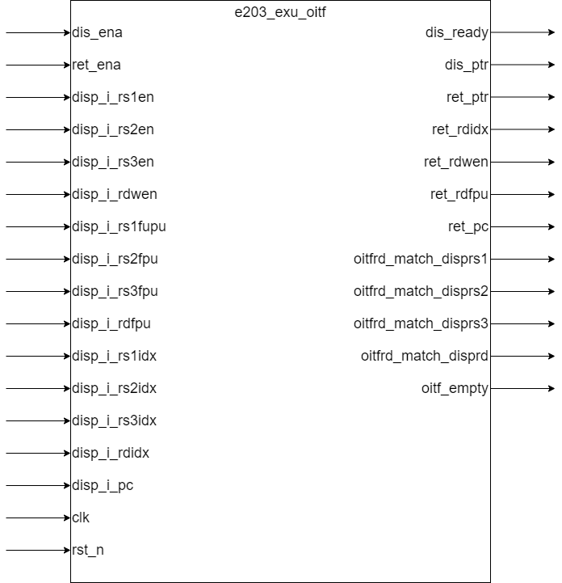

# e203_exu_oitf.v Specification

This module implements the Outstanding Instructions Track FIFO (OITF), which is used to track the status and information of all non-ALU long-pipeline instructions in the execution unit (EXU) of a RISC-V processor.

## Introduction

The `e203_exu_oitf` module is responsible for managing the lifecycle of long-pipeline instructions, including their dispatch, execution, and retirement. It ensures that the dependencies between instructions are correctly handled by tracking the destination registers of outstanding instructions and resolving potential data hazards.

## Module Diagram

## Interface

| Direction | Port Name             | Width            | Description |
| --------- | --------------------- | ---------------- | ----------- |
| output    | dis_ready             | 1                | Indicates if the OITF is ready to accept new dispatched instructions |
| input     | dis_ena               | 1                | Dispatch enable signal for new instructions |
| input     | ret_ena               | 1                | Retirement enable signal for completed instructions |
| output    | dis_ptr               | E203_ITAG_WIDTH  | Pointer to the next available entry for dispatching |
| output    | ret_ptr               | E203_ITAG_WIDTH  | Pointer to the next entry to be retired |
| output    | ret_rdidx             | E203_RFIDX_WIDTH | Destination register index of the retiring instruction |
| output    | ret_rdwen             | 1                | Write enable signal for the retiring instruction's destination register |
| output    | ret_rdfpu             | 1                | Indicates if the retiring instruction's destination is an FPU register |
| output    | ret_pc                | E203_PC_SIZE     | Program counter (PC) of the retiring instruction |
| input     | disp_i_rs1en          | 1                | Source register 1 enable signal for the dispatched instruction |
| input     | disp_i_rs2en          | 1                | Source register 2 enable signal for the dispatched instruction |
| input     | disp_i_rs3en          | 1                | Source register 3 enable signal for the dispatched instruction |
| input     | disp_i_rdwen          | 1                | Destination register write enable signal for the dispatched instruction |
| input     | disp_i_rs1fpu         | 1                | Indicates if source register 1 is an FPU register |
| input     | disp_i_rs2fpu         | 1                | Indicates if source register 2 is an FPU register |
| input     | disp_i_rs3fpu         | 1                | Indicates if source register 3 is an FPU register |
| input     | disp_i_rdfpu          | 1                | Indicates if the destination register is an FPU register |
| input     | disp_i_rs1idx         | E203_RFIDX_WIDTH | Source register 1 index for the dispatched instruction |
| input     | disp_i_rs2idx         | E203_RFIDX_WIDTH | Source register 2 index for the dispatched instruction |
| input     | disp_i_rs3idx         | E203_RFIDX_WIDTH | Source register 3 index for the dispatched instruction |
| input     | disp_i_rdidx          | E203_RFIDX_WIDTH | Destination register index for the dispatched instruction |
| input     | disp_i_pc             | E203_PC_SIZE     | Program counter (PC) of the dispatched instruction |
| output    | oitfrd_match_disprs1  | 1                | Indicates if the dispatched instruction's source register 1 matches any outstanding destination register |
| output    | oitfrd_match_disprs2  | 1                | Indicates if the dispatched instruction's source register 2 matches any outstanding destination register |
| output    | oitfrd_match_disprs3  | 1                | Indicates if the dispatched instruction's source register 3 matches any outstanding destination register |
| output    | oitfrd_match_disprd   | 1                | Indicates if the dispatched instruction's destination register matches any outstanding destination register |
| output    | oitf_empty            | 1                | Indicates if the OITF is empty |
| input     | clk                   | 1                | Clock signal |
| input     | rst_n                 | 1                | Reset signal (active low) |

## Function Description

### OITF Structure

- The OITF is implemented as a FIFO with a depth defined by `E203_OITF_DEPTH`. Each entry in the FIFO stores the following information:
  - Destination register index (`rdidx`)
  - Program counter (`pc`)
  - Write enable signal (`rdwen`)
  - FPU register flag (`rdfpu`)

### Dispatch Logic

- When a new instruction is dispatched (`dis_ena` is high), the OITF allocates a new entry at the position indicated by `dis_ptr`. The destination register index, PC, write enable signal, and FPU flag are stored in the allocated entry.
- The `dis_ptr` is incremented after each dispatch, wrapping around when it reaches the maximum depth.

### Retirement Logic

- The information of the entry corresponding to the `ret_ptr` is returned to the downstream module through `ret_rdidx`, `ret_pc`, `ret_rdwen`, and `ret_rdfpu` respectively.
- When an instruction is retired (`ret_ena` is high), this module releases the entry at the position indicated by `ret_ptr`. 
- The `ret_ptr` is incremented after each retirement, wrapping around when it reaches the maximum depth.

### Dependency Checking

- The OITF checks for dependencies between the dispatched instruction and all outstanding instructions. There are two types of dependencies: one is that the register that the dispatched instruction needs to read is the register that the outstanding instructions need to write back, and the other is that the register that the dispatched instruction needs to write back is also the register that the outstanding instructions need to write back. When any register involved in the dispatched instruction is detected to have a dependency, the corresponding signal (`oitfrd_match_disprs1`, `oitfrd_match_disprs2`, `oitfrd_match_disprs3` or `oitfrd_match_disprd`) is asserted. Specifically, the following conditions must be met at the same time to achieve a dependency:

  - The destination register type of the long instruction is the same as the register type of the dispatched instruction (both are floating point registers or both are integer registers)
  - The destination register index used by the long-pipeline instruction is the same as the register index of the dispatched instruction
  - The long-pipeline instruction writes back the destination register
  - The dispatched instruction reads (`rs1`,`rs2`,`rs3`) or writes (`rd`) the register

### Full and Empty Conditins

We use a flag to indicate whether the dispatch or retire pointers in the FIFO have wrapped around.

- The OITF is considered full (`oitf_full`) when the `dis_ptr` and `ret_ptr` are equal, and their flags are different.
- The OITF is considered empty (`oitf_empty`) when the `dis_ptr` and `ret_ptr` are equal, and their flags are the same.
- For the special case when `E203_OITF_DEPTH` equals 1, the OITF is considered full when the single entry is valid, and empty when the entry is invalid.

### Ready Signal

- The `dis_ready` signal indicates whether the OITF is ready to accept new dispatched instructions.
- In the implementation, `dis_ready` is determined solely by whether the OITF is full (`dis_ready = ~oitf_full`).
- This is designed to cut down the loop dependency between ALU write-back valid, OITF retire enable, OITF ready, dispatch ready, and ALU instruction valid.

## Clock and Reset

- The module operates on the rising edge of the `clk` signal.
- The `rst_n` signal is used to reset the internal state of the OITF, including the `dis_ptr`, `ret_ptr`, and all FIFO entries.

## Corner Cases

- **OITF Full**: If the OITF is full, new instructions cannot be dispatched until an instruction is retired.
- **OITF Empty**: If the OITF is empty, no instructions are available for retirement.
- **Dependency Hazards**: If a dispatched instruction has a source register that matches the destination register of an outstanding instruction, the OITF signals a dependency hazard, which must be handled by the pipeline control logic.