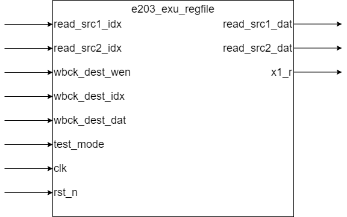

# e203_exu_regfile.v Specification

This module implements an integer general-purpose register file as defined by the RISC-V architecture.

## Introduction

The module supports two read ports and one write port. It contains both sequential and combinational logic circuits and does not respond to reset operations.

## Module Diagram

## Interface

**Basic Interface**

| Direction | Port Name     | Width            | Description |
| --------- | ------------- | ---------------- | ----------- |
| input     | read_src1_idx | E203_RFIDX_WIDTH | Register index for source operand 1 |
| input     | read_src2_idx | E203_RFIDX_WIDTH | Register index for source operand 2 |
| output    | read_src1_dat | E203_XLEN        | Read result for source operand 1 |
| output    | read_src2_dat | E203_XLEN        | Read result for source operand 2 |
| input     | wbck_dest_wen | 1                | Register write enable |
| input     | wbck_dest_idx | E203_RFIDX_WIDTH | Register index to write |
| input     | wbck_dest_dat | E203_XLEN        | Data to write to the register |
| output    | x1_r          | E203_XLEN        | Output for general-purpose register 1 |
| input     | test_mode     | 1                | Whether in test mode |
| input     | clk           | 1                | Clock signal |
| input     | rst_n         | 1                | Reset signal |

## Submodule List

### sirv_gnrl_ltch

#### Submodule Parameter Override

| Parameter Name | Value | Description |
|----------------|---------------|-------------|
| DW             | `E203_XLEN` | Data width (in bits) |

#### Signal Interface

| Port Name | Direction | Width | Description |
|-----------|-----------|-------|-------------|
| lden      | Input     | 1     | Latch enable signal |
| dnxt      | Input     | DW    | Input data |
| qout      | Output    | DW    | Output data |

### sirv_gnrl_dffl

#### Submodule Parameter Override

| Parameter Name | Value       | Description |
|----------------|---------------|-------------|
| DW             | `E203_XLEN` | Data width (in bits) |

#### Signal Interface

| Port Name | Direction | Width | Description |
|-----------|-----------|-------|-------------|
| lden      | Input     | 1     | Load enable signal |
| dnxt      | Input     | DW    | Input data |
| qout      | Output    | DW    | Output data |
| clk       | Input     | 1     | Clock signal |

### e203_clkgate

#### Signal Interface

| Port Name | Direction | Width | Description |
|-----------|-----------|-------|-------------|
| clk_in    | Input     | 1     | Input clock signal |
| test_mode | Input     | 1     | Test mode signal |
| clock_en  | Input     | 1     | Clock enable signal |
| clk_out   | Output    | 1     | Gated clock output |

## Function Description

### Register Number

The number of registers in the register file is defined by the macro `E203_RFREG_NUM`.

### Read

The module uses `read_src1_idx` and `read_src2_idx` as the indexes, outputting the data from the corresponding registers in the register file to `read_src1_dat` and `read_src1_dat` separately.

### Write

1. Register 0

   Register 0 is a constant value of `0` and cannot be modified.

2. Non-zero Registers

   Writing occurs on the rising edge of the clock signal.

### Implementation Detail

The implementation of the register file is configured by macros `E203_REGFILE_LATCH_BASED`.

If `E203_REGFILE_LATCH_BASED` is defined, the register file is implemented using `sirv_gnrl_ltch` (latches) and `e203_clkgate`; Otherwise, it is implemented using `sirv_gnrl_dffl` (DFF).
