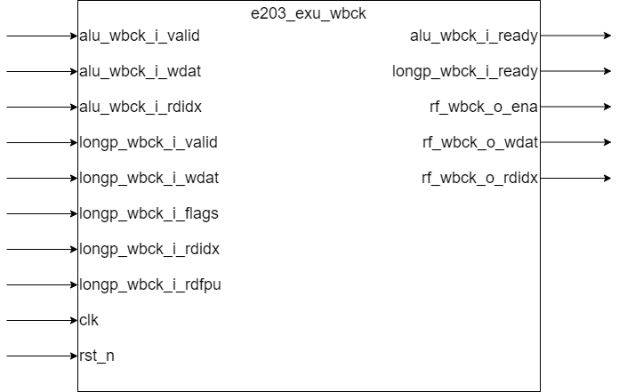

# e203_exu_wbck.v Specification

## Introduction

The `e203_exu_wbck` module arbitrates between the write-back requests from the ALU and long-pipeline instructions. It ensures that the ALU write-back requests are handled only when there are no pending long-pipeline write-back requests, as ALU instructions have lower priority. The module then forwards the selected write-back data to the register file.

## Module Diagram

## Interface

| Direction | Port Name           | Width            | Description |
| --------- | ------------------- | ---------------- | ----------- |
| input     | alu_wbck_i_valid    | 1                | ALU write-back handshake valid signal |
| output    | alu_wbck_i_ready    | 1                | ALU write-back handshake ready signal |
| input     | alu_wbck_i_wdat     | E203_XLEN        | ALU write-back data |
| input     | alu_wbck_i_rdidx    | E203_RFIDX_WIDTH | ALU write-back destination register index |
| input     | longp_wbck_i_valid  | 1                | Long-pipeline write-back handshake valid signal |
| output    | longp_wbck_i_ready  | 1                | Long-pipeline write-back handshake ready signal |
| input     | longp_wbck_i_wdat   | E203_FLEN        | Long-pipeline write-back data |
| input     | longp_wbck_i_flags  | 5                | Long-pipeline write-back flags |
| input     | longp_wbck_i_rdidx  | E203_RFIDX_WIDTH | Long-pipeline write-back destination register index |
| input     | longp_wbck_i_rdfpu  | 1                | Long-pipeline write-back destination is FPU register |
| output    | rf_wbck_o_ena       | 1                | Register file write enable signal |
| output    | rf_wbck_o_wdat      | E203_XLEN        | Register file write data |
| output    | rf_wbck_o_rdidx     | E203_RFIDX_WIDTH | Register file write destination index |
| input     | clk                 | 1                | Clock signal |
| input     | rst_n               | 1                | Reset signal (active low) |

## Function Description

### Arbitration Logic

- **ALU Write-Back**: The ALU write-back request is granted only if there is no pending long-pipeline write-back request (`longp_wbck_i_valid` is low). This is because ALU instructions have lower priority compared to long-pipeline instructions.
  
- **Long-Pipeline Write-Back**: The long-pipeline write-back request always has higher priority and is granted immediately if it is valid.

### Write-Back to Register File

- The selected write-back data `wbck_i_wdat` and regfile index `wbck_i_rdidx`(either from ALU or long-pipeline) is forwarded to the register file. The register file is always ready to accept write-back data (`rf_wbck_o_ready` is always high). 
  
- Since the long pipeline instruction has a higher priority, it can always proceed with write-back (`wbck_ready4longp` is always 1). Therefore, `longp_wbck_i_ready` simply depends on the downstream readiness (`wbck_i_ready`). ALU write-back (`alu_wbck_i_ready`) is only allowed when there is no long pipeline instruction and the downstream is ready.
  
- `rf_wbck_o_ena` is set to `1` if the write-back request is valid and the destination is not an FPU register (`wbck_i_rdfpu` is low).

### Data Width Handling

- If `E203_FLEN_IS_32` is defined, it means that `E203_FLEN` is 32, indicating that the bit width for floating-point operations is  32 bits, which is the same as the bit width for integer operations. In  this case, the data to be written back does not require any processing.
-  Otherwise, if `E203_FLEN_IS_32` is not defined, it means that `E203_FLEN` is not 32. In this situation, the result from the ALU can be written  back directly, while the result returned through the long pipeline needs to be truncated to the lower 32 bits before being written back.

## Implementation Detail

- ALU does not involve instruction flags and rdfpu, so when alu instruction is written back, `wbck_i_flags` and `wbck_i_rdfpu` are assigned to 0. When long pipeline instruction is written back,`wbck_i_flags` and `wbck_i_rdfpu` are assigned to corresponding signals from long pipeline interface.

## Clock and Reset

- The module operates on the rising edge of the `clk` signal.
- The module does not use the `rst_n` signal for any internal logic, as the arbitration and write-back logic are purely combinational and sequential based on the clock.

## Corner Case

- **ALU and Long-Pipeline Write-Back Collision**: If both ALU and long-pipeline write-back requests are valid simultaneously, the long-pipeline request will be granted, and the ALU request will be stalled until the long-pipeline request is completed.
  
- **FPU Register Write-Back**: If the write-back destination is an FPU register (`wbck_i_rdfpu` is high), the write-back to the integer register file is disabled (`rf_wbck_o_ena` is low).
