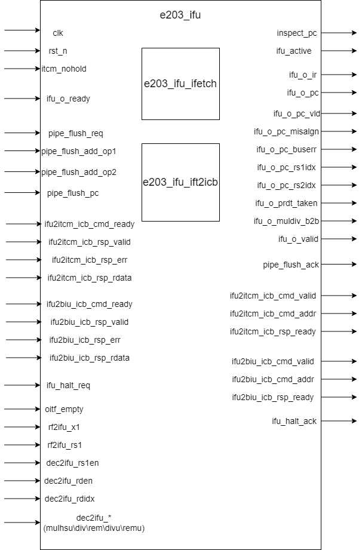

# e203_ifu Design Document

## 1. Introduction
The e203_ifu module is the top-level module of the instruction fetch unit (IFU) for the E203 processor. It coordinates instruction fetch operations by integrating the instruction fetch controller (`e203_ifu_ifetch`) and the bus interface converter (`e203_ifu_ift2icb`). This module supports the ITCM and system memory interfaces, implements a complete instruction fetch pipeline, and manages instruction alignment and error handling.

## 2. Module Block Diagram

## 3. Interface List

### 3.1 System Interface
| Signal Name | Direction | Bit Width | Description |
| --- | --- | --- | --- |
| clk | Input | 1 | System clock |
| rst_n | Input | 1 | Active low reset signal |
| inspect_pc | Output | E203_PC_SIZE | Current PC value for inspection |
| ifu_active | Output | 1 | IFU activity indicator |
| itcm_nohold | Input | 1 | ITCM hold control signal |
| pc_rtvec | Input | E203_PC_SIZE | Reset vector address |

### 3.2 IR stage to Execution Unit Interface
| Signal Name | Direction | Bit Width | Description |
| --- | --- | --- | --- |
| ifu_o_ir | Output | E203_INSTR_SIZE | Instruction register data |
| ifu_o_pc | Output | E203_PC_SIZE | PC value of the current instruction |
| ifu_o_pc_vld | Output | 1 | Indication signal for valid PC value |
| ifu_o_misalgn | Output | 1 | Instruction misalignment indication |
| ifu_o_buserr | Output | 1 | Bus error indication |
| ifu_o_rs1idx | Output | E203_RFIDX_WIDTH | Index of the first source operand register |
| ifu_o_rs2idx | Output | E203_RFIDX_WIDTH | Index of the second source operand register |
| ifu_o_prdt_taken | Output | 1 | Indication for branch prediction taken |
| ifu_o_muldiv_b2b | Output | 1 | Indication for consecutive multiplication and division instructions |
| ifu_o_valid | Output | 1 | Output data valid signal |
| ifu_o_ready | Input | 1 | Signal indicating that the downstream module is ready to receive data |

### 3.3 Pipeline Control Interface
| Signal Name | Direction | Bit Width | Description |
| --- | --- | --- | --- |
| pipe_flush_req | Input | 1 | Pipeline flush request |
| pipe_flush_ack | Output | 1 | Pipeline flush acknowledgment |
| pipe_flush_add_op1 | Input | E203_PC_SIZE | First operand for PC calculation during pipeline flush |
| pipe_flush_add_op2 | Input | E203_PC_SIZE | Second operand for PC calculation during pipeline flush |

if `E203_TIMING_BOOST` is defined, `pipe_flush_pc` is available.

| Signal Name   | Direction | Bit Width    | Description                                    |
| ------------- | --------- | ------------ | ---------------------------------------------- |
| pipe_flush_pc | Input     | E203_PC_SIZE | Flush PC value used when enabling timing boost |

### 3.4 ITCM Interface

if `E203_HAS_ITCM` is defined, this part of interfaces is available.

| Signal Name | Direction | Bit Width | Description |
| --- | --- | --- | --- |
| ifu2itcm_holdup | Input | 1 | The IFU to ITCM holdup signal |
| itcm_region_indic | Input | E203_ADDR_SIZE | The ITCM address region indication signal |
| ifu2itcm_icb_cmd_valid | Output | 1 | ITCM command valid signal |
| ifu2itcm_icb_cmd_ready | Input | 1 | ITCM ready to receive command signal |
| ifu2itcm_icb_cmd_addr | Output | E203_ITCM_ADDR_WIDTH | ITCM access address |
| ifu2itcm_icb_rsp_valid | Input | 1 | ITCM response valid signal |
| ifu2itcm_icb_rsp_ready | Output | 1 | IFU ready to receive response signal |
| ifu2itcm_icb_rsp_err | Input | 1 | ITCM access error indication |
| ifu2itcm_icb_rsp_rdata | Input | E203_ITCM_DATA_WIDTH | ITCM read data |

### 3.5 System Memory Interface

if `E203_HAS_MEM_ITF` is defined, this part of interfaces is available.

| Signal Name | Direction | Bit Width | Description |
| --- | --- | --- | --- |
| ifu2biu_icb_cmd_valid | Output | 1 | BIU command valid signal |
| ifu2biu_icb_cmd_ready | Input | 1 | BIU ready to receive command signal |
| ifu2biu_icb_cmd_addr | Output | E203_ADDR_SIZE | BIU access address |
| ifu2biu_icb_rsp_valid | Input | 1 | BIU response valid signal |
| ifu2biu_icb_rsp_ready | Output | 1 | IFU ready to receive response signal |
| ifu2biu_icb_rsp_err | Input | 1 | BIU access error indication |
| ifu2biu_icb_rsp_rdata | Input | E203_SYSMEM_DATA_WIDTH | BIU read data |

### 3.6 Halt Control Interface
| Signal Name | Direction | Bit Width | Description |
| --- | --- | --- | --- |
| ifu_halt_req | Input | 1 | Instruction fetch halt request |
| ifu_halt_ack | Output | 1 | Instruction fetch halt acknowledgment |

### 3.7 Other Input Interfaces
| Signal Name | Direction | Bit Width | Description |
| --- | --- | --- | --- |
| oitf_empty | Input | 1 | Instruction buffer empty signal |
| rf2ifu_x1 | Input | E203_XLEN | Value of register `x1` |
| rf2ifu_rs1 | Input | E203_XLEN | Value of register `rs1` |
| dec2ifu_rs1en | Input | 1 | Enable signal for register `rs1` |
| dec2ifu_rden | Input | 1 | Enable signal for destination register |
| dec2ifu_rdidx | Input | E203_RFIDX_WIDTH | Index of destination register |
| dec2ifu_mulhsu | Input | 1 | Identification of MULHSU instruction |
| dec2ifu_div | Input | 1 | Identification of DIV instruction |
| dec2ifu_rem | Input | 1 | Identification of REM instruction |
| dec2ifu_divu | Input | 1 | Identification of DIVU instruction |
| dec2ifu_remu | Input | 1 | Identification of REMU instruction |

## 4. Submodule List

This section describes the instantiated modules in the `e203_ifu` top-level module, along with their functions and interfaces.

### 4.1 `e203_ifu_ifetch`

#### Function Description
The `e203_ifu_ifetch` module is responsible for managing the program counter (PC) and the instruction fetch control flow. It mainly implements the following functions:

1. **PC Initialization and Update**:
    - Initializes the PC (sets it to `pc_rtvec` during reset).
    - Handles sequential instruction fetching, branch target updates, and pipeline flushing operations.

2. **Fetch Control**:
    - Generates fetch requests and ensures the correct timing and sequence of fetching.

3. **Exception and Halt Handling**:
    - Handles pipeline flush requests, bus errors, and alignment exceptions.
    - Handles instruction fetch halt requests.

#### Interface List

##### Input Signals
| Signal Name | Direction | Bit Width | Description |
| --- | --- | --- | --- |
| clk | Input | 1 | System clock for synchronizing internal operations. |
| rst_n | Input | 1 | Reset signal, active low, used to reset module state. |
| pc_rtvec | Input | E203_PC_SIZE | Reset vector address for initializing the program counter. |
| ifu_req_ready | Input | 1 | IFetch Interface to memory system request ready signal. |
| ifu_rsp_valid | Input | 1 | IFetch interface to memory system response signal. |
| ifu_rsp_err | Input | 1 | IFetch interface to memory system response error signal. |
| ifu_rsp_instr | Input | E203_INSTR_SIZE | IFetch interface to memory system response instruction. |
| ifu_o_ready | Input | 1 | Signal indicating that the execution unit (EXU) is ready to receive fetch data. |
| pipe_flush_req | Input | 1 | Requests to flush the pipeline, triggering an update of the pipeline state. |
| pipe_flush_add_op1 | Input | E203_PC_SIZE | The first operand for PC calculation during pipeline flushing. |
| pipe_flush_add_op2 | Input | E2003_PC_SIZE | The second operand for PC calculation during pipeline flushing. |
| pipe_flush_pc | Input | E203_PC_SIZE | Flush PC value used for performance improvement. If `E203_TIMING_BOOST` is defined, `pipe_flush_pc` is available.|
| ifu_halt_req | Input | 1 | Signal for pausing instruction fetch requests. |
| oitf_empty | Input | 1 | Indicates whether the Outstanding Instruction Tracker FIFO (OITF) is empty. |
| rf2ifu_x1 | Input | E203_XLEN | The value of register `x1` passed from the register file. |
| rf2ifu_rs1 | Input | E203_XLEN | The value of the first source register (RS1) passed from the register file. |
| dec2ifu_rden | Input | 1 | Destination register write enable signal. |
| dec2ifu_rs1en | Input | 1 | Enable signal for the first source register (RS1). |
| dec2ifu_rdidx | Input | E203_RFIDX_WIDTH | Index value of the destination register. |
| dec2ifu_mulhsu | Input | 1 | Indicates a signed/unsigned multiplication instruction. |
| dec2ifu_div | Input | 1 | Indicates a division instruction. |
| dec2ifu_rem | Input | 1 | Indicates a remainder instruction. |
| dec2ifu_divu | Input | 1 | Indicates an unsigned division instruction. |
| dec2ifu_remu | Input | 1 | Indicates an unsigned remainder instruction. |

##### Output Signals
| Signal Name | Direction | Bit Width | Description |
| --- | --- | --- | --- |
| inspect_pc | Output | E203_PC_SIZE | Current PC value for debugging or monitoring purposes. |
| ifu_req_valid | Output | 1 | Fetch request valid signal. |
| ifu_req_pc | Output | E203_PC_SIZE | Program counter (PC) value of the current fetch request. |
| ifu_req_seq | Output | 1 | Flag indicating sequential instruction fetching. |
| ifu_req_seq_rv32 | Output | 1 | Flag indicating RV32 instruction fetching. |
| ifu_req_last_pc | Output | E203_PC_SIZE | PC address of the previous fetch. |
| ifu_rsp_ready | Output | 1 | IFetch interface to memory system response ready. |
| pipe_flush_ack | Output | 1 | Acknowledgment signal for pipeline flush requests. |
| ifu_halt_ack | Output | 1 | Acknowledgment signal for halt fetch requests. |
| ifu_o_ir | Output | E203_INSTR_SIZE | Fetched instruction data, passed to the execution unit (EXU). |
| ifu_o_pc | Output | E203_PC_SIZE | PC value corresponding to the fetched instruction. |
| ifu_o_pc_vld | Output | 1 | Indicates that the PC value of the fetched instruction is valid. |
| ifu_o_misalgn | Output | 1 | Flag indicating the presence of an alignment exception. |
| ifu_o_buserr | Output | 1 | Indicates a bus error during the fetch process. |
| ifu_o_rs1idx | Output | E203_RFIDX_WIDTH | Index value of the first source register (RS1) for the current instruction. |
| ifu_o_rs2idx | Output | E203_RFIDX_WIDTH | Index value of the second source register (RS2) for the current instruction. |
| ifu_o_prdt_taken | Output | 1 | Branch prediction flag (predicted as taken). |
| ifu_o_muldiv_b2b | Output | 1 | Indicates whether there are consecutive multiplication and division instructions. |
| ifu_o_valid | Output | 1 | Indicates that the current instruction and PC data are valid and passed to the EXU. |

### 4.2 `e203_ifu_ift2icb`

#### Function Description
The `e203_ifu_ift2icb` module is responsible for converting fetch requests into ICB (Internal Chip Bus) protocol transactions and routing them to the correct storage target (ITCM or system memory). Additionally, it handles fetch responses, including data alignment and error reporting.

#### Interface List

1. 

| Signal Name | Direction | Bit Width | Description |
| --- | --- | --- | --- |
| clk | Input | 1 | System clock for synchronizing operations. |
| rst_n | Input | 1 | Reset signal, active low, used to reset module state. |
| ifu_req_valid | Input | 1 | Fetch request valid signal. |
| ifu_req_ready | Output | 1 | Signal indicating that the fetch request is ready. |
| ifu_req_pc | Input | E203_PC_SIZE | Program counter (PC) value of the current fetch request. |
| ifu_req_seq | Input | 1 | Flag indicating sequential instruction fetching. |
| ifu_req_seq_rv32 | Input | 1 | Flag indicating RV32 instruction fetching. |
| ifu_req_last_pc | Input | E203_PC_SIZE | PC address of the previous fetch. |
| ifu_rsp_valid | Output | 1 | Fetch response valid signal. |
| ifu_rsp_ready | Input | 1 | Signal indicating readiness to receive fetch responses. |
| ifu_rsp_err | Output | 1 | Fetch response error signal. |
| ifu_rsp_instr | Output | E203_INSTR_SIZE | Instruction data returned in the fetch response. |
| itcm_nohold | Input | 1 | ITCM no-hold signal indicating memory hold. |

2. If `E203_HAS_ITCM` is defined, this part is available.

| Signal Name | Direction | Bit Width | Description |
| --- | --- | --- | --- |
| itcm_region_indic | Input | E203_ADDR_SIZE | ITCM address range indication signal. |
| ifu2itcm_icb_cmd_valid | Output | 1 | ITCM command valid signal. |
| ifu2itcm_icb_cmd_ready | Input | 1 | ITCM command ready signal. |
| ifu2itcm_icb_cmd_addr | Output | ITCM_ADDR_WIDTH | ITCM access address. |
| ifu2itcm_icb_rsp_valid | Input | 1 | ITCM response valid signal. |
| ifu2itcm_icb_rsp_ready | Output | 1 | Signal indicating readiness to receive ITCM responses. |
| ifu2itcm_icb_rsp_err | Input | 1 | ITCM response error signal. |
| ifu2itcm_icb_rsp_rdata | Input | ITCM_DATA_WIDTH | ITCM response data. |
| ifu2itcm_holdup | Input | 1 | The IFU to ITCM holdup signal |

3. If `E203_HAS_MEM_ITF` is defined, this part is available.

| Signal Name | Direction | Bit Width | Description |
| --- | --- | --- | --- |
| ifu2biu_icb_cmd_valid | Output | 1 | System memory command valid signal. |
| ifu2biu_icb_cmd_ready | Input | 1 | System memory command ready signal. |
| ifu2biu_icb_cmd_addr | Output | ADDR_SIZE | System memory access address. |
| ifu2biu_icb_rsp_valid | Input | 1 | System memory response valid signal. |
| ifu2biu_icb_rsp_ready | Output | 1 | Signal indicating readiness to receive system memory responses. |
| ifu2biu_icb_rsp_err | Input | 1 | System memory response error signal. |
| ifu2biu_icb_rsp_rdata | Input | SYSMEM_DATA_WIDTH | System memory response data. |

### 4.3 Module Interaction Relationships
- **`e203_ifu_ifetch` ↔ `e203_ifu_ift2icb`**:
    - Use `ifu_req_*` signals to manage the flow of fetch requests.
    - Use `ifu_rsp_*` signals to handle fetch responses and pass instructions to `ifu_ifetch`.
- **`e203_ifu_ifetch` ↔ External Interfaces**:
    - Responsible for PC management, pipeline control, and the interface with the execution unit (EXU).
- **`e203_ifu_ift2icb` ↔ ITCM/System Memory**:
    - Convert fetch requests into ICB protocol transactions and route them to the corresponding storage targets.

## 5. Implementation Details

### 5.1 Process Overview
The `e203_ifu` module is a top module that instantiates `ifu_ifetch` and `ifu_ift2icb`. It is responsible for the entire instruction fetch process, including the following main steps:
1. **PC Generation and Update**: Generate the current fetch address (PC) and update the address of the next instruction according to the fetch result or jump request.
2. **Storage Access Routing**: Route the fetch request to the ITCM or system memory based on the address range.
3. **Instruction Data Return and Processing**: Receive the storage response and assemble the instructions into complete 32-bit or 16-bit instructions.
4. **Instruction Passing to EXU**: Pass the fetch results and the corresponding PC to the execution unit (EXU).
5. **Exception and Halt Handling**: Monitor and handle exceptions, halt requests, and other special cases during the fetch process.

### 5.2 Module Instantiation details

Signals with the same name are connected when instantiated. Moreover, signals that starts with `ifu_req` and `ifu_resp` are not part of ifu interface. They are signals that connect the two submodules.

### 5.3 Activation

The ifu module is always activated hence the `ifu_active` should be assign to 1 all the time.
