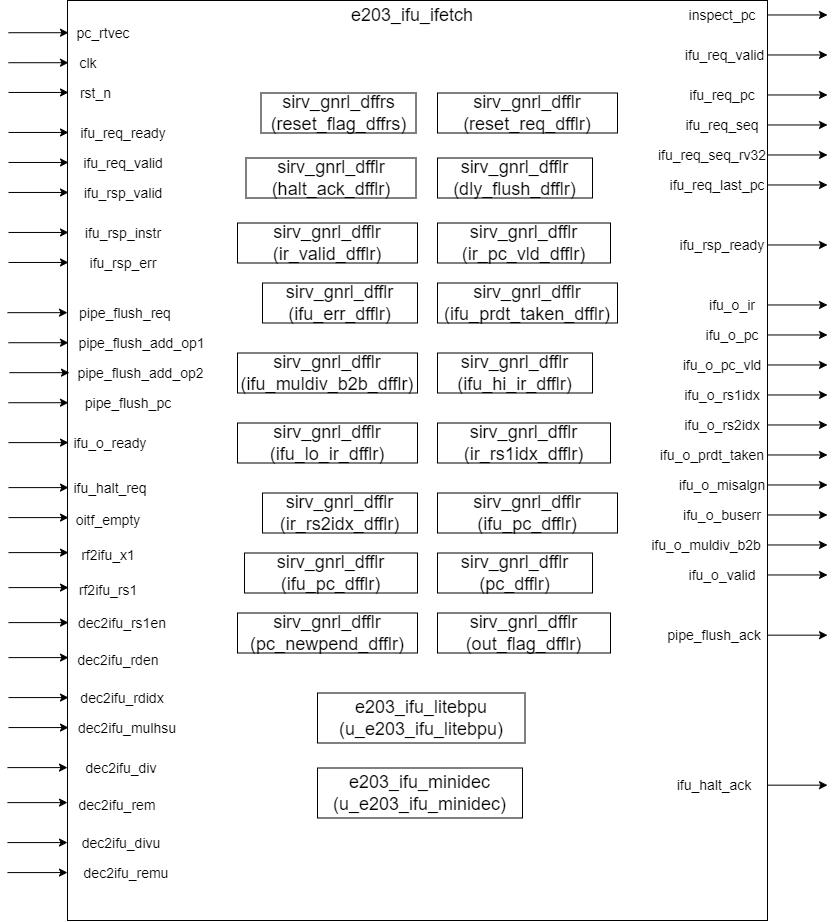

# e203_ifu_ifetch Design Document

## 1. Introduction
The e203_ifu_ifetch module is the core module of the Instruction Fetch Unit (IFU) of the E203 processor. It is responsible for generating the PC value of the next instruction and issuing bus requests. This module implements functions such as instruction pre-fetching, branch prediction, and instruction alignment. It supports the RV32C compressed instruction set and can handle complex control flow transitions.

## 2. Module Diagram

## 3. Interface List
### 3.1 System Interface
| Signal Name | Direction | Bit Width | Description |
| ---- | ---- | ---- | ---- |
| clk | Input | 1 | System clock used for synchronizing internal operations. |
| rst_n | Input | 1 | Active low reset signal, when deasserted, resets the module's internal state. |

### 3.2 Fetch Interface
| Signal Name | Direction | Bit Width | Description |
| ---- | ---- | ---- | ---- |
| ifu_req_valid | Output | 1 | Indicates that the fetch request is valid and ready to be sent to the memory system. |
| ifu_req_ready | Input | 1 | Signals that the memory system or the receiving component is ready to accept the fetch request. |
| ifu_req_pc | Output | E203_PC_SIZE | The PC address for the fetch request, specifying the location from which to fetch the instruction. |
| ifu_req_seq | Output | 1 | Flag to denote that the current request is for sequential instruction fetching. |
| ifu_req_seq_rv32 | Output | 1 | Flag indicating that the sequential fetch is for a 32-bit RV32 instruction. |
| ifu_req_last_pc | Output | E203_PC_SIZE | Holds the value of the last accessed PC address. |
| ifu_rsp_valid | Input | 1 | Signals that a valid response has been received from the memory system on the fetch response channel. |
| ifu_rsp_ready | Output | 1 | Indicates that the module is ready to receive the response from the memory system. |
| ifu_rsp_err | Input | 1 | Flag showing if an error occurred during the fetch process in the memory system. |
| ifu_rsp_instr | Input | E203_INSTR_SIZE | The actual instruction data fetched from the memory system. |

### 3.3 Pipeline Control Interface
| Signal Name | Direction | Bit Width | Description |
| ---- | ---- | ---- | ---- |
| pipe_flush_req | Input | 1 | Request to flush the pipeline, triggering internal state updates for flushing operations. |
| pipe_flush_ack | Output | 1 | Acknowledgement sent back to indicate that the pipeline flush request has been received and is being processed. |
| pipe_flush_add_op1 | Input | E203_PC_SIZE | First operand used in PC calculation during the pipeline flush process. |
| pipe_flush_add_op2 | Input | E203_PC_SIZE | Second operand for PC calculation during the pipeline flush operation. |
| pipe_flush_pc | Input | E203_PC_SIZE | Flush PC value used specifically for timing boost purposes. Only available when E203_TIMING_BOOST is defined. |

### 3.4 Execution Unit Interface
| Signal Name | Direction | Bit Width | Description |
| ---- | ---- | ---- | ---- |
| ifu_o_ir | Output | E203_INSTR_SIZE | Holds the instruction that is being passed from the fetch unit to the execution unit. |
| ifu_o_pc | Output | E203_PC_SIZE | The PC value associated with the instruction being sent to the execution unit. |
| ifu_o_pc_vld | Output | 1 | Flag indicating that the PC value sent to the execution unit is valid. |
| ifu_o_rs1idx | Output | E203_RFIDX_WIDTH | Index of the first source register (RS1) used by the instruction. |
| ifu_o_rs2idx | Output | E203_RFIDX_WIDTH | Index of the second source register (RS2) used by the instruction. |
| ifu_o_prdt_taken | Output | 1 | Flag indicating whether a branch prediction for a conditional branch instruction is predicted as taken. |
| ifu_o_misalgn | Output | 1 | Flag denoting if there is a misalignment issue with the fetched instruction (though usually 0 in certain configurations like RV32C). |
| ifu_o_buserr | Output | 1 | Flag showing if there was a bus error during the fetch process. |
| ifu_o_muldiv_b2b | Output | 1 | Flag indicating if multiplication and division instructions are executed back-to-back. |
| ifu_o_valid | Output | 1 | Handshake signal to inform the execution unit that the output data (instruction, PC, etc.) is valid. |
| ifu_o_ready | Input | 1 | Handshake signal from the execution unit indicating its readiness to receive the data. |

### 3.5 Halt Control Interface
| Signal Name | Direction | Bit Width | Description |
| ---- | ---- | ---- | ---- |
| ifu_halt_req | Input | 1 | Request to halt the instruction fetching process. When asserted, the fetch unit should stop issuing new requests. |
| ifu_halt_ack | Output | 1 | Acknowledgement sent back to indicate that the instruction fetch unit has stopped fetching and completed outstanding transactions in response to the halt request. |

### 3.6 Other Input Signals
| Signal Name | Direction | Bit Width | Description |
| ---- | ---- | ---- | ---- |
| inspect_pc | Output | E203_PC_SIZE | PC value. Used for debugging and monitoring purposes |
| pc_rtvec   | Input  | E203_PC_SIZE | PC reset vector address. |
| oitf_empty | Input | 1 | Signals whether an internal buffer or queue related to the instruction fetch interface is empty. |
| rf2ifu_x1 | Input | E203_XLEN | Value of the x1 register passed from the register file, which might be used in instruction processing. |
| rf2ifu_rs1 | Input | E203_XLEN | Value of the first source register (RS1) provided by the register file for instruction operands. |
| dec2ifu_rs1en | Input | 1 | Flag indicating whether the first source register (RS1) is enabled and relevant for the current instruction. |
| dec2ifu_rden | Input | 1 | Flag showing if the destination register for the current instruction is enabled and ready to be written to. |
| dec2ifu_rdidx | Input | E203_RFIDX_WIDTH | Index of the destination register for the current instruction. |
| dec2ifu_mulhsu | Input | 1 | Flag indicating the presence of a specific multiplication instruction type (e.g., signed/unsigned multiplication with specific behavior). |
| dec2ifu_div | Input | 1 | Flag indicating the presence of a division instruction. |
| dec2ifu_rem | Input | 1 | Flag indicating the presence of a remainder instruction. |
| dec2ifu_divu | Input | 1 | Flag indicating the presence of an unsigned division instruction. |
| dec2ifu_remu | Input | 1 | Flag indicating the presence of an unsigned remainder instruction. |

## 4. Submodule List

### 4.1 e203_ifu_minidec Module
**Function:** Instruction mini-decoder, used for quickly decoding instruction types and key fields.
Main Interfaces:

**Interface**

| Signal Name     | Direction | Bit Width          | Description                                     |
| --------------- | --------- | ------------------ | ----------------------------------------------- |
| instr           | Input     | `E203_INSTR_SIZE`  | Instruction to be decoded                       |
| dec_rs1en       | Output    | 1                  | Enable flag for source register 1               |
| dec_rs2en       | Output    | 1                  | Enable flag for source register 2               |
| dec_rs1idx      | Output    | `E203_RFIDX_WIDTH` | Index of source register 1                      |
| dec_rs2idx      | Output    | `E203_RFIDX_WIDTH` | Index of source register 2                      |
| dec_mulhsu      | Output    | 1                  | MULHSU (Multiply High Signed-Unsigned) flag     |
| dec_mul         | Output    | 1                  | MUL (Multiply) instruction flag                 |
| dec_div         | Output    | 1                  | DIV (Divide) instruction flag                   |
| dec_rem         | Output    | 1                  | REM (Remainder) instruction flag                |
| dec_divu        | Output    | 1                  | DIVU (Unsigned Divide) instruction flag         |
| dec_remu        | Output    | 1                  | REMU (Unsigned Remainder) instruction flag      |
| dec_rv32        | Output    | 1                  | RV32 instruction flag                           |
| dec_bjp         | Output    | 1                  | Branch or jump instruction flag                 |
| dec_jal         | Output    | 1                  | JAL (Jump and Link) instruction flag            |
| dec_jalr        | Output    | 1                  | JALR (Jump and Link Register) instruction flag  |
| dec_bxx         | Output    | 1                  | Conditional branch instruction flag             |
| dec_jalr_rs1idx | Output    | `E203_RFIDX_WIDTH` | Index of source register 1 for JALR instruction |
| dec_bjp_imm     | Output    | `E203_XLEN`        | Immediate value for branch or jump instructions |

### 4.2 e203_ifu_litebpu Module
**Function:** Lightweight branch prediction unit.
**Interfaces:**

| Signal Name             | Direction | Bit Width          | Description                                                  |
| ----------------------- | --------- | ------------------ | ------------------------------------------------------------ |
| pc                      | Input     | `E203_PC_SIZE`     | Current program counter (PC)                                 |
| dec_jal                 | Input     | 1                  | JAL (Jump and Link) instruction flag                         |
| dec_jalr                | Input     | 1                  | JALR (Jump and Link Register) instruction flag               |
| dec_bxx                 | Input     | 1                  | Conditional branch instruction flag                          |
| dec_bjp_imm             | Input     | `E203_XLEN`        | Immediate value for branch or jump instructions              |
| dec_jalr_rs1idx         | Input     | `E203_RFIDX_WIDTH` | Source register index for JALR instruction                   |
| oitf_empty              | Input     | 1                  | Flag indicating if the OITF (Outstanding Instruction Tracking FIFO) is empty |
| ir_empty                | Input     | 1                  | Flag indicating if the instruction register (IR) is empty    |
| ir_rs1en                | Input     | 1                  | Enable flag for source register 1 in the instruction register (IR) |
| jalr_rs1idx_cam_irrdidx | Input     | 1                  | Flag indicating if `jalr_rs1idx` matches the IR destination index |
| bpu_wait                | Output    | 1                  | Block prediction unit (BPU) wait signal                      |
| prdt_taken              | Output    | 1                  | Predicted branch taken signal                                |
| prdt_pc_add_op1         | Output    | `E203_PC_SIZE`     | First operand for predicted PC calculation                   |
| prdt_pc_add_op2         | Output    | `E203_PC_SIZE`     | Second operand for predicted PC calculation                  |
| dec_i_valid             | Input     | 1                  | Valid flag for the decoded instruction                       |
| bpu2rf_rs1_ena          | Output    | 1                  | Enable signal for reading source register 1 from the register file |
| ir_valid_clr            | Input     | 1                  | Clear valid flag for the instruction register (IR)           |
| rf2bpu_x1               | Input     | `E203_XLEN`        | Value of the x1 register from the register file              |
| rf2bpu_rs1              | Input     | `E203_XLEN`        | Value of source register 1 from the register file            |
| clk                     | Input     | 1                  | Clock signal                                                 |
| rst_n                   | Input     | 1                  | Reset signal (active low)                                    |

### 4.3 sirv_gnrl_dffrs(Optional)

**Function** A D-flip-flop that could used to store bits. The bit width can be configured by changing the DW parameter when instantiating.

#### 4.3.1 Parameter Configuration

| Parameter Name | Default Value | Description |
|----------------|---------------|-------------|
| DW             | 32            | Data width (in bits) |

#### 4.3.2 Signal Interface

| Port Name | Direction | Width | Description |
|-----------|-----------|-------|-------------|
| dnxt      | Input     | DW    | Input data |
| qout      | Output    | DW    | Output data |
| clk       | Input     | 1     | Clock signal |
| rst_n     | Input     | 1     | Active-low reset signal |

#### 4.3.3 Instantiation List

1. Used to synchronize the reset signal with clock signal.

   Function: 

   - The instance synchronizes the reset signal to the clock domain.
   - The output is initialized to 1 when resetting and updated to 0 when not resetting.
   - This synchronization prevents timing-related issues and ensures proper reset behavior in the design.

### 4.4. sirv_gnrl_dfflr(Optional)

**Function** A D-flip-flop that could used to store bits. The bit width can be configured by changing the DW parameter when instantiating. The value will only be stored when `lden` signal is high.

#### 4.4.1 Parameter Configuration

| Parameter Name | Default Value | Description |
|----------------|---------------|-------------|
| DW             | 32            | Data width (in bits) |

#### 4.4.2 Signal Interface

| Port Name | Direction | Width | Description |
|-----------|-----------|-------|-------------|
| lden      | Input     | 1     | Load enable signal |
| dnxt      | Input     | DW    | Input data |
| qout      | Output    | DW    | Output data |
| clk       | Input     | 1     | Clock signal |
| rst_n     | Input     | 1     | Active-low reset signal |

#### 4.4.3 Instantiation List

1. reset_req_dfflr：

   The `reset_req_dfflr` manages the **latching and clearing of a reset request**:

   - It ensures that a reset request (`reset_req_r`) is generated when needed (based on `reset_flag_r`) and cleared when acknowledged (`ifu_req_hsked`).
   - This mechanism ensures proper synchronization of reset requests with the clock and coordination with the IFU, avoiding redundant or missed  reset handling.

2. halt_ack_dfflr:

   The `halt_ack_dfflr` is responsible for:

   - Generating a synchronized halt acknowledgment signal (`halt_ack_r`) based on the presence of a halt request and the readiness of the IFU (no outstanding transactions).
   - Clearing the acknowledgment when the halt request is no longer active.

   This mechanism ensures that halt requests are acknowledged only under safe and valid conditions, avoiding potential conflicts in the system.

   Key Features:

   - **Set and Clear Logic:** Ensures `halt_ack_r` is asserted or de-asserted based on specified conditions.
   - **Load-Enable Control:** Updates the state of `halt_ack_r` only when necessary, reducing unnecessary toggling.
   - **Clock Synchronization:** Provides a stable and clock-synchronized halt acknowledgment signal for use in the system.

3. dly_flush_dfflr:

   The `dly_flush_dfflr` is used to handle **delayed flush requests** in the pipeline, ensuring that a flush request (`pipe_flush_req`) is properly managed when the instruction fetch unit (IFU) is not ready  to accept a new fetch request. It ensures that flush requests are not  lost and are issued as soon as the IFU becomes ready

4. ir_valid_dfflr:

   The `ir_valid_dfflr` is responsible for managing the **validity of the current instruction** (`ir_valid_r`) in a pipelined system. It ensures that the instruction remains valid  until it is either processed by the execution unit (EXU) or invalidated  due to a pipeline flush.

5. ir_pc_valid_dfflr:

   The `ir_pc_vld_dfflr` is responsible for managing the **validity of the program counter (PC)** associated with the current instruction in a pipelined processor. It ensures that the PC validity (`ir_pc_vld_r`) is updated and maintained based on specific pipeline conditions, such as instruction fetch, flushes, and execution

6. **ifu_err_dfflr**:
    The `ifu_err_dfflr` stores the next error signal (`ifu_err_nxt`) for the instruction fetch unit (IFU) and updates it only when a valid instruction is being fetched (`ir_valid_set`). This ensures that any error associated with the current instruction is recorded and synchronized with the instruction's validity.

7. **ifu_prdt_taken_dfflr**:
    The `ifu_prdt_taken_dfflr` stores the branch prediction result (`prdt_taken`) for the current instruction and updates it when a valid instruction is fetched (`ir_valid_set`). This allows the pipeline to track whether the branch prediction for the current instruction was taken.

8. **ir_muldiv_b2b_dfflr**:
    The `ir_muldiv_b2b_dfflr` tracks whether there is a back-to-back multiply or divide operation (`ifu_muldiv_b2b_nxt`) for the current instruction. It updates this status whenever a valid instruction is fetched (`ir_valid_set`). This is useful for handling instruction dependencies in the pipeline.

9. **ifu_hi_ir_dfflr**:
    The `ifu_hi_ir_dfflr` is responsible for storing the high 16 bits (`ifu_ir_nxt[31:16]`) of a 32-bit instruction in the instruction register (`ifu_ir_r[31:16]`). It only updates the high part when a valid instruction is fetched and the instruction is 32 bits long (`ir_valid_set & minidec_rv32`), optimizing power usage by avoiding unnecessary updates for 16-bit instructions.

10. **ifu_lo_ir_dfflr**:
     The `ifu_lo_ir_dfflr` stores the low 16 bits (`ifu_ir_nxt[15:0]`) of the current instruction in the instruction register (`ifu_ir_r[15:0]`). It updates the low part whenever a valid instruction is fetched (`ir_valid_set`), ensuring the low bits of the instruction are always stored regardless of its length.

11. **ir_rs1idx_dfflr**:
     The `ir_rs1idx_dfflr` stores the source register 1 index (`ir_rs1idx_r`) for the current instruction. It updates the register index (`ir_rs1idx_nxt`) only when the enable signal (`ir_rs1idx_ena`) is active. The enable signal ensures that the index is updated based on whether the instruction uses the first source register and whether it is an FPU or non-FPU instruction, masking unnecessary updates for power efficiency.

12. **ir_rs2idx_dfflr**:
     The `ir_rs2idx_dfflr` stores the source register 2 index (`ir_rs2idx_r`) for the current instruction. It updates the register index (`ir_rs2idx_nxt`) only when the enable signal (`ir_rs2idx_ena`) is active. The enable signal ensures that the index is updated only when the instruction uses the second source register, considering whether the instruction is an FPU or non-FPU instruction, optimizing for power efficiency.

13. **ifu_pc_dfflr**:
     The `ifu_pc_dfflr` stores the program counter (PC) value (`ifu_pc_r`) for the current instruction. It updates the PC value (`ifu_pc_nxt`) only when the enable signal (`ir_pc_vld_set`) is active, ensuring the PC is valid and ready for use in the pipeline. This mechanism ensures that the PC is stored and synchronized with the instruction validity, avoiding unnecessary updates to save power.

14. **pc_dfflr**:
     The `pc_dfflr` stores the program counter (`pc_r`) for the instruction fetch unit (IFU). It updates the program counter value (`pc_nxt`) only when the enable signal (`pc_ena`) is active. The enable signal is triggered when either the instruction fetch request channel handshake (`ifu_req_hsked`) completes or a pipeline flush occurs (`pipe_flush_hsked`). This ensures that the program counter is updated at the correct times, such as after a successful instruction fetch or during a pipeline flush.

15. **out_flag_dfflr**:
     The `out_flag_dfflr` manages the state of the `out_flag_r` signal, which indicates whether there is an outstanding request in the instruction fetch unit (IFU). It is set (`out_flag_set`) when a new instruction fetch request handshake occurs (`ifu_req_hsked`) and cleared (`out_flag_clr`) when the corresponding response handshake completes (`ifu_rsp_hsked`). The next state (`out_flag_nxt`) prioritizes setting the flag if both set and clear conditions occur simultaneously. This ensures proper tracking of outstanding requests in the pipeline.

16. **pc_newpend_dfflr**:
     The `pc_newpend_dfflr` manages the `pc_newpend_r` signal, which indicates whether a new program counter (PC) value is pending in the pipeline. It is set (`pc_newpend_set`) when a new PC is loaded (`pc_ena`) and cleared (`pc_newpend_clr`) when the PC is successfully loaded into the instruction register (`ir_pc_vld_set`). The next state (`pc_newpend_nxt`) prioritizes setting the flag if both set and clear conditions occur simultaneously. This ensures that the pipeline accurately tracks pending PC updates.

## 5. Implementation Details

### 5.1 Definition of Basic Signals and Handshake Logic

The module implements a handshaking protocol to maintain proper flow control. For example, when both `ifu_req_valid` and `ifu_req_ready` are true, it means that the ifu module request is valid and the downstream module is ready to process ifu's request.

The handshake protocol plays a role in the process of ifu sending requests, receiving replies, outputting instructions and pipeline flushing.

### 5.2 Reset Control Logic
`ifu_reset_req` is a control signal that manages the reset request logic of the instruction fetch unit (IFU). Its role is to coordinate the reset process of the IFU when the system reset state changes, ensuring that the reset operation is correctly executed and eventually released.

Specifically, the logic generates a reset request signal by detecting changes in the reset flag. When the system is in the reset state, the reset request is activated; when the reset state is released and the IFU is able to accept new instruction requests, the reset request is revoked. This mechanism ensures that the reset operation does not interfere with the normal instruction fetch process while responding to the system reset requirements in a timely manner.

The logic adopts a synchronous design to avoid glitches or asynchronous problems in the reset signal, and stabilizes the reset request signal through the status register to ensure that it takes effect in the correct clock cycle. The whole process is self-consistent, that is, the activation and revocation of the reset request are automatically controlled by internal conditions without external intervention, thereby ensuring a smooth transition between the reset and the resumption of normal operation of the IFU.

Finally, `ifu_reset_req` is used as the output signal of the reset request to inform the IFU whether a reset operation is required to ensure that the instruction fetch unit maintains the correct state when the system is reset or restored.

### 5.3 Halt Acknowledgement Generation

The halt_ack will be set when

- Currently halt_req is asserting
- Currently halt_ack is not asserting
- Currently the ifetch REQ channel is ready, means there is no oustanding transactions

The `halt_ack` is cleared when 

- Currently halt_ack is asserting
- Currently halt_req is de-asserting

### 5.4 Pipeline Flush Control

`pipe_flush_req_real` is a synthetic signal used to manage pipeline flush requests. Its core function is to ensure that the flush operation can be reliably executed even when the instruction fetch unit (IFU) is temporarily unable to respond immediately. This logic solves the timing coupling problem between pipeline control and instruction fetch by introducing a delayed refresh mechanism, avoiding the loss of flush requests due to unready handshake signals.

Specifically, when a pipeline flush request is initiated externally, the system will respond immediately (that is, always return a confirmation signal), but if the IFU is not ready, the request will be temporarily stored as a delayed flush marker. Subsequently, when the IFU is able to process new requests, the delayed flush operation will be automatically triggered. This design not only ensures the immediate responsiveness of the flush request, but also avoids the blocking problem caused by the incomplete handshake. At the same time, it supports the continued reception of new flush requests in the case of an existing delayed refresh, ensuring the efficiency and robustness of pipeline control.

Finally, `pipe_flush_req_real` merges the real-time flush request with the delayed flush request to form a unified control signal, ensuring that all flush operations can be executed at the appropriate time to maintain the correct state of the pipeline.

### 5.5 IR (Instruction Register) Control
#### 5.5.1 IR Validity Control
- ir_valid_set: IR valid set condition.
  - Composition: ifu_rsp_hsked & (~pipe_flush_req_real) & (~ifu_rsp_need_replay).
- ir_valid_clr: IR valid clear condition.
  - Composition: ifu_ir_o_hsked | (pipe_flush_hsked & ir_valid_r).
- ir_valid_ena: IR valid enable.
  - Composition: ir_valid_set | ir_valid_clr.
- ir_valid_nxt: IR valid next state.
  - Composition: ir_valid_set | (~ir_valid_clr).
- ir_valid_r: IR valid register.
  - Implementation: sirv_gnrl_dfflr flip-flop.
  - Update condition: ir_valid_ena.
  - Update value: ir_valid_nxt.
#### 5.5.2 IR PC Validity Control
- ir_pc_vld_set: IR PC valid set condition.
  - Composition: pc_newpend_r & ifu_ir_i_ready & (~pipe_flush_req_real) & (~ifu_rsp_need_replay).
- ir_pc_vld_clr: IR PC valid clear condition.
  - Composition: ir_valid_clr.
- ir_pc_vld_ena: IR PC valid enable.
  - Composition: ir_pc_vld_set | ir_pc_vld_clr.
- ir_pc_vld_nxt: IR PC valid next state.
  - Composition: ir_pc_vld_set | (~ir_pc_vld_clr).
- ir_pc_vld_r: IR PC valid register.
  - Implementation: sirv_gnrl_dfflr flip-flop.
  - Update condition: ir_pc_vld_ena.
  - Update value: ir_pc_vld_nxt.
#### 5.5.3 Error Flag Register
- ifu_err_r: Fetch error flag.
  - Implementation: sirv_gnrl_dfflr flip-flop.
  - Update condition: ir_valid_set.
  - Update value: ifu_err_nxt (from ifu_rsp_err).
#### 5.5.4 Branch Prediction Flag
- ifu_prdt_taken_r: Branch prediction result.
  - Implementation: sirv_gnrl_dfflr flip-flop.
  - Update condition: ir_valid_set.
  - Update value: prdt_taken (from BPU).
#### 5.5.5 Multiplication and Division Back-to-Back Flag
- ifu_muldiv_b2b_r: Multiplication and division back-to-back execution flag.
  - Implementation: sirv_gnrl_dfflr flip-flop.
  - Update condition: ir_valid_set.
  - Update value: ifu_muldiv_b2b_nxt.
#### 5.5.6 IR Instruction Storage Implementation
- ifu_ir_r: Instruction register.
  - Segmented storage:
    - High 16 bits (31:16):
      - Enable condition (ir_hi_ena): ir_valid_set & minidec_rv32.
      - Update value: ifu_ir_nxt[31:16].
      - Implementation: sirv_gnrl_dfflr flip-flop.
    - Low 16 bits (15:0):
      - Enable condition (ir_lo_ena): ir_valid_set.
      - Update value: ifu_ir_nxt[15:0].
      - Implementation: sirv_gnrl_dfflr flip-flop.
  - Note: Adopts a segmented update strategy to reduce power consumption.
#### 5.5.7 Source Register Index Storage
- ir_rs1idx_r: RS1 register index.
  - Enable condition (ir_rs1idx_ena):
    1. (minidec_fpu & ir_valid_set & minidec_fpu_rs1en & (~minidec_fpu_rs1fpu)) |
    2. ((~minidec_fpu) & ir_valid_set & minidec_rs1en) |
    3. bpu2rf_rs1_ena.
  - Update value (ir_rs1idx_nxt):
    - FPU instruction: minidec_fpu_rs1idx.
    - Normal instruction: minidec_rs1idx.
  - Implementation: sirv_gnrl_dfflr flip-flop.
- ir_rs2idx_r: RS2 register index.
  - Enable condition (ir_rs2idx_ena):
    1. (minidec_fpu & ir_valid_set & minidec_fpu_rs2en & (~minidec_fpu_rs2fpu)) |
    2. ((~minidec_fpu) & ir_valid_set & minidec_rs2en).
  - Update value (ir_rs2idx_nxt):
    - FPU instruction: minidec_fpu_rs2idx.
    - Normal instruction: minidec_rs2idx.
  - Implementation: sirv_gnrl_dfflr flip-flop.

### 5.6 PC Control Logic
#### 5.6.1 PC Update Enable Control
- pc_ena: PC update enable signal.
  - Composition: ifu_req_hsked | pipe_flush_hsked.
  - Function: Controls the update timing of the PC value.
#### 5.6.2 PC Adder Operand Selection
- pc_add_op1: First operand of the PC adder.
  - Selection logic (priority from high to low):
    1. `ifndef E203_TIMING_BOOST
       - When pipe_flush_req: pipe_flush_add_op1.
       - When dly_pipe_flush_req: pc_r.
       `endif
    2. When ifetch_replay_req: pc_r.
    3. When bjp_req: prdt_pc_add_op1.
    4. When ifu_reset_req: pc_rtvec.
    5. Default: pc_r.
- pc_add_op2: Second operand of the PC adder.
  - Selection logic (priority from high to low):
    1. `ifndef E203_TIMING_BOOST
       - When pipe_flush_req: pipe_flush_add_op2.
       - When dly_pipe_flush_req: 0.
       `endif
    2. When ifetch_replay_req: 0.
    3. When bjp_req: prdt_pc_add_op2.
    4. When ifu_reset_req: 0.
    5. Default: pc_incr_ofst.
#### 5.6.3 Instruction Length and Sequence Control
- pc_incr_ofst: PC increment value.
  - Calculation: minidec_rv32? 3'd4 : 3'd2.
  - Usage: Determines the next PC offset according to the instruction length.
- ifu_req_seq: Sequential fetch flag.
  - Composition: (~pipe_flush_req_real) & (~ifu_reset_req) & (~ifetch_replay_req) & (~bjp_req).
  - Function: Indicates whether the current fetch is sequential.
- ifu_req_seq_rv32: RV32 instruction flag.
  - Value: minidec_rv32.
  - Function: Indicates whether the currently fetched instruction is 32 bits.
- ifu_req_last_pc: Previous PC value.
  - Value: pc_r.
  - Usage: Used for instruction alignment and exception handling.
#### 5.6.4 PC Generation and Update
- pc_nxt_pre: Pre-calculated PC value.
  - Calculation: pc_add_op1 + pc_add_op2.
  - Usage: Original calculation result, may not be aligned.
- pc_nxt: Actual next PC value.
  - `ifndef E203_TIMING_BOOST
    Value: {pc_nxt_pre[`E203_PC_SIZE-1:1],1'b0}.
    `else
    Selection logic:
    1. When pipe_flush_req: {pipe_flush_pc[`E203_PC_SIZE-1:1],1'b0}.
    2. When dly_pipe_flush_req: {pc_r[`E203_PC_SIZE-1:1],1'b0}.
    3. Default: {pc_nxt_pre[`E203_PC_SIZE-1:1],1'b0}.
    `endif
  - Function: Ensures that the PC is always 2-byte aligned.
- pc_r: Current PC register.
  - Implementation: sirv_gnrl_dfflr flip-flop.
  - Update condition: pc_ena.
  - Update value: pc_nxt.
  - Usage: Stores the current instruction address.
#### 5.6.5 PC Output Interface
- inspect_pc: PC monitoring output.
  - Value: pc_r.
  - Usage: Used for debugging and monitoring purposes.

### 5.7 Fetch Request Generation and Control
#### 5.7.1 Fetch Request Generation Conditions
- ifu_new_req: New fetch request condition.
  - Composition: (~bpu_wait) & (~ifu_halt_req) & (~reset_flag_r) & (~ifu_rsp_need_replay).
  - Condition Explanation:
    1. The BPU is not in a waiting state.
    2. There is no halt request.
    3. It is not in a reset state.
    4. There is no need for replay.
#### 5.7.2 Request Validity Control
- new_req_condi: New request condition.
  - Composition: (~out_flag_r) | out_flag_clr.
  - Explanation: There is no outstanding request or the current request has been completed.
- ifu_req_valid_pre: Request valid preprocessing signal.
  - Composition: ifu_new_req | ifu_reset_req | pipe_flush_req_real | ifetch_replay_req.
  - Explanation: Combines all possible request sources.
- ifu_req_valid: Final request valid signal.
  - Composition: ifu_req_valid_pre & new_req_condi.
  - Function: The actual control signal that drives the fetch request.
#### 5.7.3 Response Processing Control
- ifu_rsp2ir_ready: IR is ready to receive the response.
  - Composition: (pipe_flush_req_real)? 1'b1 : (ifu_ir_i_ready & ifu_req_ready & (~bpu_wait)).
  - Condition Explanation:
    1. During pipeline flush, it is directly ready.
    2. In other cases, it needs to meet:
       - The IR is ready.
       - The request channel is ready.
       - The BPU is not waiting.
- ifu_rsp_ready: Response channel ready signal.
  - Value: ifu_rsp2ir_ready.
  - Function: Indicates that the fetch unit is ready to receive the response.
#### 5.7.4 Outstanding Request Control
- out_flag_set: Set the outstanding request.
  - Condition: ifu_req_hsked.
  - Explanation: Set when a new request is issued.
- out_flag_clr: Clear the outstanding request.
  - Condition: ifu_rsp_hsked.
  - Explanation: Clear when the response handshake is completed.
- out_flag_ena: Enable the update of the flag.
  - Composition: out_flag_set | out_flag_clr.
  - Function: Controls the update of the outstanding request flag.
- out_flag_nxt: Update value of the flag.
  - Composition: out_flag_set | (~out_flag_clr).
  - Explanation: Considers both the set and clear operations.
- out_flag_r: Outstanding request flag register.
  - Implementation: sirv_gnrl_dfflr flip-flop.
  - Update condition: out_flag_ena.
  - Update value: out_flag_nxt.

### 5.8 Mini-decoder Interface Implementation
#### 5.8.1 Decoder Input
- instr: Instruction to be decoded.
  - Source: ifu_ir_nxt.
  - Bit width: E203_INSTR_SIZE.
#### 5.8.2 Instruction Type Decoding Output
- minidec_rv32: RV32 instruction flag.
- minidec_bjp: Branch jump instruction flag.
- minidec_jal: JAL instruction flag.
- minidec_jalr: JALR instruction flag.
- minidec_bxx: Conditional branch instruction flag.
#### 5.8.3 Register Usage Decoding
- minidec_rs1en: RS1 usage enable.
- minidec_rs2en: RS2 usage enable.
- minidec_rs1idx: RS1 register index.
- minidec_rs2idx: RS2 register index.
- minidec_jalr_rs1idx: JALR instruction RS1 index.
#### 5.8.4 Immediate Decoding
- minidec_bjp_imm: Immediate value of the branch jump instruction.
  - Bit width: E203_XLEN.
  - Usage: Used for calculating the branch target address.
#### 5.8.5 Multiplication and Division Instruction Decoding
- minidec_mul: Multiplication instruction flag.
- minidec_div: Division instruction flag.
- minidec_rem: Remainder instruction flag.
- minidec_divu: Unsigned division flag.
- minidec_remu: Unsigned remainder flag.

### 5.9 BPU Interface and Control
#### 5.9.1 BPU Input Signals
- pc: Current PC value.
  - Source: pc_r.
  - Usage: The base address for branch prediction.
- dec_jal: JAL instruction flag.
- dec_jalr: JALR instruction flag.
- dec_bxx: Conditional branch flag.
- dec_bjp_imm: Branch immediate value.
- dec_jalr_rs1idx: RS1 index of JALR.
#### 5.9.2 BPU Control Signals
- dec_i_valid: Decoded instruction valid.
  - Value: ifu_rsp_valid.
  - Function: Notifies the BPU that there is a new instruction that needs prediction.
- ir_valid_clr: IR clear signal.
  - Function: Notifies the BPU that the current instruction has finished processing.
#### 5.9.3 BPU Output Signals
- bpu_wait: BPU wait flag.
- prdt_taken: Branch prediction result.
- prdt_pc_add_op1: First operand of the predicted PC adder.
- prdt_pc_add_op2: Second operand of the predicted PC adder.
#### 5.9.4 Register Interaction Signals
- bpu2rf_rs1_ena: RS1 read enable.
- rf2bpu_x1: Value of the x1 register.
- rf2bpu_rs1: Value of the RS1 register.

### 5.10 State Monitoring and Control
#### 5.10.1 PC Pending State Control
- pc_newpend_set: PC pending set condition.
  - Value: pc_ena.
  - Explanation: Set the pending flag when the PC is updated.
- pc_newpend_clr: PC pending clear condition.
  - Value: ir_pc_vld_set.
  - Explanation: Clear when the PC value is loaded into the IR-PC stage.
- pc_newpend_ena: PC pending enable.
  - Composition: pc_newpend_set | pc_newpend_clr.
  - Function: Controls the update of the pending flag.
- **pc_newpend_nxt**: PC pending next state.
  - Composition: pc_newpend_set | (~pc_newpend_clr).
  - Explanation: Considers the priority of setting and clearing.
- pc_newpend_r: PC pending flag register.
  - Implementation: sirv_gnrl_dfflr flip-flop.
  - Update condition: pc_newpend_ena.
  - Update value: pc_newpend_nxt.
#### 5.10.2 Fetch Replay Control
- ifu_rsp_need_replay: Response replay requirement.
  - Fixed value: 1'b0.
  - Explanation: Reserved for future expansion.
- ifetch_replay_req: Replay request signal.
  - Fixed value: 1'b0.
  - Explanation: Reserved for future expansion.
#### 5.10.3 State Output Interface
- ir_empty: IR empty state.
  - Composition: ~ir_valid_r.
  - Usage: Indicates whether the IR stage is empty.
- ir_rs1en: RS1 enable state.
  - Value: dec2ifu_rs1en.
  - Usage: Reflects the usage status of RS1.
- ir_rden: Destination register enable.
  - Value: dec2ifu_rden.
  - Usage: Reflects the write register enable status.
- ir_rdidx: Destination register index.
  - Value: dec2ifu_rdidx.
  - Usage: Stores the write register index.

### 5.11 Assertion Check Implementation
#### 5.11.1 FPGA-related Control
- Enable additional checks when not in FPGA implementation.
- Controlled by the FPGA_SOURCE macro.
- The assertion is enabled or disabled by the DISABLE_SV_ASSERTION macro.
#### 5.11.2 Key Signal Check
- CHECK_IFU_REQ_VALID_NO_X: Check the validity of the ifu_req_valid signal.
  - Check object: ifu_req_valid signal.
  - Check content: Ensure that the signal does not have an X value.
  - Trigger condition: On the rising edge of the clock and when the reset is inactive.
  - Error handling: Trigger a fatal error when an X value is detected.
#### 5.11.3 Timing-related Checks
- Check the clock edge of all DFF instances.
- Check the validity of the asynchronous reset signal.
- Check the state transition of key control signals.

### 5.12 Special Case Handling
#### 5.12.1 FPU-related Handling
- When E203_HAS_FPU is not defined:
  - minidec_fpu = 1'b0.
  - minidec_fpu_rs1en = 1'b0.
  - minidec_fpu_rs2en = 1'b0.
  - minidec_fpu_rs3en = 1'b0.
  - minidec_fpu_rs1fpu = 1'b0.
  - minidec_fpu_rs2fpu = 1'b0.
  - minidec_fpu_rs3fpu = 1'b0.
  - minidec_fpu_rs1idx = E203_RFIDX_WIDTH'b0.
  - minidec_fpu_rs2idx = E203_RFIDX_WIDTH'b0.
#### 5.12.2 Timing Optimization-related Handling
- When E203_TIMING_BOOST is defined:
  - Modify the PC calculation logic.
  - Simplify the flush processing flow.
  - Optimize the critical path delay.

## 6. Corner Cases
1. Reset Timing Handling:
   - Ensure that the reset vector is loaded correctly.
   - Handle outstanding requests during the reset period.
2. Instruction Alignment:
   - There is no need to check instruction alignment in RV32C mode.
   - Automatically handle the switch between 16-bit and 32-bit instructions.
3. Branch Prediction Conflict:
   - Handle the situation where the prediction is inconsistent with the actual execution result.
   - Ensure the correct state recovery.
4. Pipeline Flush Race:
   - Handle consecutive flush requests.
   - Ensure that flush requests are not lost.

## 7. Constraints
1. Mutual Exclusion Conditions:
   - reset_req and pipe_flush_req will not be valid at the same time.
   - ir_valid_set and ir_valid_clr will not occur simultaneously.
2. Timing Constraints:
   - The PC update must be completed on the rising edge of the clock.
   - The instruction response must arrive in the next cycle after the request.
3. Handshake Constraints:
   - req_valid and req_ready must follow the standard handshake protocol.
   - rsp_valid and rsp_ready must follow the standard handshake protocol.
4. State Constraints:
   - The out_flag must be set when a new request is issued.
   - The IR register must be empty or about to be emptied when receiving a new instruction. 