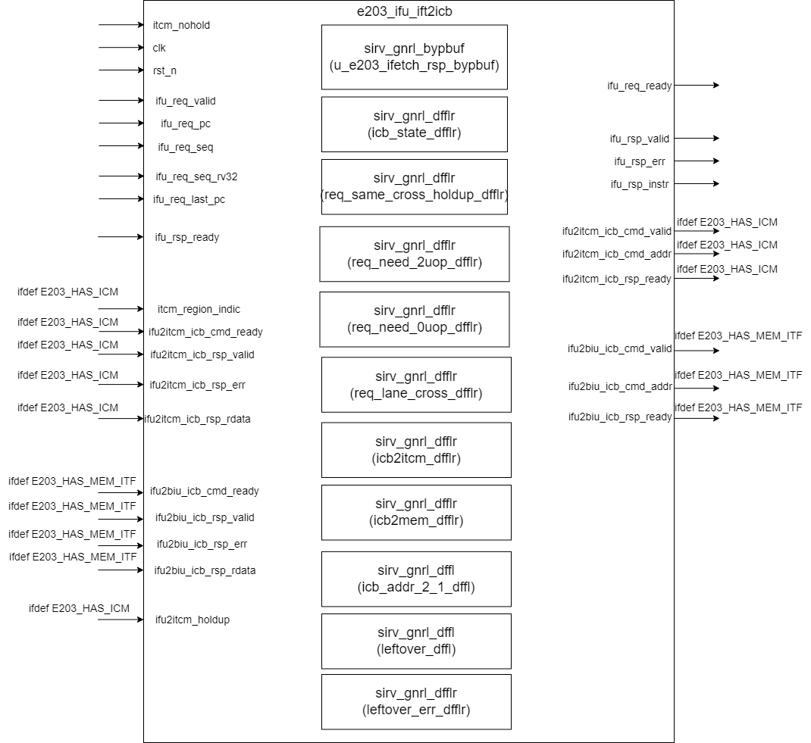
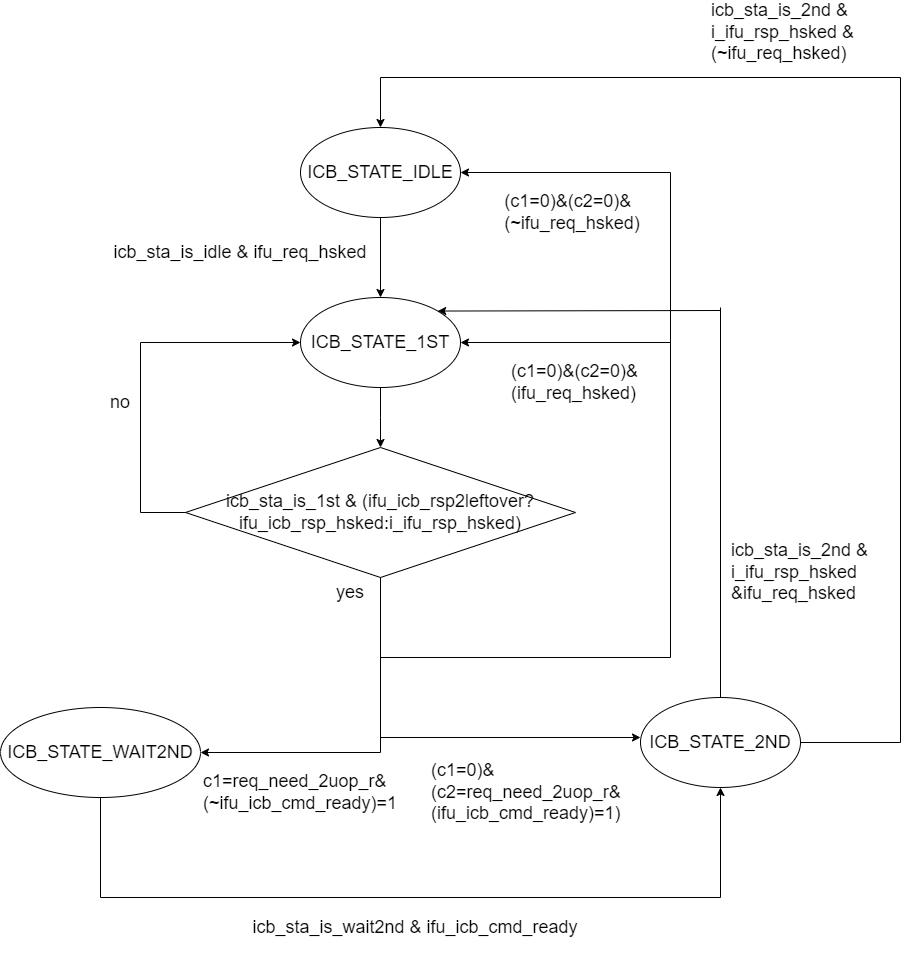

# e203_ifu_ift2icb Design Document

## 1. Introduction
The e203_ifu_ift2icb module is one of the core components of the Instruction Fetch unit in the E203 processor. It is responsible for converting instruction fetch requests into the Internal Chip Bus (ICB) format and distributing the requests to different targets, including the Instruction Cache (ITCM), system memory, etc., according to the access addresses. This module supports handling of unaligned accesses.

## 2. Module Diagram

## 3. Interface List

### Input Signals
| Signal Name | Direction | Bit Width | Description |
| ---- | ---- | ---- | ---- |
| itcm_nohold | Input | 1 | ITCM no-hold signal |
| ifu_req_valid | Input | 1 | Instruction fetch request valid |
| ifu_req_pc | Input | PC_SIZE | Program counter address of the request |
| ifu_req_seq | Input | 1 | Flag for sequential instruction fetch request |
| ifu_req_seq_rv32 | Input | 1 | RV32 incremental fetch flag |
| ifu_req_last_pc | Input | PC_SIZE | The PC address of the previous access |
| ifu_rsp_ready | Input | 1 | Instruction fetch response ready |
| clk | Input | 1 | Clock signal |
| rst_n | Input | 1 | Reset signal (active low) |

### Output Signals
| Signal Name | Direction | Bit Width | Description |
| ---- | ---- | ---- | ---- |
| ifu_req_ready | Output | 1 | Instruction fetch request ready |
| ifu_rsp_valid | Output | 1 | Instruction fetch response valid |
| ifu_rsp_err | Output | 1 | Instruction fetch response error |
| ifu_rsp_instr | Output | 32 | Response instruction data |

### ITCM Interface

This part of signals are available only if the `E203_HAS_ITCM` is defined.

| Signal Name | Direction | Bit Width | Description |
| ---- | ---- | ---- | ---- |
| itcm_region_indic | Input | E203_ADDR_SIZE | The ITCM address region indication signal |
| ifu2itcm_icb_cmd_valid | Output | 1 | ITCM command valid |
| ifu2itcm_icb_cmd_ready | Input | 1 | ITCM command ready |
| ifu2itcm_icb_cmd_addr | Output | ITCM_ADDR_WIDTH | ITCM access address |
| ifu2itcm_icb_rsp_valid | Input | 1 | ITCM response valid |
| ifu2itcm_icb_rsp_ready | Output | 1 | ITCM response ready |
| ifu2itcm_icb_rsp_err | Input | 1 | ITCM response error |
| ifu2itcm_icb_rsp_rdata | Input | ITCM_DATA_WIDTH | ITCM read data |
| ifu2itcm_holdup | Input | 1 | The holdup indicating the target is not accessed by other agents and the output of it should holdup last value|

### System Memory Interface

This part of signals are available only if the `E203_HAS_MEM_ITF` is defined.

| Signal Name | Direction | Bit Width | Description |
| ---- | ---- | ---- | ---- |
| ifu2biu_icb_cmd_valid | Output | 1 | BIU command valid |
| ifu2biu_icb_cmd_ready | Input | 1 | BIU command ready |
| ifu2biu_icb_cmd_addr | Output | ADDR_SIZE | BIU access address |
| ifu2biu_icb_rsp_valid | Input | 1 | BIU response valid |
| ifu2biu_icb_rsp_ready | Output | 1 | BIU response ready |
| ifu2biu_icb_rsp_err | Input | 1 | BIU response error |
| ifu2biu_icb_rsp_rdata | Input | SYSMEM_DATA_WIDTH | BIU read data |

## 4. Called Module List

### 4.1 sirv_gnrl_dfflr

#### 4.1.1 SubModule interface

| Parameter Name | Default Value | Description |
|----------------|---------------|-------------|
| DW             | 32            | Data width (in bits) |

| Port Name | Direction | Width | Description |
|-----------|-----------|-------|-------------|
| lden      | Input     | 1     | Load enable signal |
| dnxt      | Input     | DW    | Input data |
| qout      | Output    | DW    | Output data |
| clk       | Input     | 1     | Clock signal |
| rst_n     | Input     | 1     | Active-low reset signal |

#### 4.1.2 SubModule description

A D-flip-flops with asynchronous reset that could store bits with DW width when the signal lden is set. DW can be configured when instantiate the module. 

### 4.2 sirv_gnrl_dffl
#### 4.2.1 SubModule interface

| Parameter Name | Default Value | Description |
|----------------|---------------|-------------|
| DW             | 32            | Data width (in bits) |

| Port Name | Direction | Width | Description |
|-----------|-----------|-------|-------------|
| lden      | Input     | 1     | Load enable signal |
| dnxt      | Input     | DW    | Input data |
| qout      | Output    | DW    | Output data |
| clk       | Input     | 1     | Clock signal |

#### 4.2.2 SubModule description

A D-flip-flops without asynchronous reset.

### sirv_gnrl_bypbuf
Function: A fifo buffer bypassed when fifo is empty, and o_rdy is high

| Parameter Name | Default Value | Description |
|----------------|---------------|-------------|
| DP             | 8             | Depth of the bypass buffer |
| DW             | 32            | Data width (in bits) |

| Signal Name | Direction | Width | Description |
|-------------|-----------|-------|-------------|
| i_vld | Input | 1 | Input valid signal |
| i_rdy | Output | 1 | Input ready signal |
| i_dat | Input | DW | Input data |
| o_vld | Output | 1 | Output valid signal |
| o_rdy | Input | 1 | Output ready signal |
| o_dat | Output | DW | Output data |
| clk | Input | 1 | Clock signal |
| rst_n | Input | 1 | Reset signal (active low) |

## 5. Implementation Details

### 5.1 State Machine Implementation
1. State Definition:
- ICB_STATE_IDLE(2'b00): Idle state, no outstanding instruction fetch requests.
- ICB_STATE_1ST(2'b01): Issue the first ICB request and wait for the response.
- ICB_STATE_WAIT2ND(2'b10): Wait for the state to issue the second ICB request.
- ICB_STATE_2ND(2'b11): Issue the second ICB request and wait for the response.

2. State Transition Logic:
- IDLE State Transition:
  * Transition Condition: A new request valid/ready handshake is received.
  * Target State: ICB_STATE_1ST.

- 1ST State Transition:
  * Transition Condition: Based on whether the response data needs to be stored in the leftover buffer:
    - If the current request needs to store part of response data in the leftover buffer, it is necessary to wait for the response handshake to be completed before exiting the current state.
    - If the current request does not need to store part of the response data in the leftover buffer, it is necessary to wait for the IFU response handshake to be completed before exiting the current state.
  * Target State Depends on Multiple Conditions:
    - If two requests are needed and the ICB is not ready: WAIT2ND.
    - If two requests are needed and the ICB is ready: 2ND.
    - If a new request is received: 1ST.
    - Otherwise: IDLE.
  
- WAIT2ND State Transition:
  * Transition Condition: The ICB command channel is ready (ifu_icb_cmd_ready).
  * Target State: ICB_STATE_2ND.

- 2ND State Transition:
  * Transition Condition: The ifetch response is received (i_ifu_rsp_hsked).
  * Target State:
    - If there is a new request: 1ST.
    - Otherwise: IDLE.

3. State Update Control:
- icb_state_ena: Set to 1 when any state meets the transition condition.
- icb_state_nxt: Select the next state based on the current state and transition conditions.
- Use sirv_gnrl_dfflr to update the state on the rising edge of the clock.

4.  State Transition Diagram

### 5.2 Bypass Buffer Implementation
1. sirv_gnrl_bypbuf is used here as a FIFO buffer that stores the instructions fetched from ITCM or System Memory. The bypass buffer is used due to the following reasons:
   1. The IR stage ready signal is generated from EXU stage which incoperated several timing critical source (e.g., ECC error check, .etc)and this ready signal will be back-pressure to ifetch rsponse channel here
   2. If there is no such bypbuf, the ifetch response channel may stuck waiting the IR stage to be cleared, and this may end up with a deadlock, becuase EXU stage may access the BIU or ITCM and they are waiting the IFU to accept last instruction access to make way of BIU and ITCM for LSU to access.
2. Signal Packing and Splitting:
- Input Data Packing:
  * ifu_rsp_bypbuf_i_data = {i_ifu_rsp_err, i_ifu_rsp_instr}.
  * Combine the error flag and 32-bit instruction data.

- Output Data Splitting:
  * ifu_rsp_err = ifu_rsp_bypbuf_o_data[32].
  * ifu_rsp_instr = ifu_rsp_bypbuf_o_data[31:0].

3. Bypass Buffer Connection:
- Input Side:
  * i_ifu_rsp_valid/ready: Internal response handshake signals.
  * i_dat: Packed 33-bit data.

- Output Side:
  * ifu_rsp_valid/ready: Interface with the IFU response.
  * o_dat: Data output to the IFU.

4. Buffer Characteristics:
- Depth is 1, supports back-to-back transmission.
- Does not cut the ready signal to avoid deadlock.
- Registers data on the clock edge.

### 5.3 Lane Operation Implementation
1. Lane Crossing Detection:
- ifu_req_lane_cross Signal Generation:
  * In ITCM 32-bit mode: PC[1] == 1.
  * In ITCM 64-bit mode: PC[2:1] == 2'b11.
  * In system memory mode: The same condition as the corresponding bit width of ITCM.
  * The final result is the logical OR of the conditions for each target area.

2. Lane Start Detection:
- ifu_req_lane_begin Signal Generation:
  * In ITCM 32-bit mode: PC[1] == 0.
  * In ITCM 64-bit mode: PC[2:1] == 2'b00.
  * In system memory mode: The same condition as the corresponding bit width of ITCM.
  * The final result is the logical OR of the conditions for each target area.

3. Lane Reuse Detection:
- ifu_req_lane_same Signal Generation:
  * Basic Condition: Must be a sequential instruction fetch (ifu_req_seq).
  * Lane Start Position: Must have been in prefetch mode last time (req_lane_cross_r).
  * Non-start Position: Reuse directly (set to 1).

4. Lane Hold Detection:
- ifu_req_lane_holdup Signal Generation:
  * ITCM Condition: ifu2itcm_holdup & (~itcm_nohold).
  * Take the OR of the hold signals of all target areas.

### 5.4 Request Feature Registering
1. Request Type Registering:
- req_same_cross_holdup_r:
  * Set Condition: The current request is the same, crosses lanes, and data is held.
  * Updated when ifu_req_hsked.
  * Used to control whether the first access is needed.

- req_need_2uop_r:
  * Set Condition:
    - The same, crosses lanes but not held.
    - Or not the same and crosses lanes.
  * Updated when ifu_req_hsked.
  * Used for state machine control and address generation.

- req_need_0uop_r:
  * Set Condition: The same, does not cross lanes, and data is held.
  * Updated when ifu_req_hsked.
  * Used to directly use the held data.

2. Target Indication Registering:
- icb_cmd2itcm_r:
  * Records whether the current ICB request is sent to the ITCM.
  * Updated when ifu_icb_cmd_hsked.

- icb_cmd2biu_r:
  * Records whether the current ICB request is sent to the system memory.
  * Updated when ifu_icb_cmd_hsked.

3. Address Alignment Information:
- icb_cmd_addr_2_1_r:
  * Updated when the command is shaken hands or a new request is received.
  * Used for alignment selection of 64-bit data.

### 5.5 Leftover Buffer Implementation
1. Enable Control:
- holdup2leftover_ena:
  * Condition: ifu_req_hsked & req_same_cross_holdup.
  * Used to save the upper 16 bits of the currently held data.

- uop1st2leftover_ena:
  * Condition: ifu_icb_rsp_hsked & ifu_icb_rsp2leftover.
  * Used to save the upper 16 bits of the data returned by the first access.

2. Data Selection:
- leftover_nxt Selection:
  * From the upper 16 bits of ITCM.
  * Or from the upper 16 bits of the system memory.
  * Select according to the target indication.

3. Error Flag:
- leftover_err_nxt Generation:
  * Set to 0 when data is held.
  * Carry the source error flag during the first access.
  * Updated when leftover_ena.

### 5.6 Response Generation Implementation
1. Instruction Response Data Path:
- Selection Conditions:
  * rsp_instr_sel_leftover =
    - ICB_STATE_1ST & req_same_cross_holdup_r.
    - Or ICB_STATE_2ND.
  * rsp_instr_sel_icb_rsp = ~rsp_instr_sel_leftover.

- Data Assembly:
  * Leftover Path: {ifu_icb_rsp_rdata_lsb16, leftover_r}.
  * ICB Response Path: Data according to the target and address alignment.

2. Response Valid Control:
- i_ifu_rsp_valid Generation:
  * holdup_gen_fake_rsp_valid: State is 1ST and no request needs to be sent.
  * ifu_icb_rsp2ir_valid: ICB response and not the case of storing in leftover.

3. Error Flag Handling:
- i_ifu_rsp_err Generation:
  * Leftover Path: Combine the current error and the leftover error.
  * ICB Response Path: Use the ICB error flag directly.

### 5.7 ICB Command Generation Implementation
1. Command Valid Control:
- ifu_icb_cmd_valid Set Condition:
  * New request and not the 0uop case.
  * Or the current request needs 2uop and:
    - A response is received in the 1ST state.
    - Or in the WAIT2ND state.

2. Command Address Generation:
- Address Selection Conditions:
  * icb_addr_sel_1stnxtalgn: holdup2leftover_sel.
  * icb_addr_sel_2ndnxtalgn: req_need_2uop_r & (1ST or WAIT2ND).
  * icb_addr_sel_cur: None of the above conditions are met.

- Aligned Address Calculation:
  * Basic Offset: 2/4/6 selected according to the mode.
  * Calculate the next aligned address based on ifu_req_last_pc.

3. Target Selection:
- ITCM Determination:
  * The address base address area matches.
  * Generate the ifu_icb_cmd2itcm signal.

- System Memory Determination:
  * Non-ITCM area.
  * Generate the ifu_icb_cmd2biu signal.

### 5.8 Handshake Control Implementation
1. IFU Request Handshake:
- ifu_req_ready Generation:
  * Basic Condition: ifu_icb_cmd_ready.
  * And meet any of the following conditions:
    - The state is IDLE.
    - Only 0/1 uop is needed and the response in the 1ST state is completed.
    - 2 uops are needed and the response in the 2ND state is completed.
  * ready = ifu_icb_cmd_ready & ifu_req_ready_condi.

2. ICB Response Handshake:
- ifu_icb_rsp_ready Generation:
  * Set to 1 directly when storing in leftover.
  * Otherwise, connect to i_ifu_rsp_ready.

3. Internal Handshake Signals:
- ifu_req_hsked: Request channel handshake successful.
- ifu_icb_cmd_hsked: ICB command channel handshake successful.
- ifu_icb_rsp_hsked: ICB response channel handshake successful.
- i_ifu_rsp_hsked: Internal response channel handshake successful.

### 5.9 Data Alignment Implementation
1. ITCM Data Alignment:
- 32-bit Mode:
  * Use the returned data directly.

- 64-bit Mode:
  * Select the 32-bit data segment according to icb_cmd_addr_2_1_r:
    - 2'b00: [31:0].
    - 2'b01: [47:16].
    - 2'b10: [63:32].

2. System Memory Data Alignment:
- The alignment logic is the same as that of ITCM.
- Select the corresponding logic according to the configured data bit width.

3. Lowest 16 Bits Acquisition:
- ifu_icb_rsp_rdata_lsb16:
  * Extract the lowest 16 bits from the ITCM or system memory response.
  * Used to combine with leftover.

### 5.11 ICB Response Merge Implementation
1. Error Flag Generation:
- ifu_icb_rsp_err Signal Generation:
  * ITCM Source: icb_cmd2itcm_r & ifu2itcm_icb_rsp_err.
  * System Memory Source: icb_cmd2biu_r & ifu2biu_icb_rsp_err.
  * Use logical OR to merge the error flags from the two sources.

2. Response Valid Generation:
- ifu_icb_rsp_valid Signal Generation:
  * ITCM Source: icb_cmd2itcm_r & ifu2itcm_icb_rsp_valid.
  * System Memory Source: icb_cmd2biu_r & ifu2biu_icb_rsp_valid.
  * Use logical OR to merge the valid signals from the two sources.

### 5.12 ICB Request Distribution Implementation
1. Request Distribution Determination:
- ifu_icb_cmd2biu Determination:
  * Basically set to 1.
  * If there is ITCM, then it needs ~(ifu_icb_cmd2itcm).

2. Command Distribution Control:
- System Memory Preprocessing:
  * ifu2biu_icb_cmd_valid_pre = ifu_icb_cmd_valid & ifu_icb_cmd2biu
  * ifu2biu_icb_cmd_addr_pre = ifu_icb_cmd_addr

3. Command Ready Merge:
- ifu_icb_cmd_ready Generation:
  * ITCM Ready: ifu_icb_cmd2itcm & ifu2itcm_icb_cmd_ready
  * System Memory Ready: ifu_icb_cmd2biu & ifu2biu_icb_cmd_ready_pre
  * Use logical OR to merge

### 5.13 System Memory Interface Implementation
1. Direct Connection Mode:
- Command Channel Direct Connection:
  * ifu2biu_icb_cmd_addr = ifu2biu_icb_cmd_addr_pre
  * ifu2biu_icb_cmd_valid = ifu2biu_icb_cmd_valid_pre
  * ifu2biu_icb_cmd_ready_pre = ifu2biu_icb_cmd_ready

2. No Pipeline Design:
- Removed the original pipeline stage implementation.
- To optimize timing and area.
- Direct connection to support zero-cycle response return.

## 6. Corner Cases

1. Cross-Lane Boundary Access Handling
- When an instruction crosses the Lane boundary, two accesses are required.
- Use the Leftover buffer to store the upper 16 bits of the first access.
- Consider the data hold situation to possibly avoid the first access.

2. Unaligned Access Handling
- Support unaligned 32-bit instruction accesses.
- Align the returned data according to the low bits of the address.

3. Data Hold Handling
- ITCM data can be reused when held.
- The system memory is assumed not to hold data.

4. Error Handling
- Propagate and merge the error flags from ITCM and system memory.
- The error in the Leftover buffer needs to be merged with the current response error.

## 7. Constraints

1. Mutual Exclusion Constraints
- ITCM and system memory accesses are mutually exclusive.
- ICB state machine states are mutually exclusive.

2. Timing Constraints
- The address generation needs to be completed before the rising edge of the clock.
- The ICB handshake signals need to meet the timing requirements.

3. Functional Constraints
- There must be at least one instruction fetch target (ITCM or system memory).
- The data width must be 32 bits or 64 bits.

4. Configuration Constraints
- The ITCM and system memory data widths must be correctly configured.
- The address range must be correctly configured to avoid conflicts. 