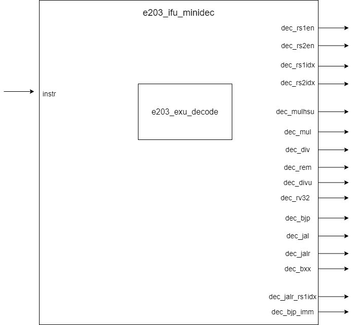

# e203_ifu_minidec Design Document

## 1. Introduction
The e203_ifu_minidec module is a mini decoder module in the instruction fetch unit (IFU) of the E203 processor. Its main function is to perform preliminary decoding of instructions, extract key control information, and provide necessary pre-decoded information for the subsequent full decoding and execution stages. This module mainly focuses on register access information in instructions, branch jump information, and the identification of multiplication and division operations.

## 2. Module Diagram

## 3. Interface

### 3.1 Relevant Macro Configuration
| Macro Name | Description |
| ------- | ------- |
| E203_INSTR_SIZE | Instruction width |
| E203_RFIDX_WIDTH | Register index width |
| E203_XLEN | Data path width |

### 3.2 Signal Interface
| Interface Name | Direction | Width | Description |
| ------- | ------- | ------- | ------- |
| instr | input | E203_INSTR_SIZE | Instruction to be decoded |
| dec_rs1en | output | 1 | RS1 register enable signal |
| dec_rs2en | output | 1 | RS2 register enable signal |
| dec_rs1idx | output | E203_RFIDX_WIDTH | RS1 register index |
| dec_rs2idx | output | E203_RFIDX_WIDTH | RS2 register index |
| dec_mulhsu | output | 1 | MULHSU instruction flag |
| dec_mul | output | 1 | MUL instruction flag |
| dec_div | output | 1 | DIV instruction flag |
| dec_rem | output | 1 | REM instruction flag |
| dec_divu | output | 1 | DIVU instruction flag |
| dec_remu | output | 1 | REMU instruction flag |
| dec_rv32 | output | 1 | RV32 instruction set flag |
| dec_bjp | output | 1 | Branch/jump instruction flag |
| dec_jal | output | 1 | JAL instruction flag |
| dec_jalr | output | 1 | JALR instruction flag |
| dec_bxx | output | 1 | Conditional branch instruction flag |
| dec_jalr_rs1idx | output | E203_RFIDX_WIDTH | RS1 register index for JALR instruction |
| dec_bjp_imm | output | E203_XLEN | Immediate number of branch/jump instruction |

## 4. Module Invocation

### 4.1 Internal Module Invocation Table
| Module Name | Instance Name | Invocation Level | Description |
| ------- | ------- | ------- | ------- |
| e203_exu_decode | u_e203_exu_decode | 1 | Execution unit decoder module |

### 4.2 Interface Connection
| Signal Name | Direction | Width | Description |
| ------- | ------- | ------- | ------- |
| i_instr | input | E203_INSTR_SIZE | Connected to top-level instr input |
| i_pc | input | E203_PC_SIZE | Fixed to 0 |
| i_prdt_taken | input | 1 | Fixed to 0 |
| i_muldiv_b2b | input | 1 | Fixed to 0 |
| i_misalgn | input | 1 | Fixed to 0 |
| i_buserr | input | 1 | Fixed to 0 |
| dbg_mode | input | 1 | Fixed to 0 |
| dec_rs1en | output | 1 | Connected to top-level dec_rs1en output |
| dec_rs2en | output | 1 | Connected to top-level dec_rs2en output |
| dec_rs1idx | output | E203_RFIDX_WIDTH | Connected to top-level dec_rs1idx output |
| dec_rs2idx | output | E203_RFIDX_WIDTH | Connected to top-level dec_rs2idx output |
| dec_mulhsu | output | 1 | Connected to top-level dec_mulhsu output |
| dec_mul | output | 1 | Connected to top-level dec_mul output |
| dec_div | output | 1 | Connected to top-level dec_div output |
| dec_rem | output | 1 | Connected to top-level dec_rem output |
| dec_divu | output | 1 | Connected to top-level dec_divu output |
| dec_remu | output | 1 | Connected to top-level dec_remu output |
| dec_rv32 | output | 1 | Connected to top-level dec_rv32 output |
| dec_bjp | output | 1 | Connected to top-level dec_bjp output |
| dec_jal | output | 1 | Connected to top-level dec_jal output |
| dec_jalr | output | 1 | Connected to top-level dec_jalr output |
| dec_bxx | output | 1 | Connected to top-level dec_bxx output |
| dec_jalr_rs1idx | output | E203_RFIDX_WIDTH | Connected to top-level dec_jalr_rs1idx output |
| dec_bjp_imm | output | E203_XLEN | Connected to top-level dec_bjp_imm output |
| dec_misalgn | output | 1 | Unused |
| dec_buserr | output | 1 | Unused |
| dec_ilegl | output | 1 | Unused |
| dec_rs1x0 | output | 1 | Unused |
| dec_rs2x0 | output | 1 | Unused |
| dec_rdwen | output | 1 | Unused |
| dec_rdidx | output | E203_RFIDX_WIDTH | Unused |
| dec_info | output | - | Unused |
| dec_imm | output | - | Unused |
| dec_pc | output | - | Unused |

### 4.3 NICE Extension Configuration
The following signals exists only if the `E203_HAS_NICE` is defined.
| Signal Name | Direction | Width | Description |
| ------- | ------- | ------- | ------- |
| dec_nice | output | - | NICE extension instruction flag, unused |
| nice_xs_off | input | 1 | NICE extension off signal, fixed to 0 |
| nice_cmt_off_ilgl_o | output | - | NICE illegal instruction commit off signal, unused |

## 5. Implementation Details

### Working Mechanism
1. This module acts as a wrapper and mainly encapsulates the e203_exu_decode module.
2. Passes the input instruction directly to the internal decoder.
3. Connects some key decoded information directly to the output port.
4. Other non-critical signals are ignored or set to fixed values.

### Key Features
1. Only focuses on the key features of instructions, including:
   - Register access information.
   - Identification of multiplication and division operations.
   - Branch jump related information.
2. Provides a simplified input environment for the internal decoder:
   - Sets the PC value to 0.
   - Sets the predicted jump signal to 0.
   - Disables the debug mode.
   - Disables the bus error signal.

## 6. Corner Cases
1. NICE extension processing:
   - The module supports NICE extension through conditional compilation.
   - When E203_HAS_NICE is not defined, the related logic is excluded.
2. Error handling is simplified:
   - Address misalignment check is disabled.
   - Bus error check is disabled.

## 7. Limitations (Constraints)
1. Input constraints:
   - The instruction must be a valid RISC-V instruction encoding.
   - The instruction width must conform to the definition of E203_INSTR_SIZE.

2. Functional constraints:
   - This module is only used as a pre-decoder.
   - Does not handle full decoding of instructions.
   - Does not verify the legality of instructions.

3. Timing constraints:
   - Belongs to combinational logic circuit.
   - No clock domain crossing problem.

4. Configuration constraints:
   - Parameters such as E203_INSTR_SIZE, E203_RFIDX_WIDTH, and E203_XLEN must be correctly defined.
   - The NICE extension function depends on the definition of E203_HAS_NICE.