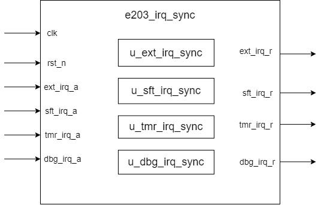
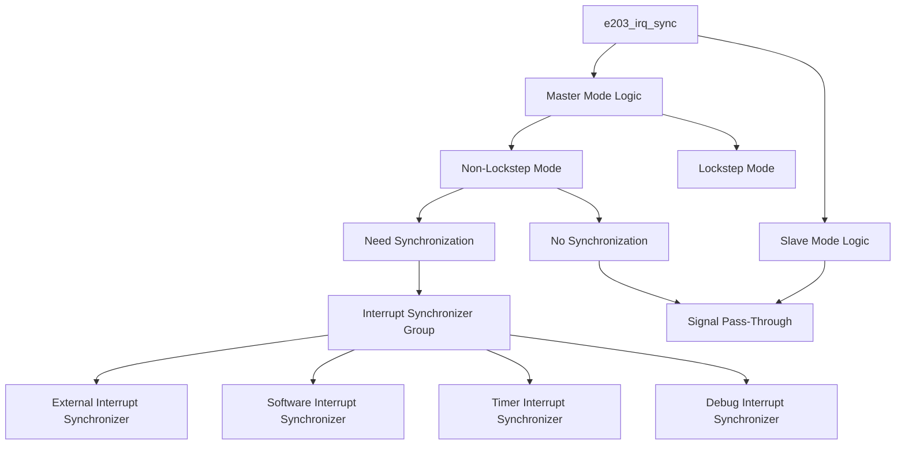

# e203_irq_sync Design Document

## 1. Introduction
e203_irq_sync is an interrupt synchronization module used in the E203 processor, primarily for synchronizing various interrupt signals across clock domains. The module supports master-slave mode configuration and can handle synchronization of four types of interrupts: external interrupt, software interrupt, timer interrupt, and debug interrupt.

## 2. Module Block Diagram

## 3. Interface Definition

| Signal Name | Direction | Width | Description |
|-------------|-----------|-------|-------------|
| clk | Input | 1 | System clock signal |
| rst_n | Input | 1 | Asynchronous reset signal (active low) |
| ext_irq_a | Input | 1 | External interrupt input signal |
| sft_irq_a | Input | 1 | Software interrupt input signal |
| tmr_irq_a | Input | 1 | Timer interrupt input signal |
| dbg_irq_a | Input | 1 | Debug interrupt input signal |
| ext_irq_r | Output | 1 | Synchronized external interrupt signal |
| sft_irq_r | Output | 1 | Synchronized software interrupt signal |
| tmr_irq_r | Output | 1 | Synchronized timer interrupt signal |
| dbg_irq_r | Output | 1 | Synchronized debug interrupt signal |

## 4. Module Invocation

### sirv_gnrl_sync Module Invocation (for Interrupt Synchronization)

| Parameter Name | Default Value | Description |
|----------------|---------------|-------------|
| DP             | 2             | Depth of the synchronizer (number of flip-flops) |
| DW             | 32            | Data width (in bits) |

| Signal Name | Direction | Width | Description |
|-------------|-----------|-------|-------------|
| din_a | Input | DW | Asynchronous input data |
| dout | Output | DW | Synchronized output data |
| rst_n | Input | 1 | Reset signal (active low) |
| clk | Input | 1 | Destination clock domain |

The `sirv_gnrl_sync` submodule is a FIFO syncer that receives an asynchonised data `din_a` and the output `dout` is synced.

The `DP` parameter of `sirv_gnrl_sync` represents the number of flip-flops in the synchronizer, typically set to 2 or 3, to reduce the probability of metastability when an asynchronous signal enters the synchronizer. Increasing the number of synchronizer stages improves synchronization stability and reduces the likelihood of metastability but also introduces additional clock cycle latency. Choosing an appropriate `DP` value is key to ensuring timing convergence and reducing the impact of metastability for interrupt signal synchronization.

The `DW` parameter represents the data width, which is usually set to 1 because interrupt signals are generally single-bit signals. If multi-bit signals need to be synchronized, the `DW` value can be increased to match the signal width. In this module, each interrupt type uses single-bit synchronization, so `DW` is set to 1. This simplifies the synchronizer design and ensures that each interrupt signal is independently synchronized to avoid interference.

Note: Each interrupt signal (ext/sft/tmr/dbg) has its own instance of the `sirv_gnrl_sync` module, with the same connection approach.

## 5. Implementation Details

# 5.1 Logical Flowchart

# 5.2 Implementation Description

1. Master-Slave Mode Control Mechanism
   - The module's top-level parameter `MASTER` is used to select between master and slave modes.
   - The `generate` statement is used to create different logic structures based on the `MASTER` parameter.

2. Master Mode (MASTER=1) Implementation
   - Non-Lockstep Mode (E203_HAS_LOCKSTEP not defined):
     - When `E203_IRQ_NEED_SYNC` is defined: interrupt signals are handled through synchronizers.
     - When `E203_IRQ_NEED_SYNC` is not defined: signals are directly passed through.
   - Lockstep Mode (E203_HAS_LOCKSTEP defined):
     - No operations are performed (neither synchronization nor pass-through).

3. Slave Mode (MASTER=0) Implementation
   - Signal pass-through is used regardless of lockstep mode.
   - All interrupt signals are directly connected from input to output.

4. Interrupt Synchronization Mechanism
   - Each interrupt type uses an independent synchronizer.
   - The number of synchronizer stages is determined by the `E203_ASYNC_FF_LEVELS` parameter.
   - Supported interrupt types:
     - External interrupt (ext): used for external device interrupts.
     - Software interrupt (sft): used for software-triggered interrupts.
     - Timer interrupt (tmr): used for timer interrupts.
     - Debug interrupt (dbg): used for debugging purposes.

5. Timing Control Mechanism
   - All synchronizers share the same clock domain.
   - Asynchronous reset is used to ensure reliable initialization.
   - Multi-stage flip-flops are used to mitigate metastability risks.
   - Each interrupt signal is synchronized independently to avoid interference.

## 6. Corner Case Handling

### Potential Issues
1. Metastability of asynchronous signals
2. Interrupt signal glitches
3. Reset timing issues
4. Concurrent interrupts
5. Mode switching timing

### Special Handling
1. Multi-stage flip-flops are used to mitigate metastability.
2. Independent synchronizers avoid interference between interrupts.
3. Asynchronous reset ensures reliable initialization.
4. Parallel synchronization circuits handle concurrent interrupts.
5. Modes and configurations are fixed by parameters to avoid runtime switching.

## 7. Limitations

1. Timing Constraints
   - Input interrupt signals must meet the minimum pulse width requirement.
   - Synchronizer stages must meet timing convergence requirements.

2. Configuration Constraints
   - The `MASTER` parameter must be determined at compile time.
   - Lockstep mode and synchronization requirements must be properly configured through macros.
   - The number of synchronizer stages must be set appropriately.

3. Runtime Constraints
   - The reset signal must be held for a sufficient time.
   - The clock signal must be stable and reliable.
   - Master-slave mode switching is not supported at runtime.

4. Functional Constraints
   - The master module does not handle interrupt signals in lockstep mode.
   - Slave mode always uses signal pass-through.
   - Synchronization introduces a fixed delay.
   - All interrupt signals must maintain a sufficient active time.

