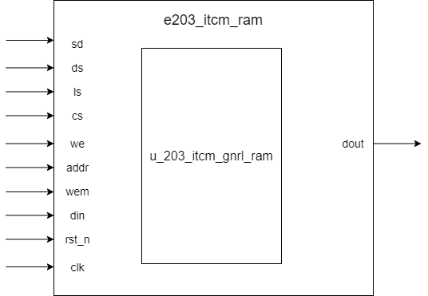

# e203_itcm_ram Design Document

## 1. Introduction
The e203_itcm_ram module is an Instruction Tightly Coupled Memory (ITCM) RAM module for the E203 processor. The module is encapsulated based on a generic RAM module, primarily used for instruction storage and access. The module is controlled by the macro definition `E203_HAS_ITCM`.

## 2. Module Block Diagram

## 3. Interface Definition

| Signal Name | Direction | Width | Description |
|------------|-----------|-------|-------------|
| sd | Input | 1 | Power domain shutdown enable signal for power management |
| ds | Input | 1 | Deep sleep mode enable, controlling complete power area shutdown |
| ls | Input | 1 | Light sleep mode enable, reducing power without full shutdown |
| cs | Input | 1 | Chip select signal, controlling RAM selection |
| we | Input | 1 | Write enable signal, controlling write operation |
| addr | Input | E203_ITCM_RAM_AW | Address input, specifying read/write location |
| wem | Input | E203_ITCM_RAM_MW | Write mask, controlling specific byte writing |
| din | Input | E203_ITCM_RAM_DW | Data input to be written |
| rst_n | Input | 1 | Asynchronous reset signal (active low) |
| clk | Input | 1 | System clock |
| dout | Output | E203_ITCM_RAM_DW | Data output, read data |

## 4. Module Invocation Parameters

| Parameter Name | Value | Description |
|---------------|-------|-------------|
| FORCE_X2ZERO | 0 (Conditional) | Force undefined states to zero if `E203_HAS_ECC` is not defined. Otherwise use the default value. |
| DP | E203_ITCM_RAM_DP | RAM depth |
| DW | E203_ITCM_RAM_DW | Data width |
| MW | E203_ITCM_RAM_MW | Write mask width |
| AW | E203_ITCM_RAM_AW | Address width |

## 5. Submodules

### sirv_gnrl_ram Design Specification

#### Introduction

The `sirv_gnrl_ram` module is a general-purpose RAM wrapper that serves as the top-level RAM module in the system. It provides a configurable memory implementation that can adapt to different target environments (FPGA, ASIC, or simulation) by conditionally instantiating the appropriate underlying RAM model.

#### Interface

##### Parameter Configuration

| Parameter Name   | Default Value | Description |
|------------------|---------------|-------------|
| DP               | 32            | Depth of the RAM (number of entries) |
| DW               | 32            | Data width (in bits) |
| FORCE_X2ZERO     | 1             | Forces uninitialized memory to zero |
| MW               | 4             | Write mask width (in bits) |
| AW               | 15            | Address width (in bits) |

##### Signal Interface

| Port Name | Direction | Width | Description |
|-----------|-----------|-------|-------------|
| sd | Input | 1 | Power shutdown control signal |
| ds | Input | 1 | Deep sleep mode enable signal |
| ls | Input | 1 | Light sleep mode enable signal |
| rst_n | Input | 1 | Active-low reset signal |
| clk | Input | 1 | Clock signal |
| cs | Input | 1 | Chip select (enable) signal |
| we | Input | 1 | Write enable signal |
| addr | Input | AW | Memory address |
| din | Input | DW | Data input (write data) |
| wem | Input | MW | Write enable mask (byte-enable) |
| dout | Output | DW | Data output (read data) |

## 6. Implementation Details
1. Module implements instruction storage and access through underlying generic RAM module

2. Supports flexible read/write control with byte-level writing precision

3. Provides low-power management interface signals (sd, ds, ls), Currently, these signals are not actually used in the implementation due to:

   - Reserved low-power interface
   - Possible future extensions
   - Maintain consistency with other module interfaces
6. Flexibly adapts to different RAM depths and widths based on configuration parameters
7. Special handling for Error Correction Code (ECC) configurations
   - When `E203_HAS_ECC` is not defined, submodule parameter `FORCE_X2ZERO` is set to 0
   - This option allows for potential future error detection and correction mechanisms
8. The interfaces of this module are connected to the corresponding interfaces of the submodules

## 7. Corner Case Handling

### Potential Issues
1. Simultaneous read and write operations
2. Address boundary anomalies
3. Write enable and chip select signal conflicts
4. Undefined state processing

## 8. Constraints
1. Address `addr` must be within defined RAM depth range
2. Write mask `wem` must match data width
3. Clock (`clk`) must be stable without glitches
4. Reset signal (`rst_n`) must satisfy setup and hold time requirements
5. Low-power control signals (sd, ds, ls) must comply with power management specifications

