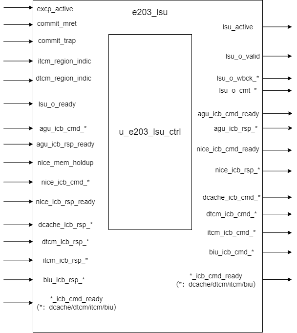

# E203 LSU Design Document

## 1. Introduction
The LSU (Load Store Unit) is the memory access unit of the E203 processor, responsible for handling all Load/Store operations. It performs address routing, arbitration control, write-back processing, and exception handling to ensure efficient support for memory access requests. It connects the AGU (Address Generation Unit), the NICE extension interface, and supports access to ITCM, DTCM, DCache, and the external bus (BIU). The LSU implements the ICB (Internal Chip Bus) protocol and supports exclusive access (Exclusive Access) and exception handling.

## 2. Block Diagram

## 3. Interface List

### Control Signals
|Signal Name|Direction|Width|Description|
|-----------|---------|-----|-----------|
|commit_mret|input|1|Machine mode return signal|
|commit_trap|input|1|Exception trap signal|
|excp_active|input|1|Exception active signal|
|lsu_active|output|1|LSU working status signal|

### System Signals

| Signal Name | Direction | Width | Description              |
| ----------- | --------- | ----- | ------------------------ |
| clk         | input     | 1     | clock signal             |
| rst_n       | input     | 1     | reset signal(active low) |

### LSU Write-Back Interface

|Signal Name|Direction|Width|Description|
|-----------|---------|-----|-----------|
|lsu_o_valid|output|1|Write-back handshake valid signal|
|lsu_o_ready|input|1|Write-back handshake ready signal|
|lsu_o_wbck_wdat|output|E203_XLEN|Write-back data|
|lsu_o_wbck_itag|output|E203_ITAG_WIDTH|Write-back instruction tag|
|lsu_o_wbck_err|output|1|Write-back error flag|
|lsu_o_cmt_ld|output|1|Load instruction commit flag|
|lsu_o_cmt_st|output|1|Store instruction commit flag|
|lsu_o_cmt_badaddr|output|E203_ADDR_SIZE|Error address|
|lsu_o_cmt_buserr|output|1|Bus error exception flag|

### AGU ICB Interface  
|Signal Name|Direction|Width|Description|
|-----------|---------|-----|-----------|
|agu_icb_cmd_valid|input|1|Command valid|
|agu_icb_cmd_ready|output|1|Command ready|
|agu_icb_cmd_addr|input|E203_ADDR_SIZE|Access address|
|agu_icb_cmd_read|input|1|Read/Write flag|
|agu_icb_cmd_wdata|input|E203_XLEN|Write data|
|agu_icb_cmd_wmask|input|E203_XLEN/8|Write mask|
|agu_icb_cmd_lock|input|1|Lock flag|
|agu_icb_cmd_excl|input|1|Exclusive access flag|
|agu_icb_cmd_size|input|2|Access size|
|agu_icb_cmd_back2agu|input|1|Response back to AGU flag|
|agu_icb_cmd_usign|input|1|Unsigned flag|
|agu_icb_cmd_itag|input|E203_ITAG_WIDTH|Instruction tag|
|agu_icb_rsp_valid|output|1|Response valid|
|agu_icb_rsp_ready|input|1|Response ready|
|agu_icb_rsp_err|output|1|Response error|
|agu_icb_rsp_excl_ok|output|1|Exclusive access success|
|agu_icb_rsp_rdata|output|E203_XLEN|Read data|

### Other ICB Interfaces (NICE/ITCM/DTCM/DCache/BIU)

#### ICB interface template

The interface signals for inter-module communication using the ICB protocol have the same suffix, and the prefix of the signals is determined by the connected module, represented by `*` in the template below. Unless otherwise specified, the bit width of the interface signals is the value in the table below.

| Signal Name       | Direction | Bit Width      | Description                             |
| :---------------- | --------- | -------------- | --------------------------------------- |
| *_icb_cmd_valid   | Input     | 1              | command valid signal                    |
| *_icb_cmd_ready   | Output    | 1              | current ready to receive command signal |
| *_icb_cmd_addr    | Input     | E203_ADDR_SIZE | command address                         |
| *_icb_cmd_read    | Input     | 1              | read command indication                 |
| *_icb_cmd_wdata   | Input     | E203_XLEN      | write data                              |
| *_icb_cmd_wmask   | Input     | E203_XLEN/8    | write mask                              |
| *_icb_cmd_lock    | Input     | 1              | locked access signal                    |
| *_icb_cmd_excl    | Input     | 1              | exclusive access signal                 |
| *_icb_cmd_size    | Input     | 2              | access size                             |
| *_icb_rsp_valid   | Output    | 1              | response valid signal                   |
| *_icb_rsp_ready   | Input     | 1              | ready to receive response signal        |
| *_icb_rsp_err     | Output    | 1              | response error signal                   |
| *_icb_rsp_excl_ok | Output    | 1              | exclusive access success signal         |
| *_icb_rsp_rdata   | Output    | E203_XLEN      | response data                           |

#### Other ICB Interfaces

The relationship between connected module names and signal prefixes is shown in the table below.

| Module Name | The string represented by `*` |
| ----------- | ----------------------------- |
| ITCM        | itcm                          |
| DTCM        | dtcm                          |
| NICE        | nice                          |
| BIU         | biu                           |

1. NICE

   if `E203_HAS_NICE` is defined, the ICB signal group to NICE is available. And we also have `nice_mem_holdup` defined as below.

   | Signal Name     | Direction | Width | Description           |
   | --------------- | --------- | ----- | --------------------- |
   | nice_mem_holdup | input     | 1     | Memory access hold-up |

   Specifically, the bit width of `nice_icb_cmd_wmask` is `E203_XLEN_MW`.

2. ITCM

   if `E203_HAS_ITCM` is defined, the ICB signal group to ITCM is available. And we also have `itcm_region_indic` defined as below.

   | Signal Name       | Direction | Width          | Description               |
   | ----------------- | --------- | -------------- | ------------------------- |
   | itcm_region_indic | input     | E203_ADDR_SIZE | Indicates the ITCM region |

   Specifically, the bit width of `itcm_icb_cmd_addr` is `E203_ITCM_ADDR_WIDTH`.

3. DTCM

   if `E203_HAS_DTCM` is defined, the ICB signal group to DTCM is available. And we also have `dtcm_region_indic` defined as below.

   | Signal Name       | Direction | Width          | Description               |
   | ----------------- | --------- | -------------- | ------------------------- |
   | dtcm_region_indic | input     | E203_ADDR_SIZE | Indicates the DTCM region |

   Specifically, the bit width of `dtcm_icb_cmd_addr` is `E203_DTCM_ADDR_WIDTH`.

4. BIU

   The ICB signal group to BIU is always available. 

## 4. Submodule List 

### e203_lsu_ctrl
**Function:** Main control logic module of the LSU

**Interface:** 

#### Control Interface

| Signal Name     | Direction | Bit Width | Description                                              |
| --------------- | --------- | --------- | -------------------------------------------------------- |
| commit_mret     | Input     | 1         | MRET commit instruction signal                           |
| commit_trap     | Input     | 1         | Trap commit signal                                       |
| lsu_ctrl_active | Output    | 1         | Indication of the active state of the LSU control module |

#### LSU Write-back Interface

| Signal Name       | Direction | Bit Width       | Description                         |
| ----------------- | --------- | --------------- | ----------------------------------- |
| lsu_o_valid       | Output    | 1               | Write-back data valid signal        |
| lsu_o_ready       | Input     | 1               | Write-back interface ready signal   |
| lsu_o_wbck_wdat   | Output    | E203_XLEN       | Write-back data                     |
| lsu_o_wbck_itag   | Output    | E203_ITAG_WIDTH | Instruction tag                     |
| lsu_o_wbck_err    | Output    | 1               | Error indication signal             |
| lsu_o_cmt_buserr  | Output    | 1               | Bus error exception indication      |
| lsu_o_cmt_badaddr | Output    | E203_ADDR_SIZE  | Error address                       |
| lsu_o_cmt_ld      | Output    | 1               | Load instruction commit indication  |
| lsu_o_cmt_st      | Output    | 1               | Store instruction commit indication |

#### AGU-ICB Interface

| Signal Name          | Direction | Bit Width       | Description                                                  |
| -------------------- | --------- | --------------- | ------------------------------------------------------------ |
| agu_icb_cmd_valid    | Input     | 1               | Command valid signal                                         |
| agu_icb_cmd_ready    | Output    | 1               | Command ready signal                                         |
| agu_icb_cmd_addr     | Input     | E203_ADDR_SIZE  | Access address                                               |
| agu_icb_cmd_read     | Input     | 1               | Read/write control (1: read, 0: write)                       |
| agu_icb_cmd_wdata    | Input     | E203_XLEN       | Write data                                                   |
| agu_icb_cmd_wmask    | Input     | E203_XLEN / 8   | Byte write enable                                            |
| agu_icb_cmd_lock     | Input     | 1               | Lock signal                                                  |
| agu_icb_cmd_excl     | Input     | 1               | Exclusive access signal                                      |
| agu_icb_cmd_size     | Input     | 2               | Access size (00: byte, 01: half, 10: word)                   |
| agu_icb_cmd_back2agu | Input     | 1               | Indication that the response needs to be returned to the AGU |
| agu_icb_cmd_usign    | Input     | 1               | Unsigned load indication                                     |
| agu_icb_cmd_itag     | Input     | E203_ITAG_WIDTH | Instruction tag                                              |

#### AGU-ICB Response Interface

| Signal Name         | Direction | Bit Width | Description                         |
| ------------------- | --------- | --------- | ----------------------------------- |
| agu_icb_rsp_valid   | Output    | 1         | Response valid signal               |
| agu_icb_rsp_ready   | Input     | 1         | Response receive ready signal       |
| agu_icb_rsp_err     | Output    | 1         | Error response indication           |
| agu_icb_rsp_excl_ok | Output    | 1         | Exclusive access success indication |
| agu_icb_rsp_rdata   | Output    | E203_XLEN | Read data                           |

#### NICE Interface (Optional Configuration)

Available if `E203_HAS_NICE` is defined.

| Signal Name        | Direction | Bit Width      | Description               |
| ------------------ | --------- | -------------- | ------------------------- |
| nice_mem_holdup    | Input     | 1              | Memory access hold signal |
| nice_icb_cmd_valid | Input     | 1              | Command valid signal      |
| nice_icb_cmd_ready | Output    | 1              | Command ready signal      |
| nice_icb_cmd_addr  | Input     | E203_ADDR_SIZE | Access address            |
| nice_icb_cmd_read  | Input     | 1              | Read/write control        |
| nice_icb_cmd_wdata | Input     | E203_XLEN      | Write data                |
| nice_icb_cmd_wmask | Input     | E203_XLEN / 8  | Write mask                |
| nice_icb_rsp_valid | Output    | 1              | Response valid signal     |
| nice_icb_rsp_ready | Input     | 1              | Response ready signal     |
| nice_icb_rsp_err   | Output    | 1              | Error indication          |
| nice_icb_rsp_rdata | Output    | E203_XLEN      | Read data                 |

#### Memory Interfaces

##### DCache Interface (Optional Configuration)

Available if `E203_HAS_DCACHE` is defined.

| Signal Name            | Direction | Bit Width        | Description                                                  |
| ---------------------- | --------- | ---------------- | ------------------------------------------------------------ |
| dcache_icb_cmd_valid   | Output    | 1                | Command valid signal, indicates that a valid command is being sent to the DCache |
| dcache_icb_cmd_ready   | Input     | 1                | Command ready signal, indicates that the DCache is ready to accept a command |
| dcache_icb_cmd_addr    | Output    | `E203_ADDR_SIZE` | Memory access address for the command                        |
| dcache_icb_cmd_read    | Output    | 1                | Read/write control signal (1: Read, 0: Write)                |
| dcache_icb_cmd_wdata   | Output    | `E203_XLEN`      | Write data that will be sent to the DCache when performing a write operation |
| dcache_icb_cmd_wmask   | Output    | `E203_XLEN / 8`  | Write mask to specify which bytes in the data are valid during a write operation |
| dcache_icb_cmd_lock    | Output    | 1                | Lock signal used for atomic operations to ensure exclusive access to the memory |
| dcache_icb_cmd_excl    | Output    | 1                | Exclusive access signal, typically used in load-reserve/store-conditional operations |
| dcache_icb_cmd_size    | Output    | 2                | Access size specification (e.g., byte, half-word, word, etc.) |
| dcache_icb_rsp_valid   | Input     | 1                | Response valid signal, indicates that the response from the DCache is valid |
| dcache_icb_rsp_ready   | Output    | 1                | Response ready signal, indicates that the module is ready to accept the DCache response |
| dcache_icb_rsp_err     | Input     | 1                | Error signal, indicates if there was an error during the command execution |
| dcache_icb_rsp_excl_ok | Input     | 1                | Exclusive access success signal, indicates if an exclusive operation (e.g., store-conditional) succeeded |
| dcache_icb_rsp_rdata   | Input     | `E203_XLEN`      | Read data returned by the DCache for a read operation        |

##### DTCM Interface (Optional Configuration)

Available if `E203_HAS_DTCM` is defined.

| Signal Name            | Direction | Bit Width        | Description                                                  |
| ---------------------- | --------- | ---------------- | ------------------------------------------------------------ |
| dcache_icb_cmd_valid   | Output    | 1                | Command valid signal, indicates that a valid command is being sent to the DCache |
| dcache_icb_cmd_ready   | Input     | 1                | Command ready signal, indicates that the DCache is ready to accept a command |
| dcache_icb_cmd_addr    | Output    | `E203_ADDR_SIZE` | Memory access address for the command                        |
| dcache_icb_cmd_read    | Output    | 1                | Read/write control signal (1: Read, 0: Write)                |
| dcache_icb_cmd_wdata   | Output    | `E203_XLEN`      | Write data that will be sent to the DCache when performing a write operation |
| dcache_icb_cmd_wmask   | Output    | `E203_XLEN / 8`  | Write mask to specify which bytes in the data are valid during a write operation |
| dcache_icb_cmd_lock    | Output    | 1                | Lock signal used for atomic operations to ensure exclusive access to the memory |
| dcache_icb_cmd_excl    | Output    | 1                | Exclusive access signal, typically used in load-reserve/store-conditional operations |
| dcache_icb_cmd_size    | Output    | 2                | Access size specification (e.g., byte, half-word, word, etc.) |
| dcache_icb_rsp_valid   | Input     | 1                | Response valid signal, indicates that the response from the DCache is valid |
| dcache_icb_rsp_ready   | Output    | 1                | Response ready signal, indicates that the module is ready to accept the DCache response |
| dcache_icb_rsp_err     | Input     | 1                | Error signal, indicates if there was an error during the command execution |
| dcache_icb_rsp_excl_ok | Input     | 1                | Exclusive access success signal, indicates if an exclusive operation (e.g., store-conditional) succeeded |
| dcache_icb_rsp_rdata   | Input     | `E203_XLEN`      | Read data returned by the DCache for a read operation        |

##### ITCM Interface (Optional Configuration)

Available if `E203_HAS_ITCM` is defined.

| Signal Name          | Direction | Bit Width              | Description                                                  |
| -------------------- | --------- | ---------------------- | ------------------------------------------------------------ |
| dtcm_icb_cmd_valid   | Output    | 1                      | Command valid signal, indicates that a valid command is being sent to DTCM |
| dtcm_icb_cmd_ready   | Input     | 1                      | Command ready signal, indicates that the DTCM is ready to accept a command |
| dtcm_icb_cmd_addr    | Output    | `E203_DTCM_ADDR_WIDTH` | Memory access address for the command                        |
| dtcm_icb_cmd_read    | Output    | 1                      | Read/write control signal (1: Read, 0: Write)                |
| dtcm_icb_cmd_wdata   | Output    | `E203_XLEN`            | Write data that will be sent to the DTCM during a write operation |
| dtcm_icb_cmd_wmask   | Output    | `E203_XLEN / 8`        | Write mask to specify which bytes in the data are valid for a write |
| dtcm_icb_cmd_lock    | Output    | 1                      | Lock signal for atomic operations to ensure exclusive access to memory |
| dtcm_icb_cmd_excl    | Output    | 1                      | Exclusive access signal, typically used in load-reserve/store-conditional |
| dtcm_icb_cmd_size    | Output    | 2                      | Access size specification (e.g., byte, half-word, word, etc.) |
| dtcm_icb_rsp_valid   | Input     | 1                      | Response valid signal, indicates that the response from DTCM is valid |
| dtcm_icb_rsp_ready   | Output    | 1                      | Response ready signal, indicates that the module is ready to accept a response |
| dtcm_icb_rsp_err     | Input     | 1                      | Error signal, indicates if an error occurred during command execution |
| dtcm_icb_rsp_excl_ok | Input     | 1                      | Exclusive access success signal, indicates if an exclusive operation succeeded |
| dtcm_icb_rsp_rdata   | Input     | `E203_XLEN`            | Read data returned by the DTCM for a read operation          |
| dtcm_region_indic    | Input     | `E203_ADDR_SIZE`       | Indicates if the current address belongs to the DTCM region  |

##### BIU Interface

| Signal Name         | Direction | Bit Width        | Description                                                  |
| ------------------- | --------- | ---------------- | ------------------------------------------------------------ |
| biu_icb_cmd_valid   | Output    | 1                | Command valid signal, indicates that a valid command is being sent to BIU |
| biu_icb_cmd_ready   | Input     | 1                | Command ready signal, indicates that the BIU is ready to accept a command |
| biu_icb_cmd_addr    | Output    | `E203_ADDR_SIZE` | Memory access address for the command                        |
| biu_icb_cmd_read    | Output    | 1                | Read/write control signal (1: Read, 0: Write)                |
| biu_icb_cmd_wdata   | Output    | `E203_XLEN`      | Write data that will be sent to the BIU during a write operation |
| biu_icb_cmd_wmask   | Output    | `E203_XLEN / 8`  | Write mask to specify which bytes in the data are valid for a write |
| biu_icb_cmd_lock    | Output    | 1                | Lock signal for atomic operations to ensure exclusive access to memory |
| biu_icb_cmd_excl    | Output    | 1                | Exclusive access signal, typically used in load-reserve/store-conditional operations |
| biu_icb_cmd_size    | Output    | 2                | Access size specification (e.g., byte, half-word, word, etc.) |
| biu_icb_rsp_valid   | Input     | 1                | Response valid signal, indicates that the response from BIU is valid |
| biu_icb_rsp_ready   | Output    | 1                | Response ready signal, indicates that the module is ready to accept a response |
| biu_icb_rsp_err     | Input     | 1                | Error signal, indicates if an error occurred during command execution |
| biu_icb_rsp_excl_ok | Input     | 1                | Exclusive access success signal, indicates if an exclusive operation succeeded |
| biu_icb_rsp_rdata   | Input     | `E203_XLEN`      | Read data returned by the BIU for a read operation           |

**Main Functions:**

1. Arbitration of memory access requests from AGU and NICE
2. Implementation of memory access path selection
3. Management of exclusive access control
4. Write-back channel management
5. Exception handling

## 5. Function Description

1. **Address Routing Implementation**
- Determine the target storage region using the high bits of the address region indicator (`region_indic`).
- Use command difference branch detection (`cmd_diff_branch`) to prevent out-of-order execution.
- Simplify all `ready` signals to reduce timing path complexity.

2. **Arbitration Control**
- Perform priority-based arbitration between AGU and NICE requests.
- The `nice_mem_holdup` signal can suppress AGU requests.
- Use an outstanding FIFO to record in-flight requests.

3. **Write-Back Processing**
- Support byte, half-word, and word-aligned accesses.
- Implement sign extension and zero extension.
- Support exclusive flag checks for conditional store (SC) instructions.

4. **Exception Handling**
- Trigger a bus error exception and record the error address.
- Support clearing exclusive access on `trap` or `mret`.
- Maintain LSU active state for clock control.

5. **Activate Signal Genration**

   `lsu_active` is set to 1 in two cases:

   - When submodule `e203_lsu_ctrl` is processing the request

   - When interrupts comes, need to update the exclusive monitor so also need to turn on the clock

## 6. Implementation Detail

The module does not implement functional logic, it is only responsible for instantiating submodules. The interfaces of this module are connected to the corresponding interfaces of the submodules.

## 7. Corner Cases

1. **Exclusive Access**
- Clear exclusive flags when a `trap` or `mret` occurs.
- Write 0 for SC instructions when the exclusive flag is invalid.
- Fail exclusive access if the address does not match.

2. **Unaligned Access**
- Require `back2agu` signals to support multiple accesses.
- Ensure partial writes are valid using `wmask_pos`.

3. **Concurrent Access**
- Commands targeting different destinations must wait for previous requests to complete.
- NICE requests can preempt AGU requests.

## 8. Constraints

1. **Access Restrictions**
- Only one active target channel is allowed at a time.
- Write masks must match the access size.
- Exclusive writes must match the address of the exclusive read.

2. **Configuration Requirements**
- At least one storage interface (ITCM/DTCM/DCACHE/BIU) must be enabled.
- `LSU_OUTS_NUM` determines the maximum number of in-flight requests.
- Storage region addresses must not overlap.