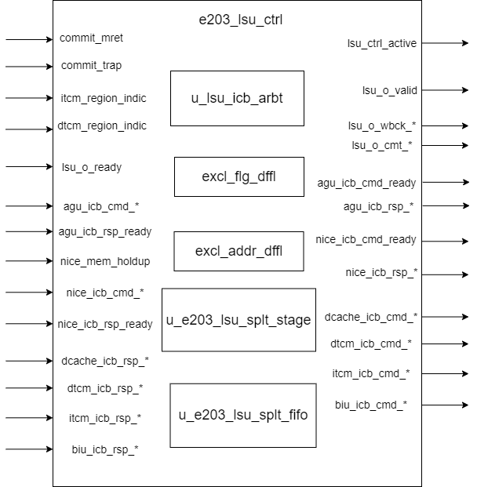

# e203_lsu_ctrl Design Document

## 1. Introduction
The e203_lsu_ctrl module is the LSU (Load Store Unit) control module in the E203 processor. It is mainly responsible for processing and controlling all memory access requests. This module receives memory access commands from the AGU (Address Generation Unit), routes them to different memory subsystems (ITCM, DTCM, DCache, BIU, etc.), and processes the returned responses. The module supports Atomic Memory Operations (AMO) instructions and implements a multi-level bus arbitration and distribution mechanism.

## 2. Module Diagram

## 3. Interface List

### 3.1 Control Interface
| Signal Name | Direction | Bit Width | Description |
| --- | --- | --- | --- |
| commit_mret | Input | 1 | MRET commit instruction signal |
| commit_trap | Input | 1 | Trap commit signal |
| lsu_ctrl_active | Output | 1 | Indication of the active state of the LSU control module |
| clk | Input | 1 | clock  signal |
| rst_n | Input | 1 | reset signal(activate low) |

### 3.2 LSU Write-back Interface
| Signal Name | Direction | Bit Width | Description |
| --- | --- | --- | --- |
| lsu_o_valid | Output | 1 | Write-back data valid signal |
| lsu_o_ready | Input | 1 | Write-back interface ready signal |
| lsu_o_wbck_wdat | Output | E203_XLEN | Write-back data |
| lsu_o_wbck_itag | Output | E203_ITAG_WIDTH | Instruction tag |
| lsu_o_wbck_err | Output | 1 | Error indication signal |
| lsu_o_cmt_buserr | Output | 1 | Bus error exception indication |
| lsu_o_cmt_badaddr | Output | E203_ADDR_SIZE | Error address |
| lsu_o_cmt_ld | Output | 1 | Load instruction commit indication |
| lsu_o_cmt_st | Output | 1 | Store instruction commit indication |

### 3.3 AGU-ICB Interface
| Signal Name | Direction | Bit Width | Description |
| --- | --- | --- | --- |
| agu_icb_cmd_valid | Input | 1 | Command valid signal |
| agu_icb_cmd_ready | Output | 1 | Command ready signal |
| agu_icb_cmd_addr | Input | E203_ADDR_SIZE | Access address |
| agu_icb_cmd_read | Input | 1 | Read/write control (1: read, 0: write) |
| agu_icb_cmd_wdata | Input | E203_XLEN | Write data |
| agu_icb_cmd_wmask | Input | E203_XLEN / 8 | Byte write enable |
| agu_icb_cmd_lock | Input | 1 | Lock signal |
| agu_icb_cmd_excl | Input | 1 | Exclusive access signal |
| agu_icb_cmd_size | Input | 2 | Access size (00: byte, 01: half, 10: word) |
| agu_icb_cmd_back2agu | Input | 1 | Indication that the response needs to be returned to the AGU |
| agu_icb_cmd_usign | Input | 1 | Unsigned load indication |
| agu_icb_cmd_itag | Input | E203_ITAG_WIDTH | Instruction tag |

### 3.4 AGU-ICB Response Interface
| Signal Name | Direction | Bit Width | Description |
| --- | --- | --- | --- |
| agu_icb_rsp_valid | Output | 1 | Response valid signal |
| agu_icb_rsp_ready | Input | 1 | Response receive ready signal |
| agu_icb_rsp_err | Output | 1 | Error response indication |
| agu_icb_rsp_excl_ok | Output | 1 | Exclusive access success indication |
| agu_icb_rsp_rdata | Output | E203_XLEN | Read data |

### 3.5 NICE Interface (Optional Configuration)

These interfaces are available if `E203_HAS_NICE` is defined.

| Signal Name | Direction | Bit Width | Description |
| --- | --- | --- | --- |
| nice_mem_holdup | Input | 1 | Memory access hold signal |
| nice_icb_cmd_valid | Input | 1 | Command valid signal |
| nice_icb_cmd_ready | Output | 1 | Command ready signal |
| nice_icb_cmd_addr | Input | E203_ADDR_SIZE | Access address |
| nice_icb_cmd_read | Input | 1 | Read/write control |
| nice_icb_cmd_wdata | Input | E203_XLEN | Write data |
| nice_icb_cmd_wmask | Input | E203_XLEN / 8 | Write mask |
| nice_icb_cmd_lock | Input | 1 | Lock signal used for atomic operations to ensure exclusive access to the memory |
| nice_icb_cmd_excl | Input | 1 | Exclusive access signal, typically used in load-reserve/store-conditional operations |
| nice_icb_cmd_size | Input | 2 | Access size specification (e.g., byte, half-word, word, etc.) |
| nice_icb_rsp_valid | Output | 1 | Response valid signal |
| nice_icb_rsp_ready | Input | 1 | Response ready signal |
| nice_icb_rsp_err | Output | 1 | Error indication |
| nice_icb_rsp_excl_ok | Output | 1 | Exclusive access success signal, indicates if an exclusive operation succeeded |
| nice_icb_rsp_rdata | Output | E203_XLEN | Read data |

### 3.6 Memory Interfaces
#### 3.6.1 DCache Interface (Optional Configuration)

These interfaces are available if `E203_HAS_DCACHE` is defined.

| Signal Name            | Direction | Bit Width        | Description                                                  |
| ---------------------- | --------- | ---------------- | ------------------------------------------------------------ |
| dcache_icb_cmd_valid   | Output    | 1                | Command valid signal, indicates that a valid command is being sent to the DCache |
| dcache_icb_cmd_ready   | Input     | 1                | Command ready signal, indicates that the DCache is ready to accept a command |
| dcache_icb_cmd_addr    | Output    | `E203_ADDR_SIZE` | Memory access address for the command                        |
| dcache_icb_cmd_read    | Output    | 1                | Read/write control signal (1: Read, 0: Write)                |
| dcache_icb_cmd_wdata   | Output    | `E203_XLEN`      | Write data that will be sent to the DCache when performing a write operation |
| dcache_icb_cmd_wmask   | Output    | `E203_XLEN / 8`  | Write mask to specify which bytes in the data are valid during a write operation |
| dcache_icb_cmd_lock    | Output    | 1                | Lock signal used for atomic operations to ensure exclusive access to the memory |
| dcache_icb_cmd_excl    | Output    | 1                | Exclusive access signal, typically used in load-reserve/store-conditional operations |
| dcache_icb_cmd_size    | Output    | 2                | Access size specification (e.g., byte, half-word, word, etc.) |
| dcache_icb_rsp_valid   | Input     | 1                | Response valid signal, indicates that the response from the DCache is valid |
| dcache_icb_rsp_ready   | Output    | 1                | Response ready signal, indicates that the module is ready to accept the DCache response |
| dcache_icb_rsp_err     | Input     | 1                | Error signal, indicates if there was an error during the command execution |
| dcache_icb_rsp_excl_ok | Output    | 1                | Exclusive access success signal, indicates if an exclusive operation (e.g., store-conditional) succeeded |
| dcache_icb_rsp_rdata   | Input     | `E203_XLEN`      | Read data returned by the DCache for a read operation        |

#### 3.6.2 DTCM Interface (Optional Configuration)

These interfaces are available when `E203_HAS_DTCM` is defined.

| Signal Name          | Direction | Bit Width              | Description                                                  |
| -------------------- | --------- | ---------------------- | ------------------------------------------------------------ |
| dtcm_icb_cmd_valid   | Output    | 1                      | Command valid signal, indicates that a valid command is being sent to DTCM |
| dtcm_icb_cmd_ready   | Input     | 1                      | Command ready signal, indicates that the DTCM is ready to accept a command |
| dtcm_icb_cmd_addr    | Output    | `E203_DTCM_ADDR_WIDTH` | Memory access address for the command                        |
| dtcm_icb_cmd_read    | Output    | 1                      | Read/write control signal (1: Read, 0: Write)                |
| dtcm_icb_cmd_wdata   | Output    | `E203_XLEN`            | Write data that will be sent to the DTCM during a write operation |
| dtcm_icb_cmd_wmask   | Output    | `E203_XLEN / 8`        | Write mask to specify which bytes in the data are valid for a write |
| dtcm_icb_cmd_lock    | Output    | 1                      | Lock signal for atomic operations to ensure exclusive access to memory |
| dtcm_icb_cmd_excl    | Output    | 1                      | Exclusive access signal, typically used in load-reserve/store-conditional |
| dtcm_icb_cmd_size    | Output    | 2                      | Access size specification (e.g., byte, half-word, word, etc.) |
| dtcm_icb_rsp_valid   | Input     | 1                      | Response valid signal, indicates that the response from DTCM is valid |
| dtcm_icb_rsp_ready   | Output    | 1                      | Response ready signal, indicates that the module is ready to accept a response |
| dtcm_icb_rsp_err     | Input     | 1                      | Error signal, indicates if an error occurred during command execution |
| dtcm_icb_rsp_excl_ok | Input     | 1                      | Exclusive access success signal, indicates if an exclusive operation succeeded |
| dtcm_icb_rsp_rdata   | Input     | `E203_XLEN`            | Read data returned by the DTCM for a read operation          |
| dtcm_region_indic    | Input     | `E203_ADDR_SIZE`       | Indicates if the current address belongs to the DTCM region  |

#### 3.6.3 ITCM Interface (Optional Configuration)

These interfaces are available when `E203_HAS_ITCM` is defined.

| Signal Name          | Direction | Bit Width              | Description                                                  |
| -------------------- | --------- | ---------------------- | ------------------------------------------------------------ |
| itcm_icb_cmd_valid   | Output    | 1                      | Command valid signal, indicates that a valid command is being sent to ITCM |
| itcm_icb_cmd_ready   | Input     | 1                      | Command ready signal, indicates that the ITCM is ready to accept a command |
| itcm_icb_cmd_addr    | Output    | `E203_ITCM_ADDR_WIDTH` | Memory access address for the command                        |
| itcm_icb_cmd_read    | Output    | 1                      | Read/write control signal (1: Read, 0: Write)                |
| itcm_icb_cmd_wdata   | Output    | `E203_XLEN`            | Write data that will be sent to the ITCM during a write operation |
| itcm_icb_cmd_wmask   | Output    | `E203_XLEN / 8`        | Write mask to specify which bytes in the data are valid for a write |
| itcm_icb_cmd_lock    | Output    | 1                      | Lock signal for atomic operations to ensure exclusive access to memory |
| itcm_icb_cmd_excl    | Output    | 1                      | Exclusive access signal, typically used in load-reserve/store-conditional |
| itcm_icb_cmd_size    | Output    | 2                      | Access size specification (e.g., byte, half-word, word, etc.) |
| itcm_icb_rsp_valid   | Input     | 1                      | Response valid signal, indicates that the response from ITCM is valid |
| itcm_icb_rsp_ready   | Output    | 1                      | Response ready signal, indicates that the module is ready to accept a response |
| itcm_icb_rsp_err     | Input     | 1                      | Error signal, indicates if an error occurred during command execution |
| itcm_icb_rsp_excl_ok | Input     | 1                      | Exclusive access success signal, indicates if an exclusive operation succeeded |
| itcm_icb_rsp_rdata   | Input     | `E203_XLEN`            | Read data returned by the ITCM for a read operation          |
| itcm_region_indic    | Input     | `E203_ADDR_SIZE`       | Indicates if the current address belongs to the ITCM region  |

#### 3.6.4 BIU Interface

| Signal Name         | Direction | Bit Width        | Description                                                  |
| ------------------- | --------- | ---------------- | ------------------------------------------------------------ |
| biu_icb_cmd_valid   | Output    | 1                | Command valid signal, indicates that a valid command is being sent to BIU |
| biu_icb_cmd_ready   | Input     | 1                | Command ready signal, indicates that the BIU is ready to accept a command |
| biu_icb_cmd_addr    | Output    | `E203_ADDR_SIZE` | Memory access address for the command                        |
| biu_icb_cmd_read    | Output    | 1                | Read/write control signal (1: Read, 0: Write)                |
| biu_icb_cmd_wdata   | Output    | `E203_XLEN`      | Write data that will be sent to the BIU during a write operation |
| biu_icb_cmd_wmask   | Output    | `E203_XLEN / 8`  | Write mask to specify which bytes in the data are valid for a write |
| biu_icb_cmd_lock    | Output    | 1                | Lock signal for atomic operations to ensure exclusive access to memory |
| biu_icb_cmd_excl    | Output    | 1                | Exclusive access signal, typically used in load-reserve/store-conditional operations |
| biu_icb_cmd_size    | Output    | 2                | Access size specification (e.g., byte, half-word, word, etc.) |
| biu_icb_rsp_valid   | Input     | 1                | Response valid signal, indicates that the response from BIU is valid |
| biu_icb_rsp_ready   | Output    | 1                | Response ready signal, indicates that the module is ready to accept a response |
| biu_icb_rsp_err     | Input     | 1                | Error signal, indicates if an error occurred during command execution |
| biu_icb_rsp_excl_ok | Input     | 1                | Exclusive access success signal, indicates if an exclusive operation succeeded |
| biu_icb_rsp_rdata   | Input     | `E203_XLEN`      | Read data returned by the BIU for a read operation           |

## 4. Submodule List

### 4.1 ICB Bus Arbiter (sirv_gnrl_icb_arbt)
**Function**: Implements arbitration control for multi-source memory access requests and supports a configurable priority mechanism.

**Configuration Parameters**:
| Parameter Name     | Default Value | Description |
|--------------------|---------------|-------------|
| AW                 | 32            | Address width (in bits) |
| DW                 | 64            | Data width (in bits) |
| USR_W              | 1             | User-defined signal width |
| ARBT_SCHEME        | 0             | Arbitration scheme (0: priority-based, 1: round-robin) |
| FIFO_OUTS_NUM      | 1             | Number of outstanding transactions supported |
| FIFO_CUT_READY     | 0             | Controls whether the ready signal is cut to avoid logic chains |
| ARBT_NUM           | 4             | Number of ICB ports |
| ALLOW_0CYCL_RSP    | 1             | Allows 0-cycle response |
| ARBT_PTR_W         | 2             | Width of the arbitration pointer |

**Interface**

| Port Name             | Direction | Width          | Description                   |
| --------------------- | --------- | -------------- | ----------------------------- |
| o_icb_cmd_valid       | Output    | 1              | Command valid to slave        |
| o_icb_cmd_ready       | Input     | 1              | Command ready from slave      |
| o_icb_cmd_read        | Output    | 1              | Read/write indicator (1=read) |
| o_icb_cmd_addr        | Output    | AW             | Command address               |
| o_icb_cmd_wdata       | Output    | DW             | Write data                    |
| o_icb_cmd_wmask       | Output    | DW/8           | Write mask                    |
| o_icb_cmd_burst       | Output    | 2              | Burst type                    |
| o_icb_cmd_beat        | Output    | 2              | Beat type                     |
| o_icb_cmd_lock        | Output    | 1              | Lock signal                   |
| o_icb_cmd_excl        | Output    | 1              | Exclusive access              |
| o_icb_cmd_size        | Output    | 2              | Transfer size                 |
| o_icb_cmd_usr         | Output    | USR_W          | User-defined signal           |
| o_icb_rsp_valid       | Input     | 1              | Response valid from slave     |
| o_icb_rsp_ready       | Output    | 1              | Response ready to slave       |
| o_icb_rsp_err         | Input     | 1              | Response error                |
| o_icb_rsp_excl_ok     | Input     | 1              | Exclusive access ok           |
| o_icb_rsp_rdata       | Input     | DW             | Read data                     |
| o_icb_rsp_usr         | Input     | USR_W          | User-defined response signal  |
| i_bus_icb_cmd_ready   | Output    | ARBT_NUM       | Command ready to masters      |
| i_bus_icb_cmd_valid   | Input     | ARBT_NUM       | Command valid from masters    |
| i_bus_icb_cmd_read    | Input     | ARBT_NUM       | Read/write indicators         |
| i_bus_icb_cmd_addr    | Input     | ARBT_NUM*AW    | Command addresses             |
| i_bus_icb_cmd_wdata   | Input     | ARBT_NUM*DW    | Write data                    |
| i_bus_icb_cmd_wmask   | Input     | ARBT_NUM*DW/8  | Write masks                   |
| i_bus_icb_cmd_burst   | Input     | ARBT_NUM*2     | Burst types                   |
| i_bus_icb_cmd_beat    | Input     | ARBT_NUM*2     | Beat types                    |
| i_bus_icb_cmd_lock    | Input     | ARBT_NUM       | Lock signals                  |
| i_bus_icb_cmd_excl    | Input     | ARBT_NUM       | Exclusive access              |
| i_bus_icb_cmd_size    | Input     | ARBT_NUM*2     | Transfer sizes                |
| i_bus_icb_cmd_usr     | Input     | ARBT_NUM*USR_W | User-defined signals          |
| i_bus_icb_rsp_valid   | Output    | ARBT_NUM       | Response valid to masters     |
| i_bus_icb_rsp_ready   | Input     | ARBT_NUM       | Response ready from masters   |
| i_bus_icb_rsp_err     | Output    | ARBT_NUM       | Response errors               |
| i_bus_icb_rsp_excl_ok | Output    | ARBT_NUM       | Exclusive access ok           |
| i_bus_icb_rsp_rdata   | Output    | ARBT_NUM*DW    | Read data to masters          |
| i_bus_icb_rsp_usr     | Output    | ARBT_NUM*USR_W | User-defined signals          |
| clk                   | Input     | 1              | Clock                         |
| rst_n                 | Input     | 1              | Reset (active low)            |

### 4.2 Segmented Pipeline (sirv_gnrl_pipe_stage)
**Function**: Implements a single-stage pipeline buffer for the LSU's outstanding request queue.

**Parameter Configuration**

| Parameter Name | Default Value | Description |
|----------------|---------------|-------------|
| CUT_READY      | 0             | Controls whether the ready signal is cut to avoid logic chains |
| DP             | 1             | Depth of the pipeline stage |
| DW             | 32            | Data width (in bits) |

**Signal Interface**

| Signal Name | Direction | Width | Description |
|-------------|-----------|-------|-------------|
| i_vld | Input | 1 | Input valid signal |
| i_rdy | Output | 1 | Input ready signal |
| i_dat | Input | DW | Input data |
| o_vld | Output | 1 | Output valid signal |
| o_rdy | Input | 1 | Output ready signal |
| o_dat | Output | DW | Output data |
| clk | Input | 1 | Clock signal |
| rst_n | Input | 1 | Reset signal (active low) |

### 4.3 FIFO Module (sirv_gnrl_fifo)
**Function**: Implements a multi-level FIFO buffer for storing outstanding information.

**Parameter Configuration**

| Parameter Name | Default Value | Description |
|----------------|---------------|-------------|
| CUT_READY      | 0             | Controls whether the ready signal is cut to avoid logic chains |
| MSKO           | 0             | Masks the output data with valid signal |
| DP             | 8             | Depth of the FIFO |
| DW             | 32            | Data width (in bits) |

**Signal Interface**

| Signal Name | Direction | Width | Description |
|-------------|-----------|-------|-------------|
| i_vld | Input | 1 | Input valid signal |
| i_rdy | Output | 1 | Input ready signal |
| i_dat | Input | DW | Input data |
| o_vld | Output | 1 | Output valid signal |
| o_rdy | Input | 1 | Output ready signal |
| o_dat | Output | DW | Output data |
| clk | Input | 1 | Clock signal |
| rst_n | Input | 1 | Reset signal (active low) |

### 4.4 FIFO Module (sirv_gnrl_dfflr)
**Function**: Verilog module sirv_gnrl DFF with Load-enable and Reset. Default reset value is 0.

**Parameter Configuration**

| Parameter Name | Default Value | Description |
|----------------|---------------|-------------|
| DW             | 32            | Data width (in bits) |

**Signal Interface**

| Port Name | Direction | Width | Description |
|-----------|-----------|-------|-------------|
| lden      | Input     | 1     | Load enable signal |
| dnxt      | Input     | DW    | Input data |
| qout      | Output    | DW    | Output data |
| clk       | Input     | 1     | Clock signal |
| rst_n     | Input     | 1     | Active-low reset signal |

## 5. Implementation Details

### 5.1 Access Request Processing and Arbitration

1. **NICE Request Priority Processing Mechanism**
    - The LSU module first checks the NICE memory access hold signal (nice_mem_holdup).
    - When there is a NICE memory access hold, it suppresses the memory access requests from the AGU.
    - To ensure that the AGU requests are correctly suppressed, the original request valid signal of the AGU is combined with the NICE hold signal to generate the actual request valid signal.
    - The same suppression processing mechanism is also applied to the response ready signal of the AGU.

2. **Implementation of the Request Arbiter**
    - A priority arbitration scheme is adopted and configured through the ARBT_SCHEME parameter.
    - The 0-cycle response mechanism is disabled because the command delay of the BIU is always greater than 0.
    - For internal memories such as ITCM and DTCM, responses also cannot be completed within 0 cycles.
    - The FIFO depth of the arbiter is configured through the LSU_OUTS_NUM parameter to support multiple outstanding requests.

3. **Bus Channel Signal Allocation**
    - **CMD Channel Signal Allocation**:
        - Combine the command signals of the AGU and NICE and then allocate them to the bus.
        - The valid signal distinguishes between the original (valid_raw) and processed (valid) ones.
        - Basic control signals such as address, read/write control, and data are directly combined.
        - The burst and beat signals are fixed to 0.
        - The bus ready signal is inversely allocated to the source devices.

    - **RSP Channel Signal Allocation**:
        - Allocate the bus response signals to the AGU and NICE respectively.
        - This includes status signals such as valid, error flag, and exclusive access result.
        - Distribution of data and user-defined signals.
        - The ready signals of the source devices are combined and returned to the bus.

### 5.2 Management of Outstanding Requests

1. **FIFO Tracking of Request Information**
    - When an ICB command completes the handshake, the request information is written into the FIFO.
    - The FIFO stores the complete information of the request, including:
        - The type of the target device (BIU/DCache/DTCM/ITCM).
        - The user information of the original request.
        - The access type and control flags.

2. **Configuration Choices for FIFO Implementation**
    - **Simple Configuration for a Single Outstanding Request**:
        - Implemented using a single-stage pipeline structure.
        - Simplifies the control logic.
    - **Configuration for Supporting Multiple Outstanding Requests**:
        - Adopts a complete FIFO structure.
        - Provides greater concurrent processing capabilities.

### 5.3 Memory Interface Selection and Control

1. **Address Decoding and Target Selection**
    - Decode by comparing the request address with the indication bits of each memory area.
    - Supported target devices include:
        - Instruction Tightly Coupled Memory (ITCM).
        - Data Tightly Coupled Memory (DTCM).
        - Data Cache (DCache).
        - Bus Interface Unit (BIU).
    - For addresses not in any of the above areas, they are routed to the BIU by default.

2. **Control Strategy for Branch Requests**
    - Monitor whether there are outstanding requests to different target devices.
    - In the configuration that only supports a single outstanding request, the branch monitoring logic is simplified.
    - Depending on the FIFO status and the branch check result, decide whether a new request can be sent.

### 5.4 Storage Access Flow Control

1. **Processing of the Command Channel**
    - Generate control signals separately for each target interface:
        - The command valid signal is selectively activated according to the address decoding result.
        - All control signals (read/write, size, lock, etc.) are directly passed from the original request.
        - The write mask signal will be specially processed as all 0s when the conditional store instruction fails.

2. **Management of the Response Channel**
    - Select the valid response source according to the target information recorded in the FIFO.
    - Processing of the response data includes:
        - Byte alignment based on the access address.
        - Data truncation according to the access size (byte/half-word/word).
        - Handling of sign extension requirements.
        - Generation of special response data for conditional store instructions.

### 5.5 Exclusive Access Mechanism

1. **Maintenance Mechanism of the Exclusive Flag**
    - When processing an exclusive load instruction:
        - Record the target address of the exclusive access.
        - Set the exclusive valid flag.
    - The clearing conditions of the exclusive flag are:
        - When a store operation hits the exclusive address.
        - When an exception occurs or a return instruction is executed.

2. **Processing Flow of Conditional Stores**
    - Check whether the current store address hits the exclusive address.
    - Verify the validity of the exclusive flag.
    - Depending on the check result:
        - If successful, allow the write operation.
        - If failed, generate a write mask of all 0s to block the write.
        - Return the corresponding success/failure indication value.

### 5.6 Data Alignment and Size Conversion

1. **Data Processing for Load Operations**
    - Supports multiple load types:
        - Byte load (LB/LBU).
        - Half-word load (LH/LHU).
        - Word load (LW).
    - Perform data shift alignment based on the lower bits of the access address.
    - Perform sign extension or zero extension according to the instruction requirements.

2. **Mask Generation for Store Operations**
    - Generate the write mask according to the access size and address.
    - Special treatment for conditional store instructions:
        - Use the normal write mask when successful.
        - Generate a write mask of all 0s when failed.

### 5.7 Error Handling Mechanism

1. **Error Detection and Reporting**
    - Aggregate the error indications from various memory interfaces.
    - Distinguish the accessed types of errors:
        - Record whether it is a load or store operation.
        - Save the access address where the error occurred.
    - Report errors to the processor core through the write-back channel.

2. **Work Status Monitoring**
    - Reflect through the activity status indication signal:
        - Whether there are currently unprocessed requests.
        - Whether there are unfinished operations in the FIFO.
    - Used to assist the processor in resource management.

### 5.8 ICB Interface Separation Implementation

1. **Generation of Command Ready Signals**
    - Generation of the main ready signal (all_icb_cmd_ready):
        - AND all the ready signals of the target devices (BIU/DCACHE/DTCM/ITCM).
        - Used to simplify the implementation and ensure stability.
        - May slightly affect performance but simplifies the timing path.

    - Generation of independent exception ready signals for each interface:
        - all_icb_cmd_ready_excp_biu: All interfaces except BIU are ready.
        - all_icb_cmd_ready_excp_dcach: All interfaces except DCACHE are ready.
        - all_icb_cmd_ready_excp_dtcm: All interfaces except DTCM are ready.
        - all_icb_cmd_ready_excp_itcm: All interfaces except ITCM are ready.

2. **Interface Command Distribution**
    - **DCACHE Interface Control**:
        - Generate the valid signal based on address decoding and the exception ready signal.
        - Pass the address, data, control signals, etc.

    - **DTCM Interface Control**:
        - Use the DTCM address width for address truncation.
        - Keep the consistency of basic control signals.

    - **ITCM Interface Control**:
        - Use the ITCM-specific address width.
        - Similar control logic to DTCM.

    - **BIU Interface Control**:
        - Handle non-special area accesses as the default interface.
        - Completely pass all control signals.

3. **Response Channel Merging**
    - Use the source selection signal (arbt_icb_rsp_xxx) to control the multiplexer.
    - The merged signals include:
        - valid/error/excl_ok signals.
        - Response data.
        - User information fields.

### 5.9 LSU Write-back Interface Implementation
1. **Write-back Path Selection**
    - Based on the `back2agu` flag for selection:
        - When it is 1, the data is routed back to the AGU.
        - When it is 0, the data enters the write-back channel.
    - The `ready` signal is generated correspondingly.

2. **Data Conversion Processing**
    - **Sign Extension Handling**:
        - Depending on the access size (byte/half-word/word), perform sign extension.
        - Take into account the distinction between signed and unsigned instructions.
    - **Alignment Processing**:
        - Calculate the shift amount using the lower bits of the address.
        - Generate correctly aligned data.

3. **Write-back Control Signal Generation**
    - Pass the error flag.
    - Generate the bus error exception indication.
    - Record the access address and type.

### 5.10 Write Mask Generation Implementation
1. **NICE Interface Write Mask**
    - Generated according to the access size and address:
        - For byte access: Generate 0001 at the specified position.
        - For half-word access: Generate 0011 at the specified position.
        - For word access: Generate 1111.
    - The mask position is determined by the lower bits of the address.

2. **Conditional Store Write Mask**
    - In the success case:
        - Use the original write mask.
    - In the failure case:
        - Generate an all-zero mask to prevent writing.

3. **Normal Store Write Mask**
    - Directly use the input `wmask` signal.
    - Align it naturally according to the size and address.

## 6. Corner Cases
1. **Multi-level Bus Contention Handling**
    - When multiple requests arrive simultaneously, they are arbitrated according to priority.
    - NICE requests can interrupt AGU requests.
    - Special handling to prevent starvation.

2. **Exception Handling**
    - Bus error response handling.
    - Out-of-bounds access detection.
    - Alignment violation handling.

## 7. Constraints
1. **Request Exclusivity**
    - AGU and NICE requests cannot obtain bus access rights simultaneously.
    - Read and write requests will not be executed concurrently.

2. **Timing Constraints**
    - The handshake signals of the command and response channels must meet the timing requirements.
    - The FIFO depth limits the number of outstanding requests.