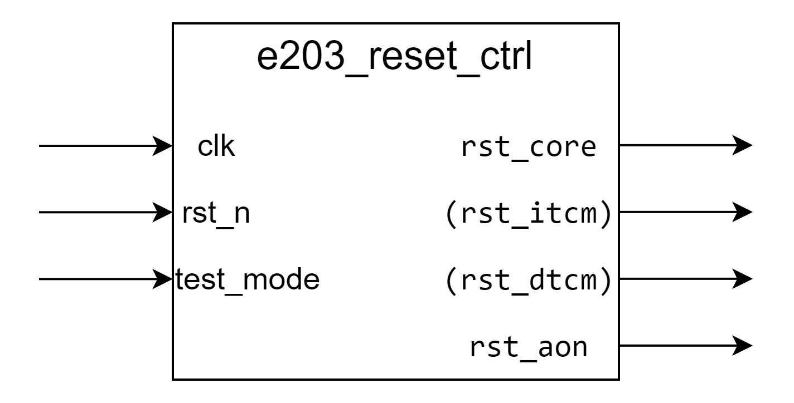

**e203_reset_ctrl Design Document**

**1. Introduction**

The e203_reset_ctrl module is responsible for managing reset signals for critical system modules, supporting master-slave reset modes and test modes.

**2. Block Diagram**

**3. Interface**

**Basic Interface**

| Signal Name | Direction | Width | Description |
| ---- | ---- | ---- | ---- |
| clk | Input | 1 | System clock |
| rst_n | Input | 1 | Asynchronous reset signal (active low) |
| test_mode | Input | 1 | Test mode enable |
| rst_core | Output | 1 | Processor core reset signal |
| rst_itcm | Output | 1 | ITCM memory reset signal. Exists only if `E203_HAS_ITCM` is defined |
| rst_dtcm | Output | 1 | DTCM memory reset signal Exists only if `E203_HAS_DTCM` is defined |
| rst_aon | Output | 1 | Always-on module reset signal |

**Optional Interface**

1. Below signal is available when `E203_HAS_ITCM` is defined.

   | Signal Name | Direction | Width | Description              |
   | ----------- | --------- | ----- | ------------------------ |
   | rst_itcm    | output    | 1     | ITCM memory reset signal |

2. Below signal is available when `E203_HAS_DTCM` is defined.

   | Signal Name | Direction | Width | Description              |
   | ----------- | --------- | ----- | ------------------------ |
   | rst_dtcm    | output    | 1     | DTCM memory reset signal |

**4. Parameter Configuration**

**4.1 Module Parameter**

| Parameter | Default Value | Description |
| ---- | ---- | ---- |
| MASTER | 1 | Reset controller mode (1 for master controller, 0 for slave controller) |
**4.2 local param in module**
| Parameter | Value | Description |
| ---- | ---- | ---- |
| RST_SYNC_LEVEL | E203_ASYNC_FF_LEVELS | Synchronous reset cascade depth. Exists only if the `E203_HAS_LOCKSTEP` is defined |

**5. Functional Description**

**5.1 Reset Synchronization Mechanism**

-   In master controller mode, synchronize the asynchronous reset signal through multiple-stage registers
-   Each clock cycle, the reset register shifts left and is filled with 1
-   In test mode, directly use the asynchronous reset signal

**5.2 Operating Modes**

1.  Master Controller Mode (MASTER == 1)

-   Implements multi-stage synchronous reset mechanism
-   Generates synchronized reset signal

2.  Slave Controller Mode (MASTER == 0)

-   Directly passes the reset signal
-   No additional reset synchronization processing

**5.3 Test Mode Handling**

-   When test_mode is high, directly use the input rst_n as the reset signal
-   When test_mode is low, use the synchronized reset signal

**6. Reset Signal Distribution**

-   Core reset
-   ITCM memory reset (conditional compilation)
-   DTCM memory reset (conditional compilation)
-   Always-on module reset

**7. Corner Cases**

1.  Reset behavior in test mode
2.  Reset processing in master/slave modes
3.  Boundary conditions of multi-stage synchronous reset registers

**8. Constraints**

1.  Timing Constraints

-   Reset signal synchronization must meet setup and hold time requirements

2.  Power Constraints

-   Reset control logic should be as simple as possible to minimize static power consumption