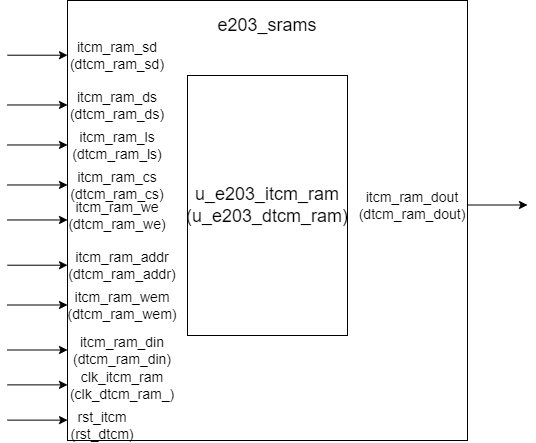

# e203_srams Design Documentation

## 1. Introduction
The e203_srams module is the memory management module of the E203 processor. It is mainly used for integrating and managing the Instruction Tightly Coupled Memory (ITCM) and Data Tightly Coupled Memory (DTCM). This module flexibly controls the instantiation of ITCM and DTCM through macro definitions `E203_HAS_ITCM` and `E203_HAS_DTCM`.

## 2. Module Block Diagram

## 3. Interface Definition

### General Interface
| Signal Name | Direction | Bit Width | Description |
|--------|------|------|------|
| test_mode | Input | 1 | Unused and unassigned |

### ITCM RAM Interface

Signals exist only if the `E203_HAS_ITCM` is defined
| Signal Name | Direction | Bit Width | Description |
|--------|------|------|------|
| itcm_ram_sd | Input | 1 | ITCM power off enable signal |
| itcm_ram_ds | Input | 1 | ITCM deep sleep mode enable |
| itcm_ram_ls | Input | 1 | ITCM light sleep mode enable |
| itcm_ram_cs | Input | 1 | ITCM chip select signal |
| itcm_ram_we | Input | 1 | ITCM write enable signal |
| itcm_ram_addr | Input | E203_ITCM_RAM_AW | ITCM address |
| itcm_ram_wem | Input | E203_ITCM_RAM_MW | ITCM write mask |
| itcm_ram_din | Input | E203_ITCM_RAM_DW | ITCM write data |
| itcm_ram_dout | Output | E203_ITCM_RAM_DW | ITCM read data |
| clk_itcm_ram | Input | 1 | ITCM clock signal |
| rst_itcm | Input | 1 | ITCM reset signal |

### DTCM RAM Interface

Signals exist only if the `E203_HAS_DTCM` is defined
(Similar to the ITCM interface, with the signal name prefix changed to dtcm).
| Signal Name | Direction | Bit Width | Description |
|--------|------|------|------|
| dtcm_ram_sd | Input | 1 | DTCM power off enable signal |
| dtcm_ram_ds | Input | 1 | DTCM deep sleep mode enable |
| dtcm_ram_ls | Input | 1 | DTCM light sleep mode enable |
| dtcm_ram_cs | Input | 1 | DTCM chip select signal |
| dtcm_ram_we | Input | 1 | DTCM write enable signal |
| dtcm_ram_addr | Input | E203_ITCM_RAM_AW | DTCM address |
| dtcm_ram_wem | Input | E203_ITCM_RAM_MW | DTCM write mask |
| dtcm_ram_din | Input | E203_ITCM_RAM_DW | DTCM write data |
| dtcm_ram_dout | Output | E203_ITCM_RAM_DW | DTCM read data |
| clk_dtcm_ram | Input | 1 | DTCM clock signal |
| rst_dtcm | Input | 1 | DTCM reset signal |

## 4. Submodule List

### ITCM RAM 

#### Function

The e203_dtcm_ram module is a Data Tightly Coupled Memory (DTCM) RAM module for the E203 processor. The module is encapsulated based on a generic RAM module, primarily used for data storage and access. The module is controlled by the macro definition `E203_HAS_DTCM`.

#### Interface

| Signal Name | Direction | Width | Description |
|------------|-----------|-------|-------------|
| sd | Input | 1 | Power domain shutdown enable signal for power management |
| ds | Input | 1 | Deep sleep mode enable, controlling complete power area shutdown |
| ls | Input | 1 | Light sleep mode enable, reducing power without full shutdown |
| cs | Input | 1 | Chip select signal, controlling RAM selection |
| we | Input | 1 | Write enable signal, controlling write operation |
| addr | Input | E203_ITCM_RAM_AW | Address input, specifying read/write location |
| wem | Input | E203_ITCM_RAM_MW | Write mask, controlling specific byte writing |
| din | Input | E203_ITCM_RAM_DW | Data input to be written |
| rst_n | Input | 1 | Asynchronous reset signal (active low) |
| clk | Input | 1 | System clock |
| dout | Output | E203_ITCM_RAM_DW | Data output, read data |

### DTCM RAM 

#### Function

The e203_itcm_ram module is an Instruction Tightly Coupled Memory (ITCM) RAM module for the E203 processor. The module is encapsulated based on a generic RAM module, primarily used for instruction storage and access. The module is controlled by the macro definition `E203_HAS_ITCM`.

#### Interface

| Signal Name | Direction | Width | Description |
|------------|-----------|-------|-------------|
| sd | Input | 1 | Power domain shutdown enable signal for power management |
| ds | Input | 1 | Deep sleep mode enable, controlling complete power area shutdown |
| ls | Input | 1 | Light sleep mode enable, reducing power without full shutdown |
| cs | Input | 1 | Chip select signal, controlling RAM selection |
| we | Input | 1 | Write enable signal, controlling write operation |
| addr | Input | E203_DTCM_RAM_AW | Address input, specifying read/write location |
| wem | Input | E203_DTCM_RAM_MW | Write mask, controlling specific byte writing |
| din | Input | E203_DTCM_RAM_DW | Data input to be written |
| rst_n | Input | 1 | Asynchronous reset signal (active low) |
| clk | Input | 1 | System clock |
| dout | Output | E203_DTCM_RAM_DW | Data output, read data |

## 5. Implementation Details

1. Memory management mechanism
   - Supports independent configuration and control of ITCM and DTCM.
   - Each memory module has an independent clock and reset domain.

2. Data flow control
   - Adopts a preprocessed data output mechanism (dout_pre).
   - Removes the data bypass function in test mode.

3. Submodule Instantiation Details

   The submodule interface is connected to the corresponding interface of this module. For example, the `sd` signal of `e203_itcm_ram` is connected to the `itcm_ram_sd` interface.

## 6. Limitations

1. Functional constraints
   - The address must be within the valid range.