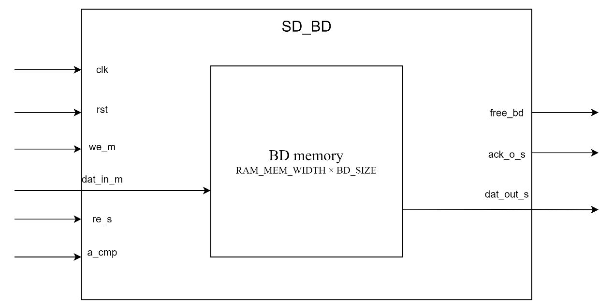
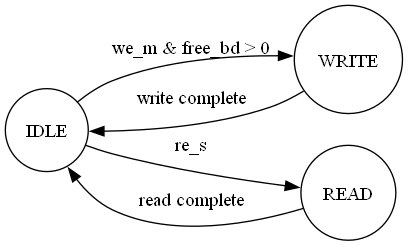

**sd_bd design specification**

**1. Introduction**

The sd_bd module is a crucial component in the SD/MMC controller design. It manages the buffer descriptors used for data transmission and reception between the system memory and the SD card. This module implements a circular buffer of descriptors, allowing efficient management of data transfer operations.

**2. Block Diagram**

**3. Interface**

| **Port Name** | **Direction** | **Width**     | **Description**                           |
|---------------|---------------|---------------|-------------------------------------------|
| clk           | Input         | 1             | System clock                              |
| rst           | Input         | 1             | Asynchronous reset, active high           |
| we_m          | Input         | 1             | Write enable signal                       |
| dat_in_m      | Input         | RAM_MEM_WIDTH | Input data for writing BD                 |
| free_bd       | Output        | BD_WIDTH      | Number of free buffer descriptors         |
| re_s          | Input         | 1             | Read enable signal                        |
| ack_o_s       | Output        | 1             | Read operation acknowledgment             |
| a_cmp         | Input         | 1             | SD card operation completion |
| dat_out_s     | Output        | RAM_MEM_WIDTH | Output data from reading BD               |

**4. State Transition Diagram**

**5. Operation Process**

**5.1 Initialization**

1.  The module enters initialization state on system reset.
2.  32-bit mode: The free_bd counter is set to half of the total number of BDs.
3.  16-bit mode: The free_bd counter is set to one quarter of the total number of BDs.
4.  Write pointer m_wr_pnt and read pointer s_rd_pnt are reset to 0.
5.  Write and read counters are reset to 0.

**5.2 Writing Buffer Descriptor**

1.  The host asserts the we_m signal to initiate a BD write.
2.  The module checks if free_bd is greater than 0.
3.  32-bit mode: Two writes complete one BD.
4.  16-bit mode: Four writes complete one BD.
5.  m_wr_pnt increments by 1 after each write.
6.  After completing a BD write, new_bw is set high, and free_bd decrements by 1.

**5.3 Reading Buffer Descriptor**

1.  The SD controller asserts the re_s signal to initiate a BD read.
2.  32-bit mode: Two reads obtain complete BD information.
3.  16-bit mode: Four reads obtain complete BD information.
4.  Each read outputs data from bd_mem[s_rd_pnt] to dat_out_s.
5.  s_rd_pnt increments by 1 after each read.
6.  In 16-bit mode, ack_o_s is set high during each read.

**5.4 Releasing Buffer Descriptor**

1.  The external module asserts the a_cmp signal to indicate SD card operation completion.
2.  When an a_cmp rising edge is detected, free_bd increments by 1.
3.  16-bit mode uses last_a_cmp to detect the rising edge.

**5.5 Circular Operation**

1.  Write and read operations continue, with pointers wrapping to 0 after reaching BD_SIZE - 1.
2.  The free_bd counter updates dynamically, tracking the number of available BDs.

**6. Constraints and Limitations**

1.  The total number of BDs must be a power of 2 to ensure correct wraparound behavior.
2.  The module assumes read and write operations do not overlap in the buffer.
3.  In 16-bit mode, all four writes or reads must be completed consecutively for a valid BD operation.
