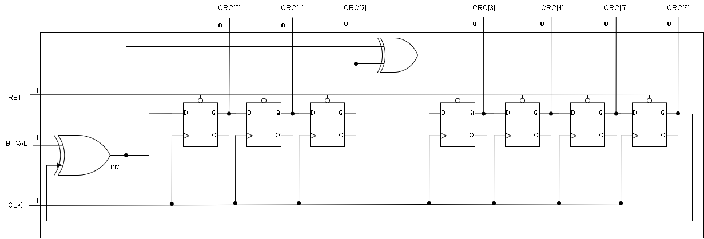

# sd_crc_7 design specification

## Introduction

The `sd_crc_7` module is designed to compute a 7-bit Cyclic Redundancy Check (CRC) value for serial data inputs. It processes incoming bits serially, updating the CRC value based on the current input bit and the previous CRC state. This module is critical for error detection in data transmission systems where data integrity is paramount.

- Design Level: module
- Module Name: `sd_crc_7`

## Interface

**Inputs**

- BITVAL (input): The next input bit to be processed for CRC computation.
- Enable (input): A control signal that enables the CRC update on the rising edge of the clock. When high (1), the CRC is updated; otherwise, it remains unchanged.
- CLK (input): The clock signal that synchronizes the CRC computation. The CRC value updates on the rising edge of this clock.
- RST (input): The reset signal. When asserted high (1), it initializes the CRC value to zero.

**Outputs**

- CRC (output [6:0]): The current 7-bit CRC value.

## Diagram

## Clock and Reset

**Clock :`CLK`**

- Type: Synchronous
- Edge: Positive (rising edge)
- Function: Drives the CRC update mechanism. On each rising edge, if `Enable` is high, the CRC value is updated based on the current input.

**Reset:`RST`**

- Type: Asynchronous
- Active Level: High (`1`)
- Function: Immediately resets the CRC register to `0` regardless of the clock. Ensures CRC computation starts from a known state.

## Dataflow

The `sd_crc_7` module operates based on the following dataflow:

1. Inverse Calculation:

- `inv = BITVAL ^ CRC[6]`

- Determines whether to invert the incoming bit based on the highest bit of the current CRC value.

2. CRC Update:

- On the rising edge of `CLK` or when `RST` is asserted:

- If `RST` is high, `CRC` is reset to `0`.

- Else, if `Enable` is high:

  | signal | Updated with |
  | ------ | ------------ |
  | CRC[0] | inv          |
  | CRC[3] | CRC[2] ^ inv |
  | CRC[i] | CRC[i-1]     |

  

## Corner Cases

**Enable Signal Deassertion:**

- When `Enable` is low (`0`), the CRC value remains unchanged even if `BITVAL` changes. This prevents unintended updates when CRC computation should be paused.

**Simultaneous Reset and Enable:**

- If `RST` is high and `Enable` is high simultaneously, the reset operation takes precedence, and the CRC is set to `0`.
