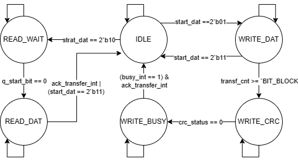

# sd_data_serial_host design specification

The `sd_data_serial_host` module is the interface towards physical SD card device Data port. The external interface consist of two signals clk and a bidirectional signal DAT. The DAT_oe_o, DAT_dat_o and DAT_dat_i, signals has to be combined in additional module (Preferable the SoC top module). 

The module perform the following actions.

- Synchronized request for write and read data and . 
- Adding a CRC-16 checksum on sent data and check for correct CRC-16 on received commands. 

## Interface

### Input Ports

| **Name**     | **Width** | **Description**                                |
| ------------ | --------- | ---------------------------------------------- |
| `sd_clk`     | 1         | Clock signal for synchronization.              |
| `rst`        | 1         | Reset signal to initialize the module.         |
| `data_in`    | 32        | 32-bit input data to transmit.                 |
| `start_dat`  | 2         | start data transfer. “01” Start Read block, “10” Start Write block and “11” Stop .       |
|`ack_transfer`| 1         | ACK on transm_complete.          |
| `DAR_dat_i`  | SD_BUS_W  | SD card data input.                            |

### Output Ports

| **Name**     | **Width** | **Description**                                |
| ------------ | --------- | ---------------------------------------------- |
| `rd`         | 1         | FIFO read enable. |
| `data_out`   | SD_BUS_W  | FIFO data out.        |
| `we`         | 1         | FIFO WriteEnable.             |
| `DAT_oe_o`   | 1         | Tri-state Output enable.        |
| `DAT_dat_o`  | SD_BUS_W  | SD Data output.         |
| `busy_n`     | 1         | Data line Busy Active Low.  |
| `transm_complete`  | 1   | Transmission complete.       |
| `crc_ok`     | 1         | CRC checksum ok.       |

## Signal Description

### Internal Signals

The module maintains several internal signals to manage command processing, CRC operations, and state transitions:

| **Type** | **Variable Name**            | **Bit Width**  | **Description**                                                         |
|----------|----------------------------- |----------------|------------------------------------------------------------------------ |
| **reg**  | `crc_in`                     | `SD_BUS_W`     | Input for CRC calculation                                               |
| **reg**  | `crc_en`                     | 1              | Enable signal for CRC calculation                                       |
| **reg**  | `crc_rst`                    | 1              | Reset signal for CRC calculation                                        |
| **wire** | `crc_out`                    | 16 * `SD_BUS_W`| Output from CRC calculation (array of 16-bit values, `SD_BUS_W` wide)   |
| **reg**  | `temp_in`                    | `SD_BUS_W`     | Temporary storage for input data                                        |
| **reg**  | `transf_cnt`                 | 11             | Transfer counter                                                        |
| **reg**  | `state`                      | 6              | Current state of FSM                                                    |
| **reg**  | `next_state`                 | 6              | Next state of FSM                                                       |
| **reg**  | `crc_status`                 | 3              | Status register for CRC                                                 |
| **reg**  | `busy_int`                   | 1              | Internal busy signal                                                    |
| **reg**  | `ack_transfer_int`           | 1              | Synchronized version of `ack_transfer`                                  |
| **reg**  | `ack_q`                      | 1              | Acknowledge signal in the synchronization process                       |
| **reg**  | `q_start_bit`                | 1              | Start bit indicator for the receive operation                           |
| **reg**  | `crc_c`                      | 5              | CRC counter                                                             |
| **reg**  | `last_din`                   | 4              | Last data input for CRC calculation                                     |
| **reg**  | `crc_s`                      | 3              | CRC status bits                                                         |
| **reg**  | `write_buf_0`                | 32             | Buffer for writing data (first buffer)                                  |
| **reg**  | `write_buf_1`                | 32             | Buffer for writing data (second buffer)                                 |
| **reg**  | `sd_data_out`                | 32             | Output data buffer                                                      |
| **reg**  | `out_buff_ptr`               | 1              | Pointer for output buffer                                               |
| **reg**  | `in_buff_ptr`                | 1              | Pointer for input buffer                                                |
| **reg**  | `data_send_index`            | 3              | Index for data being sent                                               |

### External Signals

| **Type**        | **Variable Name**           | **Bit Width** | **Description**                                         |
|-----------------|-----------------------------|---------------|---------------------------------------------------------|
| **parameter**   | `SD_BUS_W`                   | Defined in `sd_defines.v` | SD data bus width as defined externally               |
| **parameter**   | `BIT_BLOCK`                  | Defined in `sd_defines.v` | Bit block size as defined externally                   |
| **parameter**   | `CRC_OFF`                    | Defined in `sd_defines.v` | CRC offset as defined externally                       |
| **parameter**   | `BIT_BLOCK_REC`              | Defined in `sd_defines.v` | Bit block size for receiving as defined externally      |
| **parameter**   | `BIT_CRC_CYCLE`              | Defined in `sd_defines.v` | CRC cycle size as defined externally                    |
| **parameter**   | `LITLE_ENDIAN`               | Defined in `sd_defines.v` | Endian type (little endian) as defined externally       |
| **parameter**   | `BIG_ENDIAN`                 | Defined in `sd_defines.v` | Endian type (big endian) as defined externally          |
| **parameter**   | `SD_BUS_WIDTH_1`             | Defined in `sd_defines.v` | SD bus width of 1 as defined externally                 |
| **parameter**   | `SD_BUS_WIDTH_4`             | Defined in `sd_defines.v` | SD bus width of 4 as defined externally                 |

## Function Description

The module consist of 6 block, CRC_16_gen, ACK_SYNC, FSM_COMBO, START_SYNC, FSM_SEQ and FSM_OUT. 

CRC_16_gen: Calculates and appends the CRC-16 checksum for data integrity.

ACK_SYNC: Synchronizes the external acknowledgment signal to avoid timing errors.

FSM_COMBO: Implements the combinational logic for state transitions in data transfer.

START_SYNC: Synchronizes the detection of the start bit during read operations.

FSM_SEQ: Handles the sequential state updates of the FSM based on clock cycles.

FSM_OUT: Controls the transmission and reception of data, CRC calculation, and the signaling of transfer completion.

### Sub-Modules

#### 1. **CRC_16_gen (CRC Generation Block)**

   - **Submodule**：

     module name：sd_crc_16

     IO Ports:

     | Direction | Name   | Width | Description                   |
     | --------- | ------ | ----- | ----------------------------- |
     | input     | BITVAL | 1     | Next input bit                |
     | input     | Enable | 1     | Enables CRC updating          |
     | input     | CLK    | 1     | Current bit valid (Clock)     |
     | input     | RST    | 1     | Initializes CRC value to zero |
     | output    | CRC    | 16    | Current output CRC value      |

     connection:

     - crc_in -> BITVAL
     - crc_en -> Enable
     - crc_rst -> RST
     - crc_out[15:0] <- CRC[15:0]

   - **Purpose**: This block generates a CRC-16 checksum for error detection during data transfer. It ensures data integrity by calculating and appending a 16-bit CRC code to the data being transmitted.
   - **Function**:
     - For each data bit in the transfer, the block computes a CRC-16 checksum. 
     - The result is stored in the `crc_out` array, which is used later during the transmission process to append the checksum to the data stream.
   - **Key Components**:
     - `crc_in`: Input data for CRC calculation.
     - `crc_en`: Enable signal for CRC calculation.
     - `crc_rst`: Reset signal for CRC calculation.
     - `crc_out`: Output of the CRC-16 checksum.
     - **Generation Logic**: The `generate` block creates multiple instances of the CRC module (`sd_crc_16`), one for each bit of the `SD_BUS_W` width.

---

### Internal Block

#### 1. **ACK_SYNC (Acknowledgment Synchronization Block)**

   - **Purpose**: Synchronizes the acknowledgment signal (`ack_transfer`) with the `sd_clk` to prevent timing issues.
   - **Function**:
     - This block ensures that the `ack_transfer` signal is properly synchronized with the clock domain of the module. It avoids metastability or glitches during the transition of the acknowledgment signal.
     - The synchronized acknowledgment is stored in `ack_transfer_int`, which is used throughout the module.
   - **Key Components**:
     - `ack_transfer`: External acknowledgment input.
     - `ack_q`, `ack_transfer_int`: Registers to synchronize the acknowledgment signal.
     - **Synchronization Logic**: Two-stage flip-flop synchronization.

---

#### 2. **FSM_COMBO (Finite State Machine Logic for Transmit and Receive Operations)**
   - **Purpose**: Defines the combinational logic for the state transitions in the FSM, controlling data transmission and reception.
   - **Function**:
     - The FSM handles the various states of the SD card communication, such as idle, writing data, CRC generation, and reading data.
     - Depending on the input signals (`start_dat`, `transf_cnt`, `crc_status`, etc.), it transitions between different states like `IDLE`, `WRITE_DAT`, `WRITE_CRC`, `WRITE_BUSY`, `READ_WAIT`, and `READ_DAT`.
     - It controls the sequence of operations like writing data, generating CRC, waiting for acknowledgment, and reading data from the SD bus.
   - **Key Components**:
     - `state`, `next_state`: Current and next states of the FSM.
     - `start_dat`: Control signal to initiate data transfer.
     - `transf_cnt`: Transfer counter to track data blocks.
     - `crc_status`, `busy_int`, `DAT_dat_i`: Various control and status inputs.
     - **State Transitions**: The FSM transitions between states based on current conditions, controlling the flow of data transfer.

---

#### 3. **START_SYNC (Start Bit Synchronization Block)**
   - **Purpose**: Synchronizes the detection of the start bit during the read operation.
   - **Function**:
     - This block synchronizes the start bit for read operations, ensuring that the data reception begins at the correct moment. It checks the `DAT_dat_i` signal and asserts or deasserts `q_start_bit` based on the `READ_WAIT` state and the value of `DAT_dat_i`.
   - **Key Components**:
     - `q_start_bit`: Indicates whether the start bit has been detected.
     - `DAT_dat_i`: Input data from the SD bus.
     - **Logic**: The block sets `q_start_bit` low when the start bit (indicated by `DAT_dat_i[0] == 0`) is detected during the `READ_WAIT` state. Otherwise, it remains high.

---

#### 4. **FSM_SEQ (Sequential Logic for FSM)**
   - **Purpose**: Implements the sequential logic that updates the current state of the FSM.
   - **Function**:
     - This block is responsible for updating the current state of the FSM (`state`) based on the next state (`next_state`), which is calculated by the combinational FSM logic (`FSM_COMBO`).
     - On each clock cycle (`sd_clk`), the current state is updated to the `next_state`. If the reset signal (`rst`) is asserted, the state is reset to `IDLE`.
   - **Key Components**:
     - `state`, `next_state`: Registers holding the current and next state of the FSM.
     - **Logic**: Sequential update of the state on each clock edge, with reset handling.

---

#### 5. **FSM_OUT (Output Logic for FSM Control)**
   - **Purpose**: Controls the output signals based on the current state of the FSM and handles data transmission, CRC generation, and bus control.
   - **Function**:
     - This block contains the logic that generates output signals (`DAT_oe_o`, `DAT_dat_o`, `rd`, `we`, etc.) and controls data transfer to and from the SD bus.
     - During the `WRITE_DAT` state, it loads data from the buffers and transmits it over the SD bus, while computing the CRC in parallel.
     - During the `READ_DAT` state, it reads data from the SD bus and stores it in the `data_out` register, while also verifying the CRC.
   - **Key Components**:
     - `write_buf_0`, `write_buf_1`: Buffers for storing data to be transmitted.
     - `DAT_oe_o`, `DAT_dat_o`: Tristate control and data signals for the SD bus.
     - `transf_cnt`: Tracks the number of bits transferred.
     - `crc_in`, `crc_en`, `crc_rst`: Controls for CRC calculation during data transfer.
     - `transm_complete`, `crc_ok`: Signals indicating transfer completion and CRC status.
     - **Logic**: Handles data transmission and reception, CRC generation, and the signaling of transmission status.

### ACK_SYNC

**Reset Condition (`rst` High)**:

- Singal `ack_transfer_int` and `ack_q` is set to `0`.

**Normal Operation (`rst` Low)**:

- On each rising edge of `sd_clk`, we set `ack_q` as `ack_transfer` and set `ack_transfer_int` as `ack_q`.

### FSM_COMBO

Below is a state transition table for the **FSM_COMBO** block, which defines the transition between different states based on input conditions:

| **Current State** | **Input Conditions**                               | **Next State** | **Description**                                                                 |
| ----------------- | -------------------------------------------------- | -------------- | ------------------------------------------------------------------------------- |
| `IDLE`            | `start_dat` asserted                               | `WRITE_DAT`    | Start writing data to the SD bus.                                               |
| `IDLE`            | `cmd_mode` asserted                               | `READ_WAIT`    | Enter read wait state to receive data from the SD bus.                          |
| `IDLE`            | Otherwise                                          | `IDLE`         | Remain in idle state.                                                           |
| `WRITE_DAT`       | `transf_cnt == SD_BUS_W`                           | `WRITE_CRC`    | All data transferred, transition to CRC generation.                             |
| `WRITE_DAT`       | Otherwise                                          | `WRITE_DAT`    | Continue writing data.                                                          |
| `WRITE_CRC`       | `crc_status == OK`                                 | `WRITE_BUSY`   | CRC successfully generated, transition to busy state.                           |
| `WRITE_CRC`       | Otherwise                                          | `WRITE_CRC`    | Continue CRC generation.                                                        |
| `WRITE_BUSY`      | `busy_int == 0`                                    | `IDLE`         | Data transmission complete, return to idle.                                     |
| `WRITE_BUSY`      | Otherwise                                          | `WRITE_BUSY`   | Continue waiting for busy signal to deassert.                                   |
| `READ_WAIT`       | `DAT_dat_i[0] == 0` (Start bit detected)           | `READ_DAT`     | Start bit detected, begin reading data.                                         |
| `READ_WAIT`       | Otherwise                                          | `READ_WAIT`    | Wait for start bit.                                                             |
| `READ_DAT`        | `transf_cnt == SD_BUS_W`                           | `IDLE`         | All data read, return to idle.                                                  |
| `READ_DAT`        | Otherwise                                          | `READ_DAT`     | Continue reading data.                                                          |
| `READ_WAIT`       | `DAT_dat_i[0] == 1` (No start bit detected)        | `IDLE`         | No start bit detected within timeout, return to idle.                           |
| Default           | Any condition not listed                           | `IDLE`         | Default to idle to ensure safe operation.                                       |

### START_SYNC

**Reset Condition (`rst` High)**:

- Singal `q_start_bit` is set to `1`.

**Normal Operation (`rst` Low)**:

- On each rising edge of `sd_clk`, if `!DAT_dat_i[0] & state == READ_WAIT` asserts, then set `q_start_bit` to `0`, otherwise set it to `1`.

### FSM_SEQ

**Reset Condition (`rst` High)**:

- The FSM state is set to IDLE, regardless of the current state.
- Ensures the FSM starts in a known, stable state upon reset.

**Normal Operation (`rst` Low)**:

- On each rising edge of `sd_clk`, the current state state transitions to next_state.
- next_state is determined by the combinational logic in the FSM_COMBO block.

### FSM_OUT

**Reset Condition (`rst` High)**:
The variables listed below will be assigned values as shown in the table.

| **Signal**            | **Value** |
|-----------------------|-----------|
| `write_buf_0`         | `0`       |
| `write_buf_1`         | `0`       |
| `DAT_oe_o`            | `0`       |
| `crc_en`              | `0`       |
| `crc_rst`             | `1`       |
| `transf_cnt`          | `0`       |
| `rd`                  | `0`       |
| `last_din`            | `0`       |
| `crc_c`               | `0`       |
| `crc_in`              | `0`       |
| `DAT_dat_o`           | `0`       |
| `crc_status`          | `7`       |
| `crc_s`               | `0`       |
| `transm_complete`     | `0`       |
| `busy_n`              | `1`       |
| `we`                  | `0`       |
| `data_out`            | `0`       |
| `crc_ok`              | `0`       |
| `busy_int`            | `0`       |
| `data_send_index`     | `0`       |
| `out_buff_ptr`        | `0`       |
| `in_buff_ptr`         | `0`       |

**Normal Operation (`rst` Low)**:

1. IDLE State
  
    Reset the CRC and pause it. Reset counters that been used previously.

2. WRITE_DAT State
     1. Fill the inbufferts “write_buf_0” and “write_buf_1” with data from FIFO
     2. Set the outputbuffert “sd_data_out” to point at the inbuffert the out_buff_ptr points at.
     3. Send Startbit → dat<=0;
     4. Read 4 bits from the outputbuffert “sd_data_out” and assign to last_din and crc_in
     5. Assign value of last_din to DAT_dat_o, (this makes the card lay 1 step behind CRC unit)
     6. When 28 bit have been sent from outputbuffert, increase out_buff_ptr and read in a new value to sd_data_out from a inbuffert.
     7. Repeat (1-7) until 512 bytes has been sent
     8. Attach a 16 bit CRC to each data line
     9. End with stop bit

3. WRITE_CRC State
  
    Read the CRC response token, 7 cycler. Ignore the 3 first cycler 2 delay and 1 start bit. Save bit 4 to 6 to crc_s.

    Read bit nr 7 the stopbit.

4. WRITE_BUSY State
     1. Signal for transm_complete
     2. Check the CRC response set crc_ok.
     3. Poll DAT_dat_i[0] to sense whenever the card is busy

5. READ_WAIT State

    Prepare for data reception, enable crc units, disable output enable, and set up internal control register.

6. READ_DAT State
     1. Read DAT_dat_i and store to FIFO data_out and crc_in
     2. Increase the transfercounter
     3. Repeat 1-2 until 512 bytes been received
     4. Compare received CRC bits with calculated crc_out values:
        - In SD_BUS_WIDTH_4 mode: Check all 4 data lines independently
        - In SD_BUS_WIDTH_1 mode: Check only data line 0
     5. When CRC mismatch is detected, set crc_ok<=0 (note: in simulation mode, CRC checking is bypassed)
     6. Set transm_complete when 16 CRC bit has been read
     7. Clear busy_n to indicate operation completion
