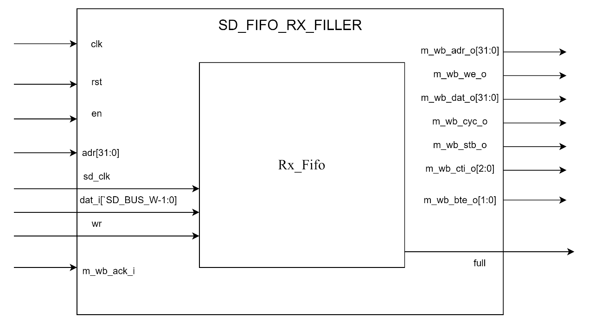
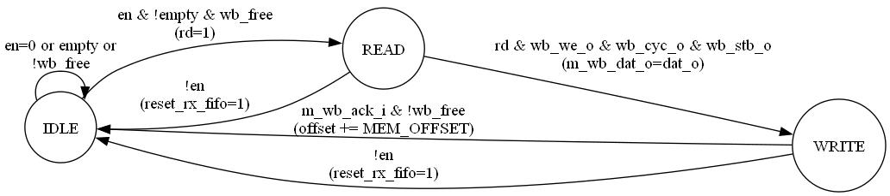

# sd_fifo_rx_filler design specification

**1. Introduction**

The `sd_fifo_rx_filler` module is a part of the SD card controller design.
It manages the reception of data from the SD card and transfers it to
the system memory via a Wishbone bus interface. This module acts as a
bridge between the SD card\'s data reception and the system\'s memory,
utilizing a FIFO buffer to manage data flow and timing differences
between the two domains.

**2. Block Diagram**

**3. Clock and Reset**

-   System Clock (clk): Main clock for the control logic and Wishbone
    interface.

-   SD Clock (sd_clk): Clock for the SD card interface, used for writing
    to the RX FIFO.

-   Reset (rst): Asynchronous reset, active high. Resets all registers
    and the RX FIFO.

**4. Interface**

| **Port Name** | **Direction** | **Width** | **Description**                              |
|---------------|---------------|-----------|----------------------------------------------|
| clk           | Input         | 1         | System clock                                 |
| rst           | Input         | 1         | System reset                                 |
| m_wb_adr_o    | Output        | 32        | Wishbone master address output               |
| m_wb_we_o     | Output        | 1         | Wishbone master write enable                 |
| m_wb_dat_o    | Output        | 32        | Wishbone master data output                  |
| m_wb_cyc_o    | Output        | 1         | Wishbone master cycle output                 |
| m_wb_stb_o    | Output        | 1         | Wishbone master strobe output                |
| m_wb_ack_i    | Input         | 1         | Wishbone master acknowledgment input         |
| m_wb_cti_o    | Output        | 3         | Wishbone master cycle type identifier output |
| m_wb_bte_o    | Output        | 2         | Wishbone master burst type extension output  |
| en            | Input         | 1         | Enable signal for the module                 |
| adr           | Input         | 32        | Base address for memory write operations     |
| sd_clk        | Input         | 1         | SD card clock                                |
| dat_i         | Input         | SD_BUS_W  | Data input from SD card interface            |
| wr            | Input         | 1         | Write enable for FIFO                        |
| full          | Output        | 1         | FIFO full flag                               |
| empty         | Output        | 1         | FIFO empty flag                              |

**5. Registers**

| **Register**  | **Width** | **Description**                          |
|---------------|-----------|------------------------------------------|
| offset        | 9         | Address offset for Wishbone transactions |
| wb_free       | 1         | Wishbone bus availability flag           |
| reset_rx_fifo | 1         | RX FIFO reset control                    |
| rd            | 1         | Read enable for RX FIFO                  |

**6.Sub-modules (sd_rx_fifo)**

**6.1 Description**

The `sd_rx_fifo` module is part of an SD card controller system and is responsible
for buffering incoming data from the SD card before it\'s read by the
host system.

**6.2 IO Port**

| **Port Name** | **Direction** | **Width** | **Description**                   |
|---------------|---------------|-----------|-----------------------------------|
| d             | Input         | 4         | Input data from SD card           |
| wr            | Input         | 1         | Write enable signal (active high) |
| wclk          | Input         | 1         | Write clock(rising edge active)   |
| q             | Output        | 32        | Output data to host               |
| rd            | Input         | 1         | Read enable signal (active high)  |
| full          | Output        | 1         | FIFO full flag (active high)      |
| empty         | Output        | 1         | FIFO empty flag (active high)     |
| mem_empt      | Output        | 2         | Memory empty space (in words)     |
| rclk          | Input         | 1         | Read clock (rising edge active)   |
| rst           | Input         | 1         | Asynchronous reset (active high)  |

**7. State Transition Diagram**

**8. Operation**

**8.1 Initialization On reset：**

-   Reset all control signals and counters

-   Reset the RX FIFO buffer

-   Set Wishbone master signals to inactive state

-   Initialize address offset to 0

**8.2 Data Reception and Transfer Process When enabled (en = 1):**

1.  FIFO Read Preparation:

    -   Stop any previous read operation (rd = 0)

    -   Release FIFO from reset state (reset_rx_fifo = 0)

2.  Read from FIFO and initiate Wishbone write transaction when:

    -   FIFO is not empty (empty != 0)

    -   Wishbone bus is free (wb_free = 1) 

    Actions include:

    -   Start reading from FIFO (rd = 1)

    -   Prepare Wishbone data output (m_wb_dat_o = dat_o)

    -   Set Wishbone write enable and control signals

    -   Mark Wishbone bus as busy (wb_free = 0)

1.  Wishbone Write Transaction Completion: When Wishbone bus is busy and
    acknowledgment is received (m_wb_ack_i = 1):

    -   Reset Wishbone control signals

    -   Update address offset (offset += MEM_OFFSET)

    -   Mark Wishbone bus as free (wb_free = 1)

**8.3 Disabled State Handling When disabled (en = 0):**

-   Reset RX FIFO

-   Stop FIFO read operation

-   Reset address offset

-   Reset all Wishbone control signals

-   Mark Wishbone bus as free

**9. Constraints**

1.  The module assumes that the Wishbone slave will eventually
    acknowledge each transaction. There\'s no timeout mechanism
    implemented for unresponsive slaves.

2.  The address increment (MEM_OFFSET) is fixed and defined externally.
    Ensure this matches the data width and memory alignment requirements
    of the system.

3.  The module doesn\'t implement error handling for Wishbone bus
    errors. Additional logic may be needed if error responses need to be
    handled.

4.  The FIFO depth is not explicitly specified in this module. Ensure
    the FIFO depth in the sd_rx_fifo module is sufficient to handle the
    timing differences between the SD card data rate and the Wishbone
    bus transfer rate.
