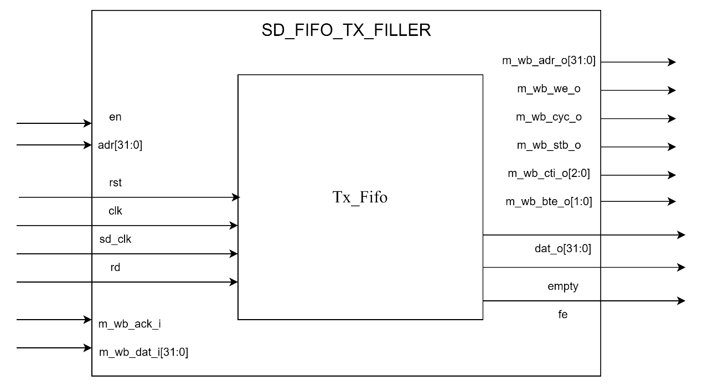
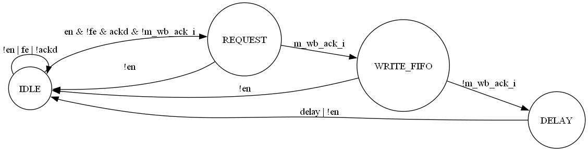

# sd_fifo_tx_filler design specification

**1. Introduction**

The `sd_fifo_tx_filler` module is a part of the SD card controller design.
Its primary function is to manage the transmission FIFO buffer for the
data stream. It acts as a DMA (Direct Memory Access) controller, reading
data from the system memory and filling the transmit FIFO buffer.

**2. Block Diagram**

**3. Clock and Reset**

-   System Clock (clk): Main clock for the control logic and Wishbone
    interface.

-   SD Clock (sd_clk): Clock for the SD card interface, used for reading
    from the TX FIFO.

-   Reset (rst): Asynchronous reset, active high. Resets all registers
    and the TX FIFO.

**4. Interface**

| **Port Name** | **Direction** | **Width** | **Description**                              |
|---------------|---------------|-----------|----------------------------------------------|
| clk           | Input         | 1         | System clock                                 |
| rst           | Input         | 1         | System reset                                 |
| m_wb_adr_o    | Output        | 32        | Wishbone master address output               |
| m_wb_we_o     | Output        | 1         | Wishbone master write enable                 |
| m_wb_dat_i    | Input         | 32        | Wishbone master data input                   |
| m_wb_cyc_o    | Output        | 1         | Wishbone master cycle output                 |
| m_wb_stb_o    | Output        | 1         | Wishbone master strobe output                |
| m_wb_ack_i    | Input         | 1         | Wishbone master acknowledgment input         |
| m_wb_cti_o    | Output        | 3         | Wishbone master cycle type identifier output |
| m_wb_bte_o    | Output        | 2         | Wishbone master burst type extension output  |
| en            | Input         | 1         | Enable signal for the module                 |
| adr           | Input         | 32        | Base address for memory read operations      |
| sd_clk        | Input         | 1         | SD card clock                                |
| dat_o         | Output        | 32        | Data output to SD card interface             |
| rd            | Input         | 1         | Read enable for FIFO                         |
| empty         | Output        | 1         | FIFO empty flag                              |
| fe            | Output        | 1         | FIFO full flag                               |

**5. Registers**

| **Register**  | **Width** | **Description**                          |
|---------------|-----------|------------------------------------------|
| offset        | 9         | Address offset for Wishbone transactions |
| we            | 9         | Write enable counter                     |
| din           | 32        | Data to be written to FIFO               |
| wr_tx         | 1         | Write control for FIFO                   |
| reset_tx_fifo | 1         | TX FIFO reset control                    |
| first         | 1         | First operation flag                     |
| ackd          | 1         | Acknowledge delay flag                   |
| delay         | 1         | Delay flag for synchronization           |

**6.Sub-modules (sd_tx_fifo)**

**6.1 Description**

The `sd_tx_fifo` module is a dual-clock domain FIFO designed to transfer
data between two potentially asynchronous clock domains. It plays a
crucial role in the SD/MMC controller design, serving as a buffer for
data transmission.

**6.2 IO Port**

| **Port Name** | **Direction** | **Width** | **Description**                  |
|---------------|---------------|-----------|----------------------------------|
| d             | Input         | 32        | Data input                       |
| wr            | Input         | 1         | Write enable (active high)       |
| wclk          | Input         | 1         | Write clock(rising edge active)  |
| q             | Output        | 32        | Data output                      |
| rd            | Input         | 1         | Read enable (active high)        |
| full          | Output        | 1         | FIFO full flag (active high)     |
| empty         | Output        | 1         | FIFO empty flag (active high)    |
| mem_empt      | Output        | 6         | FIFO occupancy                   |
| rclk          | Input         | 1         | Read clock(rising edge active)   |
| rst           | Input         | 1         | Asynchronous reset (active high) |

**7. State Transition Diagram**

**8. Operation**

**8.1 Initialization**

On reset:

-   Reset all control signals and counters

-   Reset the FIFO buffer

-   Set Wishbone master signals to inactive state

-   Initialize address offset to 0

**8.2 Data Transfer Process**

When enabled (en = 1):

1.  Start a Wishbone read transaction if:

    -   FIFO is not full (fe = 0)

    -   No ongoing Wishbone transaction (m_wb_ack_i = 0)

    -   Previous transaction is acknowledged (ackd = 1)

2.  When Wishbone acknowledges (m_wb_ack_i = 1):

    -   Write data to FIFO (wr_tx = 1, din = m_wb_dat_i)

    -   Deassert Wishbone signals

    -   Set delay flag for timing purposes

3.  On the next clock cycle (delay = 1):

    -   Increment memory address offset.(offset += MEM_OFFSET)

    -   Toggle acknowledge flag (ackd)

    -   Stop writing to FIFO (wr_tx = 0)

**8.3 Disabled State Handling**

When disabled (en = 0):

-   Reset TX FIFO (reset_tx_fifo = 1)

-   Reset address offset to 0

-   Set Wishbone control signals to inactive state (m_wb_cyc_o = 0,
    m_wb_stb_o = 0, m_wb_we_o = 0)

**9. Constraints and Limitations**

-   The module assumes a 32-bit Wishbone data bus.

-   The FIFO depth is not explicitly specified in this module and
    depends on the sd_tx_fifo implementation.
