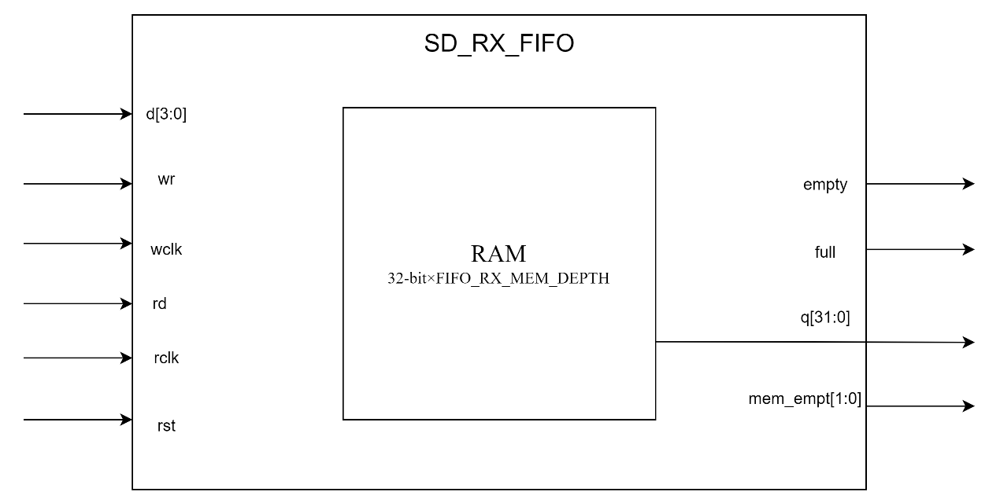
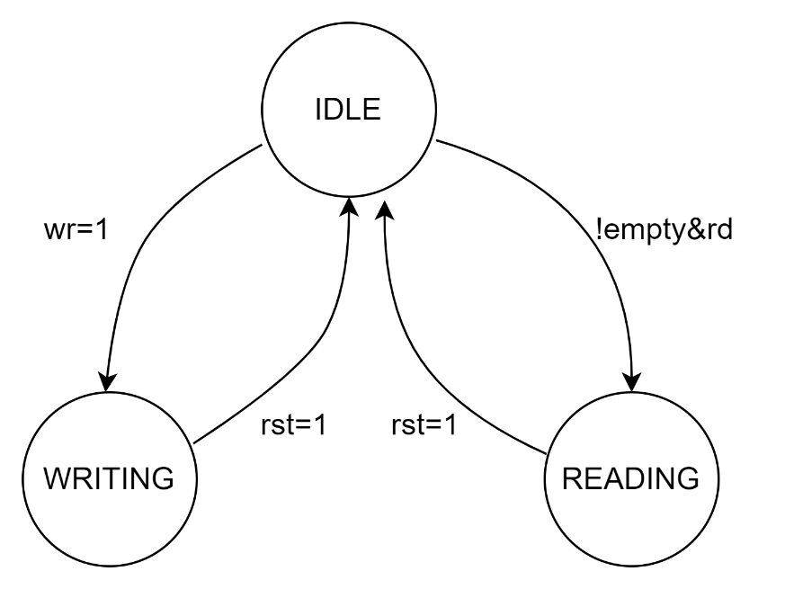

# sd_rx_fifo design specification

**1. Introduction**

This document describes the design of the `sd_rx_fifo` module. The module is part of an SD card controller system and is responsible for buffering incoming data from the SD card before it's read by the host system.

**2. Block Diagram**

**3.Clock and Reset**

-   Write Clock (wclk): Used for write operations and write pointer management
-   Read Clock (rclk): Used for read operations and read pointer management
-   Reset (rst): Asynchronous active-high reset

**4. Interface**

| **Signal Name** | **Direction** | **Width** | **Description**                   |
|-----------------|---------------|-----------|-----------------------------------|
| d               | Input         | 4         | Input data from SD card           |
| wr              | Input         | 1         | Write enable signal (active high) |
| wclk            | Input         | 1         | Write clock(rising edge active)   |
| q               | Output        | 32        | Output data to host               |
| rd              | Input         | 1         | Read enable signal (active high)  |
| full            | Output        | 1         | FIFO full flag (active high)      |
| empty           | Output        | 1         | FIFO empty flag (active high)     |
| mem_empt        | Output        | 2         | Memory empty space (in words)     |
| rclk            | Input         | 1         | Read clock (rising edge active)   |
| rst             | Input         | 1         | Asynchronous reset (active high)  |

**5. Registers**

| **Register** | **Width**                | **Description**                                                                 |
|--------------|--------------------------|---------------------------------------------------------------------------------|
| ram          | 32bit\*FIFO_RX_MEM_DEPTH | FIFO storage array                                                              |
| adr_i        | FIFO_RX_MEM_ADR_SIZE     | Write address                                                                   |
| adr_o        | FIFO_RX_MEM_ADR_SIZE     | Read address                                                                    |
| we           | 8                        | Byte-wise write enable. Used to indicate which bytes can be written to the RAM. |
| tmp          | 32                       | Temporary storage                                                               |
| ft           | 1                        | Data written flag                                                               |

**6. State Transition Diagram**

**7. Operation**

**7.1 Write Operation**

1.  4-bit data is written when wr is high on the rising edge of wclk.
2.  Data is accumulated in the tmp register.
3.  When a full 32-bit word is accumulated, it is written to the RAM.
4.  The write address (adr_i) is incremented.

**7.2 Read Operation**

1.  32-bit data is read from the RAM when rd is high and the FIFO is not empty.
2.  Data is presented on the q output.
3.  The read address (adr_o) is incremented.

**7.3 Full and Empty Flags**

-   Full Flag: Asserted when the write address catches up with the read address.
-   Empty Flag: Asserted when the read address catches up with the write address.

**8. Corner Cases**

**8.1 Reset**

-   Verify that both read pointer (adr_o) and write pointer (adr_i) are reset to 0.
-   Ensure that the FIFO is empty (empty signal is high) after reset.
-   Check that the full signal is low after reset.
-   Verify that the we register is correctly initialized to 8'h1.
-   Confirm that the tmp register is cleared to zero and the ft flag is set to 0.

**8.2 FIFO Full**

-   Continue writing until the FIFO is full, verify that the full signal is correctly asserted.
-   Writing after FIFO is full is undefined.

**8.3 FIFO Empty**

-   When the FIFO is empty, attempt to read data:
    -   Ensure that the read operation does not change the FIFO's state (empty signal should remain high).
    -   Verify that the read address (adr_o) is not updated.
    -   Check that the output q returns the data from the RAM location corresponding to the last read address (adr_o).
-   Ensure that the empty signal is correctly maintained when the FIFO is empty.

**8.4 Pointer Wrap-around**

-   For the write pointer (adr_i):
    -   Fill the FIFO, then read out some data.
    -   Continue writing until adr_i reaches the end of memory (FIFO_RX_MEM_DEPTH-1).
    -   Verify that on the next write, adr_i correctly wraps around to 0 and the high bit flips.
-   For the read pointer (adr_o):
    -   Fill the FIFO, then read data until adr_o reaches the end of memory.
    -   Verify that on the next read, adr_o correctly wraps around to 0 and the high bit flips.
-   Ensure that the FIFO's full/empty state determination remains correct after pointer wrap-around.

**9. Constraints**

The module assumes that the read clock domain can keep up with the write clock domain to prevent data overflow.
