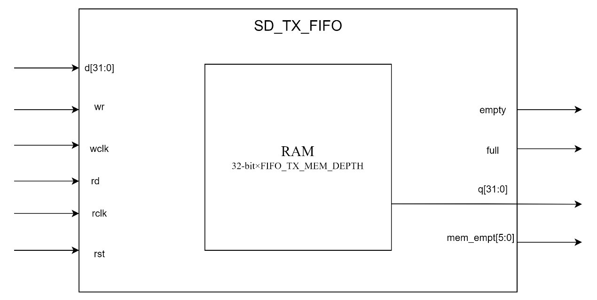
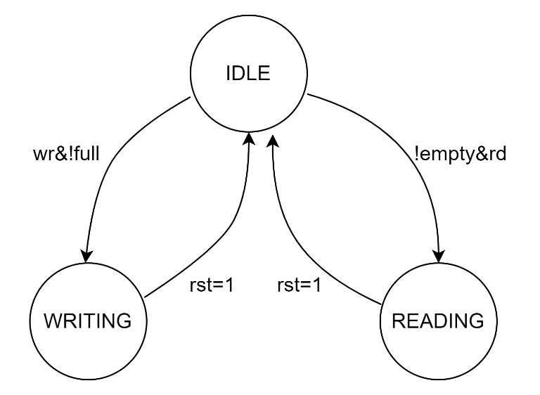

# sd_tx_fifo design specification

**1. Introduction**

The `sd_tx_fifo` module is a dual-clock domain FIFO designed to transfer data between two potentially asynchronous clock domains. It plays a crucial role in the SD/MMC controller design, serving as a buffer for data transmission. This document provides a detailed description of the module's functionality, interfaces, and implementation details.

**2. Block Diagram**

**3. Clock and Reset**

-   Write Clock (wclk): Used for write operations and write pointer management
-   Read Clock (rclk): Used for read operations and read pointer management
-   Reset (rst): Asynchronous active-high reset

**4. Interface**

| **Signal** | **Direction** | **Width** | **Description**                  |
|------------|---------------|-----------|----------------------------------|
| d          | Input         | 32        | Data input                       |
| wr         | Input         | 1         | Write enable (active high)       |
| wclk       | Input         | 1         | Write clock(rising edge active)  |
| q          | Output        | 32        | Data output                      |
| rd         | Input         | 1         | Read enable (active high)        |
| full       | Output        | 1         | FIFO full flag (active high)     |
| empty      | Output        | 1         | FIFO empty flag (active high)    |
| mem_empt   | Output        | 6         | FIFO occupancy                   |
| rclk       | Input         | 1         | Read clock(rising edge active)   |
| rst        | Input         | 1         | Asynchronous reset (active high) |

**5. Registers**

| **Register** | **Width**                | **Description**    |
|--------------|--------------------------|--------------------|
| ram          | 32bit\*FIFO_TX_MEM_DEPTH | FIFO storage array |
| adr_i        | FIFO_RX_MEM_ADR_SIZE     | Write address      |
| adr_o        | FIFO_RX_MEM_ADR_SIZE     | Read address       |

**6. State Transition Diagram**

**7. Operation Process**

The FIFO operation process can be divided into the following main parts:

**7.1 Write Operation**

1.  Write Enable Check:
    -   The system checks the write enable signal and the FIFO's full status.
    -   Write operation is allowed only when the FIFO is not full and the write enable is active.
2.  Data Writing:
    -   When write conditions are met, data is written to the RAM location pointed to by the current write pointer.

**7.2 Write Address Management**

1.  Write Address Increment:
    -   After each successful write, the write address pointer is automatically incremented.
2.  Write Address Wrap-around:
    -   When the write address pointer reaches the maximum value of the FIFO depth, it wraps around to the starting position.
    -   This process is handled by specific logic to ensure correct circular writing.

**7.3 Read Operation**

1.  Read Enable Check:
    -   The system checks the read enable signal and the FIFO's empty status.
    -   Read operation is allowed only when the FIFO is not empty and the read enable is active.
2.  Data Reading:
    -   When read conditions are met, data is read from the RAM location pointed to by the current read pointer.
3.  Read Address Management:
    -   The read address pointer increment and wrap-around logic is similar to the write address, but operates independently in the read clock domain.

**7.4 Status Update**

1.  FIFO Full Status Update:
    -   The FIFO full status is determined by comparing the positions of read and write pointers.
    -   Specific logic is used to accurately determine the full status, considering pointer wrap-around situations.
2.  FIFO Empty Status Update:
    -   The FIFO is considered empty when the read and write pointers are equal.
3.  FIFO Occupancy Update:
    -   The FIFO occupancy(mem_empt) is determined by the relative positions of the write and read pointers(adr_i - adr_o).
    -   The system continuously calculates and updates this value to reflect the current usage status of the FIFO.
4.  Clock Domain Crossing Considerations:
    -   Write operations and write address management occur in the write clock domain.
    -   Read operations and read address management occur in the read clock domain.
    -   Full and empty signals are generated by comparing read and write pointers, implementing cross-clock domain status synchronization.

**8. Corner Cases**

**8.1 Reset**

-   Verify that both read pointer (adr_o) and write pointer (adr_i) are reset to 0.
-   Ensure that the FIFO is empty (empty signal is high) after reset.
-   Check that the full signal is low after reset.
-   Verify that the mem_empt signal correctly indicates an empty FIFO.

**8.2 FIFO Full**

-   Continue writing until the FIFO is full, verify that the full signal is correctly asserted.
-   When the FIFO is full, attempt to write more data:
    -   Ensure that new write requests do not result in any writes to the RAM.
    -   Verify that existing data in the FIFO is not overwritten.
    -   Confirm that new data is effectively discarded.
-   Check that adr_i does not continue to increment when the FIFO is full.
-   Verify that the mem_empt signal correctly indicates a full FIFO.

**8.3 FIFO Empty**

-   When the FIFO is empty, attempt to read data:
    -   Ensure that the read operation does not change the FIFO's state (empty signal should remain high).
    -   Verify that the read address (adr_o) is not updated.
    -   Check that the output q returns the data from the RAM location corresponding to the last read address (adr_o).
-   Ensure that the empty signal is correctly maintained when the FIFO is empty.
-   Verify that the mem_empt signal correctly indicates an empty FIFO.

**8.4 Pointer Wrap-around**

-   For the write pointer (adr_i):
    -   Fill the FIFO, then read out some data.
    -   Continue writing until adr_i reaches the end of memory (FIFO_TX_MEM_DEPTH-1).
    -   Verify that on the next write, adr_i correctly wraps around to 0 and the high bit flips.
-   For the read pointer (adr_o):
    -   Fill the FIFO, then read data until adr_o reaches the end of memory.
    -   Verify that on the next read, adr_o correctly wraps around to 0 and the high bit flips.
-   Ensure that the FIFO's full/empty state determination remains correct after pointer wrap-around.
-   Verify that the mem_empt signal correctly reflects the FIFO occupancy during and after pointer wrap-around.

**9. Constraints**

1.  The write clock (wclk) and read clock (rclk) can be asynchronous to each other.
2.  The reset signal (rst) is asynchronous and active-high.
