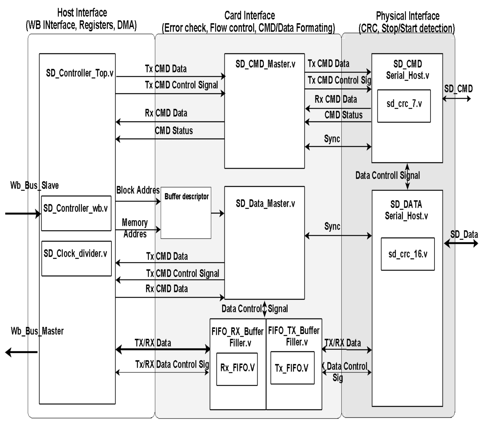

# sdc_controller design specification

## Introduction

This module is the interface between the SDC Core and the bus . Two WB interfaces (slave and master) are used for this. The internal registers and buffer descriptors (BD) are all accessed through the same WB Slave Interface. The master interface is used for the internal DMA to fetch and store data to and from an external memory. The module contains the setting and status register accessible by user from the WB slave, and the required logic to access this.

## Interface

### Wishbone

#### IO Ports

| Direction | Width | Name        | Description                          |
| --------- | ----- | ----------- | ------------------------------------ |
| Input     | 1     | wb_clk_i    | Slave WISHBONE Clock Input           |
| Input     | 1     | wb_rst_i    | Slave WISHBONE Reset Input           |
| Input     | 4     | wb_sel_i    | Slave WISHBONE Select Inputs         |
| Input     | 32    | wb_dat_i    | Slave WISHBONE Data Inputs           |
| Output    | 32    | wb_dat_o    | Slave WISHBONE Data Output           |
| Input     | 8     | wb_adr_i    | Slave WISHBONE Address Input         |
| Input     | 1     | wb_we_i     | Slave WISHBONE Write Enable          |
| Input     | 1     | wb_cyc_i    | Slave WISHBONE Cycle                 |
| Input     | 1     | wb_stb_i    | Slave WISHBONE Strobe                |
| Output    | 1     | wb_ack_o    | Slave WISHBONE Acknowledgment        |
| Output    | 32    | m_wb_adr_o  | Master WISHBONE Address Output       |
| Output    | 1     | m_wb_sel_o  | Master WISHBONE Select               |
| Output    | 1     | m_wb_we_o   | Master WISHBONE Write Enable         |
| Output    | 32    | m_wb_dat_o  | Master WISHBONE Data Output          |
| Input     | 31    | m_wb_dat_i  | Master WISHBONE Data Input           |
| Output    | 1     | m_wb_cyc_o  | Master WISHBONE Cycle                |
| Output    | 1     | m_wb_stb_o  | Master WISHBONE Strobe               |
| Input     | 1     | m_wb_ack_i  | Master WISHBONE Acknowledgment Input |
| Output    | 1     | m_wb_cti_o  | Master WISHBONE Cti                  |
| Output    | 1     | m_wb_bte_o  | Master WISHBONE Bte                  |
| Input     | 1     | card_detect | Card detect                          |

### SDC IO

#### IO Ports

| Direction | Width | Name         | Description                |
| --------- | ----- | ------------ | -------------------------- |
| Input     | 1     | sd_cmd_dat_i | SDC/MMC CMD Input          |
| Output    | 1     | sd_cmd_out_o | SDC/MMC CMD Output         |
| Output    | 1     | sd_cmd_oe_o  | SDC/MMC CMD Output enable  |
| Input     | 4     | sd_dat_dat_i | SDC/MMC Data Input         |
| Output    | 4     | sd_dat_out_o | SDC/MMC Data Output        |
| Output    | 1     | sd_dat_oe_o  | SDC/MMC Data Output enable |
| Output    | 1     | sd_clk_o_pad | SDC/MMC CLK Output         |
| Input     | 1     | sd_clk_i_pad | SDCLK input, connected to `sd_clk_i` when `SDC_CLK_SEP` is defined
| Output    | 1     | int_a        | Additional Interrupt A, Triggers when any bit in both `normal_int_status_reg` and `normal_int_signal_enable_reg` is set.                |
| Output    | 1     | int_b        | Additional Interrupt B, Triggers when any bit in both `error_int_status_reg` and `error_int_signal_enable_reg` is set.                |
| Output    | 1     | int_c        | Additional Interrupt C, Triggers when any bit in both `Bd_isr_reg` and `Bd_isr_enable_reg` is set.                |

### Optional IO

#### IO Ports

| Direction | Name         | Condition      | Description                   |
| --------- | ------------ | -------------- | ----------------------------- |
| Input     | sd_clk_i_pad | SDC_CLK_SEP    | An alternative for `wb_clk_i` |
| Output    | int_a        | SDC_IRQ_ENABLE | an extra Interrupt pin        |
| Output    | int_b        | SDC_IRQ_ENABLE | an extra Interrupt pin        |
| Output    | int_c        | SDC_IRQ_ENABLE | an extra Interrupt pin        |

## 3 Architecture

### 3.1 System Overview

### 3.2 Module Breakdown

The sdc_controller module includes the following sub-modules:

- sd_controller_wb
- sd_cmd_master
- sd_data_master
- sd_cmd_serial_host
- tx_bd: an instantiation of the sd_bd module.
- rx_bd: an instantiation of the sd_bd module.
- sd_fifo_tx_filler
- sd_fifo_rx_filler

Here are their introductions and IO interface definitions, respectively:

#### sd_controller_wb

##### Description

WISHBONE is a simple, open-source hardware bus architecture used in digital circuits. It connects different components like processors and memory, allowing them to communicate. This interface should adhere to wishbone specification, detailed in WISHBONE SoC Architecture Specification, Revision B.3.

The host uses this module to assign values to configuration registers to configure the SD card and reads some register values to obtain the SD card's operational status.

##### IO Ports

| Port Type |     Width     | Name                         | Description                             |
| :-------: | :-----------: | :--------------------------- | :-------------------------------------- |
|   Input   |       1       | wb_clk_i                     | Slave WISHBONE Clock Input              |
|   Input   |       1       | wb_rst_i                     | Slave WISHBONE Reset Input              |
|   Input   |      32       | wb_dat_i                     | Slave WISHBONE Data Inputs              |
|  Output   |      32       | wb_dat_o                     | Slave WISHBONE Data Outputs             |
|   Input   |       8       | wb_adr_i                     | Slave WISHBONE Address Input            |
|   Input   |       4       | wb_sel_i                     | Slave WISHBONE Select Input             |
|   Input   |       1       | wb_we_i                      | Slave WISHBONE Write Enable             |
|   Input   |       1       | wb_cyc_i                     | Slave WISHBONE Cycle                    |
|   Input   |       1       | wb_stb_i                     | Slave WISHBONE Strobe                   |
|  Output   |       1       | wb_ack_o                     | Slave WISHBONE Acknowledge              |
|  Output   |       1       | we_m_tx_bd                   | Write enable TIx BD                     |
|  Output   |       1       | we_m_rx_bd                   | Write enable Rx BD                      |
|  Output   |       1       | new_cmd                      |                                         |
|  Output   |       1       | we_ack                       | Ack on cmd access request               |
|  Output   |       1       | int_ack                      | Internal De                             |
|  Output   |       1       | cmd_int_busy                 | Cmd busy by data module                 |
|  Output   |       1       | int_busy                     | Command Busy by data module             |
|   Input   |       1       | write_req_s                  | Cmd access request                      |
|   Input   |      16       | cmd_set_s                    | Command setting input from data master  |
|   Input   |      32       | cmd_arg_s                    | Command argument input from data master |
|  Output   |      32       | argument_reg                 | Comand Argument Reg                     |
|  Output   |      16       | cmd_setting_reg              | Command Setting Reg                     |
|   Input   |      16       | status_reg                   | Card Status Reg                         |
|   Input   |      32       | cmd_resp_1                   | Command Response                        |
|  Output   |       8       | software_reset_reg           | Software reset Reg                      |
|  Output   |      16       | time_out_reg                 | Timeout Reg                             |
|   Input   |      16       | normal_int_status_reg        | Normal Interrupt Status Reg             |
|   Input   |      16       | error_int_status_reg         | Error Interrupt Status Reg              |
|  Output   |      16       | normal_int_signal_enable_reg | Normal Interrupt Enable Reg             |
|  Output   |      16       | error_int_signal_enable_reg  | Error Interrupt Enable Reg              |
|  Output   |       8       | clock_divider                | Clock Divider Reg                       |
|   input   |      16       | Bd_Status_reg                | BD Status Reg                           |
|   input   |       8       | Bd_isr_reg                   | Data Interrupt Status Reg               |
|  output   |       8       | Bd_isr_enable_reg            | Data Interrupt Enable Reg               |
|  Output   |       1       | bd_isr_reset                 | Reset data interrupt status             |
|  Output   |       1       | normal_isr_reset             | Reset normal interrupt status           |
|  Output   |       1       | error_isr_reset              | Reset error interrupt status            |
|  Output   | RAM_MEM_WIDTH | dat_in_m_tx_bd               | Data going to the Tx BD                 |
|  Output   | RAM_MEM_WIDTH | dat_in_m_rx_bd               | Data going to the RX BD                 |

#### sd_clock_divider

##### Description

The module is a converter between the system clock and the clock required by the SD card-related modules. Divide the input clock with 2 4 6 etc..

The module perform the following actions.

- Divide the input clock signal based on the DIVIDER value and output it

##### IO Ports

| Direction | Width | name    | Description               |
| --------- | ----- | ------- | ------------------------- |
| input     | 1     | CLK     | CLK in                    |
| input     | 8     | DIVIDER | Division ratio            |
| input     | 1     | RST     | Asynchronous reset signal |
| output    | 1     | SD_CLK  | CLK out                   |

#### sd_cmd_master

##### Description

The SD CMD Master module synchronize the communication from the host interface with the physical interface . perform has three main tasks:

- Read a set of register from the user accessible register in the SD Controller Top to compose a 40 bit command messages to pass to the SD CMD 

- Read response messages from the SD CMD Host and forward it to the user accessible register in the SD Controller Top module. 

- Keep track of the status of the CMD Host module. 

##### IO Ports

| Direction | Width | Name             | Description                                    |
| --------- | ----- | ---------------- | ---------------------------------------------- |
| Input     | 1     | `CLK_PAD_IO`     | Clock input                                    |
| Input     | 1     | `RST_PAD_I`      | Asynchronous reset, active high                |
| Input     | 1     | `New_CMD`        | Signal indicating a new command is available   |
| Input     | 1     | `data_write`     | Indicates a block write command                |
| Input     | 1     | `data_read`      | Indicates a block read command                 |
| Input     | 32    | `ARG_REG`        | Command argument register                      |
| Input     | 14    | `CMD_SET_REG`    | Command settings register                      |
| Input     | 16    | `TIMEOUT_REG`    | Timeout configuration register                 |
| Output    | 16    | `STATUS_REG`     | Status register                                |
| Output    | 32    | `RESP_1_REG`     | Response register                              |
| Output    | 5     | `ERR_INT_REG`    | Error interrupt register                       |
| Output    | 16    | `NORMAL_INT_REG` | Normal interrupt register                      |
| Input     | 1     | `ERR_INT_RST`    | Error interrupt reset signal                   |
| Input     | 1     | `NORMAL_INT_RST` | Normal interrupt reset signal                  |
| Output    | 16    | `settings`       | Command settings output                        |
| Output    | 1     | `go_idle_o`      | Signal to reset the module to idle state       |
| Output    | 40    | `cmd_out`        | Command output to SD/MMC card                  |
| Output    | 1     | `req_out`        | Request signal for service                     |
| Output    | 1     | `ack_out`        | Acknowledge signal for service completion      |
| Input     | 1     | `req_in`         | Request input signal from serial interface     |
| Input     | 1     | `ack_in`         | Acknowledge input signal from serial interface |
| Input     | 40    | `cmd_in`         | Command input from SD/MMC card                 |
| Input     | 8     | `serial_status`  | Serial status input                            |
| Input     | 1     | `card_detect`    | SD card presence detection signal              |

#### sd_cmd_serial_host

##### Description

This module is the interface towards physical SD/MMC cards command pin. This module takes care of the physical sending and receiving of the messages, adding start bits, stop bits and CRC checksum. 

##### IO Ports

| Direction | **Name**     | **Width** | **Description**                                |
| ------------ | --------- | ---------------------------------------------- | ---------------------------------------------- |
| Input | `SD_CLK_IN`  | 1         | Clock signal for SD interface synchronization. |
| Input | `RST_IN`     | 1         | Synchronous reset signal (active high).        |
| Input | `SETTING_IN` | 16        | Settings for the current command.              |
| Input | `CMD_IN`     | 40        | Command to be sent to the SD/MMC card.         |
| Input | `REQ_IN`     | 1         | Request signal for service initiation.         |
| Input | `ACK_IN`     | 1         | Acknowledgment signal for service completion.  |
| Input | `cmd_dat_i`  | 1         | Command data input from the SD/MMC card.       |
| Output | `CMD_OUT`   | 40        | Command output to be sent to the SD/MMC card.        |
| Output | `ACK_OUT`   | 1         | Acknowledgment signal for service completion.        |
| Output | `REQ_OUT`   | 1         | Request signal to initiate service.                  |
| Output | `STATUS`    | 8         | Status register indicating module state and flags.   |
| Output | `cmd_oe_o`  | 1         | Tri-state control for CMD output enable.             |
| Output | `cmd_out_o` | 1         | Command output enable signal to SD/MMC card.         |
| Output | `st_dat_t`  | 2         | Start data transfer signal indicating transfer type. |

#### sd_data_master

##### Description

Starts to check if there are any new BD thats need to be processed if so the module generate a command and set up the DMA to read/write to correct address. If the command line is free the module send the command and wait fore response. If response is valid the module starts the DMA if not valid the CMD is resent again. 

During transmission the module keep track for FIFO buffet underflow or overflows, when the transmission is completed it check for valid CRC. If anything goes wrong during a transmission a stop command is sent and the module try to restart the transmission n times before giving up.

##### IO Ports

| Direction  | Name            | Width                        | Description                                                      |
|-----------------|------------------------------|------------------------------------------------------------------|------------------------------------------------------------------|
| Input      | `clk`           | 1 bit                        | System clock signal                                              |
| Input      | `rst`           | 1 bit                        | Reset signal (active high)                                       |
| Input | `dat_in_tx`     | `RAM_MEM_WIDTH-1:0`          | Data input for the transmission (Tx) buffer                      |
| Input | `free_tx_bd`    | `BD_WIDTH-1:0`               | Free buffer descriptor count for Tx                              |
| Input | `ack_i_s_tx`    | 1 bit                        | Acknowledge signal for Tx buffer                                 |
| Input | `dat_in_rx`     | `RAM_MEM_WIDTH-1:0`          | Data input for the reception (Rx) buffer                         |
| Input | `free_rx_bd`    | `BD_WIDTH-1:0`               | Free buffer descriptor count for Rx                              |
| Input | `ack_i_s_rx`    | 1 bit                        | Acknowledge signal for Rx buffer                                 |
| Input | `cmd_busy`      | 1 bit                        | Command busy signal (indicates ongoing command execution)        |
| Input   | `we_ack`        | 1 bit                        | Acknowledge signal for write enable                              |
| Input | `cmd_tsf_err`   | 1 bit                        | Command transfer error signal                                    |
| Input | `card_status`   | 5 bits                       | Status of the SD card                                            |
| Input  | `tx_empt`       | 1 bit                        | Indicates if the Tx FIFO is empty                                |
| Input  | `tx_full`       | 1 bit                        | Indicates if the Tx FIFO is full                                 |
| Input  | `rx_full`       | 1 bit                        | Indicates if the Rx FIFO is full                                 |
| Input   | `busy_n`        | 1 bit                        | Busy signal for the SD card data lines                           |
| Input | `transm_complete` | 1 bit                      | Indicates completion of data transmission                        |
| Input   | `crc_ok`        | 1 bit                        | Indicates CRC check success                                      |
| Input | `Dat_Int_Status_rst` | 1 bit                    | Resets the `Dat_Int_Status` register                             |
| Input | `transfer_type` | 2 bits                       | Indicates the type of data transfer (single block, multiple block, etc.) |
| Output    | `re_s_tx`          | 1 bit           | Read enable signal for Tx buffer                                 |
| Output   | `a_cmp_tx`         | 1 bit           | Tx buffer completion signal                                      |
| Output    | `re_s_rx`          | 1 bit           | Read enable signal for Rx buffer                                 |
| Output   | `a_cmp_rx`         | 1 bit           | Rx buffer completion signal                                      |
| Output     | `we_req`           | 1 bit           | Write enable request signal to SD-Host register                  |
| Output    | `d_write`          | 1 bit           | Data write control signal                                        |
| Output     | `d_read`           | 1 bit           | Data read control signal                                         |
| Output    | `cmd_arg`          | 32 bits         | Command argument sent to SD-Host                                 |
| Output    | `cmd_set`          | 16 bits         | Command setup value sent to SD-Host                              |
| Output | `start_tx_fifo`    | 1 bit           | Start signal for Tx FIFO operation                               |
| Output | `start_rx_fifo`    | 1 bit           | Start signal for Rx FIFO operation                               |
| Output    | `sys_adr`          | 32 bits         | System address for memory access during data transfers           |
| Output | `ack_transfer`     | 1 bit           | Acknowledge signal for the completion of a data transfer         |
| Output | `Dat_Int_Status`   | 8 bits          | Data interrupt status register output                            |
| Output      | `CIDAT`            | 1 bit           | CRC Interrupt Data status output                                 |

#### sd_data_serial_host

##### Description

This module is the interface towards physical SD card device Data port. The interface consist of only 5 signals, one clock SDCLK, and the 1-4 bit bi-direction Data signal DAT. 

The module perform the following actions. 

• Synchronized request for write and read data and . 

• Adding a CRC-16 checksum on sent data and check for correct CRC-16 on received commands. 

##### IO Ports

| Direction | **Name**     | **Width** | **Description**                                |
| ------------ | --------- | ---------------------------------------------- | ---------------------------------------------- |
| Input | `sd_clk`     | 1         | Clock signal for synchronization.              |
| Input   | `rst`        | 1         | Reset signal to initialize the module.         |
| Input | `data_in`    | 32        | 32-bit input data to transmit.                 |
| Input | `start_dat`  | 2         | 2-bit input indicating whether the host should start transmitting (`2'b01`), receiving (`2'b10`), or do nothing (`2'b00`).        |
|Input|`ack_transfer`| 1         | Acknowledge signal for data transfer.          |
| Input | `DAT_dat_i`  | SD_BUS_W  | SD card data input.                            |
| Output   | `rd`         | 1         | Indicates if the read operation is occurring (active during Tx). |
| Output | `data_out`   | SD_BUS_W | Data output during receiving (Rx).        |
| Output   | `we`         | 1         | Write enable signal for received data.             |
| Output | `DAT_oe_o`   | 1         | Output enable for the data lines during transmission.         |
| Output | `DAT_dat_o`  | SD_BUS_W  | Data to be sent to the SD card.         |
| Output | `busy_n`     | 1         | Signal indicating that the module is busy during transmission or reception.  |
| Output | `transm_complete`  | 1         | Indicates the completion of the transmission.       |
| Output | `crc_ok`     | 1         | Indicates whether the CRC (Cyclic Redundancy Check) is correct.       |

#### rx_bd/tx_bd

##### Description

The reception and transmission processes is based on the descriptor. Two sequential wrings to this module is required to create one buffer descriptor. First the source address (Memory location) of the data is written then the card block address is written.

##### IO Ports

| **Port Name** | **Direction** | **Width**     | **Description**                           |
|---------------|---------------|---------------|-------------------------------------------|
| clk           | Input         | 1             | System clock                              |
| rst           | Input         | 1             | Asynchronous reset, active high           |
| we_m          | Input         | 1             | Write enable signal                       |
| dat_in_m      | Input         | RAM_MEM_WIDTH | Input data for writing BD                 |
| free_bd       | Output        | BD_WIDTH      | Number of free buffer descriptors         |
| re_s          | Input         | 1             | Read enable signal                        |
| ack_o_s       | Output        | 1             | Read operation acknowledgment             |
| a_cmp         | Input         | 1             | Compare signal for updating buffer status |
| dat_out_s     | Output        | RAM_MEM_WIDTH | Output data from reading BD               |

#### sd_fifo_tx_filler

##### Description

The SD TX FIFO module is a dual-clock domain FIFO designed to transfer data between two potentially asynchronous clock domains. It plays a crucial role in the SD/MMC controller design, serving as a buffer for data transmission. This document provides a detailed description of the module's functionality, interfaces, and implementation details.

##### IO Ports

| **Port Name** | **Direction** | **Width** | **Description**                              |
|---------------|---------------|-----------|----------------------------------------------|
| clk           | Input         | 1         | System clock                                 |
| rst           | Input         | 1         | System reset                                 |
| m_wb_adr_o    | Output        | 32        | Wishbone master address output               |
| m_wb_we_o     | Output        | 1         | Wishbone master write enable                 |
| m_wb_dat_i    | Input         | 32        | Wishbone master data input                   |
| m_wb_cyc_o    | Output        | 1         | Wishbone master cycle output                 |
| m_wb_stb_o    | Output        | 1         | Wishbone master strobe output                |
| m_wb_ack_i    | Input         | 1         | Wishbone master acknowledgment input         |
| m_wb_cti_o    | Output        | 3         | Wishbone master cycle type identifier output |
| m_wb_bte_o    | Output        | 2         | Wishbone master burst type extension output  |
| en            | Input         | 1         | Enable signal for the module                 |
| adr           | Input         | 32        | Base address for memory read operations      |
| sd_clk        | Input         | 1         | SD card clock                                |
| dat_o         | Output        | 32        | Data output to SD card interface             |
| rd            | Input         | 1         | Read enable for FIFO                         |
| empty         | Output        | 1         | FIFO empty flag                              |
| fe            | Output        | 1         | FIFO full flag                               |

#### sd_fifo_rx_filler

##### Description

This document describes the design of the SD Card Receive FIFO (sd_rx_fifo) module. The module is part of an SD card controller system and is responsible for buffering incoming data from the SD card before it's read by the host system.

##### IO Ports

| **Port Name** | **Direction** | **Width** | **Description**                              |
|---------------|---------------|-----------|----------------------------------------------|
| clk           | Input         | 1         | System clock                                 |
| rst           | Input         | 1         | System reset                                 |
| m_wb_adr_o    | Output        | 32        | Wishbone master address output               |
| m_wb_we_o     | Output        | 1         | Wishbone master write enable                 |
| m_wb_dat_o    | Output        | 32        | Wishbone master data output                  |
| m_wb_cyc_o    | Output        | 1         | Wishbone master cycle output                 |
| m_wb_stb_o    | Output        | 1         | Wishbone master strobe output                |
| m_wb_ack_i    | Input         | 1         | Wishbone master acknowledgment input         |
| m_wb_cti_o    | Output        | 3         | Wishbone master cycle type identifier output |
| m_wb_bte_o    | Output        | 2         | Wishbone master burst type extension output  |
| en            | Input         | 1         | Enable signal for the module                 |
| adr           | Input         | 32        | Base address for memory write operations     |
| sd_clk        | Input         | 1         | SD card clock                                |
| dat_i         | Input         | SD_BUS_W  | Data input from SD card interface            |
| wr            | Input         | 1         | Write enable for FIFO                        |
| full          | Output        | 1         | FIFO full flag                               |

## Operation

### Function Description

The host interface connects the IP Core to the rest of the system (RISC,memory) via the WISHBONE bus. The WISHBONE serves to access the configuration registers and the memory. Currently, only DMA transfers are supported for transferring the data from/to the memory.

#### Reseting the core

The RST_I signal is used for resetting all modules. This can also be done by setting the SRST bit in the Software reset register to 1 .

#### Setting up the core

1. Reset the core
2. Set the timeout register
3. Assert Sofrware reset

#### Sending command

The sending of a command to the SDC/MMC card is performed in two step. 

1. First the command index and transmission settings for the command to be sent is written into the Command setting Register. 
2. Next the commands argument bits of the command is be written to the argument register, which then initiate the transfer.
3. Upon response bit 0 in the Normal interrupt status register is set to 1 and the response is available in response register. If any of the requested error check fails will this be visible in the Error interrupt status register. 

#### Buffer descriptors

The transmission and the reception processes are based on the descriptors. The Transmit Descriptors (Tx) are used for transmission while the Receive Descriptors (Rx) are used for reception. The buffer descriptors are 64 bits long. The first 32 bits contain the pointer to the associated buffer (where data is stored) while the last 32 bits contain the card block address to read or write from. The core has a internal ram that can store up to 255 Tx and Rx BD. 

#### Data block transmission

To transmit a block of data, the RISC has to perform several steps. First make sure the card is initiated correctly and is ready for data with the block size of 512 byte with all 4 data bits enabled. If interrupt is used, those associated with the command line should be disabled to not receive unnecessary interrupts when the data module use the CMD line. Enabling interrupts generated by the data module should instead be activated. 

Then it has to check the BD status register to see if there are any free BD. If so it store what to be sent in the memory after that it writes the start address of the stored data to the the TX Buffer descriptor register and the destination block address.  

The core continuously reads the first BD, where it reads the pointer to the memory storing the associated data and starts then reading data to the internal FIFO. At the end of the transmission, the transmit status is written to the data interrupt status register and interrupt might be generated (when enabled). The next descriptor is then loaded if more is qued up, and the process starts all over again. 

#### Master Wishbone Interface Control

This module has a Master wishbone interface to communicate with cpu(RSIC-V). These master wishbone interface signals are controlled by `sd_data_master`. 

**Signal List**

| Name       |
| ---------- |
| m_wb_cyc_o |
| m_wb_stb_o |
| m_wb_cti_o |
| m_wb_bte   |
| m_wb_we_o  |
| m_wb_adr_o |

**Control Logic**

- If `start_tx_fifo`(an output signal from `sd_data_master`) is high, output signals of master wishbone interface are connected to `sd_fifo_tx_filler`. 
- else if `start_rx_fifo` is high, output signals of master wishbone interface are connected to `sd_fifo_rx_filler`. 
- otherwise seting to 0

#### Register Update

cmd_int_busy is set when an internal access to the CMD bus is granted then immidetly update the status busy bit to prevent bus access to cmd

| Bit#   | Name                  | Value                               |
| ------ | --------------------- | ----------------------------------- |
| [15:8] | Bd_status_reg         | free_rx_bd                          |
| [7:0]  | Bd_status_reg         | free_tx_bd                          |
| [0]    | status_reg            | cmd_int_busy ? 1'b1: STATUS_REG[0]; |
| [15:1] | status_reg            | STATUS_REG[15:1]                    |
| [1]    | status_reg            | cidat_w                             |
| -      | normal_int_status_reg | NORMAL_INT_REG                      |
| -      | error_int_status_reg  | ERR_INT_REG                         |
| -      | Bd_isr_reg            | Dat_Int_Status                      |

### Implementation Details

- Reset: There are two reset signals in the module: one is controlled by the wishbone master (host system), named wb_rst_i, and the other is controlled by a register, named software_reset_reg[0]. Both of these signals control the reset of all sub-modules simultaneously. Additionally, the reset of sd_cmd_serial_host is also controlled by the go_idle_o signal from sd_cmd_master.
- Tx/Rx: The values of m_wb_cyc_o, m_wb_stb_o, m_wb_cti_o, m_wb_bte, m_wb_we_o, and m_wb_adr_o are determined by a mux controlled by start_tx_fifo and start_rx_fifo. If start_tx_fifo is high, these variables are connected to their corresponding tx variables. Otherwise, if start_rx_fifo is high, they are connected to their corresponding rx variables. If neither is high, they are connected to a value of 0.
- Byte select: For this module, the m_wb_sel_o signal is assigned the value 4’b1111, indicating that all four bytes of the Wishbone master interface output are valid.
- For details on the connections of the sub-modules within this module, please refer to the Architecture section

## Clocks

| Name         | Source             | Remarks | Description                                                  |
| ------------ | ------------------ | ------- | ------------------------------------------------------------ |
| sd_clk_i_pad | Input Pad          |         | Connected to `sd_clk_i` when `SDC_CLK_SEP` is defined        |
| wb_clk_i     | PLL                |         | System clock. Connected to `sd_clk_i` when `SDC_CLK_BUS_CLK` is defined |
| sd_clk_i     |                    |         | clock provided to the system. Used as input clock of `sd_clock_divider` when `SDC_CLK_DYNAMIC` is defined. |
| sd_clk_o     | Internal generated |         | clock used in the system. Connected to `sd_clk_i` when `SDC_CLK_BUS_CLK` is defined. Connect to the output SD_CLK of `sd_clock_divider` when `SDC_CLK_DYNAMIC` is defined. |
| sd_clk_o_pad | Internal generated |         | An alias for `sd_clk_o`                                      |
